# OpenCode ワークフロー概要

このディレクトリには、ソフトウェア設計の自動化ワークフローが定義されています。

## ワークフロー全体図

```mermaid
flowchart TB
    subgraph title["OpenCode 設計自動化パイプライン"]
        direction TB
        
        %% 入力
        IDEA[("アイデア・メモ<br/>docs/memos/")]
        
        %% 要件定義ワークフロー
        subgraph REQ["/req-workflow<br/>要件定義完全ワークフロー"]
            direction TB
            REQ1["コンテキスト収集"]
            REQ2["要件定義書作成<br/>@req-writer"]
            REQ3{"レビューループ<br/>@req-reviewer<br/>最大5回"}
            REQ_OUT[["REQ-XXX.md<br/>8点以上"]]
            
            REQ1 --> REQ2 --> REQ3
            REQ3 -->|"不合格"| REQ2
            REQ3 -->|"合格"| REQ_OUT
        end
        
        %% 技術キャッチアップワークフロー
        subgraph TECH["/tech-catchup-workflow<br/>技術キャッチアップ"]
            direction TB
            TECH1["調査対象特定<br/>優先度付け"]
            TECH2["最新情報収集<br/>@librarian"]
            TECH3["技術調査レポート作成"]
            TECH_OUT[["TECH-XXX.md<br/>技術調査レポート"]]
            
            TECH1 --> TECH2 --> TECH3 --> TECH_OUT
        end
        
        %% 基本設計ワークフロー
        subgraph BASIC["/basic-design-workflow<br/>基本設計完全ワークフロー"]
            direction TB
            BASIC1["技術スタック検証<br/>未定義は I-XXX"]
            BASIC2["基本設計書作成<br/>@basic-design-writer"]
            BASIC3{"レビューループ<br/>@basic-design-reviewer<br/>最大3回"}
            BASIC4["詳細設計準備<br/>フォルダ構造作成"]
            BASIC_OUT[["BASIC-XXX.md<br/>9点以上"]]
            
            BASIC1 --> BASIC2 --> BASIC3
            BASIC3 -->|"不合格"| BASIC2
            BASIC3 -->|"合格"| BASIC4 --> BASIC_OUT
        end
        
        %% 詳細設計ワークフロー
        subgraph DETAIL["/detailed-design-workflow<br/>詳細設計完全ワークフロー"]
            direction TB
            DETAIL1["機能分析<br/>画面/API/DB/外部連携"]
            DETAIL2["設計書作成<br/>@detailed-design-writer<br/>BE/FE/画面/DB/インフラ等"]
            DETAIL3["モックアップ生成<br/>Playwright<br/>【必須】"]
            DETAIL4{"レビューループ<br/>@detailed-design-reviewer<br/>最大3回"}
            DETAIL5["テスト項目書<br/>@test-spec-writer"]
            DETAIL6["Issue作成<br/>GitHub Issue化"]
            DETAIL_OUT[["詳細設計書群<br/>+ テスト項目書<br/>+ GitHub Issues"]]
            
            DETAIL1 --> DETAIL2 --> DETAIL3 --> DETAIL4
            DETAIL4 -->|"不合格"| DETAIL2
            DETAIL4 -->|"合格"| DETAIL5 --> DETAIL6 --> DETAIL_OUT
        end
        
        %% 実装ワークフロー
        subgraph IMPL["/implement-issues<br/>実装ワークフロー"]
            direction TB
            I_START("Issue選択<br/>⚡ 複数指定で並列処理")
            I_DESIGN{"📋 設計書確認"}
            I_ENV["🐳 container-use<br/>環境構築"]
            I_SVC["サービス追加<br/>(DB/Redis等)"]
            I_TEST["🔴 テスト実装<br/>(Red)"]
            I_CODE["🟢 実装<br/>(Green)"]
            I_REF["🔵 リファクタリング"]
            I_CHECK{"品質検証<br/>AI Review<br/>9点以上"}
            I_APPROVE{"👤 ユーザー承認<br/>PR作成許可"}
            I_PR["🔀 PR作成"]
            
            I_START --> I_DESIGN
            I_DESIGN -->|"存在"| I_ENV
            I_DESIGN -->|"不在"| DESIGN_FIX
            I_ENV --> I_SVC --> I_TEST --> I_CODE --> I_REF --> I_CHECK
            I_CHECK -->|"修正"| I_CODE
            I_CHECK -->|"OK"| I_APPROVE
            I_APPROVE -->|"承認"| I_PR
            I_APPROVE -->|"却下"| I_CODE
        end

        %% フィードバックループ
        I_CODE -.->|"❌ 設計不備検知"| DESIGN_FIX>"設計修正リクエスト<br/>(Design Fix)"]
        DESIGN_FIX -.-> DETAIL

        %% 人間による承認ゲート
        PR_REVIEW{"👤 ユーザー/メンテナー<br/>レビュー"}
        MERGE(("マージ & デプロイ"))
        
        I_PR --> PR_REVIEW
        PR_REVIEW -->|"Approve"| MERGE
        PR_REVIEW -->|"Request Changes"| I_CODE
        
        %% フロー接続
        IDEA --> REQ
        REQ_OUT --> TECH
        TECH_OUT --> BASIC
        BASIC_OUT --> DETAIL
        DETAIL_OUT --> IMPL
        
        %% 技術キャッチアップはスキップ可能
        REQ_OUT -.->|"スキップ可"| BASIC
    end

    %% スタイル
    classDef inputNode fill:#e1f5fe,stroke:#01579b
    classDef outputNode fill:#e8f5e9,stroke:#2e7d32
    classDef reviewNode fill:#fff3e0,stroke:#e65100
    classDef processNode fill:#f3e5f5,stroke:#7b1fa2
    classDef human fill:#ffccbc,stroke:#d84315
    
    class IDEA inputNode
    class REQ_OUT,BASIC_OUT,DETAIL_OUT,IMPL_OUT,TECH_OUT outputNode
    class REQ3,BASIC3,DETAIL4 reviewNode
    class PR_REVIEW human
    class TECH processNode
```



---

## ワークフロー一覧

| コマンド | 入力 | 出力 | 合格基準 |
|---------|------|------|---------|
| `/req-workflow` | アイデア・メモ | 要件定義書 (REQ-XXX.md) | 8点以上 |
| `/tech-catchup-workflow` | 技術リスト / 要件定義書 | 技術調査レポート (TECH-XXX.md) | - (調査完了) |
| `/basic-design-workflow` | 要件定義書 + 技術調査レポート | 基本設計書 (BASIC-XXX.md) | 9点以上 |
| `/detailed-design-workflow` | 基本設計書 | 詳細設計書群 + テスト項目書 + Issues | 9点以上 |
| `/implement-issues` | GitHub Issues | 実装コード + PR | 9点以上（全レビュアー）⚡並列対応 |

> **Note**: `/tech-catchup-workflow` は任意実行。全技術が既知かつ最新の場合はスキップ可能。

---

## 使用エージェント

### ライター（作成担当）

| エージェント | 役割 |
|-------------|------|
| `@req-writer` | 要件定義書の作成・修正 |
| `@basic-design-writer` | 基本設計書の作成・修正 |
| `@detailed-design-writer` | 詳細設計書の作成・修正 |
| `@test-spec-writer` | テスト項目書の作成 |

### レビュアー（品質保証担当）

| エージェント | 役割 | 評価観点 |
|-------------|------|---------|
| `@req-reviewer` | 要件定義書のレビュー | 完全性、一貫性、実現可能性 |
| `@basic-design-reviewer` | 基本設計書のレビュー | 要件整合性、アーキテクチャ妥当性、技術スタック網羅性 |
| `@detailed-design-reviewer` | 詳細設計書のレビュー | 整合性、具体性、実装可能性 |

### スペシャリストレビュアー（専門領域）

| エージェント | 役割 |
|-------------|------|
| `@frontend-reviewer` | フロントエンド設計のレビュー |
| `@backend-reviewer` | バックエンド設計のレビュー |
| `@database-reviewer` | データベース設計のレビュー |
| `@security-reviewer` | セキュリティ設計のレビュー |
| `@infra-reviewer` | インフラ設計のレビュー |

---

## 品質ゲート

### サーキットブレーカー

各ワークフローには以下の安全装置が実装されています：

| 条件 | アクション |
|------|----------|
| 最大リトライ超過 | 警告マーク付与して終了 |
| スコア悪化検知 | 即座に中断 |
| 必須チェック失敗 | 未解決課題として記録 |

### 失敗時のリカバリ

```bash
# 要件定義でリトライ上限到達時
/req-workflow "入力パス" --resume-from=phase2

# 基本設計でスコア悪化時
/basic-design-workflow "REQ-XXX.md" --resume-from=phase2

# 詳細設計で特定機能のみ再実行
/detailed-design-workflow "BASIC-XXX.md" --target="ログイン" --resume-from=phase3
```

---

## ドキュメント構成

```
docs/
├── memos/                        # アイデア・メモ（入力）
│   ├── archive/                  # 解決済みメモ
│   └── *.md
├── research/                     # 技術調査レポート
│   └── TECH-[カテゴリ]-NNN_技術名.md
├── requirements/                 # 要件定義書
│   └── REQ-XXX-NNN_機能名.md
└── designs/
    ├── basic/                    # 基本設計書
    │   └── BASIC-XXX-NNN_機能名.md
    └── detailed/                 # 詳細設計書
        └── {機能名}/
            ├── README.md
            ├── {サブ機能}/
            │   ├── 詳細設計書.md
            │   ├── バックエンド設計書.md
            │   ├── 画面設計書.md
            │   ├── フロントエンド設計書.md
            │   ├── *.png            # モックアップ画像
            │   └── mockup*.html     # HTMLモックアップ
            └── 共通/
                ├── データベース設計書.md
                ├── インフラ設計書.md
                └── セキュリティ設計書.md
```

---

## クイックスタート

### 新規プロジェクト開始

```bash
# 1. アイデアをメモに記載
# docs/memos/my-idea.md

# 2. 要件定義書を作成
/req-workflow "プロジェクト: ECサイト, ビジネス: 売上向上, メモ: docs/memos/my-idea.md"

# 3. 技術キャッチアップ（推奨）
/tech-catchup-workflow "技術: Next.js 15, Prisma, 深度: standard, 要件: docs/requirements/REQ-FT-001_ECサイト.md"

# 4. 基本設計書を作成
/basic-design-workflow "docs/requirements/REQ-FT-001_ECサイト.md"

# 5. 詳細設計書を作成
/detailed-design-workflow "docs/designs/basic/BASIC-FT-001_ECサイト.md"

# 6. 実装開始
/implement-issues
```

---

## スキルドキュメント

実装・レビュー時に参照する詳細ガイドです。

| ドキュメント | 説明 | 参照タイミング |
|-------------|------|---------------|
| [container-use環境構築](./skill/container-use-guide.md) | コンテナ環境での開発・テスト手順 | **実装開始時（必須）** |
| [レビューガイド](./skill/review-guidelines.md) | DB/セキュリティ/アーキテクチャの詳細レビュー観点 | レビュー時 |
| [コード品質ルール](./skill/code-quality-rules.md) | 500行ルール、固定アーキテクチャ、命名規則 | 実装時 |
| [インフラワークフロー](./skill/infra-workflow.md) | Terraform/Docker Composeの設計・実装フロー | インフラ構築時 |
| [申し送り処理](./skill/handover-process.md) | BE↔FE間の申し送り処理ルール | 実装時 |
| [反復レビュー](./skill/iterative-review.md) | OpenCode自己改善の修正→レビュー→修正ループ | **.opencode/修正時** |

---

## コード品質ルール（概要）

詳細は [コード品質ルール](./skill/code-quality-rules.md) を参照。

### 500行ルール

| 条件 | 対応 |
|------|------|
| 500行以下 | OK |
| 500行超過 | 自動分割を実行 |

### 固定アーキテクチャ

| 領域 | アーキテクチャ |
|------|---------------|
| バックエンド | オニオン/クリーンアーキテクチャ + TDD |
| フロントエンド | Atomic Design + MVVM |

### テストカバレッジ

| 対象 | 閾値 |
|------|------|
| 新規コード | **80%以上** |

---

## 申し送り処理（概要）

詳細は [申し送り処理](./skill/handover-process.md) を参照。

| 方向 | 種別 | 例 |
|------|------|-----|
| BE→FE | `api_change` | APIレスポンス形式変更 |
| BE→FE | `error_code` | 新規エラーコード追加 |
| FE→BE | `api_request` | 新規API追加依頼 |
| FE→BE | `validation` | バリデーション追加依頼 |

---

## container-use（コンテナ開発環境）

**実装フェーズでは container-use を使用したコンテナ環境での開発が必須です。**

詳細は [container-use環境構築ガイド](./skill/container-use-guide.md) を参照。

### メリット

| メリット | 説明 |
|----------|------|
| 環境分離 | ローカル環境を汚さない |
| 再現性 | チーム全員が同一環境で作業 |
| サービス統合 | DB/Redis等を安全にテスト |
| クリーンな状態 | いつでもリセット可能 |

### 基本フロー

```bash
# 1. 環境作成
container-use_environment_create(title="Issue #123")

# 2. 環境設定
container-use_environment_config(base_image="node:20-slim", setup_commands=["npm ci"])

# 3. サービス追加 (必要に応じて)
container-use_environment_add_service(name="postgres", image="postgres:15")

# 4. コマンド実行 (テスト等)
container-use_environment_run_cmd(command="npm test")
```

### 対応サービス

| サービス | イメージ | 用途 |
|----------|---------|------|
| PostgreSQL | `postgres:15-alpine` | リレーショナルDB |
| MySQL | `mysql:8` | リレーショナルDB |
| Redis | `redis:7-alpine` | キャッシュ/セッション |
| MongoDB | `mongo:7` | ドキュメントDB |
| Elasticsearch | `elasticsearch:8` | 全文検索 |

---

## 外部ツール依存

| ツール | 用途 | インストール |
|--------|------|-------------|
| container-use | コンテナ開発環境 | **組み込みツール（インストール不要）** |
| Docker | コンテナランタイム | Docker Desktop |
| Playwright | モックアップスクリーンショット生成 | `npx playwright install chromium` |
| GitHub CLI | Issue/PR作成 | `brew install gh` |
| Terraform | インフラ構築（オプション） | `brew install terraform` |

---

## 変更履歴

| 日付 | バージョン | 変更内容 |
|:---|:---|:---|
<<<<<<< Updated upstream
| 2026-01-03 | 3.7.0 | **ドキュメント品質向上**: detailed-design-workflowに全体フロー図追加、request-design-fixにサーキットブレーカー・エラーハンドリング・擬似コード追加 |
=======
>>>>>>> Stashed changes
| 2026-01-03 | 3.6.0 | **MCPツール継承修正**: 並列処理で `task` → `background_task` に変更。`task` ではMCPツール（container-use）がサブエージェントに継承されない問題を解決 |
| 2026-01-03 | 3.5.0 | **並列実装ワークフロー強化**: `/implement-issues 9 10` で複数Issueを `container-worker` エージェントで並列処理、設計書存在チェック追加、PR作成前ユーザー承認ゲート追加 |
| 2026-01-03 | 3.4.0 | 並行作業ガイドライン追加: container-use環境による複数Issue並行処理の必須化、プラットフォーム固有コードの例外ルールを明文化 |
| 2026-01-03 | 3.3.0 | 反復レビュースキル追加: OpenCode自己改善のための修正→レビュー→修正ループを文書化 |
| 2026-01-03 | 3.2.0 | ユーザー承認ゲート追加: 全ワークフロー（req/basic/detailed）に明示的な承認待ちフェーズを追加、environments.jsonをgitignore対象に |
| 2026-01-02 | 3.1.0 | container-use統合: 実装ワークフローにコンテナ環境構築を必須化、ガイドドキュメント追加 |
| 2026-01-02 | 3.0.0 | ai-framework機能取り込み: レビュー観点詳細化、500行ルール/固定アーキテクチャ、インフラワークフロー、申し送り処理 |
| 2026-01-02 | 2.2.0 | 実装ワークフロー強化: TDD厳密化、設計フィードバックループ、Human-in-the-Loop、依存関係ルール追加 |
| 2026-01-02 | 2.1.0 | モックアップ生成をChrome DevToolsからPlaywrightに変更 |
| 2026-01-02 | 2.0.0 | 改善メモの内容を各ワークフローに統合。README作成 |
| 2026-01-02 | 1.0.0 | 初版作成 |
