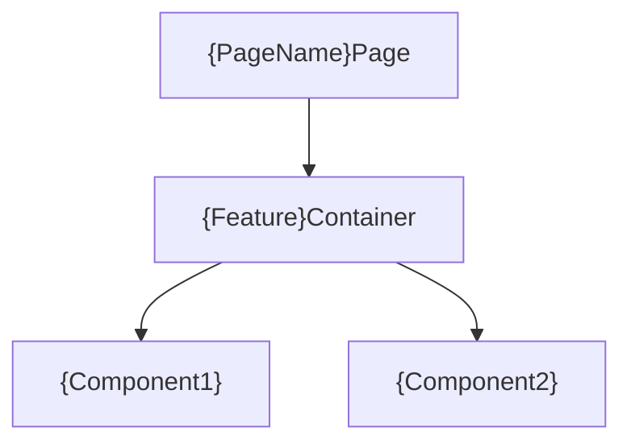
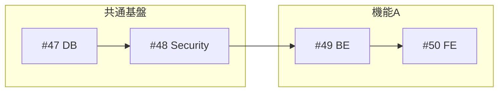

# 詳細設計・完全ワークフロー (v2.5)

基本設計書を入力として、詳細設計書を作成し、モックアップ生成とテスト設計までを一貫して行うワークフロー。

**変更点(v2.5)**:
- **ASCII自動検証の追加**: Phase 1完了時に画面設計書のASCII禁止チェックを自動実行（grepベース）。
- **禁止パターン拡大**: ページネーション表示例、ローディング状態、カード形式のASCII表現も明示的に禁止。
- **Issue依存関係のMermaid必須化**: Epic IssueのDependency図はMermaid形式で記述。ASCII禁止。

**変更点(v2.4)**:
- **ドキュメント計画フェーズ追加**: 設計書作成前にドキュメント一覧を提示し、ユーザー承認を得るプロセスを追加。

**変更点(v2.3)**:
- **画面設計書からASCII wireframe禁止**: 視覚表現はHTMLモックアップ/スクリーンショットのみ。
- **モバイルHTML固定幅方式**: レイアウト崩れを100%防止するテンプレート追加。
- **HTML構造ルール強化**: 崩れないレイアウトのための必須ルール追加。

**変更点(v2.2)**:
- **フロントエンド設計書の必須化**: 画面を持つ機能には`フロントエンド設計書.md`を必須化。
- **Phase 1の明確化**: 各機能タイプごとに作成すべき設計書を明示。

**変更点(v2.1)**:
- **モックアップ方針の変更**: High-fidelityではなく、**Low-fidelity Wireframe** を作成する。
- **モバイル対応**: モバイルビューのスクリーンショットも必須化。
- **UIパーツ網羅**: トーストやモーダル等の状態もHTML/画像化する。

---

## 実行プロセス

### Phase 0: ドキュメント計画 & 承認 (v2.4 NEW)

**目的**: 基本設計書に基づき、作成すべき詳細設計書の一覧を定義し、抜け漏れを防ぐ。

1. **機能分解 & ドキュメントリストアップ**:
   - 基本設計書を分析し、必要なサブ機能とドキュメントを特定する。
   - 機能タイプ（画面あり、APIのみ、バッチ等）に応じて必須ドキュメントを判定。
2. **ユーザー確認**:
   - 作成予定のドキュメント一覧（ファイルパス案）をユーザーに提示する。
   - 「不足している設計書はないか？」「追加すべき設計書はないか？」を確認する。
   - ユーザーの承認（または修正指示）を得てから Phase 1 に進む。

### Phase 1: 機能分割 & ドラフト作成

`detailed-design-writer` エージェントが各サブ機能に対して設計書を作成する。

#### 1.1 機能タイプ別 必須設計書

| 機能タイプ | 詳細設計書 | バックエンド | フロントエンド | 画面設計書 | その他 |
|-----------|:----------:|:------------:|:--------------:|:----------:|--------|
| **画面あり機能** | ✅ | ✅ | ✅ | ✅ | - |
| **API専用機能** | ✅ | ✅ | - | - | - |
| **バッチ処理** | ✅ | ✅ | - | - | - |
| **外部連携** | ✅ | ✅ | - | - | 外部API連携設計書 |
| **通知機能** | ✅ | ✅ | - | - | 通知設計書 |

#### 1.2 共通設計書（機能群ごとに1つ）

| 設計書 | 必須 | 内容 |
|--------|:----:|------|
| `データベース設計書.md` | ✅ | テーブル定義、ER図、インデックス設計 |
| `インフラ設計書.md` | ✅ | 構成図、スケーリング、監視設計 |
| `セキュリティ設計書.md` | ✅ | 認証認可、暗号化、監査ログ設計 |

---

#### 1.3 フロントエンド設計書テンプレート

画面を持つ機能には以下の構成で `フロントエンド設計書.md` を作成する。

```markdown
# {機能名} フロントエンド設計書

## メタ情報
| 項目 | 内容 |
|------|------|
| ドキュメントID | DETAIL-{機能ID}-FRONTEND-001 |
| 親設計書 | [詳細設計書.md](./詳細設計書.md) |

---

## 1. コンポーネント構成

### 1.1 コンポーネント階層図



### 1.2 コンポーネント一覧

| コンポーネント名 | 種類 | 責務 | Props |
|----------------|------|------|-------|
| `{Feature}Page` | Page | ルーティング、レイアウト | - |
| `{Feature}Container` | Container | 状態管理、API呼び出し | - |
| `{Component}` | Presentational | UI表示 | `data`, `onAction` |

---

## 2. 状態管理設計

### 2.1 状態の種類と管理方針

| 状態 | スコープ | 管理方法 | 永続化 |
|------|---------|---------|--------|
| ユーザー認証 | グローバル | Zustand/Context | LocalStorage |
| フォーム入力 | ローカル | useState/useForm | - |
| サーバーデータ | キャッシュ | React Query/SWR | - |

### 2.2 グローバル状態

```typescript
interface {Feature}State {
  // 状態の型定義
}
```

---

## 3. カスタムフック設計

| フック名 | 責務 | 引数 | 戻り値 |
|---------|------|------|--------|
| `use{Feature}` | {機能}のロジック | - | `{ data, isLoading, error }` |
| `use{Feature}Mutation` | データ更新 | - | `{ mutate, isPending }` |

### 3.1 フック実装詳細

```typescript
// use{Feature}.ts
export function use{Feature}() {
  // 実装概要
}
```

---

## 4. API連携設計

### 4.1 使用エンドポイント

| API | メソッド | 用途 | フック |
|-----|---------|------|--------|
| `/api/xxx` | GET | データ取得 | `use{Feature}Query` |
| `/api/xxx` | POST | データ作成 | `use{Feature}Mutation` |

### 4.2 エラーハンドリング

| エラーコード | 画面表示 | リカバリ方法 |
|------------|---------|-------------|
| 400 | バリデーションエラー表示 | フォーム修正を促す |
| 401 | ログイン画面へリダイレクト | - |
| 500 | エラーメッセージ表示 | リトライボタン |

---

## 5. フォームバリデーション

### 5.1 クライアント側バリデーション

| フィールド | ルール | ライブラリ | エラーメッセージ |
|-----------|--------|-----------|-----------------|
| email | 必須, メール形式 | zod/yup | メールアドレスを入力してください |

### 5.2 バリデーションスキーマ

```typescript
const {feature}Schema = z.object({
  // スキーマ定義
});
```

---

## 6. ルーティング設計

| パス | コンポーネント | 認証 | ガード |
|-----|--------------|:----:|--------|
| `/xxx` | `{Feature}Page` | ✅ | `AuthGuard` |

---

## 7. 再利用可能コンポーネント

### 7.1 プロジェクト共通コンポーネント使用

| コンポーネント | 用途 | カスタマイズ |
|--------------|------|-------------|
| `Button` | アクションボタン | variant="primary" |
| `Input` | テキスト入力 | - |
| `Modal` | 確認ダイアログ | - |

### 7.2 新規作成コンポーネント

| コンポーネント | 用途 | 汎用性 |
|--------------|------|--------|
| `{Feature}Card` | 専用カード | 機能固有 |

---

## 8. パフォーマンス考慮

| 最適化項目 | 実装方法 |
|-----------|---------|
| 不要な再レンダリング防止 | `React.memo`, `useMemo`, `useCallback` |
| 遅延読み込み | `React.lazy`, `Suspense` |
| 仮想スクロール | `react-virtuoso` (大量データ時) |

---

## 9. テスト方針

| テスト種別 | 対象 | ツール |
|-----------|------|--------|
| Unit | カスタムフック | Jest, React Testing Library |
| Integration | Container + API | MSW |
| E2E | ユーザーフロー | Playwright |

---

## 変更履歴

| 日付 | バージョン | 変更内容 | 担当者 |
|:---|:---|:---|:---|
| YYYY-MM-DD | 1.0.0 | 初版作成 | - |
```

---

#### 1.4 画面設計書の記述ルール（v2.3 NEW）

**禁止事項**:
- ❌ ASCII art / テキストベースのワイヤーフレーム
- ❌ 罫線文字（┌─┐│└┘等）を使った図表現
- ❌ コードブロック内のUI表現

**必須事項**:
- ✅ 視覚表現は**HTMLモックアップ + スクリーンショット画像のみ**
- ✅ 状態の説明は**表形式**または**箇条書き**で記述
- ✅ エラーメッセージ等は**テキストのみ**記載（視覚的表現はmockup-error.htmlで）

**NG例（これを書いてはいけない）**:

```markdown
❌ 禁止1: ボックス罫線
┌─────────────────────────────────────┐
│ ⚠ エラーメッセージ                   │
└─────────────────────────────────────┘

❌ 禁止2: カード形式のASCII表現
┌─────────────────────────────────────┐
│ 2026-01-15 10:30:00                 │
│ 操作者: admin@example.com            │
│ 種別: [編集]                         │
└─────────────────────────────────────┘

❌ 禁止3: ページネーション表示例
[前へ] [1] [2] [3] [4] [5] ... [次へ]

❌ 禁止4: ボタン状態のASCII表現
[  ⏳ 検索中...  ]

❌ 禁止5: ツリー構造のASCII表現
├── Header
│   ├── Logo
│   └── Navigation
└── Footer
```

**OK例（こう書く）**:
```markdown
### エラー表示
| 状態 | メッセージ | 表示位置 |
|------|-----------|---------|
| バリデーションエラー | 入力内容を確認してください | フォーム上部 |

> 視覚的な表示は [mockup-error.html](./mockup-error.html) および [エラー画面スクリーンショット](./screen-error.png) を参照
```

---

### Phase 1.5: ASCII禁止 自動検証 (v2.5 NEW)

**目的**: 画面設計書にASCIIワイヤーフレームが含まれていないことを自動検証する。

**実行コマンド**:

```bash
# ASCII罫線文字の検出
grep -r -l '┌\|┐\|└\|┘\|│\|─\|├\|┬\|┤\|┴\|┼' docs/designs/detailed/{機能名}/**/画面設計書.md

# ツリー構造パターンの検出（├──, │, └──）
grep -r -E '(├|└|│).*─' docs/designs/detailed/{機能名}/**/画面設計書.md

# ボタン表示パターンの検出（[xxx] [yyy]形式）
grep -r -E '\[.+\]\s+\[.+\]' docs/designs/detailed/{機能名}/**/画面設計書.md | grep -v '^\s*|' | grep -v 'http'
```

**検証結果の判定**:

| 結果 | アクション |
|------|----------|
| 該当なし（0件） | Phase 2に進む |
| 該当あり（1件以上） | **Phase 1に戻り修正** |

**修正方法**:

| 元のASCII表現 | 修正後 |
|--------------|--------|
| 罫線ボックス（┌─┐） | 表形式またはHTMLモックアップ参照 |
| カード形式ASCII | `mockup-mobile.html`への参照 |
| ページネーション例 | 仕様の箇条書き + モックアップ参照 |
| ツリー構造 | 表形式 + モックアップ参照 |

**自動修正テンプレート**:

```markdown
# 修正前（NG）
**モバイル表示例（カード形式）**:
┌─────────────────────────────┐
│ 2026-01-15 10:30:00        │
└─────────────────────────────┘

# 修正後（OK）
**モバイル表示（カード形式）**

各カードに含まれる情報:
- 操作日時（カードヘッダー）
- 操作者メールアドレス
- ...

※ 実際の表示は `mockup-mobile.html` を参照してください。
```

---

### Phase 2: モックアップ生成 & 検証 (Wireframe Mode)

**コンセプト**: 
- **デザイン**: 意匠性は不要。グレースケールと枠線のみの**ワイヤーフレーム**を作成する。
- **目的**: レイアウト構造と情報の網羅性を確認するため。
- **禁止事項**: 凝ったグラデーション、シャドウ、カスタムCSSの多用。Tailwindのデフォルトクラス(`border`, `bg-gray-*`)のみ使用する。

#### 2.1 HTML生成 (`frontend-ui-ux-engineer`)

各画面に対して以下のHTMLを作成する。

| ファイル名 | 内容 | 備考 |
|------------|------|------|
| `mockup.html` | 通常時のワイヤーフレーム（Desktop） | 必須 |
| `mockup-error.html` | エラー表示時の状態 | 必須 |
| `mockup-mobile.html` | モバイル専用（固定幅375px） | 必須 |
| `mockup-states.html` | トースト/モーダル等のUIパーツ表示状態 | 必要な場合のみ |

#### 2.2 レイアウト崩れ防止ルール（v2.3 NEW）

**モバイルHTML（mockup-mobile.html）は必ず以下のテンプレートを使用する**:

```html
<!DOCTYPE html>
<html lang="ja">
<head>
  <meta charset="UTF-8">
  <!-- viewport は固定幅に合わせる -->
  <meta name="viewport" content="width=375, initial-scale=1.0">
  <title>{画面名} - Mobile</title>
  <script src="https://cdn.tailwindcss.com"></script>
  <style>
    /* ===== 必須：はみ出し防止ベーススタイル ===== */
    * {
      box-sizing: border-box;
    }
    /* カード・コンテナ：子要素のはみ出しを防ぐ */
    .card, .container, .menu, .modal, .nav,
    [class*="card"], [class*="container"], [class*="menu"] {
      overflow: hidden;
    }
    /* テキスト省略 */
    .truncate, .menu-item, .nav-item {
      overflow: hidden;
      text-overflow: ellipsis;
      white-space: nowrap;
    }
    /* 複数行テキスト折り返し */
    p, .description, .card-body, td, th {
      word-break: break-word;
      overflow-wrap: break-word;
    }
    /* ボタン・入力要素：はみ出し防止 */
    button, .btn, a, input, select, textarea, img, svg {
      max-width: 100%;
    }
    img, svg {
      height: auto;
    }
    /* Flexアイテム縮小許可 */
    [class*="flex"] > * {
      min-width: 0;
      flex-shrink: 1;
    }

    /* ===== 固定幅コンテナ ===== */
    body {
      width: 375px;
      margin: 0 auto;
      background: #f5f5f5;
      min-height: 100vh;
    }
    .mobile-container {
      display: flex;
      flex-direction: column;
      padding: 16px;
      gap: 16px;
    }
    .mobile-container > * {
      width: 100%;
    }
  </style>
</head>
<body>
  <div class="mobile-container">
    <!-- ここに全てのコンテンツを縦並びで配置 -->
    <!-- 横並び（flex-row）は使用禁止 -->
  </div>
</body>
</html>
```

**絶対守るべきルール（レイアウト）**:

| ルール | 理由 |
|--------|------|
| `body { width: 375px; }` 固定 | 可変幅がレイアウト崩れの原因 |
| `flex-direction: column` のみ | 横並びは狭い画面で崩れる |
| `%` 幅の使用禁止 | 固定px または `100%` のみ使用 |
| `max-w-*` の使用禁止 | モバイルでは不要、予期しない挙動の原因 |
| 要素の入れ子は最大2階層 | 深い入れ子は崩れの原因 |

**絶対守るべきルール（オーバーフロー防止 v2.3）**:

テキストやボタンがはみ出さないよう、以下のCSSを**必ず**適用する。

```css
/* 全HTMLファイル共通：はみ出し防止ベーススタイル */
* {
  box-sizing: border-box;
}

/* カード・コンテナ：子要素のはみ出しを防ぐ */
.card, .container, .menu, .modal, [class*="card"], [class*="container"] {
  overflow: hidden;
}

/* テキスト：長文の省略表示 */
.truncate, .menu-item, .nav-item, .button-text {
  overflow: hidden;
  text-overflow: ellipsis;
  white-space: nowrap;
}

/* 複数行テキスト：単語の途中で折り返し */
.card-body, .description, p {
  word-break: break-word;
  overflow-wrap: break-word;
}

/* ボタン・要素：親からはみ出さない */
button, .btn, a, input, select, textarea {
  max-width: 100%;
}

/* Flexアイテム：縮小を許可 */
[class*="flex"] > * {
  min-width: 0;
  flex-shrink: 1;
}

/* 画像：コンテナに収める */
img, svg {
  max-width: 100%;
  height: auto;
}
```

| 問題 | 防止ルール |
|------|-----------|
| テキストがメニューからはみ出る | `overflow: hidden; text-overflow: ellipsis;` |
| ボタンがカードからはみ出る | 親に `overflow: hidden;`、子に `max-width: 100%;` |
| 長いURL/メールが崩れる | `word-break: break-word;` |
| Flexの子要素がはみ出る | `min-width: 0; flex-shrink: 1;` |
| 画像がコンテナを超える | `max-width: 100%; height: auto;` |

**Desktop HTML（mockup.html）のルール**:

```html
<!DOCTYPE html>
<html lang="ja">
<head>
  <meta charset="UTF-8">
  <meta name="viewport" content="width=1280, initial-scale=1.0">
  <title>{画面名}</title>
  <script src="https://cdn.tailwindcss.com"></script>
  <style>
    /* ===== 必須：はみ出し防止ベーススタイル（Desktop共通） ===== */
    * { box-sizing: border-box; }
    .card, .container, .menu, .modal, .nav,
    [class*="card"], [class*="container"], [class*="menu"] {
      overflow: hidden;
    }
    .truncate, .menu-item, .nav-item, th {
      overflow: hidden;
      text-overflow: ellipsis;
      white-space: nowrap;
    }
    p, .description, .card-body, td {
      word-break: break-word;
      overflow-wrap: break-word;
    }
    button, .btn, a, input, select, textarea, img, svg {
      max-width: 100%;
    }
    img, svg { height: auto; }
    [class*="flex"] > * { min-width: 0; flex-shrink: 1; }
    
    /* ===== Desktop固定幅 ===== */
    body {
      min-width: 1280px;
      background: #f5f5f5;
    }
    .main-container {
      max-width: 1200px;
      margin: 0 auto;
      padding: 24px;
    }
  </style>
</head>
<body>
  <div class="main-container">
    <!-- コンテンツ -->
  </div>
</body>
</html>
```

#### 2.3 HTML検証

- 生成されたHTMLに対して簡易構文チェックを実行。
- `div` の閉じ忘れ等がないか確認。
- **モバイルHTMLが固定幅テンプレートに準拠しているか確認**（v2.3）

#### 2.4 スクリーンショット撮影 (Playwright)

```bash
# Desktop (Wireframe)
npx playwright screenshot \
  --viewport-size="1280,900" \
  --full-page \
  "file://{path}/mockup.html" \
  "{path}/{screen-name}.png"

# Mobile (Wireframe)
npx playwright screenshot \
  --viewport-size="375,667" \
  --full-page \
  "file://{path}/mockup-mobile.html" \
  "{path}/{screen-name}-mobile.png" # または mockup.html を使い回しても可

# UI Parts (Toast/Modal)
# 状態ごとのHTMLを撮影
npx playwright screenshot \
  --viewport-size="1280,900" \
  "file://{path}/mockup-states.html" \
  "{path}/{screen-name}-states.png"
```

#### 2.5 埋め込み

画面設計書に生成した画像を埋め込む。
- デスクトップ版: ``
- モバイル版: ``
- 状態バリエーション: ``

---

### Phase 3: 設計書品質保証ループ

1. `detailed-design-reviewer` によるレビュー (9点以上合格)。
2. モックアップが**ワイヤーフレームとして構造が正しいか**確認。
3. **フロントエンド設計書の存在確認**: 画面を持つ機能に`フロントエンド設計書.md`が存在するか確認。
4. **ASCII wireframe禁止チェック（v2.3）**: 画面設計書に罫線文字（┌─┐│└┘）が含まれていないか確認。
5. **モバイルHTML固定幅チェック（v2.3）**: `mockup-mobile.html`が`width: 375px`固定になっているか確認。
6. **はみ出しチェック（v2.3）**: スクリーンショットを目視確認し、テキスト/ボタン/画像のはみ出しがないか確認。

---

### Phase 4: テスト設計 & レビュー

1. **テスト項目書作成**: `test-spec-writer` が詳細設計書を元に作成。
2. **テスト項目書レビュー**: 網羅性、独立性、検証可能性、TDD適合性をチェック。
3. **修正ループ**: 9点未満の場合は修正。

---

### Phase 5: ユーザー承認 & Issue化

1. **ユーザー承認**: 全設計書とテスト仕様書のレビュー結果を提示し、承認を得る。
2. **GitHub Issue作成**: 実装タスクをIssue化する。

#### 5.1 Issue作成ルール（v2.5 NEW）

**Epic Issue構成**:
- 概要
- 関連ドキュメント
- スコープ（機能一覧）
- 技術スタック
- 工数見積もり
- 子Issue一覧
- **依存関係（Mermaid形式で記述）**

**依存関係の記述方法**:

❌ **禁止: ASCII形式**
```
#47 (DB) ─┬─> #48 (Security) ─┬─> #49 (Auth BE)
          │                   │
          └───────────────────┴─> #53 (Detail BE)
```

✅ **必須: Mermaid形式**
````markdown

````

**子Issueの構成**:
- 概要
- 親Issue参照
- 設計書リンク
- 実装内容
- 完了条件
- 見積もり
- 依存（あれば）

---

## サーキットブレーカー & リカバリ

- **モックアップ生成失敗**: シンプルなHTMLなので失敗率は低いはずだが、失敗時は白紙画像 (`placeholder.png`) を置いて続行し、Issueに警告を残す。
- **フロントエンド設計書欠落**: 画面を持つ機能でフロントエンド設計書が作成されていない場合、Phase 3で検出してPhase 1に戻る。

---

## チェックリスト

### Phase 1 完了条件

- [ ] 全サブ機能に `詳細設計書.md` が存在する
- [ ] 全サブ機能に `バックエンド設計書.md` が存在する
- [ ] 画面を持つ機能に `画面設計書.md` が存在する
- [ ] **画面を持つ機能に `フロントエンド設計書.md` が存在する** ← v2.2
- [ ] 共通フォルダに `データベース設計書.md` が存在する
- [ ] 共通フォルダに `インフラ設計書.md` が存在する
- [ ] 共通フォルダに `セキュリティ設計書.md` が存在する

### Phase 1.5 完了条件（v2.5 NEW - BLOCKING）

以下のコマンドを実行し、**全て0件であること**を確認してからPhase 2に進む。

```bash
# 必須チェック1: ASCII罫線文字
grep -r -l '┌\|┐\|└\|┘\|│\|─\|├\|┬\|┤\|┴\|┼' docs/designs/detailed/{機能名}/**/画面設計書.md
# → 0件であること

# 必須チェック2: ツリー構造パターン
grep -r -c -E '(├|└|│).*─' docs/designs/detailed/{機能名}/**/画面設計書.md
# → 0件であること
```

- [ ] **ASCII罫線文字チェック: 0件** ← v2.5
- [ ] **ツリー構造パターンチェック: 0件** ← v2.5

### Phase 2 完了条件

- [ ] 全画面に `mockup.html` が存在する
- [ ] 全画面に `mockup-error.html` が存在する
- [ ] **全画面に `mockup-mobile.html` が存在する（固定幅375px）** ← v2.3
- [ ] 全画面にスクリーンショット（desktop/mobile）が存在する
- [ ] **モバイルHTMLが固定幅テンプレートに準拠している** ← v2.3
- [ ] **はみ出し防止CSSが全HTMLに含まれている** ← v2.3
- [ ] **スクリーンショットでテキスト/ボタンのはみ出しがない** ← v2.3

### Phase 5 完了条件（v2.5 NEW）

- [ ] Epic Issueが作成されている
- [ ] 全子Issueが作成されている
- [ ] **依存関係がMermaid形式で記述されている（ASCII禁止）** ← v2.5
- [ ] 工数見積もりが記載されている
- [ ] 設計書へのリンクが含まれている

---

## Sisyphusへの指示

```python
def detailed_design_workflow(basic_path):
    # Phase 0: Document Planning & Confirmation (v2.4)
    # 1. Analyze basic_path (Basic Design) to identify sub-features.
    # 2. List all documents to be created based on feature types.
    #    - Sub-features: 詳細, BE, (FE, Screen), etc.
    #    - Common: DB, Infra, Security
    # 3. Present the list to the User.
    # 4. ASK: "Is this list complete? Any missing documents?"
    # 5. WAIT for user confirmation or modification.
    # 6. IF modification requested -> Update list and re-confirm.
    
    # Phase 1: Design Documents
    # For each sub-feature in CONFIRMED list:
    #   - Create 詳細設計書.md
    #   - Create バックエンド設計書.md
    #   - If has_screen:
    #       - Create 画面設計書.md (NO ASCII WIREFRAMES!)
    #       - Create フロントエンド設計書.md
    #   - If has_notification:
    #       - Create 通知設計書.md
    #   - If has_external_api:
    #       - Create 外部API連携設計書.md
    
    # Phase 1.5: ASCII Validation (v2.5 NEW - BLOCKING)
    # CRITICAL: Must pass before proceeding to Phase 2
    ascii_check_result = run_command("""
        grep -r -l '┌|┐|└|┘|│|─|├|┬|┤|┴|┼' \
            docs/designs/detailed/{feature}/**/画面設計書.md
    """)
    tree_check_result = run_command("""
        grep -r -c -E '(├|└|│).*─' \
            docs/designs/detailed/{feature}/**/画面設計書.md
    """)
    
    if ascii_check_result or tree_check_result:
        # BLOCK: Do not proceed to Phase 2
        # Return to Phase 1 and fix the issues
        print("❌ ASCII検証失敗: 以下のファイルにASCII表現が含まれています")
        print(ascii_check_result)
        print("修正方法: 表形式またはHTMLモックアップ参照に置き換えてください")
        return "PHASE_1_RETRY"
    
    print("✅ ASCII検証成功: Phase 2に進みます")
    
    # Phase 2: Wireframe Mockups
    # Prompt for frontend-ui-ux-engineer:
    # "Create a SIMPLE WIREFRAME using Tailwind CSS. 
    # Use GRAYSCALE ONLY (black, white, gray). 
    # Focus on correct LAYOUT and INFORMATION STRUCTURE.
    # No fancy styling.
    # 
    # CRITICAL for mockup-mobile.html (v2.3):
    # - body MUST have width: 375px fixed
    # - Use flex-direction: column ONLY
    # - NO percentage widths (use 100% or fixed px)
    # - NO max-w-* classes
    # - Maximum 2 levels of nesting"
    
    # ... (Playwright execution with mobile viewport)
    
    # Phase 3: Quality Check
    # - Verify all required documents exist
    # - Verify フロントエンド設計書.md exists for screen-based features
    # - Check mockup-mobile.html has width: 375px
    # - Run detailed-design-reviewer
    
    # Phase 4-5
    # ...
```
