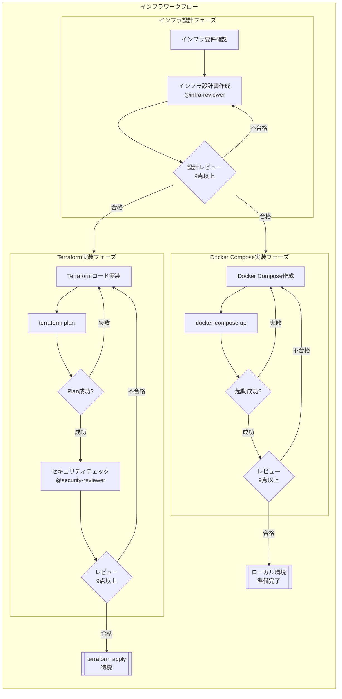

# インフラワークフロー

本ドキュメントは、Terraform/Docker Composeによるインフラ構築のワークフローを定義します。

---

## 1. インフラワークフロー概要



---

## 2. Terraformワークフロー

### 2.1 フェーズ

| # | フェーズ | 内容 | 完了条件 |
|---|---------|------|---------|
| 1 | 要件確認 | インフラ要件の確認 | 要件が明確 |
| 2 | 設計 | インフラ設計書作成 | レビュー9点以上 |
| 3 | 実装 | Terraformコード実装 | `terraform plan` 成功 |
| 4 | セキュリティレビュー | セキュリティチェック | レビュー9点以上 |
| 5 | 適用 | `terraform apply`（手動） | 人間の承認後 |

### 2.2 Terraform ベストプラクティス

#### ディレクトリ構成

```
infrastructure/
├── terraform/
│   ├── environments/
│   │   ├── dev/
│   │   │   ├── main.tf
│   │   │   ├── variables.tf
│   │   │   ├── outputs.tf
│   │   │   └── terraform.tfvars
│   │   ├── staging/
│   │   └── production/
│   │
│   └── modules/
│       ├── networking/
│       │   ├── main.tf
│       │   ├── variables.tf
│       │   └── outputs.tf
│       ├── compute/
│       ├── database/
│       └── security/
│
└── docs/
    └── インフラ設計書.md
```

#### 命名規則

| リソース | 命名規則 | 例 |
|---------|---------|-----|
| リソース名 | `{project}-{env}-{resource}` | `myapp-prod-vpc` |
| モジュール名 | 機能を表す単語 | `networking`, `compute` |
| 変数名 | snake_case | `instance_type` |

#### 必須設定

```hcl
# provider バージョン固定
terraform {
  required_version = ">= 1.0.0"
  
  required_providers {
    aws = {
      source  = "hashicorp/aws"
      version = "~> 5.0"
    }
  }
}

# 全変数にdescription必須
variable "instance_type" {
  type        = string
  description = "EC2インスタンスタイプ"
  default     = "t3.micro"
}

# 重要なoutputにはdescription必須
output "vpc_id" {
  description = "作成されたVPCのID"
  value       = aws_vpc.main.id
}
```

### 2.3 セキュリティチェック項目

| カテゴリ | チェック項目 |
|---------|-------------|
| ネットワーク | セキュリティグループが最小権限か |
| IAM | IAMポリシーが最小権限か |
| 暗号化 | RDS、S3、EBSが暗号化されているか |
| ログ | CloudTrail、VPCフローログが有効か |
| 公開設定 | S3バケットがパブリックでないか |
| シークレット | Secrets Managerが使用されているか |

---

## 3. Docker Composeワークフロー

### 3.1 フェーズ

| # | フェーズ | 内容 | 完了条件 |
|---|---------|------|---------|
| 1 | 要件確認 | ローカル環境要件の確認 | 要件が明確 |
| 2 | 実装 | Docker Compose作成 | `docker-compose up` 成功 |
| 3 | レビュー | 設定レビュー | レビュー9点以上 |
| 4 | ドキュメント化 | セットアップ手順の記載 | README更新 |

### 3.2 Docker Compose ベストプラクティス

#### ディレクトリ構成

```
docker/
├── docker-compose.yml          # 本番用
├── docker-compose.dev.yml      # 開発用（上書き）
├── docker-compose.test.yml     # テスト用
├── .env.example                # 環境変数テンプレート
└── services/
    ├── backend/
    │   └── Dockerfile
    ├── frontend/
    │   └── Dockerfile
    └── nginx/
        └── nginx.conf
```

#### 必須設定

```yaml
version: '3.8'

services:
  backend:
    build:
      context: ./services/backend
      dockerfile: Dockerfile
    env_file:
      - .env
    networks:
      - app-network
    healthcheck:
      test: ["CMD", "curl", "-f", "http://localhost:8080/health"]
      interval: 30s
      timeout: 10s
      retries: 3
    depends_on:
      db:
        condition: service_healthy

  db:
    image: postgres:15-alpine
    volumes:
      - db-data:/var/lib/postgresql/data
    environment:
      POSTGRES_USER: ${DB_USER}
      POSTGRES_PASSWORD: ${DB_PASSWORD}
      POSTGRES_DB: ${DB_NAME}
    healthcheck:
      test: ["CMD-SHELL", "pg_isready -U ${DB_USER}"]
      interval: 10s
      timeout: 5s
      retries: 5

networks:
  app-network:
    driver: bridge

volumes:
  db-data:
```

### 3.3 開発環境用オーバーライド

```yaml
# docker-compose.dev.yml
version: '3.8'

services:
  backend:
    volumes:
      - ./backend:/app          # ホットリロード用
      - /app/node_modules       # node_modules除外
    environment:
      - DEBUG=true
    ports:
      - "3000:3000"
      - "9229:9229"             # デバッグポート

  frontend:
    volumes:
      - ./frontend:/app
      - /app/node_modules
    ports:
      - "5173:5173"
```

### 3.4 チェック項目

| カテゴリ | チェック項目 |
|---------|-------------|
| バージョン | version: '3.8' 以上か |
| ネットワーク | 適切なネットワーク分離がされているか |
| ボリューム | データ永続化が適切に設定されているか |
| 環境変数 | `.env` ファイルから参照しているか |
| ヘルスチェック | healthcheckが設定されているか |
| 依存関係 | depends_onで適切な依存関係が設定されているか |
| セキュリティ | 機密情報がハードコードされていないか |

---

## 4. Well-Architected Framework対応

### 4.1 5つの柱

| 柱 | 確認項目 |
|----|---------|
| **セキュリティ** | 暗号化、最小権限、ネットワーク分離、監査ログ |
| **信頼性** | Multi-AZ、Auto Scaling、バックアップ、DR |
| **パフォーマンス効率** | 適切なインスタンスサイズ、キャッシュ、CDN |
| **コスト最適化** | 不要リソース削除、Reserved/Spot活用 |
| **運用上の優秀性** | IaC、CloudWatch、タグ付け、自動化 |

### 4.2 各柱のチェックリスト

#### セキュリティ

- [ ] 全データの暗号化（at rest / in transit）
- [ ] IAMポリシーは最小権限
- [ ] セキュリティグループは最小権限
- [ ] CloudTrailが有効
- [ ] VPCフローログが有効
- [ ] WAFの設定（該当する場合）

#### 信頼性

- [ ] Multi-AZ構成
- [ ] Auto Scalingの設定
- [ ] RDSの自動バックアップ
- [ ] S3のバージョニング
- [ ] DR計画の文書化

#### パフォーマンス効率

- [ ] 適切なインスタンスタイプの選択
- [ ] ElastiCacheの活用（該当する場合）
- [ ] CloudFrontの活用（該当する場合）
- [ ] RDSのリードレプリカ（該当する場合）

#### コスト最適化

- [ ] 不要なリソースの削除
- [ ] Reserved Instancesの検討
- [ ] Spot Instancesの検討
- [ ] S3ライフサイクルポリシー

#### 運用上の優秀性

- [ ] 全リソースにタグ付け
- [ ] CloudWatch Alarmの設定
- [ ] CloudWatch Logsへのログ集約
- [ ] IaCによる完全な管理

---

## 5. 環境変数管理

### 5.1 Terraformからの環境変数出力

```hcl
# outputs.tf
output "backend_env_vars" {
  description = "バックエンド用環境変数（非機密）"
  value = {
    DATABASE_HOST = aws_db_instance.main.address
    REDIS_HOST    = aws_elasticache_cluster.main.cache_nodes[0].address
    S3_BUCKET     = aws_s3_bucket.main.id
  }
}

output "backend_secrets_arn" {
  description = "Secrets Manager ARN"
  value       = aws_secretsmanager_secret.backend.arn
}
```

### 5.2 機密情報の管理

| 環境 | 管理方法 |
|------|---------|
| ローカル | `.env` ファイル（.gitignore） |
| AWS | Secrets Manager |
| CI/CD | GitHub Secrets / GitLab CI Variables |

---

## 変更履歴

| 日付 | バージョン | 変更内容 |
|:---|:---|:---|
| 2026-01-02 | 1.0.0 | 初版作成（ai-frameworkからの取り込み） |
