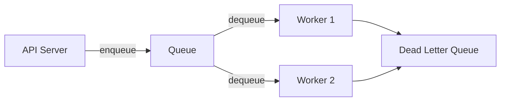
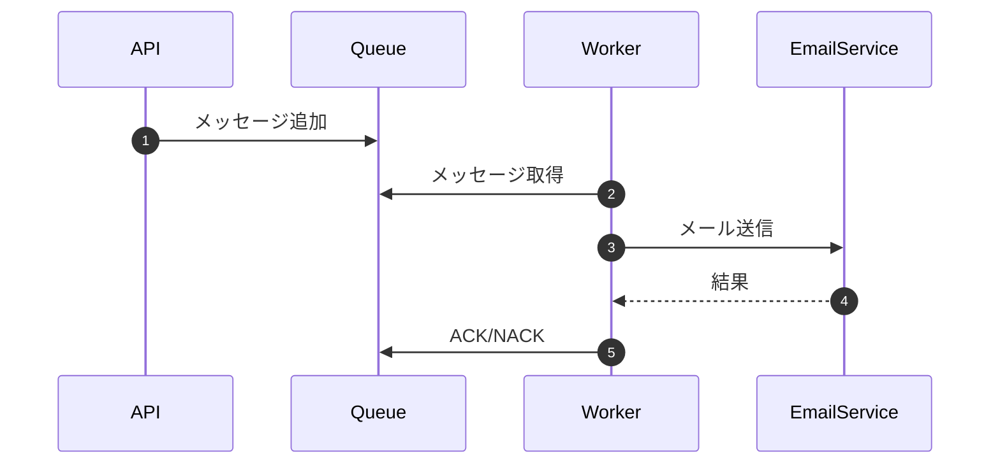

# {機能名} 非同期処理設計書

## 1. 概要

### 1.1 非同期処理の種類
| 種類 | 用途 | 技術 |
|------|------|------|
| キュー処理 | リアルタイム非同期 | Redis Queue / SQS |
| バッチ処理 | 定期実行 | cron / CloudWatch Events |

## 2. ジョブ一覧

| ジョブID | ジョブ名 | 種類 | トリガー | 優先度 |
|---------|---------|------|---------|--------|
| JOB-001 | メール送信 | キュー | API呼び出し | 高 |
| JOB-002 | 日次集計 | バッチ | 毎日 03:00 | 中 |

## 3. キュー設計

### 3.1 キュー構成


### 3.2 キュー定義
| キュー名 | 用途 | 可視性タイムアウト | メッセージ保持期間 |
|---------|------|------------------|------------------|
| email-queue | メール送信 | 30秒 | 7日 |
| high-priority | 優先処理 | 10秒 | 1日 |

## 4. ジョブ詳細

### 4.1 JOB-001: メール送信

#### ジョブ仕様
| 項目 | 値 |
|------|-----|
| トリガー | ユーザー登録完了時 |
| 想定実行時間 | 5秒以内 |
| タイムアウト | 30秒 |
| リトライ回数 | 3回 |

#### メッセージ形式
```json
{
  "jobType": "SEND_EMAIL",
  "payload": {
    "to": "user@example.com",
    "templateId": "WELCOME",
    "variables": {}
  },
  "metadata": {
    "correlationId": "xxx",
    "createdAt": "2025-01-01T00:00:00Z"
  }
}
```

#### 処理フロー


## 5. リトライ・エラーハンドリング

### 5.1 リトライ戦略
| 条件 | リトライ回数 | 間隔 |
|------|:-----------:|------|
| 一時的エラー | 3回 | 指数バックオフ |
| 永続的エラー | 0回 | DLQへ移動 |

### 5.2 デッドレターキュー（DLQ）
- 失敗メッセージの保存
- 手動リトライ機能
- アラート通知

## 6. 監視・アラート

| 監視項目 | 閾値 | アラート |
|---------|------|---------|
| キュー深度 | 1000件超過 | Warning |
| DLQメッセージ数 | 10件超過 | Critical |
| ジョブ失敗率 | 5%超過 | Critical |

---

## 変更履歴

| 日付 | バージョン | 変更内容 | 担当者 |
|:---|:---|:---|:---|
| YYYY-MM-DD | 1.0.0 | 初版作成 | - |
