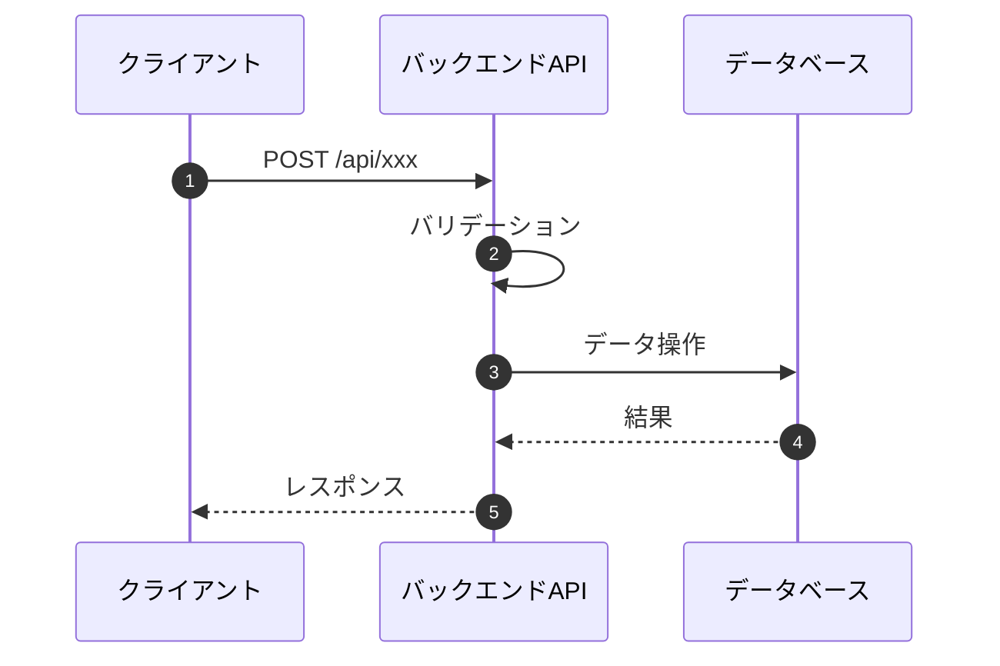

# {機能名} バックエンド設計書

## 1. API仕様

### 1.1 エンドポイント一覧
| メソッド | パス | 認証 | 説明 |
|---------|------|------|------|
| POST | /api/xxx | 必要 | XXXを実行 |

### 1.2 POST /api/xxx

#### リクエスト

**ヘッダー**
| ヘッダー | 必須 | 形式 | 説明 |
|:---|:---:|:---|:---|
| Authorization | ○ | Bearer {token} | アクセストークン |
| Content-Type | ○ | application/json | リクエスト形式 |

**ボディ**
```json
{
  "userId": "string",
  "data": {
    "fieldName": "value"
  }
}
```

| フィールド | 型 | 必須 | 説明 |
|-----------|-----|:---:|------|
| userId | string | ○ | ユーザーID |

#### レスポンス

**成功時 (200 OK)**
```json
{
  "success": true,
  "data": {
    "resultField": "value"
  }
}
```

**エラー時**
| ステータス | コード | 説明 |
|-----------|--------|------|
| 400 | VALIDATION_ERROR | 入力値エラー |
| 401 | UNAUTHORIZED | 認証エラー |

## 2. 処理フロー



## 3. 処理詳細

### 3.1 バリデーション
- フィールドXは必須
- フィールドYはN文字以内

### 3.2 ビジネスロジック
- 処理1の説明
- 処理2の説明（Argon2idでハッシュ化する等）

## 4. エラーハンドリング
| エラー条件 | HTTPステータス | エラーコード | 対処 |
|-----------|---------------|-------------|------|

---

## 変更履歴

| 日付 | バージョン | 変更内容 | 担当者 |
|:---|:---|:---|:---|
| YYYY-MM-DD | 1.0.0 | 初版作成 | - |
