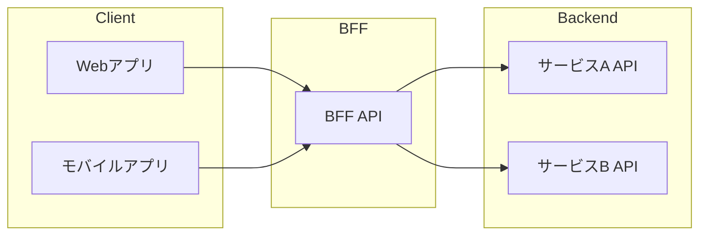

# {機能名} BFF設計書

## 1. 概要

### 1.1 BFFの責務
- クライアント（Web/Mobile）向けのAPI提供
- バックエンドAPIの集約・変換
- クライアント固有のデータ整形

### 1.2 アーキテクチャ

## 2. エンドポイント設計

### 2.1 エンドポイント一覧
| メソッド | パス | 説明 | 呼び出すバックエンドAPI |
|---------|------|------|----------------------|
| GET | /bff/xxx | XXX取得 | GET /api/a, GET /api/b |

### 2.2 GET /bff/xxx

#### リクエスト
（クライアントからのリクエスト）

#### バックエンドAPI呼び出し
| # | API | 目的 | 並列/直列 |
|---|-----|------|---------|
| 1 | GET /api/a | データA取得 | 並列 |
| 2 | GET /api/b | データB取得 | 並列 |

#### レスポンス変換
- バックエンドからの複数レスポンスを集約
- クライアントが使いやすい形式に変換

## 3. キャッシュ戦略
| 対象 | TTL | 無効化条件 |
|------|-----|-----------|
| /bff/xxx | 5分 | データ更新時 |

## 4. エラーハンドリング
| バックエンドエラー | BFFレスポンス | 対処 |
|------------------|--------------|------|
| サービスA 5xx | 503 | フォールバック |

---

## 変更履歴

| 日付 | バージョン | 変更内容 | 担当者 |
|:---|:---|:---|:---|
| YYYY-MM-DD | 1.0.0 | 初版作成 | - |
