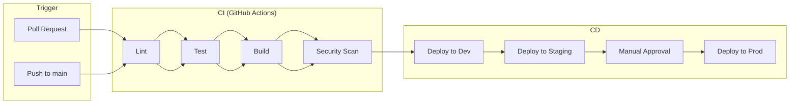

# {機能名} CI/CD設計書

## 1. パイプライン概要

## 2. 環境構成

| 環境 | ブランチ | デプロイ | 承認 |
|------|---------|---------|------|
| Development | feature/* | 自動（PR時） | 不要 |
| Staging | main | 自動 | 不要 |
| Production | main | 手動 | 必要 |

## 3. CIワークフロー

### 3.1 Pull Request時
| ステップ | 内容 | 失敗時 |
|---------|------|--------|
| Lint | ESLint, Prettier | PR ブロック |
| Type Check | TypeScript | PR ブロック |
| Unit Test | Jest | PR ブロック |
| Build | Docker build | PR ブロック |
| Security Scan | Trivy, npm audit | 警告 |

### 3.2 main マージ時
| ステップ | 内容 |
|---------|------|
| Build | Docker イメージビルド |
| Push | ECRへプッシュ |
| Deploy | ECSサービス更新 |

## 4. デプロイ戦略

### 4.1 Blue/Green デプロイ
| 項目 | 値 |
|------|-----|
| 方式 | ECS Blue/Green (CodeDeploy) |
| トラフィック切り替え | 段階的（10% → 50% → 100%） |
| 切り替え間隔 | 5分 |
| ロールバック | 自動（ヘルスチェック失敗時） |

### 4.2 ロールバック手順
1. CodeDeployコンソールからロールバック実行
2. または `aws deploy stop-deployment` コマンド
3. 前バージョンのタスクが自動で起動

## 5. シークレット管理

| シークレット | 保存場所 | 用途 |
|-------------|---------|------|
| AWS認証情報 | GitHub Secrets | AWSデプロイ |
| SLACK_WEBHOOK | GitHub Secrets | 通知 |
| 環境変数 | AWS Secrets Manager | アプリケーション |

---

## 変更履歴

| 日付 | バージョン | 変更内容 | 担当者 |
|:---|:---|:---|:---|
| YYYY-MM-DD | 1.0.0 | 初版作成 | - |
