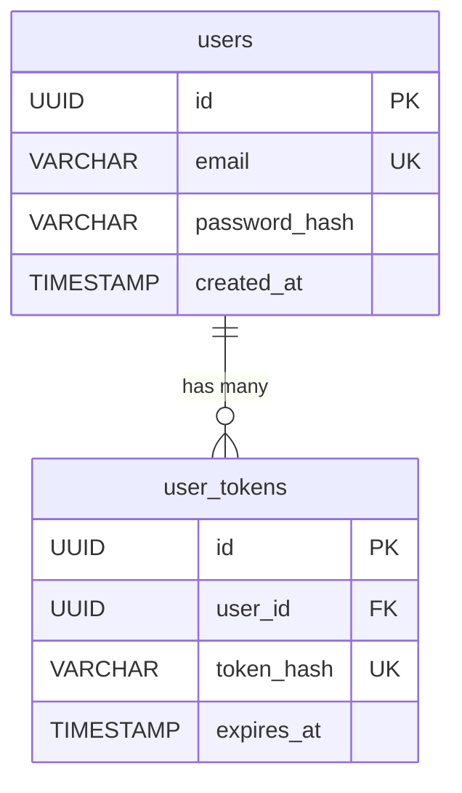

# {機能名} データベース設計書

## 1. ER図

## 2. テーブル定義

### 2.1 users テーブル

| カラム名 | 型 | NULL | デフォルト | 説明 |
|:---|:---|:---:|:---:|:---|
| id | UUID | NO | gen_random_uuid() | 主キー |
| email | VARCHAR(255) | NO | - | メールアドレス |
| password_hash | VARCHAR(255) | NO | - | ハッシュ化パスワード |
| created_at | TIMESTAMP | NO | CURRENT_TIMESTAMP | 作成日時 |

**インデックス**
| インデックス名 | カラム | 種類 |
|---------------|--------|------|
| users_pkey | id | PRIMARY KEY |
| users_email_key | email | UNIQUE |

---

## 変更履歴

| 日付 | バージョン | 変更内容 | 担当者 |
|:---|:---|:---|:---|
| YYYY-MM-DD | 1.0.0 | 初版作成 | - |
