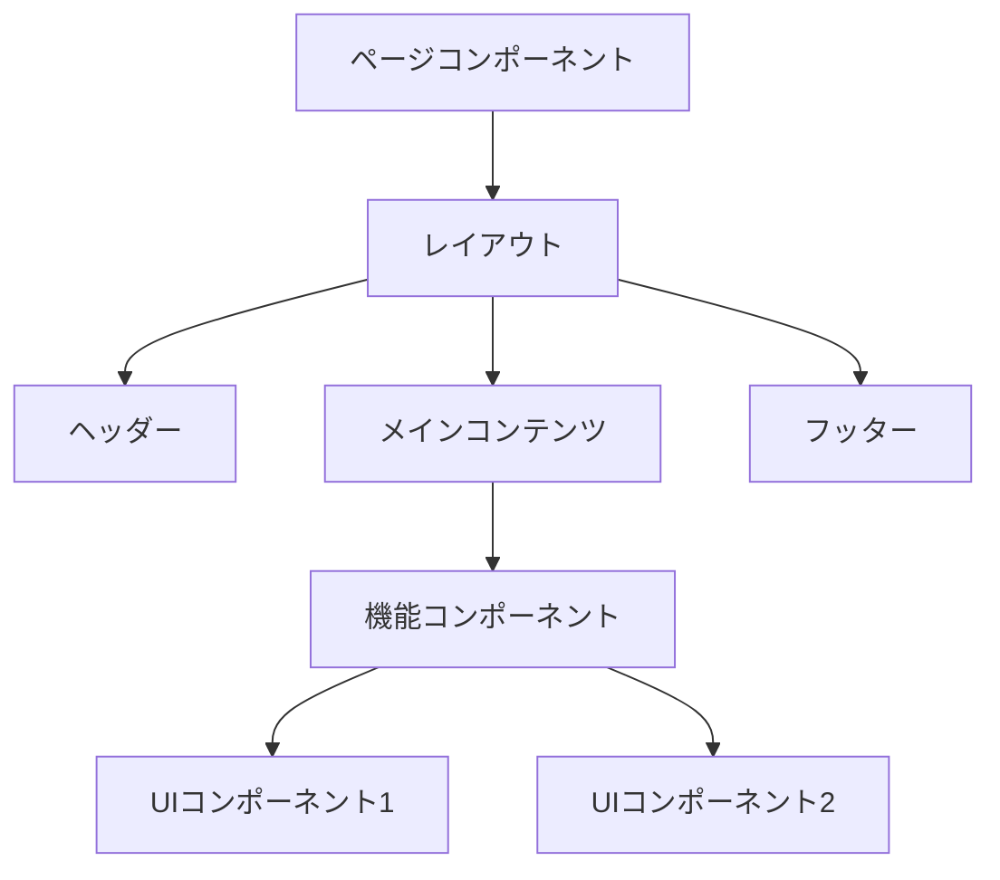

# {機能名} フロントエンド設計書

## 1. 概要

### 1.1 技術スタック
| 項目 | 技術 |
|------|------|
| フレームワーク | React / Next.js |
| 状態管理 | Zustand / Redux |
| スタイリング | Tailwind CSS |
| フォーム | React Hook Form |

## 2. コンポーネント設計

### 2.1 コンポーネント階層



### 2.2 コンポーネント一覧
| コンポーネント | 種類 | 責務 |
|--------------|------|------|
| XxxPage | Page | ページ全体のレイアウト |
| XxxForm | Feature | フォーム処理 |
| XxxList | Feature | 一覧表示 |
| Button | UI | 汎用ボタン |

## 3. 状態管理設計

### 3.1 状態の種類
| 状態種別 | 管理方法 | 例 |
|---------|---------|-----|
| サーバー状態 | TanStack Query | API データ |
| グローバル状態 | Zustand | 認証情報 |
| ローカル状態 | useState | フォーム入力 |
| URL状態 | URL params | フィルター条件 |

### 3.2 ストア設計

```typescript
// 型定義（説明用）
interface XxxStore {
  // 状態
  items: Item[]
  isLoading: boolean
  error: Error | null
  
  // アクション
  fetchItems: () => Promise<void>
  addItem: (item: Item) => void
  reset: () => void
}
```

## 4. データフェッチング

### 4.1 フェッチング戦略
| パターン | 使用場面 | 実装 |
|---------|---------|------|
| SSR | 初期表示データ | getServerSideProps |
| CSR | ユーザー操作後 | useQuery |
| ISR | 更新頻度低 | revalidate |

### 4.2 キャッシュ戦略
| データ種別 | staleTime | cacheTime |
|-----------|-----------|-----------|
| ユーザー情報 | 5分 | 30分 |
| マスタデータ | 1時間 | 24時間 |

## 5. エラーハンドリング

### 5.1 エラー境界
| レベル | 対象 | フォールバックUI |
|--------|------|-----------------|
| アプリ全体 | 致命的エラー | エラーページ |
| 機能単位 | 機能エラー | エラーメッセージ |
| コンポーネント | 部分エラー | プレースホルダー |

## 6. アクセシビリティ

| 要件 | 対応 |
|------|------|
| キーボード操作 | tabIndex, onKeyDown |
| スクリーンリーダー | aria-label, role |
| カラーコントラスト | WCAG 2.1 AA準拠 |

---

## 変更履歴

| 日付 | バージョン | 変更内容 | 担当者 |
|:---|:---|:---|:---|
| YYYY-MM-DD | 1.0.0 | 初版作成 | - |
