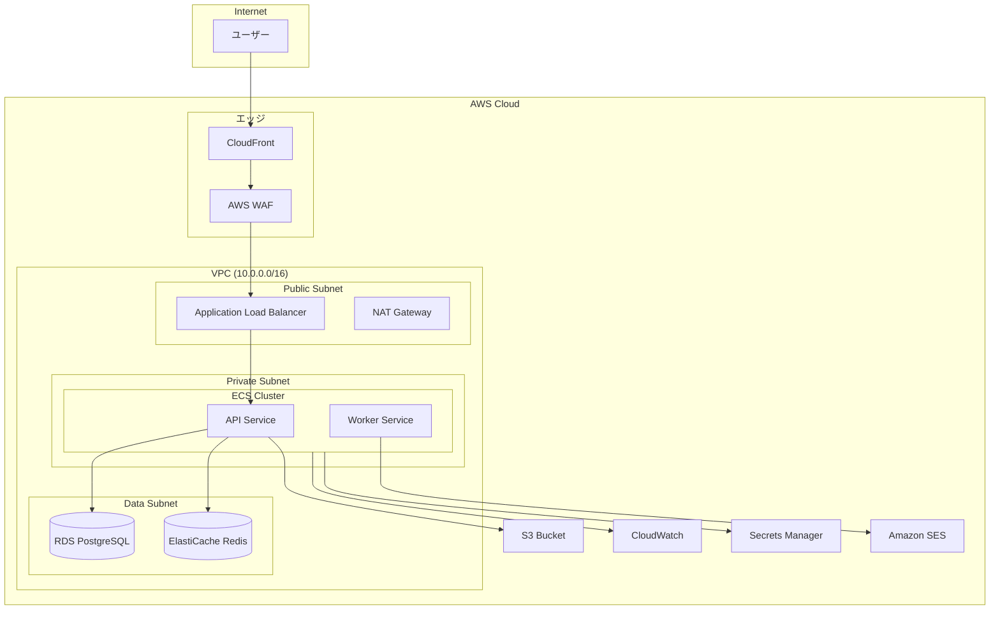

# {機能名} インフラ設計書

## 1. 概要

### 1.1 インフラ要件
| 項目 | 要件 |
|------|------|
| 可用性 | 99.9%（マルチAZ構成） |
| スケーラビリティ | オートスケーリング対応 |
| セキュリティ | WAF、暗号化必須 |
| リージョン | ap-northeast-1（東京） |

### 1.2 想定トラフィック
| 指標 | 値 |
|------|-----|
| 月間PV | XXX万PV |
| ピーク時RPS | XXX req/s |
| 同時接続数 | XXXユーザー |

## 2. システム構成図

## 3. ネットワーク設計

### 3.1 VPC設計
| 項目 | 値 |
|------|-----|
| VPC CIDR | 10.0.0.0/16 |
| リージョン | ap-northeast-1 |
| AZ | ap-northeast-1a, ap-northeast-1c |

### 3.2 サブネット構成
| サブネット | CIDR | AZ | 用途 |
|-----------|------|-----|------|
| public-1a | 10.0.1.0/24 | 1a | ALB, NAT Gateway |
| public-1c | 10.0.2.0/24 | 1c | ALB, NAT Gateway |
| private-1a | 10.0.11.0/24 | 1a | ECS Tasks |
| private-1c | 10.0.12.0/24 | 1c | ECS Tasks |
| data-1a | 10.0.21.0/24 | 1a | RDS, ElastiCache |
| data-1c | 10.0.22.0/24 | 1c | RDS, ElastiCache |

### 3.3 セキュリティグループ
| SG名 | インバウンド | アウトバウンド | 用途 |
|------|------------|--------------|------|
| alb-sg | 443 from 0.0.0.0/0 | All | ALB |
| ecs-sg | 8080 from alb-sg | All | ECS Tasks |
| rds-sg | 5432 from ecs-sg | None | RDS |
| redis-sg | 6379 from ecs-sg | None | ElastiCache |

## 4. コンピューティング

### 4.1 ECS構成
| 項目 | 値 |
|------|-----|
| 起動タイプ | Fargate |
| vCPU | 0.5 - 2 |
| メモリ | 1GB - 4GB |
| 最小タスク数 | 2 |
| 最大タスク数 | 10 |

### 4.2 オートスケーリング
| メトリクス | 閾値 | アクション |
|-----------|------|----------|
| CPU使用率 | 70%超過 | スケールアウト |
| CPU使用率 | 30%未満 | スケールイン |
| リクエスト数 | 1000/min超過 | スケールアウト |

## 5. データベース

### 5.1 RDS構成
| 項目 | 値 |
|------|-----|
| エンジン | PostgreSQL 15 |
| インスタンスクラス | db.t3.medium（本番: db.r6g.large） |
| ストレージ | gp3, 100GB |
| マルチAZ | 有効 |
| 自動バックアップ | 7日間保持 |
| 暗号化 | 有効（KMS） |

### 5.2 ElastiCache構成
| 項目 | 値 |
|------|-----|
| エンジン | Redis 7.0 |
| ノードタイプ | cache.t3.micro（本番: cache.r6g.large） |
| レプリカ数 | 1 |
| 暗号化 | 有効 |

## 6. ストレージ

### 6.1 S3バケット
| バケット名 | 用途 | アクセス |
|-----------|------|---------|
| {project}-assets | 静的ファイル | CloudFront経由 |
| {project}-uploads | ユーザーアップロード | 署名付きURL |
| {project}-logs | ログ保存 | 内部のみ |

### 6.2 ライフサイクルポリシー
| バケット | ルール |
|---------|--------|
| logs | 90日後にGlacierへ移行、365日後に削除 |
| uploads | 30日後に低頻度アクセスへ移行 |

## 7. CDN・ロードバランサー

### 7.1 CloudFront
| 項目 | 値 |
|------|-----|
| オリジン | ALB, S3 |
| キャッシュポリシー | CachingOptimized（静的）, CachingDisabled（API） |
| SSL証明書 | ACM（us-east-1） |
| WAF | 有効 |

### 7.2 ALB
| 項目 | 値 |
|------|-----|
| スキーム | Internet-facing |
| リスナー | HTTPS:443 |
| ヘルスチェック | /health, 30秒間隔 |
| スティッキーセッション | 無効 |

## 8. セキュリティ

### 8.1 IAMロール
| ロール | 用途 | 主な権限 |
|--------|------|---------|
| ecs-task-role | ECSタスク実行 | S3, Secrets Manager, SES |
| ecs-execution-role | ECSタスク起動 | ECR, CloudWatch Logs |

### 8.2 Secrets Manager
| シークレット | 用途 |
|-------------|------|
| {project}/db-credentials | RDS認証情報 |
| {project}/jwt-secret | JWT署名キー |
| {project}/external-api-keys | 外部API認証情報 |

### 8.3 WAFルール
| ルール | 説明 |
|--------|------|
| AWSManagedRulesCommonRuleSet | 一般的な脆弱性対策 |
| AWSManagedRulesKnownBadInputsRuleSet | 既知の悪意ある入力対策 |
| RateLimitRule | 1000 req/5min per IP |

## 9. 監視・ログ

### 9.1 CloudWatch Metrics
| メトリクス | 閾値 | アラート |
|-----------|------|---------|
| ECS CPU使用率 | 80%超過 | Warning |
| ECS メモリ使用率 | 80%超過 | Warning |
| RDS CPU使用率 | 70%超過 | Warning |
| ALB 5xxエラー率 | 5%超過 | Critical |
| ALB レイテンシ | 3秒超過 | Warning |

### 9.2 ログ構成
| ログ種別 | 保存先 | 保持期間 |
|---------|--------|---------|
| アプリケーションログ | CloudWatch Logs | 30日 |
| ALBアクセスログ | S3 | 90日 |
| CloudTrail | S3 | 365日 |
| VPC Flow Logs | CloudWatch Logs | 14日 |

## 10. コスト見積もり

### 10.1 月間コスト概算
| サービス | 構成 | 月額（USD） |
|---------|------|----------:|
| ECS Fargate | 2タスク × 0.5vCPU × 1GB | $30 |
| RDS | db.t3.medium, マルチAZ | $100 |
| ElastiCache | cache.t3.micro | $15 |
| ALB | 1台 | $20 |
| CloudFront | 100GB転送 | $10 |
| S3 | 50GB | $2 |
| その他 | NAT Gateway, データ転送等 | $50 |
| **合計** | | **$227** |

### 10.2 スケール時のコスト
| シナリオ | 追加コスト |
|---------|-----------|
| ECSタスク +1 | +$15/月 |
| RDSインスタンスアップグレード | +$100/月 |
| トラフィック2倍 | +$50/月 |

## 11. 障害対策・DR

### 11.1 可用性設計
| 障害シナリオ | 対策 | RTO | RPO |
|------------|------|-----|-----|
| AZ障害 | マルチAZ構成 | 5分 | 0 |
| ECSタスク障害 | オートスケーリング | 1分 | 0 |
| RDS障害 | マルチAZ自動フェイルオーバー | 5分 | 0 |

### 11.2 バックアップ
| 対象 | 方法 | 頻度 | 保持期間 |
|------|------|------|---------|
| RDS | 自動スナップショット | 日次 | 7日 |
| S3 | クロスリージョンレプリケーション | リアルタイム | - |
| 設定 | CloudFormation/Terraform | Git管理 | - |

---

## 変更履歴

| 日付 | バージョン | 変更内容 | 担当者 |
|:---|:---|:---|:---|
| YYYY-MM-DD | 1.0.0 | 初版作成 | - |
