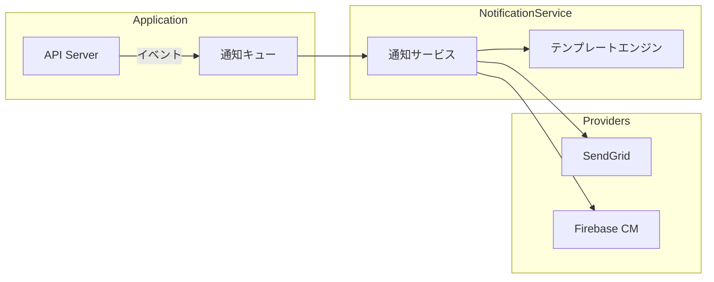

# {機能名} 通知設計書

## 1. 通知チャネル

| チャネル | 用途 | プロバイダー |
|---------|------|-------------|
| メール | 重要通知、認証 | SendGrid |
| プッシュ通知 | リアルタイム通知 | FCM |
| SMS | 二要素認証 | Twilio |

## 2. 通知種別一覧

| 通知ID | 通知名 | チャネル | トリガー | 優先度 |
|--------|--------|---------|---------|--------|
| NTF-001 | ウェルカムメール | メール | ユーザー登録 | 高 |
| NTF-002 | パスワードリセット | メール | リセット要求 | 高 |
| NTF-003 | 注文確認 | メール, プッシュ | 注文完了 | 中 |

## 3. 通知詳細

### 3.1 NTF-001: ウェルカムメール

#### 基本情報
| 項目 | 値 |
|------|-----|
| チャネル | メール |
| テンプレートID | WELCOME_EMAIL |
| 送信タイミング | ユーザー登録完了直後 |

#### テンプレート変数
| 変数名 | 型 | 説明 |
|--------|-----|------|
| userName | string | ユーザー名 |
| loginUrl | string | ログインURL |

#### 配信条件
- メール認証済みユーザーのみ
- メール配信停止していないユーザー

## 4. 配信アーキテクチャ

## 5. テンプレート管理

### 5.1 テンプレート保管場所
| 環境 | 保管場所 |
|------|---------|
| 開発 | ファイルシステム |
| 本番 | SendGrid Dynamic Templates |

### 5.2 多言語対応
| 言語 | テンプレートサフィックス |
|------|----------------------|
| 日本語 | _ja |
| 英語 | _en |

## 6. 配信ステータス管理

| ステータス | 説明 |
|-----------|------|
| QUEUED | キュー投入済み |
| SENT | 送信完了 |
| DELIVERED | 配信確認 |
| BOUNCED | バウンス |
| FAILED | 失敗 |

## 7. 監視・アラート

| 監視項目 | 閾値 | アラート |
|---------|------|---------|
| 配信失敗率 | 5%超過 | Critical |
| バウンス率 | 2%超過 | Warning |
| キュー滞留 | 100件超過 | Warning |

---

## 変更履歴

| 日付 | バージョン | 変更内容 | 担当者 |
|:---|:---|:---|:---|
| YYYY-MM-DD | 1.0.0 | 初版作成 | - |
