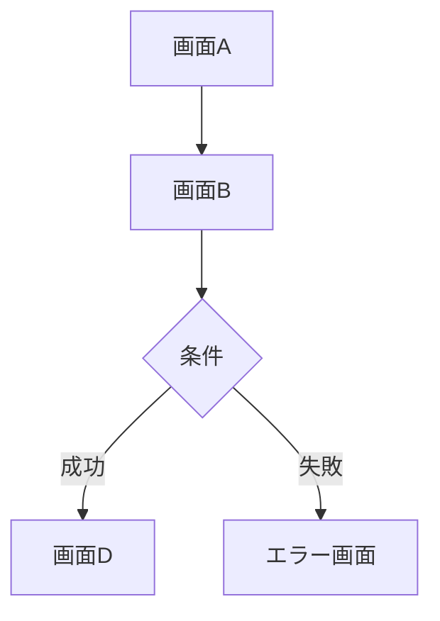

# {機能名} 画面設計書

## 1. 画面一覧
| 画面ID | 画面名 | URL | 認証 |
|--------|--------|-----|------|
| SC-001 | XXX画面 | /xxx | 必要 |

## 2. 画面遷移図

## 3. 画面詳細

### 3.1 SC-001: XXX画面

#### 画面モックアップ

<!-- MOCKUP_PLACEHOLDER: SC-001 -->
<!-- 通常状態: xxx-screen.png -->
<!-- エラー状態: xxx-screen-error.png -->

> ⚠️ モックアップはPhase 2で自動生成されます。このプレースホルダーは自動的にPNG画像参照に置換されます。

#### 画面概要
| 項目 | 内容 |
|------|------|
| 画面ID | SC-001 |
| 画面名 | XXX画面 |
| URL | /xxx |
| 認証 | 必要 |

#### レイアウト構造
- Page: XXX画面
  - Container[maxWidth=600px]
    - Form[id=xxxForm]
      - FormField
        - Input[type=text, name=field1, label="フィールド1"]
      - Button[type=submit, label="送信"]

#### バリデーション
| フィールド | ルール | エラーメッセージ |
|-----------|--------|-----------------|
| field1 | 必須、50文字以内 | 入力してください |

#### 画面遷移
| 操作 | 遷移先 | 条件 |
|------|--------|------|
| 送信ボタン | 完了画面 | 成功時 |

---

## 変更履歴

| 日付 | バージョン | 変更内容 | 担当者 |
|:---|:---|:---|:---|
| YYYY-MM-DD | 1.0.0 | 初版作成 | - |
