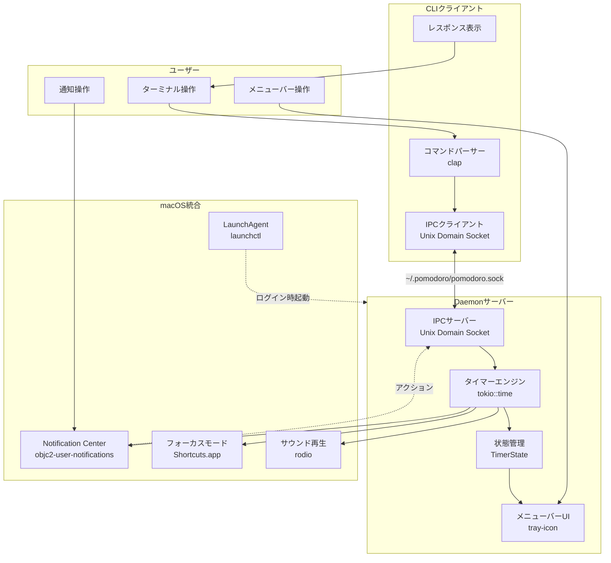
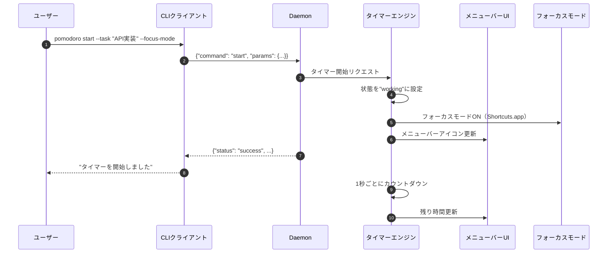
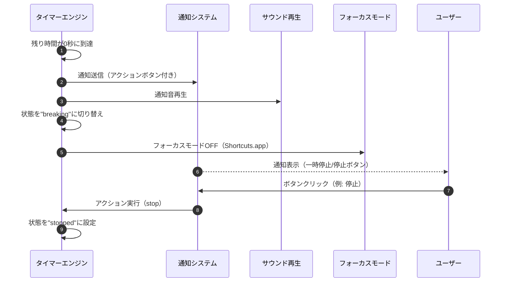
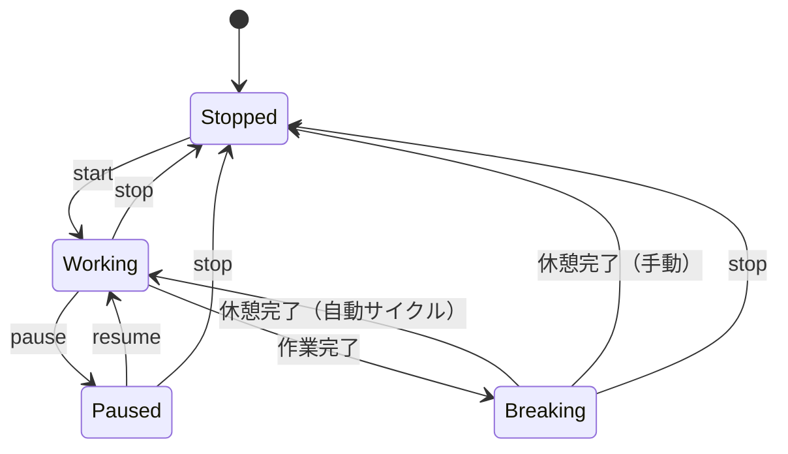
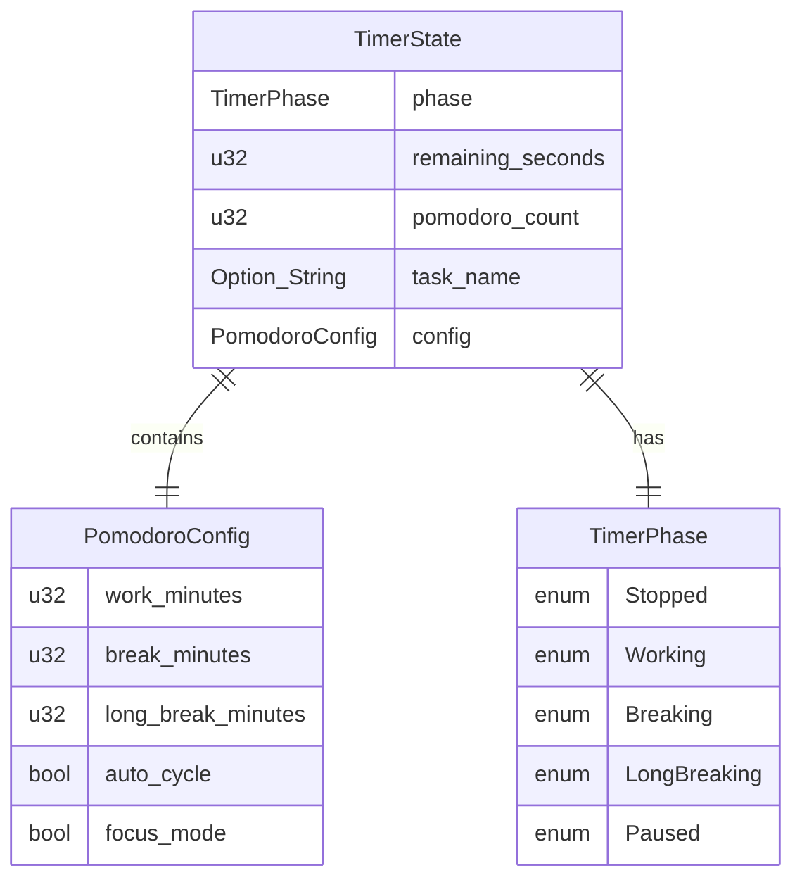

# ポモドーロタイマーCLI 基本設計書

## メタ情報

| 項目 | 内容 |
|------|------|
| ドキュメントID | BASIC-CLI-001 |
| 対応要件 | REQ-CLI-001 |
| バージョン | 1.0.0 |
| ステータス | レビュー完了 |
| 作成日 | 2026-01-03 |
| 最終更新日 | 2026-01-03 |
| 作成者 | - |
| レビュアー | - |
| 関連設計書 | [詳細設計書インデックス](../detailed/pomodoro-timer/README.md) |

---

## 1. 概要

### 1.1 目的

本設計書は、macOS専用のポモドーロタイマーCLIツールの基本設計を定義する。ターミナル上で完結しつつ、macOSのネイティブ機能（Notification Center、メニューバー、フォーカスモード、LaunchAgent）をフル活用することで、開発者の作業フローを妨げないシンプルで効率的な時間管理ツールを実現する。

### 1.2 背景

既存のポモドーロタイマーツールは以下の課題がある：
- GUI依存でターミナル作業中に画面切り替えが必要
- 不要な機能が多くシンプルに使いたいユーザーには過剰
- macOSの強力な機能（メニューバー、フォーカスモード等）を活用していない

これらを解決するため、macOS専用でターミナル上で完結し、macOSネイティブ機能を最大限活用するツールを開発する。

### 1.3 スコープ

#### スコープ内（Phase 1）
- ポモドーロタイマーの基本機能（25分作業・5分休憩サイクル）
- macOS Notification Centerによるアクションボタン付き通知
- ターミナル上でのタイマー制御（start/pause/resume/stop）
- メニューバー常駐による残り時間表示とクイック操作
- macOSフォーカスモード連携（Shortcuts.app経由）
- LaunchAgentによるログイン時自動起動・バックグラウンド実行
- 時間のカスタマイズ、タスク名設定、自動サイクル機能
- macOSネイティブサウンドによる通知音

#### スコープ外（Phase 2以降）
- 統計・履歴記録機能
- レポート出力機能
- 設定ファイルによる永続化
- 時間追加機能
- カラー/スタイルカスタマイズ
- ショートカットApp連携、Spotlight連携

### 1.4 用語定義

| 用語 | 定義 |
|------|------|
| ポモドーロ | 1回の作業時間（デフォルト25分）の単位 |
| 短い休憩 | ポモドーロ間の5分間の休憩 |
| 長い休憩 | 4ポモドーロ完了後の15-30分の休憩 |
| サイクル | 作業→休憩の1セット |
| 自動サイクル | 休憩終了後に自動的に次の作業を開始する機能 |
| Daemon | バックグラウンドで常駐するサーバープロセス |
| CLI | コマンドラインクライアント（ユーザーが直接実行） |
| IPC | プロセス間通信（Inter-Process Communication） |
| LaunchAgent | macOSのバックグラウンドプロセス管理機構 |

---

## 2. システムアーキテクチャ

### 2.1 全体構成

本システムは**クライアント・サーバーモデル**を採用し、以下の3つの主要コンポーネントで構成される：



### 2.2 コンポーネント一覧

| コンポーネント | 責務 | 技術 | 備考 |
|---------------|------|------|------|
| **CLIクライアント** | ユーザーコマンドの受付、Daemonへのリクエスト送信、結果表示 | clap 4.5+, Unix Domain Socket | 軽量・高速起動 |
| **Daemonサーバー** | タイマーロジック実行、状態管理、IPC受付、macOS統合 | tokio 1.48+ (current_thread), tray-icon 0.21+ | 常駐プロセス |
| **タイマーエンジン** | ポモドーロサイクルの実行、時間計測、イベント発火 | tokio::time::interval | MissedTickBehavior::Skip |
| **状態管理** | タイマー状態（作業中/休憩中/一時停止等）の保持 | Rust struct (TimerState) | メモリ内のみ（Phase 1） |
| **メニューバーUI** | メニューバーアイコン表示、ドロップダウンメニュー | tray-icon 0.21+ | macOS専用 |
| **通知システム** | アクションボタン付き通知の送信・受信 | objc2-user-notifications 0.3+ | UNUserNotificationCenterDelegate |
| **フォーカスモード連携** | Shortcuts.app経由でフォーカスモードON/OFF | std::process::Command | `/usr/bin/shortcuts run` |
| **サウンド再生** | タイマー完了時の通知音 | rodio 0.21+ | OutputStreamBuilder |
| **LaunchAgent管理** | ログイン時自動起動の設定・解除 | plist 1.6+, std::process::Command | launchctl load/unload |

### 2.3 通信方式

#### 2.3.1 IPC（プロセス間通信）

- **方式**: Unix Domain Socket
- **ソケットパス**: `~/.pomodoro/pomodoro.sock`
- **プロトコル**: JSON形式のリクエスト/レスポンス
- **接続**: CLIは都度接続・切断、Daemonは常時リッスン

#### 2.3.2 メッセージフォーマット

**リクエスト**:
```json
{
  "command": "start",
  "params": {
    "work_minutes": 25,
    "break_minutes": 5,
    "long_break_minutes": 15,
    "task_name": "API実装",
    "auto_cycle": false,
    "focus_mode": false
  }
}
```

**レスポンス**:
```json
{
  "status": "success",
  "message": "タイマーを開始しました",
  "data": {
    "state": "working",
    "remaining_seconds": 1500,
    "pomodoro_count": 1,
    "task_name": "API実装"
  }
}
```

### 2.4 データフロー

#### 2.4.1 タイマー開始フロー



#### 2.4.2 タイマー完了フロー



### 2.5 技術スタック

| カテゴリ | 技術 | バージョン | 選定理由 | 備考 |
|---------|------|-----------|---------|------|
| **言語** | Rust | 1.71+ | パフォーマンス、安全性、MSRV統一 | tokio/indicatifの要件 |
| **非同期ランタイム** | tokio | 1.48+ | デファクトスタンダード、軽量 | current_thread flavor |
| **CLIパーサー** | clap | 4.5.54+ | 高速、derive対応、サブコマンド対応 | derive feature |
| **通知** | objc2-user-notifications | 0.3.2+ | アクションボタン対応、最新API | codesign必須 |
| **メニューバー** | tray-icon | 0.21.2+ | macOS対応、軽量 | - |
| **プログレスバー** | indicatif | 0.18.3+ | ターミナルUI、MSRV 1.71 | - |
| **サウンド** | rodio | 0.21.1+ | 新API、軽量 | OutputStreamBuilder |
| **LaunchAgent** | plist | 1.6+ | plist生成、serde対応 | - |
| **IPC** | Unix Domain Socket | - | 標準ライブラリ、軽量 | std::os::unix::net |
| **シリアライズ** | serde | 1.0+ | JSON/TOML対応 | derive feature |
| **JSON** | serde_json | 1.0+ | IPC通信 | - |
| **エラーハンドリング** | anyhow | 1.0+ | 簡潔なエラー処理 | - |
| **ロギング** | tracing | 0.1+ | 構造化ログ | - |

### 2.6 外部システム連携

| システム名 | 連携内容 | 方式 | 頻度 |
|-----------|---------|------|------|
| macOS Notification Center | アクションボタン付き通知 | objc2-user-notifications | タイマー完了時 |
| macOSメニューバー | アイコン表示、ドロップダウンメニュー | tray-icon | 常時（1秒ごと更新） |
| macOSフォーカスモード | フォーカスモードON/OFF | `/usr/bin/shortcuts run` | タイマー状態変更時 |
| LaunchAgent | バックグラウンドプロセス管理 | launchctl load/unload | ログイン時、install/uninstall時 |
| Core Audio | システムサウンド再生 | rodio (OutputStreamBuilder) | タイマー完了時 |

---

## 3. 機能一覧

### 3.1 機能概要

| 機能ID | 機能名 | 概要 | 優先度 | 対応コンポーネント |
|--------|--------|------|--------|-------------------|
| F-001 | 基本タイマー機能 | 25分作業・5分休憩のサイクル実行 | 必須 | タイマーエンジン |
| F-002 | システム通知 | タイマー完了時のデスクトップ通知 | 必須 | 通知システム |
| F-003 | タイマー制御 | start/pause/resume/stop操作 | 必須 | CLIクライアント、Daemon |
| F-004 | 残り時間表示 | プログレスバー/カウントダウン表示 | 必須 | CLIクライアント、メニューバーUI |
| F-005 | 長い休憩 | 4ポモドーロ後に15-30分の長い休憩 | 必須 | タイマーエンジン |
| F-006 | 時間カスタマイズ | 作業時間・休憩時間の変更 | 重要 | CLIクライアント |
| F-007 | タスク名設定 | 現在のポモドーロのタスク名設定 | 重要 | 状態管理 |
| F-008 | ステータス確認 | 現在のタイマー状態の確認 | 重要 | CLIクライアント、Daemon |
| F-009 | 自動サイクル | 休憩後の自動作業開始 | 重要 | タイマーエンジン |
| F-017 | ネイティブ通知拡張 | アクションボタン付き通知（一時停止/停止） | 必須 | 通知システム |
| F-018 | メニューバー常駐 | メニューバーアイコンで残り時間表示とクイック操作 | 重要 | メニューバーUI |
| F-019 | フォーカスモード連携 | 作業中に自動でフォーカスモードON、休憩中にOFF | 重要 | フォーカスモード連携 |
| F-020 | LaunchAgent | ログイン時自動起動、バックグラウンド実行 | 必須 | LaunchAgent管理 |
| F-021 | システムサウンド | macOSネイティブサウンドで通知音 | あれば良い | サウンド再生 |

### 3.2 機能詳細

#### 3.2.1 F-001: 基本タイマー機能

**実現方式**:
- `tokio::time::interval` を使用して1秒ごとにティック
- `MissedTickBehavior::Skip` でドリフト防止
- 状態遷移: `Stopped` → `Working` → `Breaking` → `Working` ...

**主要フロー**:


#### 3.2.2 F-017: ネイティブ通知拡張

**実現方式**:
- `objc2-user-notifications` の `UNUserNotificationCenter` を使用
- `UNNotificationAction` でアクションボタン定義（一時停止/停止）
- `UNUserNotificationCenterDelegate` を `define_class!` マクロで実装
- アクションボタンクリック時、Daemon経由でタイマー操作

**制約事項**:
- バイナリに `codesign` 署名が必須
- 初回起動時に通知許可ダイアログ表示

#### 3.2.3 F-018: メニューバー常駐

**実現方式**:
- `tray-icon` でメニューバーアイテム作成
- 1秒ごとに残り時間を更新してアイコンに表示
- ドロップダウンメニューで一時停止/停止/設定/終了

**表示例**:
```
メニューバーアイコン: 🍅 15:30

ドロップダウンメニュー:
- ポモドーロタイマー
- ─────────────
- 作業中: API実装
- 残り時間: 15:30
- ポモドーロ: #2
- ─────────────
- ⏸ 一時停止
- ⏹ 停止
- ─────────────
- 終了
```

#### 3.2.4 F-019: フォーカスモード連携

**実現方式**:
- 公式APIが存在しないため、Shortcuts.app経由で制御
- ユーザーが事前に「Enable Work Focus」「Disable Work Focus」ショートカットを作成
- タイマー開始時: `/usr/bin/shortcuts run "Enable Work Focus"`
- 休憩開始時: `/usr/bin/shortcuts run "Disable Work Focus"`

**制約事項**:
- macOS 12 (Monterey) 以降
- ユーザーがショートカットを事前作成する必要がある
- ショートカット名は設定で変更可能（Phase 2）

#### 3.2.5 F-020: LaunchAgent

**実現方式**:
- `plist` クレートで `~/Library/LaunchAgents/com.example.pomodoro.plist` を生成
- `launchctl load` でLaunchAgent登録
- Daemon起動コマンド: `pomodoro daemon`

**plist構造**:
```xml
<?xml version="1.0" encoding="UTF-8"?>
<!DOCTYPE plist PUBLIC "-//Apple//DTD PLIST 1.0//EN" "http://www.apple.com/DTDs/PropertyList-1.0.dtd">
<plist version="1.0">
<dict>
    <key>Label</key>
    <string>com.example.pomodoro</string>
    <key>ProgramArguments</key>
    <array>
        <string>/usr/local/bin/pomodoro</string>
        <string>daemon</string>
    </array>
    <key>RunAtLoad</key>
    <true/>
    <key>KeepAlive</key>
    <true/>
    <key>StandardOutPath</key>
    <string>/Users/USERNAME/.pomodoro/logs/stdout.log</string>
    <key>StandardErrorPath</key>
    <string>/Users/USERNAME/.pomodoro/logs/stderr.log</string>
</dict>
</plist>
```

**注意事項**:
- パスに `~` は使用不可、絶対パス（`/Users/...`）を使用
- インストール前に必ず `unload` を試行（冪等性確保）

#### 3.2.6 F-021: システムサウンド

**実現方式**:
- `rodio` v0.21の新API `OutputStreamBuilder` を使用
- デフォルトサウンド: macOS標準の「Glass」サウンド
- サウンドファイルは埋め込みまたは `/System/Library/Sounds/` から読み込み

**実装例**:
```rust
use rodio::{OutputStreamBuilder, Sink, Decoder};
use std::fs::File;

let stream = OutputStreamBuilder::open_default_stream()?;
let sink = Sink::connect_new(stream.mixer());
let source = Decoder::try_from(File::open("/System/Library/Sounds/Glass.aiff")?)?;
sink.append(source);
```

---

## 4. 画面一覧

| 画面ID | 画面名 | 概要 | 対応機能 | 実装方式 |
|--------|--------|------|---------|---------|
| SCR-001 | ターミナルUI（プログレスバー表示） | タイマーの残り時間をプログレスバーで表示 | F-004 | indicatif |
| SCR-002 | メニューバーUI（ドロップダウンメニュー） | メニューバーアイコンとドロップダウンメニュー | F-018 | tray-icon |
| SCR-003 | 通知UI（アクションボタン付き） | タイマー完了通知とアクションボタン | F-017 | objc2-user-notifications |

### 4.1 SCR-001: ターミナルUI

**表示例**:
```
🍅 ポモドーロ #1 - 作業中
[████████████████░░░░] 15:30 / 25:00
タスク: API実装

Ctrl+C で一時停止
```

**実装方式**:
- `indicatif::ProgressBar` でプログレスバー表示
- 1秒ごとに `set_position()` で更新
- `set_message()` でタスク名表示

### 4.2 SCR-002: メニューバーUI

**表示例**:
- アイコン: `🍅 15:30`（作業中）、`☕ 04:30`（休憩中）
- ドロップダウンメニュー: 状態表示、一時停止/停止ボタン、終了ボタン

**実装方式**:
- `tray-icon::TrayIconBuilder` でアイコン作成
- `tray-icon::menu::Menu` でメニュー構築
- イベントループで `MenuEvent` を受信して処理

### 4.3 SCR-003: 通知UI

**表示例**:
```
[通知]
ポモドーロタイマー
作業時間が終了しました。休憩してください。
タスク: API実装

[一時停止] [停止]
```

**実装方式**:
- `UNMutableNotificationContent` で通知内容作成
- `UNNotificationAction` でアクションボタン定義
- `UNUserNotificationCenterDelegate` でアクション受信

---

## 5. API一覧（内部IPC）

### 5.1 メッセージフォーマット

#### 5.1.1 リクエスト

```json
{
  "command": "start" | "pause" | "resume" | "stop" | "status" | "install" | "uninstall",
  "params": {
    // コマンド固有のパラメータ
  }
}
```

#### 5.1.2 レスポンス

```json
{
  "status": "success" | "error",
  "message": "メッセージ",
  "data": {
    // コマンド固有のデータ
  }
}
```

### 5.2 コマンド一覧

| コマンド | 説明 | パラメータ | レスポンスデータ |
|---------|------|-----------|----------------|
| `start` | タイマー開始 | `work_minutes`, `break_minutes`, `long_break_minutes`, `task_name`, `auto_cycle`, `focus_mode` | `state`, `remaining_seconds`, `pomodoro_count`, `task_name` |
| `pause` | タイマー一時停止 | なし | `state`, `remaining_seconds` |
| `resume` | タイマー再開 | なし | `state`, `remaining_seconds` |
| `stop` | タイマー停止 | なし | `state` |
| `status` | ステータス確認 | なし | `state`, `remaining_seconds`, `pomodoro_count`, `task_name` |
| `install` | LaunchAgentインストール | なし | `message` |
| `uninstall` | LaunchAgentアンインストール | なし | `message` |

### 5.3 コマンド詳細

#### 5.3.1 start

**リクエスト**:
```json
{
  "command": "start",
  "params": {
    "work_minutes": 25,
    "break_minutes": 5,
    "long_break_minutes": 15,
    "task_name": "API実装",
    "auto_cycle": false,
    "focus_mode": false
  }
}
```

**レスポンス**:
```json
{
  "status": "success",
  "message": "タイマーを開始しました",
  "data": {
    "state": "working",
    "remaining_seconds": 1500,
    "pomodoro_count": 1,
    "task_name": "API実装"
  }
}
```

#### 5.3.2 status

**リクエスト**:
```json
{
  "command": "status",
  "params": {}
}
```

**レスポンス**:
```json
{
  "status": "success",
  "message": "",
  "data": {
    "state": "working",
    "remaining_seconds": 900,
    "pomodoro_count": 2,
    "task_name": "API実装"
  }
}
```

---

## 6. データモデル概要

### 6.1 主要エンティティ

| エンティティ | 説明 | 属性 |
|-------------|------|------|
| TimerState | タイマーの現在状態 | state, remaining_seconds, pomodoro_count, task_name, config |
| PomodoroConfig | タイマー設定 | work_minutes, break_minutes, long_break_minutes, auto_cycle, focus_mode |
| TimerPhase | タイマーのフェーズ | Working, Breaking, LongBreaking, Paused, Stopped |

### 6.2 データモデル詳細

#### 6.2.1 TimerState

```rust
pub struct TimerState {
    /// 現在のフェーズ
    pub phase: TimerPhase,
    /// 残り時間（秒）
    pub remaining_seconds: u32,
    /// 完了したポモドーロ回数
    pub pomodoro_count: u32,
    /// 現在のタスク名
    pub task_name: Option<String>,
    /// タイマー設定
    pub config: PomodoroConfig,
}
```

#### 6.2.2 PomodoroConfig

```rust
pub struct PomodoroConfig {
    /// 作業時間（分）
    pub work_minutes: u32,
    /// 短い休憩時間（分）
    pub break_minutes: u32,
    /// 長い休憩時間（分）
    pub long_break_minutes: u32,
    /// 自動サイクル有効化
    pub auto_cycle: bool,
    /// フォーカスモード連携有効化
    pub focus_mode: bool,
}
```

#### 6.2.3 TimerPhase

```rust
pub enum TimerPhase {
    /// 停止中
    Stopped,
    /// 作業中
    Working,
    /// 短い休憩中
    Breaking,
    /// 長い休憩中
    LongBreaking,
    /// 一時停止中
    Paused,
}
```

### 6.3 ER図（概要）



### 6.4 データフロー

Phase 1ではデータの永続化は行わず、すべてメモリ内で管理する。Phase 2で以下の永続化を検討：

| データ種別 | 保存先 | フォーマット |
|-----------|--------|-------------|
| タイマー状態 | `~/.pomodoro/state.json` | JSON |
| 統計データ | `~/.pomodoro/history.json` | JSON |
| 設定ファイル | `~/.pomodoro/config.toml` | TOML |
| ログファイル | `~/.pomodoro/logs/pomodoro.log` | TEXT |

---

## 7. 非機能要件への対応

### 7.1 パフォーマンス要件

| 要件ID | 要件 | 目標値 | 対応方針 |
|--------|------|--------|---------|
| NFR-P-001 | 起動時間 | 1秒以内 | tokio current_thread flavor使用、最小限の依存、lazy initialization |
| NFR-P-002 | メモリ使用量 | 50MB以下 | 軽量ライブラリ選定、不要な機能フラグ無効化 |
| NFR-P-003 | CPU使用率 | アイドル時1%以下 | tokio::time::interval使用、効率的なスリープ |
| NFR-P-004 | バイナリサイズ | 10MB以下 | release profile最適化、LTO有効化 |
| NFR-P-005 | 通知遅延 | タイマー完了から1秒以内 | 非同期処理、優先度付きタスク |

**実装方針**:
- `Cargo.toml` の `[profile.release]` で `lto = true`, `codegen-units = 1`, `strip = true` を設定
- tokio の `current_thread` flavor を使用してスレッドオーバーヘッドを削減
- 依存クレートの機能フラグを最小限に抑える

### 7.2 可用性要件

| 要件ID | 要件 | 目標値 | 対応方針 |
|--------|------|--------|---------|
| NFR-A-001 | コマンド実行成功率 | 99%以上 | 包括的なエラーハンドリング、入力検証 |
| NFR-A-002 | クラッシュ発生率 | 0.1%以下 | panic回避、Result型の徹底使用 |
| NFR-A-003 | エラーハンドリング | すべてのエラーで適切なメッセージ表示 | anyhowでエラーコンテキスト付与 |

**実装方針**:
- すべての外部呼び出し（IPC、ファイルI/O、プロセス起動）でエラーハンドリング
- `anyhow::Context` でエラーに文脈情報を付与
- ユーザーフレンドリーなエラーメッセージ（日本語/英語）

### 7.3 移植性要件

| 要件ID | 要件 | 詳細 | 対応方針 |
|--------|------|------|---------|
| NFR-PO-001 | 対応OS | macOS 12 (Monterey) 以降 | objc2-user-notifications、Shortcuts.app使用 |
| NFR-PO-002 | アーキテクチャ | x86_64、ARM64 | ユニバーサルバイナリ作成 |
| NFR-PO-003 | ターミナル | ANSI対応ターミナル | indicatifのフォールバック対応 |

**実装方針**:
- CI/CDでIntel Mac、Apple Silicon両方でビルド・テスト
- `cargo build --target x86_64-apple-darwin` と `--target aarch64-apple-darwin` でビルド
- `lipo` コマンドでユニバーサルバイナリ作成

### 7.4 ユーザビリティ要件

| 要件ID | 要件 | 詳細 | 対応方針 |
|--------|------|------|---------|
| NFR-U-001 | ヘルプの充実 | `--help` で全機能の使い方を表示 | clap の doc comment活用 |
| NFR-U-002 | エラーメッセージ | ユーザーが理解しやすい日本語/英語メッセージ | エラーメッセージテンプレート作成 |
| NFR-U-003 | 初回起動 | インストール後、設定なしで即使用可能 | デフォルト値設定、通知許可ダイアログ |
| NFR-U-004 | コマンド補完 | シェル補完スクリプトの提供 | clap_complete使用 |

**実装方針**:
- `clap_complete` で bash/zsh/fish の補完スクリプト生成
- `pomodoro completions <shell>` コマンドで補完スクリプト出力

### 7.5 保守性要件

| 要件ID | 要件 | 詳細 | 対応方針 |
|--------|------|------|---------|
| NFR-M-001 | ログ出力 | エラー・警告をログファイルに記録 | tracing使用、`~/.pomodoro/logs/` に出力 |
| NFR-M-002 | デバッグモード | `--verbose` フラグで詳細ログを出力 | tracing_subscriber の filter設定 |
| NFR-M-003 | バージョン情報 | `--version` でバージョン・ビルド情報を表示 | clap の version属性使用 |
| NFR-M-004 | コードカバレッジ | 80%以上のテストカバレッジ | cargo-tarpaulin使用 |

**実装方針**:
- `tracing` でログレベル管理（ERROR, WARN, INFO, DEBUG, TRACE）
- `--verbose` フラグで `RUST_LOG=debug` 相当のログ出力
- CI/CDで `cargo tarpaulin` 実行、カバレッジレポート生成

### 7.6 セキュリティ要件

| 要件ID | 要件 | 詳細 | 対応方針 |
|--------|------|------|---------|
| NFR-S-001 | 入力検証 | すべてのコマンドライン引数を検証 | clap の value_parser使用 |
| NFR-S-002 | ファイルパーミッション | ログファイルは0600（所有者のみ読み書き可） | std::fs::set_permissions使用 |
| NFR-S-003 | 依存関係 | 脆弱性のある依存クレートを使用しない | cargo-audit定期実行 |
| NFR-S-004 | エラー情報 | エラーメッセージに機密情報を含めない | エラーメッセージのサニタイズ |

**実装方針**:
- CI/CDで `cargo audit` 実行
- `cargo deny` でライセンス・依存関係チェック
- ログファイル作成時に `Permissions::from_mode(0o600)` 設定

---

## 8. 技術調査レポートからの知見反映

### 8.1 tokio (TECH-BE-001)

**適用事項**:
- [x] MSRV 1.71に設定（`Cargo.toml` の `rust-version = "1.71"`）
- [x] `#[tokio::main(flavor = "current_thread")]` 使用（軽量化）
- [x] `tokio::time::interval` の `MissedTickBehavior::Skip` 設定（ドリフト防止）
- [x] `tokio::signal::ctrl_c()` と `tokio::select!` でシグナル処理

**機能フラグ**:
```toml
tokio = { version = "1.48", features = ["rt", "time", "macros", "signal"] }
```

### 8.2 clap (TECH-TOOL-001)

**適用事項**:
- [x] `features = ["derive"]` 有効化
- [x] `#[command(...)]`, `#[arg(...)]` アトリビュート使用（v4新API）
- [x] `propagate_version = true` 設定
- [x] doc comment (`///`) でヘルプメッセージ記述

**機能フラグ**:
```toml
clap = { version = "4.5", features = ["derive"] }
```

### 8.3 objc2 (TECH-TOOL-002)

**適用事項**:
- [x] `objc2-user-notifications` 使用（アクションボタン対応）
- [x] `UNUserNotificationCenterDelegate` を `define_class!` で実装
- [x] バイナリに `codesign` 署名必須
- [x] Focus Mode制御は `/usr/bin/shortcuts run` で代替

**依存関係**:
```toml
objc2 = "0.6"
objc2-foundation = "0.3"
objc2-user-notifications = "0.3"
```

### 8.4 rodio (TECH-TOOL-003)

**適用事項**:
- [x] `OutputStreamBuilder::open_default_stream()` 使用（v0.21新API）
- [x] `Sink::connect_new(stream.mixer())` でSink接続
- [x] `Decoder::try_from(file)` で簡潔にデコード

**実装例**:
```rust
let stream = OutputStreamBuilder::open_default_stream()?;
let sink = Sink::connect_new(stream.mixer());
let source = Decoder::try_from(File::open("alert.aiff")?)?;
sink.append(source);
```

### 8.5 indicatif (TECH-TOOL-003)

**適用事項**:
- [x] MSRV 1.71に統一
- [x] `ProgressBar::set_elapsed` で経過時間手動制御

**機能フラグ**:
```toml
indicatif = "0.18"
```

### 8.6 LaunchAgents (TECH-INFRA-001)

**適用事項**:
- [x] `plist` クレートの `serde` 機能使用
- [x] パスに `~` 使用不可、絶対パス（`/Users/...`）使用
- [x] インストール場所: `~/Library/LaunchAgents/`
- [x] `launchctl load` 前に `unload` 試行（冪等性）

**依存関係**:
```toml
plist = "1.6"
serde = { version = "1.0", features = ["derive"] }
dirs = "5.0"
```

---

## 9. 未解決課題

### 9.1 要件定義書から継承

| ID | 課題 | 対応方針 | 期限 | ステータス |
|----|------|---------|------|-----------|
| I-001 | LaunchAgentの実装方式とplist生成方法 | plist クレート使用、詳細設計で実装 | 2026-01-10 | 未着手 |
| I-002 | objc2を使用したUserNotifications APIの実装 | define_class! マクロ使用、詳細設計で実装 | 2026-01-12 | 未着手 |
| I-003 | プログレスバーのちらつき防止方法 | indicatif の ProgressBar::set_draw_target 使用 | 2026-01-08 | 未着手 |
| I-004 | シェル補完スクリプトの生成方法 | clap_complete 使用 | 2026-01-15 | 未着手 |
| I-005 | CI/CDパイプラインの構築（Intel/Apple Silicon両対応） | GitHub Actions使用、詳細設計で定義 | 2026-01-17 | 未着手 |
| I-006 | フォーカスモードAPIの調査と実装方法 | Shortcuts.app経由で実装（技術調査完了） | 2026-01-11 | 解決済み |
| I-007 | メニューバーアイコンの実装（tray-icon vs objc2） | tray-icon 使用（技術調査完了） | 2026-01-09 | 解決済み |
| I-008 | 通知アクションボタンのイベントハンドリング | UNUserNotificationCenterDelegate 実装 | 2026-01-13 | 未着手 |

### 9.2 基本設計で新たに発生した課題

| ID | 課題 | 対応方針 | 期限 | ステータス |
|----|------|---------|------|-----------|
| I-009 | Unix Domain Socketの接続エラーハンドリング | リトライロジック、タイムアウト設定 | 2026-01-14 | 未着手 |
| I-010 | メニューバーUIとDaemonの同期方法 | イベントループでの状態同期 | 2026-01-11 | 未着手 |
| I-011 | 通知アクションとDaemonの連携方法 | IPC経由でアクション送信 | 2026-01-13 | 未着手 |
| I-012 | Shortcuts.appが存在しない場合のフォールバック | エラーメッセージ表示、機能無効化 | 2026-01-12 | 未着手 |
| I-013 | バイナリのcodesign署名方法 | 開発者証明書取得、CI/CDで自動署名 | 2026-01-16 | 未着手 |

---

## 10. 詳細設計への引き継ぎ事項

> **詳細設計書フォルダ**: [docs/designs/detailed/pomodoro-timer/](../detailed/pomodoro-timer/README.md)

### 10.1 詳細設計書の作成が必要な項目

以下の項目について、詳細設計書を作成する必要がある：

| # | 詳細設計書名 | 対象機能 | 優先度 | 備考 |
|---|-------------|---------|--------|------|
| 1 | Daemonサーバー詳細設計 | F-001, F-003, F-005, F-009 | 高 | タイマーエンジン、IPC、状態管理 |
| 2 | CLIクライアント詳細設計 | F-003, F-006, F-007, F-008 | 高 | コマンドパーサー、IPC、表示 |
| 3 | 通知システム詳細設計 | F-002, F-017 | 高 | objc2-user-notifications実装 |
| 4 | メニューバーUI詳細設計 | F-018 | 中 | tray-icon実装 |
| 5 | フォーカスモード連携詳細設計 | F-019 | 中 | Shortcuts.app連携 |
| 6 | LaunchAgent管理詳細設計 | F-020 | 中 | plist生成、launchctl操作 |
| 7 | サウンド再生詳細設計 | F-021 | 低 | rodio実装 |
| 8 | インフラ設計（CI/CD） | - | 高 | GitHub Actions、リリース自動化 |

### 10.2 実装時の注意事項

1. **MSRV統一**: すべての依存クレートのMSRVを考慮し、プロジェクト全体のMSRVを **1.71** に設定
2. **エラーハンドリング**: すべての外部呼び出しで `Result` 型を使用し、`anyhow::Context` でエラーコンテキスト付与
3. **テスト**: 各コンポーネントで単体テスト、統合テストを実装（カバレッジ80%以上）
4. **ドキュメント**: 公開APIには必ずdoc commentを記述
5. **コードサイン**: リリースビルドには必ず `codesign` 署名を実施

### 10.3 技術的検証が必要な項目

| 項目 | 検証内容 | 期限 |
|------|---------|------|
| objc2-user-notifications | アクションボタンのイベントハンドリング実装 | 2026-01-10 |
| Unix Domain Socket | 接続エラー時のリトライロジック | 2026-01-11 |
| tray-icon | メニューバーアイコンの動的更新 | 2026-01-09 |
| Shortcuts.app | フォーカスモード制御の動作確認 | 2026-01-08 |
| rodio | macOSシステムサウンドの再生 | 2026-01-07 |

---

## 11. 制約事項・前提条件

### 11.1 技術的制約

| 制約 | 詳細 | 理由 |
|------|------|------|
| 言語 | Rust 2021 Edition以降 | ユーザー指定、パフォーマンス・安全性 |
| MSRV | 1.71以上 | tokio/indicatifの要件 |
| 対応OS | macOS 12 (Monterey) 以降 | Shortcuts.app、Focus Mode API |
| アーキテクチャ | x86_64、ARM64 | Intel Mac、Apple Silicon対応 |
| 通知 | objc2-user-notifications | アクションボタン対応 |
| メニューバー | tray-icon | macOS専用 |
| フォーカスモード | Shortcuts.app経由 | 公式APIなし |
| サウンド | rodio 0.21+ | 新API使用 |
| IPC | Unix Domain Socket | 標準ライブラリ |

### 11.2 ビジネス制約

| 制約 | 詳細 |
|------|------|
| 予算 | 個人開発（予算なし） |
| スケジュール | Phase 1: 2週間以内に完成 |
| リソース | 開発者1名（takemo101） |
| ライセンス | MIT/Apache-2.0デュアルライセンス |

### 11.3 前提条件

- ユーザーはターミナルの基本操作ができる
- ユーザーのOSはmacOS 12 (Monterey) 以降
- ターミナルはANSIエスケープシーケンスに対応している
- システム通知機能が有効になっている
- 通知許可がアプリケーションに付与されている
- フォーカスモード連携を使用する場合、ユーザーがショートカットを事前作成している
- LaunchAgent使用のため、ユーザーディレクトリへの書き込み権限がある

---

## 12. リスクと対策

### 12.1 リスク一覧

| ID | リスク | 影響度 | 発生確率 | 対策 | ステータス |
|----|--------|--------|---------|------|-----------|
| R-001 | macOS通知APIの実装が困難 | 高 | 中 | objc2のドキュメント・サンプルコード調査、段階的実装 | 対策中 |
| R-002 | ターミナルでANSI制御が効かない | 中 | 低 | シンプルなテキスト表示にフォールバック | 未対応 |
| R-003 | フォーカスモードAPIが非公開または制限あり | 高 | 中 | Shortcuts.app経由で代替実装（技術調査完了） | 解決済み |
| R-004 | LaunchAgentの権限問題 | 中 | 低 | インストール手順の明確化、エラーハンドリング強化 | 未対応 |
| R-005 | 依存クレートの脆弱性 | 中 | 低 | 定期的な `cargo audit` 実行 | 対策中 |
| R-006 | Apple Siliconでの動作問題 | 中 | 低 | M1/M2/M3 Macでの動作確認、ユニバーサルバイナリ作成 | 未対応 |
| R-007 | macOSバージョンアップでAPI変更 | 中 | 中 | 複数バージョンでのテスト、後方互換性の確保 | 未対応 |
| R-008 | Unix Domain Socketの接続エラー | 中 | 中 | リトライロジック、タイムアウト設定、エラーメッセージ改善 | 未対応 |
| R-009 | codesign署名の失敗 | 高 | 中 | 開発者証明書取得、CI/CDで自動署名、手順書作成 | 未対応 |

---

## 13. 変更履歴

| 日付 | バージョン | 変更内容 | 担当者 |
|:---|:---|:---|:---|
| 2026-01-03 | 1.0.0 | 初版作成（要件定義書REQ-CLI-001 v2.1.0、技術調査レポート5件を基に作成） | - |

---

## 付録A: 技術スタック詳細

### A.1 依存クレート一覧

```toml
[package]
name = "pomodoro"
version = "0.1.0"
edition = "2021"
rust-version = "1.71"

[dependencies]
# 非同期ランタイム
tokio = { version = "1.48", features = ["rt", "time", "macros", "signal"] }

# CLIパーサー
clap = { version = "4.5", features = ["derive"] }

# macOS統合
objc2 = "0.6"
objc2-foundation = "0.3"
objc2-user-notifications = "0.3"
tray-icon = "0.21"
rodio = "0.21"

# UI
indicatif = "0.18"

# LaunchAgent
plist = "1.6"
dirs = "5.0"

# シリアライズ
serde = { version = "1.0", features = ["derive"] }
serde_json = "1.0"

# エラーハンドリング
anyhow = "1.0"

# ロギング
tracing = "0.1"
tracing-subscriber = "0.3"

[dev-dependencies]
# テスト
tokio-test = "0.4"

[profile.release]
lto = true
codegen-units = 1
strip = true
opt-level = "z"
```

### A.2 開発ツール

| ツール | 用途 | インストール |
|--------|------|-------------|
| rustfmt | コードフォーマット | `rustup component add rustfmt` |
| clippy | 静的解析・リント | `rustup component add clippy` |
| cargo-audit | 脆弱性チェック | `cargo install cargo-audit` |
| cargo-deny | ライセンス・依存関係チェック | `cargo install cargo-deny` |
| cargo-tarpaulin | カバレッジ測定 | `cargo install cargo-tarpaulin` |
| clap_complete | シェル補完生成 | 依存関係に含まれる |

---

## 付録B: コマンドリファレンス（Phase 1）

### B.1 基本コマンド

```bash
# タイマー開始（デフォルト: 25分作業、5分休憩）
pomodoro start

# カスタム時間で開始
pomodoro start --work 30 --break 10 --long-break 20

# タスク名を設定して開始
pomodoro start --task "API実装"

# 自動サイクルで開始
pomodoro start --auto-cycle

# フォーカスモード連携を有効にして開始
pomodoro start --focus-mode

# 一時停止
pomodoro pause

# 再開
pomodoro resume

# 停止
pomodoro stop

# ステータス確認
pomodoro status

# LaunchAgentのインストール（ログイン時自動起動）
pomodoro install

# LaunchAgentのアンインストール
pomodoro uninstall

# デーモンモード起動（LaunchAgentから呼ばれる）
pomodoro daemon

# ヘルプ表示
pomodoro --help

# バージョン表示
pomodoro --version
```

### B.2 オプション一覧

| オプション | 短縮形 | 説明 | デフォルト値 |
|-----------|--------|------|-------------|
| `--work <分>` | `-w` | 作業時間（分） | 25 |
| `--break <分>` | `-b` | 短い休憩時間（分） | 5 |
| `--long-break <分>` | `-l` | 長い休憩時間（分） | 15 |
| `--task <名前>` | `-t` | タスク名 | なし |
| `--auto-cycle` | `-a` | 自動サイクル | false |
| `--focus-mode` | `-f` | フォーカスモード連携 | false |
| `--no-sound` | | 通知音を無効化 | false |
| `--verbose` | `-v` | 詳細ログ出力 | false |
| `--help` | `-h` | ヘルプ表示 | - |
| `--version` | `-V` | バージョン表示 | - |

---

## 付録C: エラーコード一覧

| コード | メッセージ | 原因 | 対処法 |
|--------|-----------|------|--------|
| E001 | タイマーは既に実行中です | 実行中に `start` を実行 | `stop` してから再度 `start` |
| E002 | タイマーは実行されていません | 未起動時に `pause`/`resume`/`stop` | `start` でタイマーを開始 |
| E003 | タイマーは一時停止していません | 非一時停止時に `resume` | `pause` してから `resume` |
| E004 | 無効な時間指定です | 範囲外の時間を指定 | 1-120分の範囲で指定 |
| E005 | 通知の送信に失敗しました | macOS通知APIエラー | システム通知設定を確認 |
| E006 | 無効なタスク名です | 空文字列または100文字超 | 1-100文字で指定 |
| E007 | 通知許可がありません | 通知許可が拒否されている | システム環境設定で通知を許可 |
| E008 | フォーカスモードが見つかりません | 指定したショートカットが存在しない | Shortcuts.appでショートカットを作成 |
| E009 | LaunchAgentのインストールに失敗しました | plistファイルの書き込みエラー | ディレクトリの書き込み権限を確認 |
| E010 | macOSバージョンが古すぎます | macOS 12未満 | macOS 12以降にアップグレード |
| E011 | Daemonに接続できません | Daemon未起動またはソケットエラー | `pomodoro daemon` を起動 |
| E012 | バイナリが署名されていません | codesign署名なし | `codesign` で署名 |

---

**基本設計書の作成完了**

このドキュメントは、詳細設計フェーズで更新される可能性があります。変更がある場合は、変更履歴セクションに記録してください。
