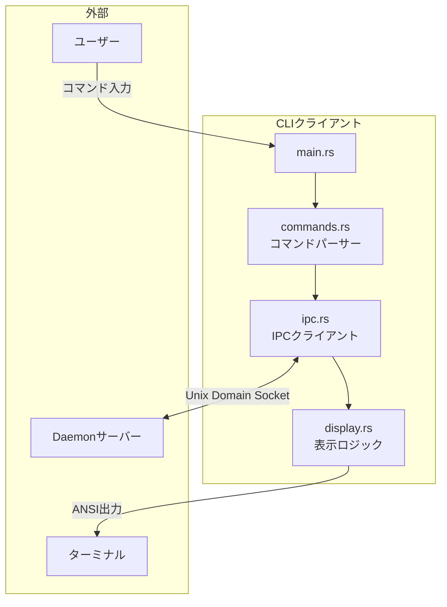
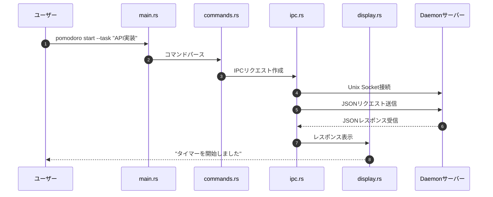
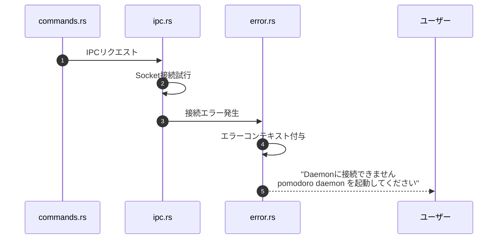

# CLIクライアント詳細設計書

## メタ情報

| 項目 | 内容 |
|------|------|
| ドキュメントID | DETAILED-CLI-001-CLIENT |
| 対応基本設計 | BASIC-CLI-001 |
| 対応要件 | REQ-CLI-001 (F-003, F-004, F-006, F-007, F-008) |
| バージョン | 1.0.0 |
| ステータス | ドラフト |
| 作成日 | 2026-01-03 |
| 最終更新日 | 2026-01-03 |
| 作成者 | - |
| レビュアー | - |

---

## 1. 概要

### 1.1 目的

本設計書は、ポモドーロタイマーCLIツールのクライアント側コンポーネントの詳細設計を定義する。CLIクライアントは、ユーザーからのコマンド入力を受け付け、Daemonサーバーとの通信を行い、結果をターミナルに表示する役割を担う。

### 1.2 スコープ

本設計書では以下を定義する：

- コマンドライン引数のパース処理（clap 4.5+使用）
- IPCクライアント実装（Unix Domain Socket）
- プログレスバー表示ロジック（indicatif 0.18+使用）
- シェル補完スクリプト生成
- エラーハンドリングとユーザーフィードバック

### 1.3 前提条件

- Daemonサーバーが起動している、または自動起動可能
- Unix Domain Socket (`~/.pomodoro/pomodoro.sock`) が利用可能
- ターミナルがANSIエスケープシーケンスに対応
- Rust 1.71以上の環境

---

## 2. アーキテクチャ

### 2.1 モジュール構成

```
src/
├── main.rs                 # エントリーポイント
├── cli/
│   ├── mod.rs             # CLIモジュールのルート
│   ├── commands.rs        # コマンド定義（clap derive）
│   ├── display.rs         # 表示ロジック（indicatif）
│   └── ipc.rs             # IPCクライアント実装
├── common/
│   ├── mod.rs
│   ├── types.rs           # 共通型定義（TimerState等）
│   └── error.rs           # エラー型定義
└── lib.rs                 # ライブラリルート
```

### 2.2 コンポーネント図



### 2.3 処理フロー

#### 2.3.1 基本フロー



#### 2.3.2 エラーハンドリングフロー



---

## 3. モジュール詳細設計

### 3.1 commands.rs - コマンド定義

#### 3.1.1 構造体定義

```rust
use clap::{Parser, Subcommand, Args};

/// ポモドーロタイマーCLI
#[derive(Parser, Debug)]
#[command(
    name = "pomodoro",
    version,
    about = "macOS専用ポモドーロタイマーCLI",
    long_about = "ターミナル上で動作するシンプルなポモドーロタイマー。\n\
                  macOSのネイティブ機能（通知、メニューバー、フォーカスモード）と統合されています。",
    propagate_version = true
)]
pub struct Cli {
    #[command(subcommand)]
    pub command: Commands,
    
    /// 詳細ログを出力
    #[arg(short, long, global = true)]
    pub verbose: bool,
}

/// サブコマンド定義
#[derive(Subcommand, Debug)]
pub enum Commands {
    /// タイマーを開始
    Start(StartArgs),
    
    /// タイマーを一時停止
    Pause,
    
    /// タイマーを再開
    Resume,
    
    /// タイマーを停止
    Stop,
    
    /// 現在のステータスを確認
    Status,
    
    /// LaunchAgentをインストール（ログイン時自動起動）
    Install,
    
    /// LaunchAgentをアンインストール
    Uninstall,
    
    /// デーモンモードで起動（LaunchAgentから呼ばれる）
    #[command(hide = true)]
    Daemon,
    
    /// シェル補完スクリプトを生成
    Completions {
        /// シェルの種類
        #[arg(value_enum)]
        shell: clap_complete::Shell,
    },
}

/// start コマンドの引数
#[derive(Args, Debug)]
pub struct StartArgs {
    /// 作業時間（分）
    #[arg(short, long, default_value = "25", value_parser = clap::value_parser!(u32).range(1..=120))]
    pub work: u32,
    
    /// 短い休憩時間（分）
    #[arg(short, long, default_value = "5", value_parser = clap::value_parser!(u32).range(1..=60))]
    pub break_time: u32,
    
    /// 長い休憩時間（分）
    #[arg(short, long, default_value = "15", value_parser = clap::value_parser!(u32).range(1..=60))]
    pub long_break: u32,
    
    /// タスク名
    #[arg(short, long, value_parser = validate_task_name)]
    pub task: Option<String>,
    
    /// 自動サイクル（休憩後に自動的に次の作業を開始）
    #[arg(short, long)]
    pub auto_cycle: bool,
    
    /// フォーカスモード連携（作業中にフォーカスモードON）
    #[arg(short, long)]
    pub focus_mode: bool,
    
    /// 通知音を無効化
    #[arg(long)]
    pub no_sound: bool,
}

/// タスク名のバリデーション
fn validate_task_name(s: &str) -> Result<String, String> {
    if s.is_empty() {
        return Err("タスク名は空にできません".to_string());
    }
    if s.len() > 100 {
        return Err("タスク名は100文字以内にしてください".to_string());
    }
    Ok(s.to_string())
}
```

#### 3.1.2 コマンド実行ロジック

```rust
use anyhow::{Context, Result};
use crate::cli::ipc::IpcClient;
use crate::cli::display::Display;

impl Cli {
    /// コマンドを実行
    pub async fn execute(self) -> Result<()> {
        // ログレベル設定
        if self.verbose {
            tracing_subscriber::fmt()
                .with_max_level(tracing::Level::DEBUG)
                .init();
        } else {
            tracing_subscriber::fmt()
                .with_max_level(tracing::Level::INFO)
                .init();
        }
        
        match self.command {
            Commands::Start(args) => {
                let client = IpcClient::new()?;
                let response = client.start(args).await
                    .context("タイマーの開始に失敗しました")?;
                Display::show_start_success(&response);
            }
            Commands::Pause => {
                let client = IpcClient::new()?;
                let response = client.pause().await
                    .context("タイマーの一時停止に失敗しました")?;
                Display::show_pause_success(&response);
            }
            Commands::Resume => {
                let client = IpcClient::new()?;
                let response = client.resume().await
                    .context("タイマーの再開に失敗しました")?;
                Display::show_resume_success(&response);
            }
            Commands::Stop => {
                let client = IpcClient::new()?;
                let response = client.stop().await
                    .context("タイマーの停止に失敗しました")?;
                Display::show_stop_success(&response);
            }
            Commands::Status => {
                let client = IpcClient::new()?;
                let response = client.status().await
                    .context("ステータスの取得に失敗しました")?;
                Display::show_status(&response);
            }
            Commands::Install => {
                let client = IpcClient::new()?;
                let response = client.install().await
                    .context("LaunchAgentのインストールに失敗しました")?;
                Display::show_install_success(&response);
            }
            Commands::Uninstall => {
                let client = IpcClient::new()?;
                let response = client.uninstall().await
                    .context("LaunchAgentのアンインストールに失敗しました")?;
                Display::show_uninstall_success(&response);
            }
            Commands::Daemon => {
                // Daemonモードは別バイナリまたは別モジュールで実装
                eprintln!("Daemonモードは直接実行できません");
                std::process::exit(1);
            }
            Commands::Completions { shell } => {
                Self::generate_completions(shell);
            }
        }
        
        Ok(())
    }
    
    /// シェル補完スクリプトを生成
    fn generate_completions(shell: clap_complete::Shell) {
        use clap::CommandFactory;
        use clap_complete::generate;
        
        let mut cmd = Cli::command();
        let bin_name = cmd.get_name().to_string();
        generate(shell, &mut cmd, bin_name, &mut std::io::stdout());
    }
}
```

### 3.2 ipc.rs - IPCクライアント実装

#### 3.2.1 IPCクライアント構造体

```rust
use std::os::unix::net::UnixStream;
use std::io::{Read, Write};
use std::time::Duration;
use anyhow::{Context, Result, bail};
use serde::{Serialize, Deserialize};

/// IPCクライアント
pub struct IpcClient {
    socket_path: String,
    timeout: Duration,
}

/// IPCリクエスト
#[derive(Serialize, Debug)]
pub struct IpcRequest {
    pub command: String,
    pub params: serde_json::Value,
}

/// IPCレスポンス
#[derive(Deserialize, Debug)]
pub struct IpcResponse {
    pub status: String,
    pub message: String,
    pub data: Option<serde_json::Value>,
}

impl IpcClient {
    /// 新しいIPCクライアントを作成
    pub fn new() -> Result<Self> {
        let socket_path = Self::get_socket_path()?;
        Ok(Self {
            socket_path,
            timeout: Duration::from_secs(5),
        })
    }
    
    /// ソケットパスを取得
    fn get_socket_path() -> Result<String> {
        let home = std::env::var("HOME")
            .context("HOME環境変数が設定されていません")?;
        Ok(format!("{}/.pomodoro/pomodoro.sock", home))
    }
    
    /// リクエストを送信してレスポンスを受信
    async fn send_request(&self, request: IpcRequest) -> Result<IpcResponse> {
        // Unix Domain Socketに接続
        let mut stream = UnixStream::connect(&self.socket_path)
            .context("Daemonに接続できません。pomodoro daemon を起動してください")?;
        
        // タイムアウト設定
        stream.set_read_timeout(Some(self.timeout))?;
        stream.set_write_timeout(Some(self.timeout))?;
        
        // リクエストをJSON形式でシリアライズ
        let request_json = serde_json::to_string(&request)
            .context("リクエストのシリアライズに失敗しました")?;
        
        // リクエスト送信
        stream.write_all(request_json.as_bytes())
            .context("リクエストの送信に失敗しました")?;
        stream.write_all(b"\n")
            .context("リクエストの送信に失敗しました")?;
        stream.flush()?;
        
        // レスポンス受信
        let mut buffer = String::new();
        stream.read_to_string(&mut buffer)
            .context("レスポンスの受信に失敗しました")?;
        
        // レスポンスをデシリアライズ
        let response: IpcResponse = serde_json::from_str(&buffer)
            .context("レスポンスのパースに失敗しました")?;
        
        // エラーレスポンスの場合
        if response.status == "error" {
            bail!("{}", response.message);
        }
        
        Ok(response)
    }
}
```

#### 3.2.2 コマンド別メソッド

```rust
use crate::cli::commands::StartArgs;

impl IpcClient {
    /// タイマー開始
    pub async fn start(&self, args: StartArgs) -> Result<IpcResponse> {
        let params = serde_json::json!({
            "workMinutes": args.work,
            "breakMinutes": args.break_time,
            "longBreakMinutes": args.long_break,
            "taskName": args.task,
            "autoCycle": args.auto_cycle,
            "focusMode": args.focus_mode,
            "noSound": args.no_sound,
        });
        
        let request = IpcRequest {
            command: "start".to_string(),
            params,
        };
        
        self.send_request(request).await
    }
    
    /// タイマー一時停止
    pub async fn pause(&self) -> Result<IpcResponse> {
        let request = IpcRequest {
            command: "pause".to_string(),
            params: serde_json::json!({}),
        };
        
        self.send_request(request).await
    }
    
    /// タイマー再開
    pub async fn resume(&self) -> Result<IpcResponse> {
        let request = IpcRequest {
            command: "resume".to_string(),
            params: serde_json::json!({}),
        };
        
        self.send_request(request).await
    }
    
    /// タイマー停止
    pub async fn stop(&self) -> Result<IpcResponse> {
        let request = IpcRequest {
            command: "stop".to_string(),
            params: serde_json::json!({}),
        };
        
        self.send_request(request).await
    }
    
    /// ステータス確認
    pub async fn status(&self) -> Result<IpcResponse> {
        let request = IpcRequest {
            command: "status".to_string(),
            params: serde_json::json!({}),
        };
        
        self.send_request(request).await
    }
    
    /// LaunchAgentインストール
    pub async fn install(&self) -> Result<IpcResponse> {
        let request = IpcRequest {
            command: "install".to_string(),
            params: serde_json::json!({}),
        };
        
        self.send_request(request).await
    }
    
    /// LaunchAgentアンインストール
    pub async fn uninstall(&self) -> Result<IpcResponse> {
        let request = IpcRequest {
            command: "uninstall".to_string(),
            params: serde_json::json!({}),
        };
        
        self.send_request(request).await
    }
}
```

### 3.3 display.rs - 表示ロジック

#### 3.3.1 表示ユーティリティ

```rust
use crate::cli::ipc::IpcResponse;
use colored::Colorize;

/// 表示ユーティリティ
pub struct Display;

impl Display {
    /// タイマー開始成功メッセージ
    pub fn show_start_success(response: &IpcResponse) {
        println!("{}", "✓ タイマーを開始しました".green().bold());
        
        if let Some(data) = &response.data {
            if let Some(task_name) = data.get("taskName").and_then(|v| v.as_str()) {
                println!("  タスク: {}", task_name.cyan());
            }
            if let Some(remaining) = data.get("remainingSeconds").and_then(|v| v.as_u64()) {
                let minutes = remaining / 60;
                let seconds = remaining % 60;
                println!("  残り時間: {}:{:02}", minutes, seconds);
            }
        }
    }
    
    /// タイマー一時停止成功メッセージ
    pub fn show_pause_success(response: &IpcResponse) {
        println!("{}", "⏸ タイマーを一時停止しました".yellow().bold());
        
        if let Some(data) = &response.data {
            if let Some(remaining) = data.get("remainingSeconds").and_then(|v| v.as_u64()) {
                let minutes = remaining / 60;
                let seconds = remaining % 60;
                println!("  残り時間: {}:{:02}", minutes, seconds);
            }
        }
    }
    
    /// タイマー再開成功メッセージ
    pub fn show_resume_success(response: &IpcResponse) {
        println!("{}", "▶ タイマーを再開しました".green().bold());
    }
    
    /// タイマー停止成功メッセージ
    pub fn show_stop_success(_response: &IpcResponse) {
        println!("{}", "⏹ タイマーを停止しました".red().bold());
    }
    
    /// ステータス表示
    pub fn show_status(response: &IpcResponse) {
        if let Some(data) = &response.data {
            let state = data.get("state").and_then(|v| v.as_str()).unwrap_or("unknown");
            let remaining = data.get("remainingSeconds").and_then(|v| v.as_u64()).unwrap_or(0);
            let pomodoro_count = data.get("pomodoroCount").and_then(|v| v.as_u64()).unwrap_or(0);
            let task_name = data.get("taskName").and_then(|v| v.as_str());
            
            println!("{}", "ポモドーロタイマー ステータス".bold());
            println!("─────────────────────────────");
            
            let state_display = match state {
                "working" => "🍅 作業中".green(),
                "breaking" => "☕ 休憩中".cyan(),
                "paused" => "⏸ 一時停止中".yellow(),
                "stopped" => "⏹ 停止中".red(),
                _ => "不明".normal(),
            };
            println!("状態: {}", state_display);
            
            if state != "stopped" {
                let minutes = remaining / 60;
                let seconds = remaining % 60;
                println!("残り時間: {}:{:02}", minutes, seconds);
                println!("ポモドーロ: #{}", pomodoro_count);
                
                if let Some(task) = task_name {
                    println!("タスク: {}", task.cyan());
                }
            }
        } else {
            println!("{}", "タイマーは起動していません".red());
        }
    }
    
    /// LaunchAgentインストール成功メッセージ
    pub fn show_install_success(_response: &IpcResponse) {
        println!("{}", "✓ LaunchAgentをインストールしました".green().bold());
        println!("  次回ログイン時から自動的に起動します");
    }
    
    /// LaunchAgentアンインストール成功メッセージ
    pub fn show_uninstall_success(_response: &IpcResponse) {
        println!("{}", "✓ LaunchAgentをアンインストールしました".green().bold());
        println!("  次回ログイン時から自動起動しなくなります");
    }
}
```

#### 3.3.2 プログレスバー表示（将来拡張用）

```rust
use indicatif::{ProgressBar, ProgressStyle};
use std::time::Duration;

impl Display {
    /// プログレスバーを作成（将来的にリアルタイム表示に使用）
    pub fn create_progress_bar(total_seconds: u64) -> ProgressBar {
        let pb = ProgressBar::new(total_seconds);
        pb.set_style(
            ProgressStyle::default_bar()
                .template("{spinner:.green} [{elapsed_precise}] [{bar:40.cyan/blue}] {pos}/{len} ({eta})")
                .unwrap()
                .progress_chars("█▓▒░ ")
        );
        pb.enable_steady_tick(Duration::from_millis(100));
        pb
    }
}
```

### 3.4 main.rs - エントリーポイント

```rust
use clap::Parser;
use anyhow::Result;

mod cli;
mod common;

#[tokio::main(flavor = "current_thread")]
async fn main() -> Result<()> {
    // コマンドライン引数をパース
    let cli = cli::commands::Cli::parse();
    
    // コマンドを実行
    if let Err(e) = cli.execute().await {
        eprintln!("{} {}", "エラー:".red().bold(), e);
        std::process::exit(1);
    }
    
    Ok(())
}
```

---

## 4. データ型定義

### 4.1 共通型（common/types.rs）

```rust
use serde::{Serialize, Deserialize};

/// タイマーの状態
#[derive(Debug, Clone, Serialize, Deserialize)]
#[serde(rename_all = "camelCase")]
pub struct TimerState {
    pub state: TimerPhase,
    pub remaining_seconds: u32,
    pub pomodoro_count: u32,
    pub task_name: Option<String>,
}

/// タイマーのフェーズ
#[derive(Debug, Clone, Serialize, Deserialize)]
#[serde(rename_all = "lowercase")]
pub enum TimerPhase {
    Stopped,
    Working,
    Breaking,
    LongBreaking,
    Paused,
}
```

### 4.2 エラー型（common/error.rs）

```rust
use thiserror::Error;

/// CLIエラー型
#[derive(Error, Debug)]
pub enum CliError {
    #[error("Daemonに接続できません: {0}")]
    ConnectionError(String),
    
    #[error("無効なコマンドです: {0}")]
    InvalidCommand(String),
    
    #[error("タイムアウトしました")]
    Timeout,
    
    #[error("レスポンスのパースに失敗しました: {0}")]
    ParseError(String),
    
    #[error("IO エラー: {0}")]
    IoError(#[from] std::io::Error),
}
```

---

## 5. エラーハンドリング

### 5.1 エラー処理方針

| エラー種別 | 処理方法 | ユーザーへの表示 |
|-----------|---------|----------------|
| 接続エラー | リトライ（最大3回） | "Daemonに接続できません。pomodoro daemon を起動してください" |
| タイムアウト | エラー終了 | "リクエストがタイムアウトしました" |
| パースエラー | エラー終了 | "レスポンスの解析に失敗しました" |
| バリデーションエラー | エラー終了 | 具体的なバリデーションメッセージ |

### 5.2 リトライロジック

```rust
use std::time::Duration;
use tokio::time::sleep;

impl IpcClient {
    /// リトライ付きリクエスト送信
    async fn send_request_with_retry(&self, request: IpcRequest) -> Result<IpcResponse> {
        let max_retries = 3;
        let mut last_error = None;
        
        for attempt in 1..=max_retries {
            match self.send_request(request.clone()).await {
                Ok(response) => return Ok(response),
                Err(e) => {
                    tracing::warn!("リクエスト失敗 (試行 {}/{}): {}", attempt, max_retries, e);
                    last_error = Some(e);
                    
                    if attempt < max_retries {
                        sleep(Duration::from_millis(500 * attempt as u64)).await;
                    }
                }
            }
        }
        
        Err(last_error.unwrap())
    }
}
```

---

## 6. テスト設計

### 6.1 単体テスト

#### 6.1.1 コマンドパーステスト

```rust
#[cfg(test)]
mod tests {
    use super::*;
    use clap::Parser;
    
    #[test]
    fn test_parse_start_command() {
        let args = vec!["pomodoro", "start", "--work", "30", "--task", "テスト"];
        let cli = Cli::parse_from(args);
        
        match cli.command {
            Commands::Start(start_args) => {
                assert_eq!(start_args.work, 30);
                assert_eq!(start_args.task, Some("テスト".to_string()));
            }
            _ => panic!("Expected Start command"),
        }
    }
    
    #[test]
    fn test_validate_task_name_too_long() {
        let long_name = "a".repeat(101);
        let result = validate_task_name(&long_name);
        assert!(result.is_err());
    }
    
    #[test]
    fn test_validate_task_name_empty() {
        let result = validate_task_name("");
        assert!(result.is_err());
    }
}
```

#### 6.1.2 IPCクライアントテスト

```rust
#[cfg(test)]
mod tests {
    use super::*;
    
    #[tokio::test]
    async fn test_ipc_request_serialization() {
        let request = IpcRequest {
            command: "start".to_string(),
            params: serde_json::json!({
                "workMinutes": 25,
                "taskName": "テスト",
            }),
        };
        
        let json = serde_json::to_string(&request).unwrap();
        assert!(json.contains("start"));
        assert!(json.contains("workMinutes"));
    }
    
    #[tokio::test]
    async fn test_ipc_response_deserialization() {
        let json = r#"{"status":"success","message":"OK","data":{"state":"working"}}"#;
        let response: IpcResponse = serde_json::from_str(json).unwrap();
        
        assert_eq!(response.status, "success");
        assert_eq!(response.message, "OK");
    }
}
```

### 6.2 統合テスト

```rust
// tests/integration_test.rs
use assert_cmd::Command;
use predicates::prelude::*;

#[test]
fn test_help_command() {
    let mut cmd = Command::cargo_bin("pomodoro").unwrap();
    cmd.arg("--help")
        .assert()
        .success()
        .stdout(predicate::str::contains("ポモドーロタイマーCLI"));
}

#[test]
fn test_version_command() {
    let mut cmd = Command::cargo_bin("pomodoro").unwrap();
    cmd.arg("--version")
        .assert()
        .success()
        .stdout(predicate::str::contains(env!("CARGO_PKG_VERSION")));
}

#[test]
fn test_completions_command() {
    let mut cmd = Command::cargo_bin("pomodoro").unwrap();
    cmd.arg("completions").arg("bash")
        .assert()
        .success()
        .stdout(predicate::str::contains("_pomodoro"));
}
```

---

## 7. シェル補完スクリプト生成

### 7.1 対応シェル

| シェル | 補完スクリプト出力先 | インストール方法 |
|--------|-------------------|----------------|
| bash | `~/.bash_completion.d/pomodoro` | `source ~/.bash_completion.d/pomodoro` |
| zsh | `~/.zsh/completions/_pomodoro` | `fpath=(~/.zsh/completions $fpath)` |
| fish | `~/.config/fish/completions/pomodoro.fish` | 自動読み込み |

### 7.2 生成コマンド

```bash
# bash
pomodoro completions bash > ~/.bash_completion.d/pomodoro
source ~/.bash_completion.d/pomodoro

# zsh
mkdir -p ~/.zsh/completions
pomodoro completions zsh > ~/.zsh/completions/_pomodoro
# .zshrc に追加: fpath=(~/.zsh/completions $fpath)

# fish
mkdir -p ~/.config/fish/completions
pomodoro completions fish > ~/.config/fish/completions/pomodoro.fish
```

---

## 8. 依存関係

### 8.1 Cargo.toml

```toml
[package]
name = "pomodoro"
version = "0.1.0"
edition = "2021"
rust-version = "1.71"

[[bin]]
name = "pomodoro"
path = "src/main.rs"

[dependencies]
# 非同期ランタイム
tokio = { version = "1.48", features = ["rt", "time", "macros"] }

# CLIパーサー
clap = { version = "4.5", features = ["derive"] }
clap_complete = "4.5"

# UI
indicatif = "0.18"
colored = "2.1"

# シリアライズ
serde = { version = "1.0", features = ["derive"] }
serde_json = "1.0"

# エラーハンドリング
anyhow = "1.0"
thiserror = "1.0"

# ロギング
tracing = "0.1"
tracing-subscriber = "0.3"

[dev-dependencies]
assert_cmd = "2.0"
predicates = "3.0"
tokio-test = "0.4"
```

---

## 9. パフォーマンス要件

### 9.1 起動時間

| 指標 | 目標値 | 測定方法 |
|------|--------|---------|
| コマンド起動時間 | 100ms以内 | `time pomodoro --help` |
| IPC接続時間 | 50ms以内 | tracing ログで測定 |
| レスポンス表示時間 | 10ms以内 | tracing ログで測定 |

### 9.2 最適化方針

- `tokio` の `current_thread` flavor使用
- 不要な機能フラグを無効化
- `release` プロファイルで LTO 有効化

```toml
[profile.release]
lto = true
codegen-units = 1
strip = true
opt-level = "z"
```

---

## 10. セキュリティ考慮事項

### 10.1 入力検証

| 入力項目 | 検証内容 | 実装方法 |
|---------|---------|---------|
| 作業時間 | 1-120分の範囲 | `clap::value_parser` の `range` |
| 休憩時間 | 1-60分の範囲 | `clap::value_parser` の `range` |
| タスク名 | 1-100文字、特殊文字制限 | カスタムバリデーション関数 |

### 10.2 ソケット通信

- Unix Domain Socketのパーミッション確認
- タイムアウト設定（5秒）
- レスポンスサイズ制限（1MB）

---

## 11. 運用・保守

### 11.1 ログ出力

| ログレベル | 出力内容 | 出力先 |
|-----------|---------|--------|
| ERROR | 致命的エラー | stderr |
| WARN | 警告（リトライ等） | stderr |
| INFO | 通常の操作ログ | stdout |
| DEBUG | デバッグ情報（`--verbose`時） | stdout |

### 11.2 デバッグモード

```bash
# 詳細ログ出力
pomodoro --verbose start

# 環境変数でログレベル設定
RUST_LOG=debug pomodoro start
```

---

## 12. 今後の拡張

### 12.1 Phase 2 で検討する機能

- リアルタイムプログレスバー表示（`indicatif` 使用）
- カラーテーマのカスタマイズ
- 設定ファイル（`~/.pomodoro/config.toml`）からのデフォルト値読み込み
- 統計情報の表示（`pomodoro stats`）

---

## 変更履歴

| 日付 | バージョン | 変更内容 | 担当者 |
|------|-----------|---------|--------|
| 2026-01-03 | 1.0.0 | 初版作成 | - |
