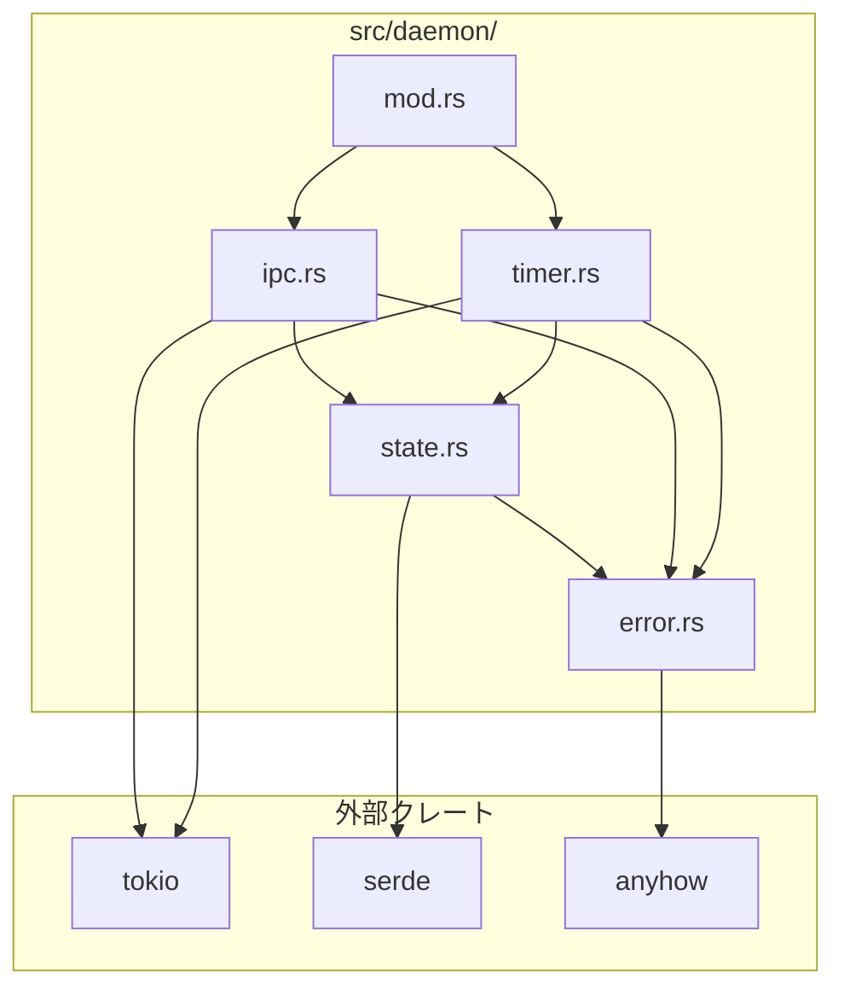
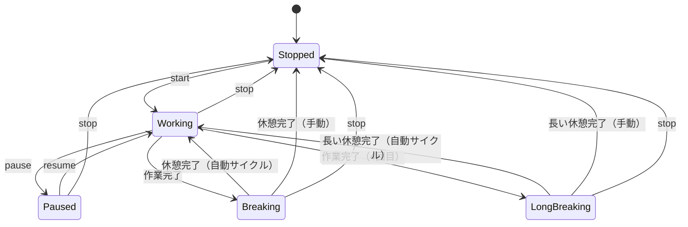
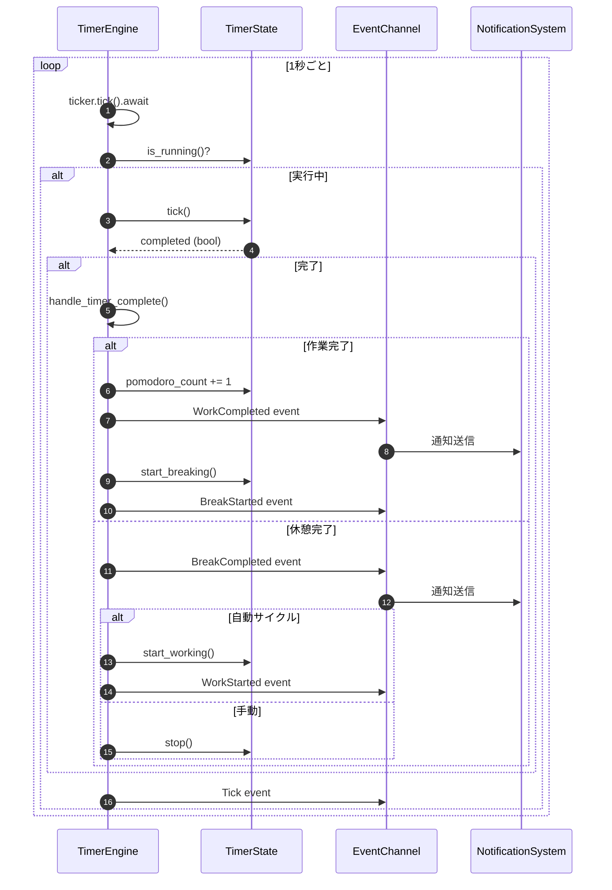
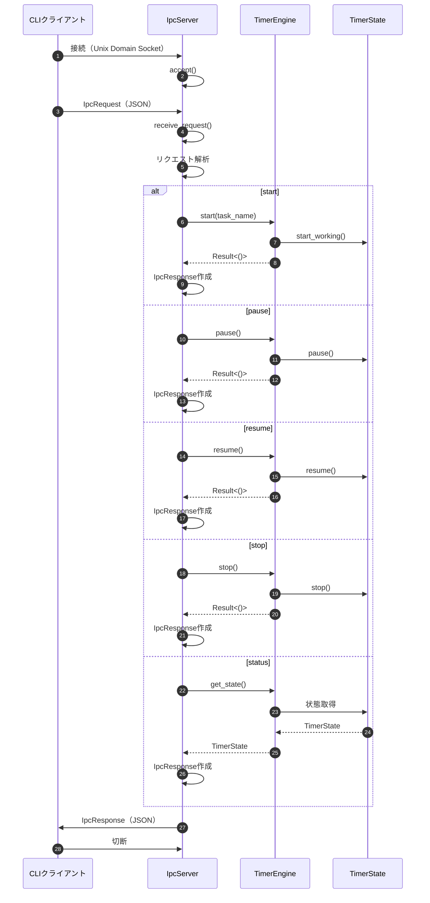

# Daemonサーバー詳細設計書

## メタ情報

| 項目 | 内容 |
|------|------|
| ドキュメントID | DETAILED-CLI-001-DAEMON |
| 対応基本設計 | BASIC-CLI-001 |
| 対応要件 | REQ-CLI-001 (F-001, F-003, F-005, F-009) |
| バージョン | 1.0.0 |
| ステータス | ドラフト |
| 作成日 | 2026-01-03 |
| 最終更新日 | 2026-01-03 |
| 作成者 | - |

---

## 1. 概要

### 1.1 目的

本設計書は、ポモドーロタイマーCLIツールのDaemonサーバーコンポーネントの詳細設計を定義する。Daemonサーバーは、バックグラウンドで常駐し、タイマーロジックの実行、状態管理、IPC通信、macOS統合機能を提供する中核コンポーネントである。

### 1.2 スコープ

本設計書では以下を定義する：

- モジュール構成（`src/daemon/`配下）
- タイマーエンジンの実装詳細
- IPCサーバーの実装詳細
- 状態管理の実装詳細
- エラーハンドリング戦略
- 単体テスト方針

以下は本設計書のスコープ外とする：

- CLIクライアントの実装（別設計書で定義）
- 通知システムの実装（別設計書で定義）
- メニューバーUIの実装（別設計書で定義）
- フォーカスモード連携の実装（別設計書で定義）

### 1.3 用語定義

| 用語 | 定義 |
|------|------|
| Daemon | バックグラウンドで常駐するサーバープロセス |
| IPC | プロセス間通信（Inter-Process Communication） |
| UDS | Unix Domain Socket |
| Tick | タイマーの1秒ごとの時間刻み |
| Phase | タイマーの状態（Working/Breaking/LongBreaking/Paused/Stopped） |
| Cycle | 作業→休憩の1セット |

---

## 2. モジュール設計

### 2.1 モジュール構成

```
src/daemon/
├── mod.rs              # Daemonモジュールのエントリーポイント
├── timer.rs            # タイマーエンジン
├── ipc.rs              # IPCサーバー
├── state.rs            # 状態管理
└── error.rs            # エラー型定義
```

### 2.2 モジュール依存関係



### 2.3 モジュール責務

| モジュール | 責務 | 主要型 |
|-----------|------|--------|
| `mod.rs` | Daemonの起動・停止、コンポーネント統合 | `Daemon`, `DaemonConfig` |
| `timer.rs` | タイマーロジック、時間計測、フェーズ遷移 | `TimerEngine`, `TimerEvent` |
| `ipc.rs` | Unix Domain Socketサーバー、リクエスト/レスポンス処理 | `IpcServer`, `IpcRequest`, `IpcResponse` |
| `state.rs` | タイマー状態の保持・更新 | `TimerState`, `PomodoroConfig`, `TimerPhase` |
| `error.rs` | エラー型定義、エラーハンドリング | `DaemonError`, `Result<T>` |

---

## 3. データ型定義

### 3.1 状態管理（state.rs）

#### 3.1.1 TimerState

```rust
use serde::{Deserialize, Serialize};

/// タイマーの現在状態
#[derive(Debug, Clone, Serialize, Deserialize)]
pub struct TimerState {
    /// 現在のフェーズ
    pub phase: TimerPhase,
    /// 残り時間（秒）
    pub remaining_seconds: u32,
    /// 完了したポモドーロ回数
    pub pomodoro_count: u32,
    /// 現在のタスク名
    pub task_name: Option<String>,
    /// タイマー設定
    pub config: PomodoroConfig,
}

impl TimerState {
    /// 新しいTimerStateを作成（停止状態）
    pub fn new(config: PomodoroConfig) -> Self {
        Self {
            phase: TimerPhase::Stopped,
            remaining_seconds: 0,
            pomodoro_count: 0,
            task_name: None,
            config,
        }
    }

    /// 作業フェーズを開始
    pub fn start_working(&mut self, task_name: Option<String>) {
        self.phase = TimerPhase::Working;
        self.remaining_seconds = self.config.work_minutes * 60;
        self.task_name = task_name;
    }

    /// 休憩フェーズを開始
    pub fn start_breaking(&mut self) {
        // 4ポモドーロごとに長い休憩
        if self.pomodoro_count > 0 && self.pomodoro_count % 4 == 0 {
            self.phase = TimerPhase::LongBreaking;
            self.remaining_seconds = self.config.long_break_minutes * 60;
        } else {
            self.phase = TimerPhase::Breaking;
            self.remaining_seconds = self.config.break_minutes * 60;
        }
    }

    /// 一時停止
    pub fn pause(&mut self) {
        if matches!(self.phase, TimerPhase::Working | TimerPhase::Breaking | TimerPhase::LongBreaking) {
            self.phase = TimerPhase::Paused;
        }
    }

    /// 再開
    pub fn resume(&mut self) {
        if self.phase == TimerPhase::Paused {
            // 一時停止前のフェーズに戻す（残り時間は保持）
            // 注: 実装では一時停止前のフェーズを保存する必要がある
            self.phase = TimerPhase::Working; // 簡略化のため、実際は前のフェーズを復元
        }
    }

    /// 停止
    pub fn stop(&mut self) {
        self.phase = TimerPhase::Stopped;
        self.remaining_seconds = 0;
        self.task_name = None;
    }

    /// 1秒経過
    pub fn tick(&mut self) -> bool {
        if self.remaining_seconds > 0 {
            self.remaining_seconds -= 1;
        }
        self.remaining_seconds == 0
    }

    /// 実行中かどうか
    pub fn is_running(&self) -> bool {
        matches!(
            self.phase,
            TimerPhase::Working | TimerPhase::Breaking | TimerPhase::LongBreaking
        )
    }

    /// 一時停止中かどうか
    pub fn is_paused(&self) -> bool {
        self.phase == TimerPhase::Paused
    }
}
```

#### 3.1.2 PomodoroConfig

```rust
/// タイマー設定
#[derive(Debug, Clone, Serialize, Deserialize)]
pub struct PomodoroConfig {
    /// 作業時間（分）
    pub work_minutes: u32,
    /// 短い休憩時間（分）
    pub break_minutes: u32,
    /// 長い休憩時間（分）
    pub long_break_minutes: u32,
    /// 自動サイクル有効化
    pub auto_cycle: bool,
    /// フォーカスモード連携有効化
    pub focus_mode: bool,
}

impl Default for PomodoroConfig {
    fn default() -> Self {
        Self {
            work_minutes: 25,
            break_minutes: 5,
            long_break_minutes: 15,
            auto_cycle: false,
            focus_mode: false,
        }
    }
}

impl PomodoroConfig {
    /// 設定を検証
    pub fn validate(&self) -> Result<(), String> {
        if self.work_minutes < 1 || self.work_minutes > 120 {
            return Err("作業時間は1-120分の範囲で指定してください".to_string());
        }
        if self.break_minutes < 1 || self.break_minutes > 60 {
            return Err("休憩時間は1-60分の範囲で指定してください".to_string());
        }
        if self.long_break_minutes < 1 || self.long_break_minutes > 60 {
            return Err("長い休憩時間は1-60分の範囲で指定してください".to_string());
        }
        Ok(())
    }
}
```

#### 3.1.3 TimerPhase

```rust
/// タイマーのフェーズ
#[derive(Debug, Clone, Copy, PartialEq, Eq, Serialize, Deserialize)]
#[serde(rename_all = "lowercase")]
pub enum TimerPhase {
    /// 停止中
    Stopped,
    /// 作業中
    Working,
    /// 短い休憩中
    Breaking,
    /// 長い休憩中
    LongBreaking,
    /// 一時停止中
    Paused,
}

impl TimerPhase {
    /// フェーズ名を取得
    pub fn as_str(&self) -> &'static str {
        match self {
            TimerPhase::Stopped => "stopped",
            TimerPhase::Working => "working",
            TimerPhase::Breaking => "breaking",
            TimerPhase::LongBreaking => "long_breaking",
            TimerPhase::Paused => "paused",
        }
    }

    /// 実行中のフェーズかどうか
    pub fn is_active(&self) -> bool {
        matches!(self, TimerPhase::Working | TimerPhase::Breaking | TimerPhase::LongBreaking)
    }
}
```

### 3.2 タイマーエンジン（timer.rs）

#### 3.2.1 TimerEngine

```rust
use tokio::time::{interval, Duration, MissedTickBehavior};
use tokio::sync::mpsc;
use anyhow::{Context, Result};

/// タイマーエンジン
pub struct TimerEngine {
    /// タイマー状態
    state: TimerState,
    /// イベント送信チャネル
    event_tx: mpsc::UnboundedSender<TimerEvent>,
}

impl TimerEngine {
    /// 新しいTimerEngineを作成
    pub fn new(config: PomodoroConfig, event_tx: mpsc::UnboundedSender<TimerEvent>) -> Self {
        Self {
            state: TimerState::new(config),
            event_tx,
        }
    }

    /// タイマーループを実行
    pub async fn run(&mut self) -> Result<()> {
        let mut ticker = interval(Duration::from_secs(1));
        ticker.set_missed_tick_behavior(MissedTickBehavior::Skip);

        loop {
            ticker.tick().await;

            if !self.state.is_running() {
                continue;
            }

            let completed = self.state.tick();

            if completed {
                self.handle_timer_complete().await?;
            }

            // 状態変更イベントを送信
            self.event_tx
                .send(TimerEvent::Tick {
                    remaining_seconds: self.state.remaining_seconds,
                })
                .context("Failed to send tick event")?;
        }
    }

    /// タイマー完了時の処理
    async fn handle_timer_complete(&mut self) -> Result<()> {
        match self.state.phase {
            TimerPhase::Working => {
                // 作業完了
                self.state.pomodoro_count += 1;
                
                self.event_tx
                    .send(TimerEvent::WorkCompleted {
                        pomodoro_count: self.state.pomodoro_count,
                        task_name: self.state.task_name.clone(),
                    })
                    .context("Failed to send work completed event")?;

                // 休憩開始
                self.state.start_breaking();

                self.event_tx
                    .send(TimerEvent::BreakStarted {
                        is_long_break: self.state.phase == TimerPhase::LongBreaking,
                    })
                    .context("Failed to send break started event")?;
            }
            TimerPhase::Breaking | TimerPhase::LongBreaking => {
                // 休憩完了
                let is_long_break = self.state.phase == TimerPhase::LongBreaking;

                self.event_tx
                    .send(TimerEvent::BreakCompleted { is_long_break })
                    .context("Failed to send break completed event")?;

                // 自動サイクルが有効な場合は次の作業を開始
                if self.state.config.auto_cycle {
                    self.state.start_working(self.state.task_name.clone());

                    self.event_tx
                        .send(TimerEvent::WorkStarted {
                            task_name: self.state.task_name.clone(),
                        })
                        .context("Failed to send work started event")?;
                } else {
                    self.state.stop();
                }
            }
            _ => {}
        }

        Ok(())
    }

    /// タイマーを開始
    pub fn start(&mut self, task_name: Option<String>) -> Result<()> {
        if self.state.is_running() {
            anyhow::bail!("タイマーは既に実行中です");
        }

        self.state.start_working(task_name.clone());

        self.event_tx
            .send(TimerEvent::WorkStarted { task_name })
            .context("Failed to send work started event")?;

        Ok(())
    }

    /// タイマーを一時停止
    pub fn pause(&mut self) -> Result<()> {
        if !self.state.is_running() {
            anyhow::bail!("タイマーは実行されていません");
        }

        self.state.pause();

        self.event_tx
            .send(TimerEvent::Paused)
            .context("Failed to send paused event")?;

        Ok(())
    }

    /// タイマーを再開
    pub fn resume(&mut self) -> Result<()> {
        if !self.state.is_paused() {
            anyhow::bail!("タイマーは一時停止していません");
        }

        self.state.resume();

        self.event_tx
            .send(TimerEvent::Resumed)
            .context("Failed to send resumed event")?;

        Ok(())
    }

    /// タイマーを停止
    pub fn stop(&mut self) -> Result<()> {
        if !self.state.is_running() && !self.state.is_paused() {
            anyhow::bail!("タイマーは実行されていません");
        }

        self.state.stop();

        self.event_tx
            .send(TimerEvent::Stopped)
            .context("Failed to send stopped event")?;

        Ok(())
    }

    /// 現在の状態を取得
    pub fn get_state(&self) -> &TimerState {
        &self.state
    }
}
```

#### 3.2.2 TimerEvent

```rust
/// タイマーイベント
#[derive(Debug, Clone)]
pub enum TimerEvent {
    /// 作業開始
    WorkStarted {
        task_name: Option<String>,
    },
    /// 作業完了
    WorkCompleted {
        pomodoro_count: u32,
        task_name: Option<String>,
    },
    /// 休憩開始
    BreakStarted {
        is_long_break: bool,
    },
    /// 休憩完了
    BreakCompleted {
        is_long_break: bool,
    },
    /// 一時停止
    Paused,
    /// 再開
    Resumed,
    /// 停止
    Stopped,
    /// ティック（1秒経過）
    Tick {
        remaining_seconds: u32,
    },
}
```

### 3.3 IPCサーバー（ipc.rs）

#### 3.3.1 IpcServer

```rust
use tokio::net::{UnixListener, UnixStream};
use tokio::io::{AsyncReadExt, AsyncWriteExt};
use std::path::Path;
use anyhow::{Context, Result};

/// IPCサーバー
pub struct IpcServer {
    /// Unixソケットリスナー
    listener: UnixListener,
}

impl IpcServer {
    /// 新しいIPCサーバーを作成
    pub fn new(socket_path: &Path) -> Result<Self> {
        // 既存のソケットファイルを削除
        if socket_path.exists() {
            std::fs::remove_file(socket_path)
                .context("Failed to remove existing socket file")?;
        }

        let listener = UnixListener::bind(socket_path)
            .context("Failed to bind Unix socket")?;

        Ok(Self { listener })
    }

    /// クライアント接続を受け付ける
    pub async fn accept(&self) -> Result<UnixStream> {
        let (stream, _) = self.listener.accept().await
            .context("Failed to accept connection")?;
        Ok(stream)
    }

    /// リクエストを受信
    pub async fn receive_request(stream: &mut UnixStream) -> Result<IpcRequest> {
        let mut buffer = vec![0u8; 4096];
        let n = stream.read(&mut buffer).await
            .context("Failed to read from socket")?;

        if n == 0 {
            anyhow::bail!("Connection closed");
        }

        let request: IpcRequest = serde_json::from_slice(&buffer[..n])
            .context("Failed to deserialize request")?;

        Ok(request)
    }

    /// レスポンスを送信
    pub async fn send_response(stream: &mut UnixStream, response: &IpcResponse) -> Result<()> {
        let json = serde_json::to_vec(response)
            .context("Failed to serialize response")?;

        stream.write_all(&json).await
            .context("Failed to write to socket")?;

        stream.flush().await
            .context("Failed to flush socket")?;

        Ok(())
    }
}
```

#### 3.3.2 IpcRequest

```rust
use serde::{Deserialize, Serialize};

/// IPCリクエスト
#[derive(Debug, Clone, Serialize, Deserialize)]
#[serde(tag = "command", rename_all = "lowercase")]
pub enum IpcRequest {
    /// タイマー開始
    Start {
        #[serde(flatten)]
        params: StartParams,
    },
    /// タイマー一時停止
    Pause,
    /// タイマー再開
    Resume,
    /// タイマー停止
    Stop,
    /// ステータス確認
    Status,
}

/// 開始パラメータ
#[derive(Debug, Clone, Serialize, Deserialize)]
pub struct StartParams {
    #[serde(rename = "workMinutes")]
    pub work_minutes: Option<u32>,
    #[serde(rename = "breakMinutes")]
    pub break_minutes: Option<u32>,
    #[serde(rename = "longBreakMinutes")]
    pub long_break_minutes: Option<u32>,
    #[serde(rename = "taskName")]
    pub task_name: Option<String>,
    #[serde(rename = "autoCycle")]
    pub auto_cycle: Option<bool>,
    #[serde(rename = "focusMode")]
    pub focus_mode: Option<bool>,
}
```

#### 3.3.3 IpcResponse

```rust
/// IPCレスポンス
#[derive(Debug, Clone, Serialize, Deserialize)]
pub struct IpcResponse {
    /// ステータス（success/error）
    pub status: String,
    /// メッセージ
    pub message: String,
    /// データ
    #[serde(skip_serializing_if = "Option::is_none")]
    pub data: Option<ResponseData>,
}

/// レスポンスデータ
#[derive(Debug, Clone, Serialize, Deserialize)]
pub struct ResponseData {
    #[serde(skip_serializing_if = "Option::is_none")]
    pub state: Option<String>,
    #[serde(rename = "remainingSeconds", skip_serializing_if = "Option::is_none")]
    pub remaining_seconds: Option<u32>,
    #[serde(rename = "pomodoroCount", skip_serializing_if = "Option::is_none")]
    pub pomodoro_count: Option<u32>,
    #[serde(rename = "taskName", skip_serializing_if = "Option::is_none")]
    pub task_name: Option<String>,
}

impl IpcResponse {
    /// 成功レスポンスを作成
    pub fn success(message: impl Into<String>, data: Option<ResponseData>) -> Self {
        Self {
            status: "success".to_string(),
            message: message.into(),
            data,
        }
    }

    /// エラーレスポンスを作成
    pub fn error(message: impl Into<String>) -> Self {
        Self {
            status: "error".to_string(),
            message: message.into(),
            data: None,
        }
    }
}
```

### 3.4 エラー型（error.rs）

```rust
use thiserror::Error;

/// Daemonエラー
#[derive(Debug, Error)]
pub enum DaemonError {
    /// タイマーエラー
    #[error("Timer error: {0}")]
    Timer(String),

    /// IPCエラー
    #[error("IPC error: {0}")]
    Ipc(String),

    /// 設定エラー
    #[error("Config error: {0}")]
    Config(String),

    /// I/Oエラー
    #[error("I/O error: {0}")]
    Io(#[from] std::io::Error),

    /// シリアライズエラー
    #[error("Serialization error: {0}")]
    Serialization(#[from] serde_json::Error),
}

pub type Result<T> = std::result::Result<T, DaemonError>;
```

---

## 4. コアロジック

### 4.1 タイマー状態遷移



### 4.2 タイマーティック処理



### 4.3 IPC処理フロー



---

## 5. IPCプロトコル詳細

### 5.1 リクエストフォーマット

#### 5.1.1 start

```json
{
  "command": "start",
  "workMinutes": 25,
  "breakMinutes": 5,
  "longBreakMinutes": 15,
  "taskName": "API実装",
  "autoCycle": false,
  "focusMode": false
}
```

#### 5.1.2 pause

```json
{
  "command": "pause"
}
```

#### 5.1.3 resume

```json
{
  "command": "resume"
}
```

#### 5.1.4 stop

```json
{
  "command": "stop"
}
```

#### 5.1.5 status

```json
{
  "command": "status"
}
```

### 5.2 レスポンスフォーマット

#### 5.2.1 成功レスポンス（start）

```json
{
  "status": "success",
  "message": "タイマーを開始しました",
  "data": {
    "state": "working",
    "remainingSeconds": 1500,
    "pomodoroCount": 1,
    "taskName": "API実装"
  }
}
```

#### 5.2.2 成功レスポンス（status）

```json
{
  "status": "success",
  "message": "",
  "data": {
    "state": "working",
    "remainingSeconds": 900,
    "pomodoroCount": 2,
    "taskName": "API実装"
  }
}
```

#### 5.2.3 エラーレスポンス

```json
{
  "status": "error",
  "message": "タイマーは既に実行中です"
}
```

---

## 6. エラーハンドリング

### 6.1 エラー分類

| エラー種別 | 説明 | 対処方法 |
|-----------|------|---------|
| `DaemonError::Timer` | タイマーロジックエラー | エラーメッセージをクライアントに返す |
| `DaemonError::Ipc` | IPC通信エラー | 接続を閉じ、ログに記録 |
| `DaemonError::Config` | 設定検証エラー | エラーメッセージをクライアントに返す |
| `DaemonError::Io` | I/Oエラー | リトライまたはログに記録 |
| `DaemonError::Serialization` | JSON解析エラー | エラーメッセージをクライアントに返す |

### 6.2 エラーハンドリング戦略

```rust
// IPC処理でのエラーハンドリング例
pub async fn handle_request(
    stream: &mut UnixStream,
    request: IpcRequest,
    engine: &mut TimerEngine,
) -> Result<()> {
    let response = match request {
        IpcRequest::Start { params } => {
            match handle_start(engine, params) {
                Ok(data) => IpcResponse::success("タイマーを開始しました", Some(data)),
                Err(e) => IpcResponse::error(e.to_string()),
            }
        }
        IpcRequest::Pause => {
            match engine.pause() {
                Ok(_) => IpcResponse::success("タイマーを一時停止しました", None),
                Err(e) => IpcResponse::error(e.to_string()),
            }
        }
        // ... 他のコマンド
    };

    IpcServer::send_response(stream, &response)
        .await
        .context("Failed to send response")?;

    Ok(())
}
```

### 6.3 リトライロジック

```rust
use tokio::time::{sleep, Duration};

/// 最大リトライ回数
const MAX_RETRIES: u32 = 3;

/// リトライ間隔（ミリ秒）
const RETRY_INTERVAL_MS: u64 = 100;

/// リトライ付きでソケット接続を試行
pub async fn connect_with_retry(socket_path: &Path) -> Result<UnixStream> {
    let mut retries = 0;

    loop {
        match UnixStream::connect(socket_path).await {
            Ok(stream) => return Ok(stream),
            Err(e) if retries < MAX_RETRIES => {
                retries += 1;
                tracing::warn!("Failed to connect (attempt {}/{}): {}", retries, MAX_RETRIES, e);
                sleep(Duration::from_millis(RETRY_INTERVAL_MS)).await;
            }
            Err(e) => {
                anyhow::bail!("Failed to connect after {} retries: {}", MAX_RETRIES, e);
            }
        }
    }
}
```

---

## 7. テスト方針

### 7.1 単体テスト

#### 7.1.1 TimerStateのテスト

```rust
#[cfg(test)]
mod tests {
    use super::*;

    #[test]
    fn test_timer_state_new() {
        let config = PomodoroConfig::default();
        let state = TimerState::new(config.clone());

        assert_eq!(state.phase, TimerPhase::Stopped);
        assert_eq!(state.remaining_seconds, 0);
        assert_eq!(state.pomodoro_count, 0);
        assert_eq!(state.task_name, None);
        assert_eq!(state.config.work_minutes, config.work_minutes);
    }

    #[test]
    fn test_start_working() {
        let config = PomodoroConfig::default();
        let mut state = TimerState::new(config);

        state.start_working(Some("Test Task".to_string()));

        assert_eq!(state.phase, TimerPhase::Working);
        assert_eq!(state.remaining_seconds, 25 * 60);
        assert_eq!(state.task_name, Some("Test Task".to_string()));
    }

    #[test]
    fn test_tick() {
        let config = PomodoroConfig::default();
        let mut state = TimerState::new(config);

        state.start_working(None);
        state.remaining_seconds = 2;

        let completed = state.tick();
        assert!(!completed);
        assert_eq!(state.remaining_seconds, 1);

        let completed = state.tick();
        assert!(completed);
        assert_eq!(state.remaining_seconds, 0);
    }

    #[test]
    fn test_long_break_after_4_pomodoros() {
        let config = PomodoroConfig::default();
        let mut state = TimerState::new(config);

        state.pomodoro_count = 4;
        state.start_breaking();

        assert_eq!(state.phase, TimerPhase::LongBreaking);
        assert_eq!(state.remaining_seconds, 15 * 60);
    }

    #[test]
    fn test_pause_and_resume() {
        let config = PomodoroConfig::default();
        let mut state = TimerState::new(config);

        state.start_working(None);
        state.remaining_seconds = 100;

        state.pause();
        assert_eq!(state.phase, TimerPhase::Paused);
        assert_eq!(state.remaining_seconds, 100);

        state.resume();
        assert_eq!(state.phase, TimerPhase::Working);
        assert_eq!(state.remaining_seconds, 100);
    }
}
```

#### 7.1.2 PomodoroConfigのテスト

```rust
#[cfg(test)]
mod tests {
    use super::*;

    #[test]
    fn test_config_default() {
        let config = PomodoroConfig::default();

        assert_eq!(config.work_minutes, 25);
        assert_eq!(config.break_minutes, 5);
        assert_eq!(config.long_break_minutes, 15);
        assert!(!config.auto_cycle);
        assert!(!config.focus_mode);
    }

    #[test]
    fn test_config_validate_success() {
        let config = PomodoroConfig {
            work_minutes: 30,
            break_minutes: 10,
            long_break_minutes: 20,
            auto_cycle: true,
            focus_mode: true,
        };

        assert!(config.validate().is_ok());
    }

    #[test]
    fn test_config_validate_work_minutes_too_low() {
        let config = PomodoroConfig {
            work_minutes: 0,
            ..Default::default()
        };

        assert!(config.validate().is_err());
    }

    #[test]
    fn test_config_validate_work_minutes_too_high() {
        let config = PomodoroConfig {
            work_minutes: 121,
            ..Default::default()
        };

        assert!(config.validate().is_err());
    }

    #[test]
    fn test_config_validate_break_minutes_too_low() {
        let config = PomodoroConfig {
            break_minutes: 0,
            ..Default::default()
        };

        assert!(config.validate().is_err());
    }

    #[test]
    fn test_config_validate_break_minutes_too_high() {
        let config = PomodoroConfig {
            break_minutes: 61,
            ..Default::default()
        };

        assert!(config.validate().is_err());
    }
}
```

#### 7.1.3 IpcRequest/Responseのテスト

```rust
#[cfg(test)]
mod tests {
    use super::*;

    #[test]
    fn test_ipc_request_start_serialize() {
        let request = IpcRequest::Start {
            params: StartParams {
                work_minutes: Some(30),
                break_minutes: Some(10),
                long_break_minutes: Some(20),
                task_name: Some("Test".to_string()),
                auto_cycle: Some(true),
                focus_mode: Some(false),
            },
        };

        let json = serde_json::to_string(&request).unwrap();
        assert!(json.contains("\"command\":\"start\""));
        assert!(json.contains("\"workMinutes\":30"));
    }

    #[test]
    fn test_ipc_request_pause_deserialize() {
        let json = r#"{"command":"pause"}"#;
        let request: IpcRequest = serde_json::from_str(json).unwrap();

        assert!(matches!(request, IpcRequest::Pause));
    }

    #[test]
    fn test_ipc_response_success() {
        let response = IpcResponse::success(
            "Success",
            Some(ResponseData {
                state: Some("working".to_string()),
                remaining_seconds: Some(1500),
                pomodoro_count: Some(1),
                task_name: Some("Test".to_string()),
            }),
        );

        assert_eq!(response.status, "success");
        assert_eq!(response.message, "Success");
        assert!(response.data.is_some());
    }

    #[test]
    fn test_ipc_response_error() {
        let response = IpcResponse::error("Error message");

        assert_eq!(response.status, "error");
        assert_eq!(response.message, "Error message");
        assert!(response.data.is_none());
    }
}
```

### 7.2 統合テスト

```rust
#[cfg(test)]
mod integration_tests {
    use super::*;
    use tokio::time::{sleep, Duration};

    #[tokio::test]
    async fn test_timer_engine_full_cycle() {
        let (event_tx, mut event_rx) = mpsc::unbounded_channel();
        let config = PomodoroConfig {
            work_minutes: 1, // 1分に短縮
            break_minutes: 1,
            long_break_minutes: 1,
            auto_cycle: false,
            focus_mode: false,
        };

        let mut engine = TimerEngine::new(config, event_tx);

        // タイマー開始
        engine.start(Some("Test".to_string())).unwrap();

        // イベント受信
        let event = event_rx.recv().await.unwrap();
        assert!(matches!(event, TimerEvent::WorkStarted { .. }));

        // タイマーループを別タスクで実行
        tokio::spawn(async move {
            engine.run().await.unwrap();
        });

        // 1分待機
        sleep(Duration::from_secs(61)).await;

        // 作業完了イベント受信
        let event = event_rx.recv().await.unwrap();
        assert!(matches!(event, TimerEvent::WorkCompleted { .. }));

        // 休憩開始イベント受信
        let event = event_rx.recv().await.unwrap();
        assert!(matches!(event, TimerEvent::BreakStarted { .. }));
    }
}
```

---

## 8. 残タスク

### 8.1 実装タスク

| タスクID | タスク名 | 優先度 | 見積もり | 担当者 | ステータス |
|---------|---------|--------|---------|--------|-----------|
| IMPL-001 | state.rsの実装 | 高 | 4h | - | 未着手 |
| IMPL-002 | timer.rsの実装 | 高 | 8h | - | 未着手 |
| IMPL-003 | ipc.rsの実装 | 高 | 6h | - | 未着手 |
| IMPL-004 | error.rsの実装 | 中 | 2h | - | 未着手 |
| IMPL-005 | mod.rsの実装（統合） | 高 | 4h | - | 未着手 |
| IMPL-006 | 単体テストの実装 | 高 | 8h | - | 未着手 |
| IMPL-007 | 統合テストの実装 | 中 | 4h | - | 未着手 |

### 8.2 技術検証タスク

| タスクID | タスク名 | 優先度 | 見積もり | 担当者 | ステータス |
|---------|---------|--------|---------|--------|-----------|
| POC-001 | Unix Domain Socketの接続エラーハンドリング検証 | 高 | 2h | - | 未着手 |
| POC-002 | tokio::time::intervalのドリフト検証 | 中 | 1h | - | 未着手 |
| POC-003 | 一時停止前のフェーズ保存方法の検証 | 中 | 1h | - | 未着手 |

### 8.3 ドキュメントタスク

| タスクID | タスク名 | 優先度 | 見積もり | 担当者 | ステータス |
|---------|---------|--------|---------|--------|-----------|
| DOC-001 | API docコメントの追加 | 中 | 2h | - | 未着手 |
| DOC-002 | 実装例の追加 | 低 | 1h | - | 未着手 |

---

## 9. 変更履歴

| 日付 | バージョン | 変更内容 | 担当者 |
|------|-----------|---------|--------|
| 2026-01-03 | 1.0.0 | 初版作成 | - |

---

## 付録A: 実装例

### A.1 Daemonエントリーポイント（mod.rs）

```rust
use tokio::sync::mpsc;
use anyhow::{Context, Result};
use std::path::PathBuf;

mod timer;
mod ipc;
mod state;
mod error;

use timer::{TimerEngine, TimerEvent};
use ipc::IpcServer;
use state::PomodoroConfig;

/// Daemon設定
pub struct DaemonConfig {
    /// ソケットパス
    pub socket_path: PathBuf,
    /// タイマー設定
    pub pomodoro_config: PomodoroConfig,
}

/// Daemon
pub struct Daemon {
    config: DaemonConfig,
}

impl Daemon {
    /// 新しいDaemonを作成
    pub fn new(config: DaemonConfig) -> Self {
        Self { config }
    }

    /// Daemonを起動
    pub async fn run(&self) -> Result<()> {
        // イベントチャネル作成
        let (event_tx, mut event_rx) = mpsc::unbounded_channel::<TimerEvent>();

        // タイマーエンジン作成
        let mut timer_engine = TimerEngine::new(
            self.config.pomodoro_config.clone(),
            event_tx,
        );

        // IPCサーバー作成
        let ipc_server = IpcServer::new(&self.config.socket_path)
            .context("Failed to create IPC server")?;

        // タイマーループを別タスクで起動
        let timer_handle = tokio::spawn(async move {
            timer_engine.run().await
        });

        // IPCループ
        loop {
            tokio::select! {
                // クライアント接続受付
                Ok(mut stream) = ipc_server.accept() => {
                    // リクエスト処理（別タスクで実行）
                    tokio::spawn(async move {
                        if let Err(e) = handle_client(&mut stream).await {
                            tracing::error!("Failed to handle client: {}", e);
                        }
                    });
                }
                // イベント受信
                Some(event) = event_rx.recv() => {
                    handle_timer_event(event).await?;
                }
                // Ctrl+C
                _ = tokio::signal::ctrl_c() => {
                    tracing::info!("Received Ctrl+C, shutting down...");
                    break;
                }
            }
        }

        // タイマータスクを終了
        timer_handle.abort();

        Ok(())
    }
}

async fn handle_client(stream: &mut tokio::net::UnixStream) -> Result<()> {
    // 実装は省略
    Ok(())
}

async fn handle_timer_event(event: TimerEvent) -> Result<()> {
    // 実装は省略（通知システム、メニューバーUI等に転送）
    Ok(())
}
```

### A.2 使用例

```rust
#[tokio::main(flavor = "current_thread")]
async fn main() -> Result<()> {
    // ロギング初期化
    tracing_subscriber::fmt::init();

    // Daemon設定
    let config = DaemonConfig {
        socket_path: PathBuf::from("/Users/username/.pomodoro/pomodoro.sock"),
        pomodoro_config: PomodoroConfig::default(),
    };

    // Daemon起動
    let daemon = Daemon::new(config);
    daemon.run().await?;

    Ok(())
}
```

---

**詳細設計書の作成完了**
