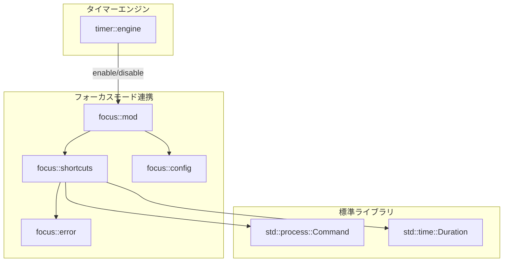

# フォーカスモード連携 詳細設計書

## メタ情報

| 項目 | 内容 |
|------|------|
| ドキュメントID | DETAILED-CLI-001-FOCUS |
| 対応基本設計 | BASIC-CLI-001 |
| 対応機能 | F-019 (フォーカスモード連携) |
| バージョン | 1.0.0 |
| ステータス | ドラフト |
| 作成日 | 2026-01-03 |
| 最終更新日 | 2026-01-03 |
| 作成者 | - |

---

## 1. 概要

### 1.1 目的

本設計書は、ポモドーロタイマーCLIツールにおけるmacOSフォーカスモード連携機能の詳細設計を定義する。作業タイマー開始時に自動的にフォーカスモードをONにし、休憩タイマー開始時にOFFにすることで、集中作業中の通知を遮断し、生産性を向上させる。

### 1.2 背景

macOSのフォーカスモード（Focus Mode）は、通知を制御して集中作業を支援する強力な機能である。しかし、Appleは公式の公開APIを提供していないため、プログラムから直接制御することができない。

技術調査（TECH-TOOL-002_objc2.md）の結果、以下の結論に至った：

- **公式APIは存在しない**: `objc2` を使用してもプライベートAPIにアクセスする必要があり、リスクが高い
- **推奨アプローチ**: Shortcuts.app経由で制御する（macOS 12以降で利用可能）
- **実装方式**: `/usr/bin/shortcuts run "ショートカット名"` コマンドを実行

### 1.3 スコープ

#### スコープ内
- Shortcuts.app経由でのフォーカスモード制御
- タイマー状態変更時の自動ON/OFF
- ショートカット実行のエラーハンドリング
- ショートカット名の設定（Phase 2準備）
- ユーザー向けショートカット作成ガイド

#### スコープ外（Phase 2以降）
- ショートカット名の設定ファイルによる永続化
- フォーカスモードの状態取得
- 複数フォーカスモードの切り替え
- フォーカスモードのスケジュール連携

### 1.4 用語定義

| 用語 | 定義 |
|------|------|
| フォーカスモード | macOS 12以降で利用可能な通知制御機能 |
| Shortcuts.app | macOSの自動化アプリケーション（旧Automator） |
| ショートカット | Shortcuts.appで作成する自動化スクリプト |
| `/usr/bin/shortcuts` | Shortcuts.appのコマンドラインインターフェース |

---

## 2. モジュール設計

### 2.1 モジュール構成

```
src/
├── focus/
│   ├── mod.rs              # モジュールエントリポイント
│   ├── shortcuts.rs        # Shortcuts.app実行ロジック
│   ├── config.rs           # 設定構造体（Phase 2準備）
│   └── error.rs            # エラー型定義
└── timer/
    └── engine.rs           # タイマーエンジン（フォーカスモード連携呼び出し）
```

### 2.2 モジュール責務

| モジュール | 責務 | 公開API |
|-----------|------|---------|
| `focus::shortcuts` | Shortcuts.appコマンド実行、タイムアウト制御 | `enable_focus()`, `disable_focus()` |
| `focus::config` | ショートカット名設定（Phase 2） | `FocusModeConfig` |
| `focus::error` | エラー型定義、エラーメッセージ | `FocusModeError` |

### 2.3 依存関係



---

## 3. データ構造

### 3.1 設定構造体（Phase 2準備）

```rust
/// フォーカスモード連携の設定
#[derive(Debug, Clone, serde::Serialize, serde::Deserialize)]
pub struct FocusModeConfig {
    /// フォーカスモード連携を有効化するか
    pub enabled: bool,
    /// フォーカスモードを有効化するショートカット名
    pub enable_shortcut_name: String,
    /// フォーカスモードを無効化するショートカット名
    pub disable_shortcut_name: String,
}

impl Default for FocusModeConfig {
    fn default() -> Self {
        Self {
            enabled: false,
            enable_shortcut_name: "Enable Work Focus".to_string(),
            disable_shortcut_name: "Disable Work Focus".to_string(),
        }
    }
}
```

### 3.2 エラー型

```rust
use thiserror::Error;

/// フォーカスモード連携のエラー
#[derive(Debug, Error)]
pub enum FocusModeError {
    /// Shortcuts.appが見つからない
    #[error("Shortcuts.appが見つかりません。macOS 12以降が必要です。")]
    ShortcutsNotFound,

    /// ショートカットが見つからない
    #[error("ショートカット '{0}' が見つかりません。Shortcuts.appで作成してください。")]
    ShortcutNotFound(String),

    /// ショートカット実行がタイムアウト
    #[error("ショートカット '{0}' の実行がタイムアウトしました（{1}秒）")]
    ExecutionTimeout(String, u64),

    /// ショートカット実行エラー
    #[error("ショートカット '{0}' の実行に失敗しました: {1}")]
    ExecutionFailed(String, String),

    /// その他のエラー
    #[error("フォーカスモード連携エラー: {0}")]
    Other(String),
}
```

---

## 4. コマンド実行実装

### 4.1 実装方針

- `std::process::Command` を使用して `/usr/bin/shortcuts run` を実行
- タイムアウト機能を実装（デフォルト5秒）
- 非同期実行でタイマーをブロックしない
- エラー時はログ出力のみで、タイマー動作は継続

### 4.2 実装コード

#### 4.2.1 フォーカスモード有効化

```rust
use std::process::Command;
use std::time::Duration;
use tokio::time::timeout;
use tracing::{info, warn, error};

/// フォーカスモードを有効化する
///
/// # 引数
/// - `shortcut_name`: 実行するショートカット名（デフォルト: "Enable Work Focus"）
///
/// # 戻り値
/// - `Ok(())`: 成功
/// - `Err(FocusModeError)`: 失敗
pub async fn enable_focus(shortcut_name: &str) -> Result<(), FocusModeError> {
    info!("フォーカスモードを有効化します: {}", shortcut_name);

    // Shortcuts.appの存在確認
    if !shortcuts_exists() {
        warn!("Shortcuts.appが見つかりません。フォーカスモード連携をスキップします。");
        return Err(FocusModeError::ShortcutsNotFound);
    }

    // ショートカット実行（タイムアウト5秒）
    let result = timeout(
        Duration::from_secs(5),
        execute_shortcut(shortcut_name)
    ).await;

    match result {
        Ok(Ok(())) => {
            info!("フォーカスモードを有効化しました");
            Ok(())
        }
        Ok(Err(e)) => {
            error!("フォーカスモード有効化に失敗: {}", e);
            Err(e)
        }
        Err(_) => {
            error!("フォーカスモード有効化がタイムアウトしました");
            Err(FocusModeError::ExecutionTimeout(shortcut_name.to_string(), 5))
        }
    }
}

/// フォーカスモードを無効化する
///
/// # 引数
/// - `shortcut_name`: 実行するショートカット名（デフォルト: "Disable Work Focus"）
///
/// # 戻り値
/// - `Ok(())`: 成功
/// - `Err(FocusModeError)`: 失敗
pub async fn disable_focus(shortcut_name: &str) -> Result<(), FocusModeError> {
    info!("フォーカスモードを無効化します: {}", shortcut_name);

    // Shortcuts.appの存在確認
    if !shortcuts_exists() {
        warn!("Shortcuts.appが見つかりません。フォーカスモード連携をスキップします。");
        return Err(FocusModeError::ShortcutsNotFound);
    }

    // ショートカット実行（タイムアウト5秒）
    let result = timeout(
        Duration::from_secs(5),
        execute_shortcut(shortcut_name)
    ).await;

    match result {
        Ok(Ok(())) => {
            info!("フォーカスモードを無効化しました");
            Ok(())
        }
        Ok(Err(e)) => {
            error!("フォーカスモード無効化に失敗: {}", e);
            Err(e)
        }
        Err(_) => {
            error!("フォーカスモード無効化がタイムアウトしました");
            Err(FocusModeError::ExecutionTimeout(shortcut_name.to_string(), 5))
        }
    }
}
```

#### 4.2.2 ショートカット実行ヘルパー

```rust
/// Shortcuts.appが存在するか確認
fn shortcuts_exists() -> bool {
    std::path::Path::new("/usr/bin/shortcuts").exists()
}

/// ショートカットを実行する
///
/// # 引数
/// - `shortcut_name`: 実行するショートカット名
///
/// # 戻り値
/// - `Ok(())`: 成功
/// - `Err(FocusModeError)`: 失敗
async fn execute_shortcut(shortcut_name: &str) -> Result<(), FocusModeError> {
    // 非同期でコマンド実行
    let output = tokio::task::spawn_blocking({
        let shortcut_name = shortcut_name.to_string();
        move || {
            Command::new("/usr/bin/shortcuts")
                .arg("run")
                .arg(&shortcut_name)
                .output()
        }
    })
    .await
    .map_err(|e| FocusModeError::Other(format!("タスク実行エラー: {}", e)))?
    .map_err(|e| FocusModeError::Other(format!("コマンド実行エラー: {}", e)))?;

    // 終了コードをチェック
    if output.status.success() {
        Ok(())
    } else {
        // エラー出力を取得
        let stderr = String::from_utf8_lossy(&output.stderr);
        
        // ショートカットが見つからない場合
        if stderr.contains("not found") || stderr.contains("does not exist") {
            Err(FocusModeError::ShortcutNotFound(shortcut_name.to_string()))
        } else {
            Err(FocusModeError::ExecutionFailed(
                shortcut_name.to_string(),
                stderr.to_string()
            ))
        }
    }
}
```

### 4.3 タイマーエンジンとの統合

```rust
// src/timer/engine.rs

use crate::focus;

impl TimerEngine {
    /// 作業タイマーを開始
    pub async fn start_work(&mut self) -> Result<()> {
        // タイマー状態を更新
        self.state.phase = TimerPhase::Working;
        self.state.remaining_seconds = self.config.work_minutes * 60;

        // フォーカスモード連携が有効な場合
        if self.config.focus_mode {
            // 非同期でフォーカスモードを有効化（エラーは無視）
            let shortcut_name = self.focus_config.enable_shortcut_name.clone();
            tokio::spawn(async move {
                if let Err(e) = focus::enable_focus(&shortcut_name).await {
                    // エラーログのみ出力、タイマーは継続
                    tracing::warn!("フォーカスモード有効化に失敗しましたが、タイマーは継続します: {}", e);
                }
            });
        }

        Ok(())
    }

    /// 休憩タイマーを開始
    pub async fn start_break(&mut self) -> Result<()> {
        // タイマー状態を更新
        self.state.phase = TimerPhase::Breaking;
        self.state.remaining_seconds = self.config.break_minutes * 60;

        // フォーカスモード連携が有効な場合
        if self.config.focus_mode {
            // 非同期でフォーカスモードを無効化（エラーは無視）
            let shortcut_name = self.focus_config.disable_shortcut_name.clone();
            tokio::spawn(async move {
                if let Err(e) = focus::disable_focus(&shortcut_name).await {
                    // エラーログのみ出力、タイマーは継続
                    tracing::warn!("フォーカスモード無効化に失敗しましたが、タイマーは継続します: {}", e);
                }
            });
        }

        Ok(())
    }
}
```

---

## 5. エラーハンドリング

### 5.1 エラーシナリオと対応

| エラーシナリオ | 検出方法 | 対応方法 | ユーザーへの影響 |
|--------------|---------|---------|----------------|
| Shortcuts.appが存在しない | `/usr/bin/shortcuts` の存在確認 | 警告ログ出力、機能無効化 | タイマーは正常動作、フォーカスモード連携のみスキップ |
| ショートカットが見つからない | コマンド実行結果の stderr 解析 | エラーログ出力、ユーザーガイド表示 | タイマーは正常動作、初回起動時にガイド表示 |
| ショートカット実行がタイムアウト | `tokio::time::timeout` で5秒制限 | エラーログ出力、タイマー継続 | タイマーは正常動作、フォーカスモード変更なし |
| ショートカット実行エラー | コマンド終了コード確認 | エラーログ出力、詳細情報表示 | タイマーは正常動作、エラー詳細をログに記録 |

### 5.2 フォールバック動作

フォーカスモード連携が失敗した場合でも、**タイマー機能は必ず継続**する。これにより、ユーザーの作業フローを妨げない。

```rust
// フォーカスモード連携のフォールバック例
pub async fn start_work_with_fallback(&mut self) -> Result<()> {
    // タイマー開始（必ず実行）
    self.start_timer(TimerPhase::Working)?;

    // フォーカスモード連携（失敗しても継続）
    if self.config.focus_mode {
        if let Err(e) = self.enable_focus_mode().await {
            // 警告ログのみ、タイマーは継続
            tracing::warn!(
                "フォーカスモード有効化に失敗しましたが、タイマーは継続します: {}",
                e
            );
        }
    }

    Ok(())
}
```

### 5.3 エラーメッセージ

#### 5.3.1 Shortcuts.appが見つからない場合

```
⚠️  警告: Shortcuts.appが見つかりません

フォーカスモード連携を使用するには、macOS 12 (Monterey) 以降が必要です。
現在のmacOSバージョンを確認してください。

タイマーは正常に動作しますが、フォーカスモード連携は無効化されます。
```

#### 5.3.2 ショートカットが見つからない場合

```
⚠️  警告: ショートカット 'Enable Work Focus' が見つかりません

フォーカスモード連携を使用するには、以下のショートカットを作成してください：
  - Enable Work Focus: フォーカスモードを有効化
  - Disable Work Focus: フォーカスモードを無効化

詳細な作成手順は以下のコマンドで確認できます：
  pomodoro help focus-mode

タイマーは正常に動作しますが、フォーカスモード連携は無効化されます。
```

---

## 6. ユーザーセットアップガイド

### 6.1 ショートカット作成手順

ユーザーがフォーカスモード連携を使用するには、事前にShortcuts.appでショートカットを作成する必要がある。以下の手順をREADMEおよびヘルプコマンドで提供する。

#### 6.1.1 「Enable Work Focus」ショートカットの作成

**手順**:

1. **Shortcuts.appを起動**
   - Spotlight検索（⌘ + Space）で「Shortcuts」と入力して起動

2. **新しいショートカットを作成**
   - 左上の「+」ボタンをクリック
   - 「新規ショートカット」が作成される

3. **アクションを追加**
   - 検索バーで「フォーカス」と入力
   - 「フォーカスを設定」アクションを選択してドラッグ

4. **フォーカスモードを選択**
   - アクション内の「フォーカス」ドロップダウンから「仕事」を選択
   - 「オンにする」を選択

5. **ショートカット名を設定**
   - 右上のショートカット名をクリック
   - 「Enable Work Focus」と入力（**正確に入力**）

6. **保存**
   - 右上の「完了」をクリック

**スクリーンショット説明**:
- スクリーンショット1: Shortcuts.appのメイン画面（新規作成ボタンの位置）
- スクリーンショット2: 「フォーカスを設定」アクションの検索画面
- スクリーンショット3: フォーカスモード選択画面（「仕事」を選択）
- スクリーンショット4: ショートカット名入力画面（「Enable Work Focus」）

#### 6.1.2 「Disable Work Focus」ショートカットの作成

**手順**:

1. **新しいショートカットを作成**（上記と同様）

2. **アクションを追加**
   - 「フォーカスを設定」アクションを選択

3. **フォーカスモードを無効化**
   - 「オンにする」を「オフにする」に変更

4. **ショートカット名を設定**
   - 「Disable Work Focus」と入力（**正確に入力**）

5. **保存**

**スクリーンショット説明**:
- スクリーンショット5: 「オフにする」を選択した画面
- スクリーンショット6: ショートカット名入力画面（「Disable Work Focus」）

### 6.2 動作確認

ショートカット作成後、以下のコマンドで動作確認を行う：

```bash
# ターミナルで実行
/usr/bin/shortcuts run "Enable Work Focus"

# フォーカスモードが有効化されることを確認
# システム環境設定 > 集中モード で「仕事」がONになっているか確認

# 無効化
/usr/bin/shortcuts run "Disable Work Focus"

# フォーカスモードが無効化されることを確認
```

### 6.3 トラブルシューティング

| 問題 | 原因 | 解決方法 |
|------|------|---------|
| ショートカットが見つからない | 名前が正確に一致していない | ショートカット名を「Enable Work Focus」「Disable Work Focus」に正確に設定 |
| フォーカスモードが変更されない | フォーカスモードが設定されていない | システム環境設定 > 集中モード で「仕事」フォーカスモードを作成 |
| 権限エラー | Shortcuts.appの実行権限がない | システム環境設定 > プライバシーとセキュリティ > 自動化 で権限を許可 |

---

## 7. Phase 2準備: 設定のカスタマイズ

### 7.1 設定ファイル対応

Phase 2では、ショートカット名を設定ファイルでカスタマイズ可能にする。

**設定ファイル例** (`~/.pomodoro/config.toml`):

```toml
[focus_mode]
enabled = true
enable_shortcut_name = "Enable Work Focus"
disable_shortcut_name = "Disable Work Focus"
```

### 7.2 実装準備

```rust
// src/focus/config.rs

use serde::{Deserialize, Serialize};

/// フォーカスモード連携の設定
#[derive(Debug, Clone, Serialize, Deserialize)]
pub struct FocusModeConfig {
    /// フォーカスモード連携を有効化するか
    #[serde(default)]
    pub enabled: bool,

    /// フォーカスモードを有効化するショートカット名
    #[serde(default = "default_enable_shortcut_name")]
    pub enable_shortcut_name: String,

    /// フォーカスモードを無効化するショートカット名
    #[serde(default = "default_disable_shortcut_name")]
    pub disable_shortcut_name: String,
}

fn default_enable_shortcut_name() -> String {
    "Enable Work Focus".to_string()
}

fn default_disable_shortcut_name() -> String {
    "Disable Work Focus".to_string()
}

impl Default for FocusModeConfig {
    fn default() -> Self {
        Self {
            enabled: false,
            enable_shortcut_name: default_enable_shortcut_name(),
            disable_shortcut_name: default_disable_shortcut_name(),
        }
    }
}
```

---

## 8. テスト設計

### 8.1 単体テスト

```rust
#[cfg(test)]
mod tests {
    use super::*;

    #[test]
    fn test_shortcuts_exists() {
        // macOS 12以降でのみパス
        if cfg!(target_os = "macos") {
            // Shortcuts.appの存在確認
            let exists = shortcuts_exists();
            // macOS 12以降では true、それ以前では false
            println!("Shortcuts.app exists: {}", exists);
        }
    }

    #[tokio::test]
    async fn test_enable_focus_shortcut_not_found() {
        // 存在しないショートカット名でテスト
        let result = enable_focus("NonExistentShortcut").await;
        
        // エラーが返ることを確認
        assert!(result.is_err());
        
        // エラー種別を確認
        if let Err(FocusModeError::ShortcutNotFound(name)) = result {
            assert_eq!(name, "NonExistentShortcut");
        } else {
            panic!("Expected ShortcutNotFound error");
        }
    }

    #[test]
    fn test_focus_mode_config_default() {
        let config = FocusModeConfig::default();
        
        assert_eq!(config.enabled, false);
        assert_eq!(config.enable_shortcut_name, "Enable Work Focus");
        assert_eq!(config.disable_shortcut_name, "Disable Work Focus");
    }
}
```

### 8.2 統合テスト

```rust
// tests/focus_mode_integration.rs

use pomodoro::focus;

#[tokio::test]
#[ignore] // CI環境ではスキップ（ショートカット作成が必要）
async fn test_focus_mode_integration() {
    // 前提: ユーザーがショートカットを作成済み
    
    // フォーカスモード有効化
    let result = focus::enable_focus("Enable Work Focus").await;
    assert!(result.is_ok(), "フォーカスモード有効化に失敗: {:?}", result);

    // 少し待機
    tokio::time::sleep(tokio::time::Duration::from_secs(2)).await;

    // フォーカスモード無効化
    let result = focus::disable_focus("Disable Work Focus").await;
    assert!(result.is_ok(), "フォーカスモード無効化に失敗: {:?}", result);
}
```

### 8.3 手動テストシナリオ

| # | テストケース | 手順 | 期待結果 |
|---|------------|------|---------|
| 1 | ショートカット作成済み | 1. ショートカット作成<br>2. `pomodoro start --focus-mode` 実行 | フォーカスモードがONになる |
| 2 | ショートカット未作成 | 1. ショートカット削除<br>2. `pomodoro start --focus-mode` 実行 | 警告メッセージ表示、タイマーは動作 |
| 3 | Shortcuts.app未インストール | 1. macOS 11以前で実行 | 警告メッセージ表示、タイマーは動作 |
| 4 | タイムアウト | 1. ショートカットに長時間処理を追加<br>2. `pomodoro start --focus-mode` 実行 | 5秒後にタイムアウト、タイマーは動作 |

---

## 9. パフォーマンス要件

### 9.1 実行時間

| 操作 | 目標時間 | 測定方法 |
|------|---------|---------|
| フォーカスモード有効化 | 1秒以内 | `tracing` でログ測定 |
| フォーカスモード無効化 | 1秒以内 | `tracing` でログ測定 |
| タイムアウト | 5秒 | `tokio::time::timeout` で制御 |

### 9.2 リソース使用量

- **メモリ**: 追加で1MB以下
- **CPU**: ショートカット実行中のみ使用、アイドル時は0%

---

## 10. セキュリティ考慮事項

### 10.1 コマンドインジェクション対策

- ショートカット名は設定ファイルまたはコマンドライン引数から取得
- ユーザー入力を直接コマンドに渡さない
- `Command::arg()` を使用してシェルエスケープを回避

```rust
// 安全な実装例
Command::new("/usr/bin/shortcuts")
    .arg("run")
    .arg(&shortcut_name)  // シェルエスケープ不要
    .output()
```

### 10.2 権限管理

- `/usr/bin/shortcuts` は標準ユーザー権限で実行可能
- 管理者権限は不要
- ユーザーのホームディレクトリ内でのみ動作

---

## 11. 運用・保守

### 11.1 ログ出力

```rust
// フォーカスモード有効化時
tracing::info!("フォーカスモードを有効化します: {}", shortcut_name);

// 成功時
tracing::info!("フォーカスモードを有効化しました");

// 失敗時
tracing::warn!("フォーカスモード有効化に失敗しましたが、タイマーは継続します: {}", error);

// エラー詳細
tracing::error!("ショートカット実行エラー: shortcut={}, error={}", shortcut_name, stderr);
```

### 11.2 デバッグモード

`--verbose` フラグでデバッグログを有効化：

```bash
pomodoro start --focus-mode --verbose
```

出力例：
```
[DEBUG] フォーカスモード連携が有効です
[DEBUG] ショートカット名: Enable Work Focus
[DEBUG] コマンド実行: /usr/bin/shortcuts run "Enable Work Focus"
[DEBUG] コマンド終了コード: 0
[INFO] フォーカスモードを有効化しました
```

---

## 12. 今後の拡張

### 12.1 Phase 2で検討する機能

| 機能 | 概要 | 優先度 |
|------|------|--------|
| 設定ファイル対応 | ショートカット名をTOMLで設定 | 高 |
| フォーカスモード状態取得 | 現在のフォーカスモード状態を取得 | 中 |
| 複数フォーカスモード対応 | 作業内容に応じてフォーカスモードを切り替え | 低 |
| スケジュール連携 | カレンダーイベントと連携 | 低 |

### 12.2 技術的改善案

- **リトライロジック**: ショートカット実行失敗時に自動リトライ（最大3回）
- **キャッシュ**: ショートカット存在確認結果をキャッシュ
- **並列実行**: 複数ショートカットを並列実行（Phase 2）

---

## 13. 変更履歴

| 日付 | バージョン | 変更内容 | 担当者 |
|------|-----------|---------|--------|
| 2026-01-03 | 1.0.0 | 初版作成 | - |

---

## 付録A: ショートカット作成スクリプト（将来対応）

Phase 2以降で、ショートカット作成を自動化するスクリプトを提供する可能性がある。

```bash
#!/bin/bash
# create_focus_shortcuts.sh

# Enable Work Focusショートカットを作成
shortcuts create \
  --name "Enable Work Focus" \
  --action "Set Focus" \
  --focus "Work" \
  --state "On"

# Disable Work Focusショートカットを作成
shortcuts create \
  --name "Disable Work Focus" \
  --action "Set Focus" \
  --state "Off"
```

**注意**: `shortcuts create` コマンドは現在存在しないため、将来のmacOSアップデートで対応される可能性がある。

---

## 付録B: 参考リンク

- [Shortcuts User Guide](https://support.apple.com/guide/shortcuts-mac/welcome/mac)
- [Focus Mode User Guide](https://support.apple.com/guide/mac-help/set-up-a-focus-mchl613dc43f/mac)
- [shortcuts(1) Manual Page](https://www.manpagez.com/man/1/shortcuts/)
- [TECH-TOOL-002_objc2.md](../../../research/TECH-TOOL-002_objc2.md)
