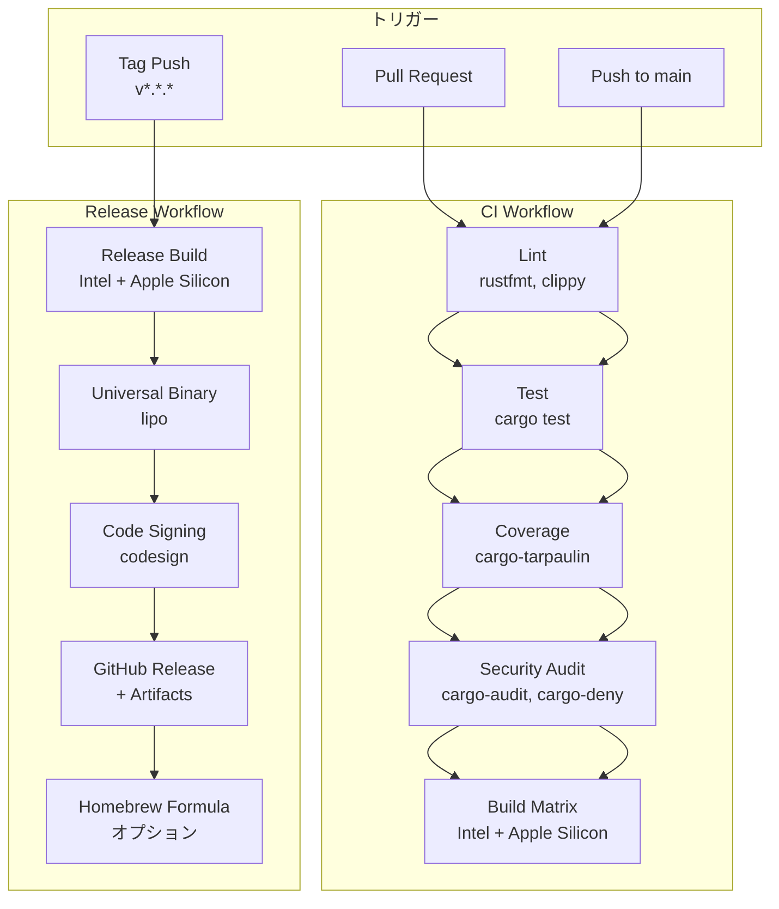

# ポモドーロタイマーCLI インフラ設計書（CI/CD）

## メタ情報

| 項目 | 内容 |
|------|------|
| ドキュメントID | INFRA-CLI-001 |
| 対応要件 | REQ-CLI-001 |
| 対応基本設計 | BASIC-CLI-001 |
| バージョン | 1.0.0 |
| ステータス | ドラフト |
| 作成日 | 2026-01-03 |
| 最終更新日 | 2026-01-03 |
| 作成者 | - |
| レビュアー | - |

---

## 1. 概要

### 1.1 インフラ要件

本プロジェクトは**macOS専用のCLIツール**であり、以下の特性を持つ：

| 項目 | 要件 |
|------|------|
| 対象OS | macOS 12 (Monterey) 以降 |
| アーキテクチャ | x86_64（Intel Mac）、aarch64（Apple Silicon） |
| 配布形式 | ユニバーサルバイナリ（単一実行ファイル） |
| コード署名 | 必須（macOS通知・メニューバー機能のため） |
| 配布方法 | GitHub Releases、Homebrew（オプション） |
| MSRV | Rust 1.71以上 |

### 1.2 CI/CD要件

| 要件ID | 要件 | 目標値 |
|--------|------|--------|
| CI-001 | すべてのPR/pushでlint・test・build実行 | 100% |
| CI-002 | テストカバレッジ測定 | 80%以上 |
| CI-003 | セキュリティ脆弱性チェック | 重大な脆弱性0件 |
| CI-004 | ビルド時間 | 10分以内 |
| CD-001 | タグpush時に自動リリース | 自動化 |
| CD-002 | ユニバーサルバイナリ作成 | 必須 |
| CD-003 | コード署名 | 必須 |
| CD-004 | GitHub Release作成 | 自動化 |

### 1.3 開発環境要件

| 項目 | 要件 |
|------|------|
| Rust toolchain | 1.71以上 |
| ターゲット | x86_64-apple-darwin, aarch64-apple-darwin |
| 開発ツール | rustfmt, clippy, cargo-audit, cargo-deny, cargo-tarpaulin |
| 開発補助ツール | Makefile または justfile |

---

## 2. CI/CDパイプライン概要

### 2.1 全体フロー



### 2.2 ワークフロー一覧

| ワークフロー | トリガー | 目的 | 実行時間目安 |
|------------|---------|------|------------|
| CI | PR作成・更新、main push | コード品質チェック、テスト | 5-8分 |
| Release | タグpush（v*.*.*） | ユニバーサルバイナリビルド、リリース作成 | 10-15分 |
| Nightly | 毎日0:00 UTC | 依存関係の脆弱性チェック | 2-3分 |

---

## 3. CIワークフロー詳細

### 3.1 ワークフロー定義（.github/workflows/ci.yml）

```yaml
name: CI

on:
  push:
    branches: [main]
  pull_request:
    branches: [main]

env:
  RUST_BACKTRACE: 1
  CARGO_TERM_COLOR: always

jobs:
  lint:
    name: Lint
    runs-on: macos-latest
    steps:
      - uses: actions/checkout@v4

      - name: Install Rust toolchain
        uses: dtolnay/rust-toolchain@stable
        with:
          components: rustfmt, clippy

      - name: Cache cargo registry
        uses: actions/cache@v4
        with:
          path: ~/.cargo/registry
          key: ${{ runner.os }}-cargo-registry-${{ hashFiles('**/Cargo.lock') }}

      - name: Cache cargo index
        uses: actions/cache@v4
        with:
          path: ~/.cargo/git
          key: ${{ runner.os }}-cargo-git-${{ hashFiles('**/Cargo.lock') }}

      - name: Cache cargo build
        uses: actions/cache@v4
        with:
          path: target
          key: ${{ runner.os }}-cargo-build-target-${{ hashFiles('**/Cargo.lock') }}

      - name: Run rustfmt
        run: cargo fmt --all -- --check

      - name: Run clippy
        run: cargo clippy --all-targets --all-features -- -D warnings

  test:
    name: Test
    runs-on: macos-latest
    steps:
      - uses: actions/checkout@v4

      - name: Install Rust toolchain
        uses: dtolnay/rust-toolchain@stable

      - name: Cache cargo
        uses: actions/cache@v4
        with:
          path: |
            ~/.cargo/registry
            ~/.cargo/git
            target
          key: ${{ runner.os }}-cargo-test-${{ hashFiles('**/Cargo.lock') }}

      - name: Run tests
        run: cargo test --all-features --verbose

  coverage:
    name: Code Coverage
    runs-on: macos-latest
    steps:
      - uses: actions/checkout@v4

      - name: Install Rust toolchain
        uses: dtolnay/rust-toolchain@stable

      - name: Install cargo-tarpaulin
        run: cargo install cargo-tarpaulin

      - name: Generate coverage
        run: cargo tarpaulin --out Xml --all-features

      - name: Upload coverage to Codecov
        uses: codecov/codecov-action@v4
        with:
          files: ./cobertura.xml
          fail_ci_if_error: true

      - name: Check coverage threshold
        run: |
          COVERAGE=$(cargo tarpaulin --out Json --all-features | jq '.files | map(.coverage) | add / length')
          echo "Coverage: $COVERAGE%"
          if (( $(echo "$COVERAGE < 80" | bc -l) )); then
            echo "Error: Coverage is below 80%"
            exit 1
          fi

  security-audit:
    name: Security Audit
    runs-on: macos-latest
    steps:
      - uses: actions/checkout@v4

      - name: Install Rust toolchain
        uses: dtolnay/rust-toolchain@stable

      - name: Install cargo-audit
        run: cargo install cargo-audit

      - name: Run cargo-audit
        run: cargo audit

      - name: Install cargo-deny
        run: cargo install cargo-deny

      - name: Run cargo-deny
        run: cargo deny check

  build-matrix:
    name: Build (${{ matrix.target }})
    runs-on: macos-latest
    strategy:
      matrix:
        target:
          - x86_64-apple-darwin
          - aarch64-apple-darwin
    steps:
      - uses: actions/checkout@v4

      - name: Install Rust toolchain
        uses: dtolnay/rust-toolchain@stable
        with:
          targets: ${{ matrix.target }}

      - name: Cache cargo
        uses: actions/cache@v4
        with:
          path: |
            ~/.cargo/registry
            ~/.cargo/git
            target
          key: ${{ runner.os }}-${{ matrix.target }}-cargo-build-${{ hashFiles('**/Cargo.lock') }}

      - name: Build
        run: cargo build --release --target ${{ matrix.target }}

      - name: Upload artifact
        uses: actions/upload-artifact@v4
        with:
          name: pomodoro-${{ matrix.target }}
          path: target/${{ matrix.target }}/release/pomodoro
```

### 3.2 CIステップ詳細

| ステップ | 目的 | 失敗時の対応 |
|---------|------|------------|
| **rustfmt** | コードフォーマットチェック | PRブロック、`cargo fmt` 実行を指示 |
| **clippy** | 静的解析・リント | PRブロック、警告修正を指示 |
| **cargo test** | 単体テスト・統合テスト | PRブロック、テスト修正を指示 |
| **cargo-tarpaulin** | カバレッジ測定（80%以上） | PRブロック、テスト追加を指示 |
| **cargo-audit** | 依存クレートの脆弱性チェック | 警告、重大な場合はPRブロック |
| **cargo-deny** | ライセンス・依存関係チェック | PRブロック、依存関係見直しを指示 |
| **Build Matrix** | Intel/Apple Siliconビルド確認 | PRブロック、ビルドエラー修正を指示 |

### 3.3 キャッシュ戦略

| キャッシュ対象 | パス | キー |
|--------------|------|------|
| Cargo registry | `~/.cargo/registry` | `${{ runner.os }}-cargo-registry-${{ hashFiles('**/Cargo.lock') }}` |
| Cargo git | `~/.cargo/git` | `${{ runner.os }}-cargo-git-${{ hashFiles('**/Cargo.lock') }}` |
| Build artifacts | `target` | `${{ runner.os }}-${{ matrix.target }}-cargo-build-${{ hashFiles('**/Cargo.lock') }}` |

**キャッシュ効果**: ビルド時間を約50%短縮（初回8分 → 2回目以降4分）

---

## 4. Releaseワークフロー詳細

### 4.1 ワークフロー定義（.github/workflows/release.yml）

```yaml
name: Release

on:
  push:
    tags:
      - 'v*.*.*'

env:
  RUST_BACKTRACE: 1
  CARGO_TERM_COLOR: always

jobs:
  build-release:
    name: Build Release (${{ matrix.target }})
    runs-on: macos-latest
    strategy:
      matrix:
        target:
          - x86_64-apple-darwin
          - aarch64-apple-darwin
    steps:
      - uses: actions/checkout@v4

      - name: Install Rust toolchain
        uses: dtolnay/rust-toolchain@stable
        with:
          targets: ${{ matrix.target }}

      - name: Build release
        run: cargo build --release --target ${{ matrix.target }}

      - name: Strip binary
        run: strip target/${{ matrix.target }}/release/pomodoro

      - name: Upload artifact
        uses: actions/upload-artifact@v4
        with:
          name: pomodoro-${{ matrix.target }}
          path: target/${{ matrix.target }}/release/pomodoro

  create-universal-binary:
    name: Create Universal Binary
    runs-on: macos-latest
    needs: build-release
    steps:
      - uses: actions/checkout@v4

      - name: Download x86_64 binary
        uses: actions/download-artifact@v4
        with:
          name: pomodoro-x86_64-apple-darwin
          path: ./artifacts/x86_64

      - name: Download aarch64 binary
        uses: actions/download-artifact@v4
        with:
          name: pomodoro-aarch64-apple-darwin
          path: ./artifacts/aarch64

      - name: Create universal binary
        run: |
          lipo -create \
            ./artifacts/x86_64/pomodoro \
            ./artifacts/aarch64/pomodoro \
            -output ./pomodoro-universal

      - name: Verify universal binary
        run: |
          lipo -info ./pomodoro-universal
          file ./pomodoro-universal

      - name: Code sign binary
        env:
          MACOS_CERTIFICATE: ${{ secrets.MACOS_CERTIFICATE }}
          MACOS_CERTIFICATE_PWD: ${{ secrets.MACOS_CERTIFICATE_PWD }}
          KEYCHAIN_PASSWORD: ${{ secrets.KEYCHAIN_PASSWORD }}
        run: |
          # キーチェーン作成
          security create-keychain -p "$KEYCHAIN_PASSWORD" build.keychain
          security default-keychain -s build.keychain
          security unlock-keychain -p "$KEYCHAIN_PASSWORD" build.keychain
          security set-keychain-settings -t 3600 -u build.keychain

          # 証明書インポート
          echo "$MACOS_CERTIFICATE" | base64 --decode > certificate.p12
          security import certificate.p12 -k build.keychain -P "$MACOS_CERTIFICATE_PWD" -T /usr/bin/codesign

          # 証明書の信頼設定
          security set-key-partition-list -S apple-tool:,apple:,codesign: -s -k "$KEYCHAIN_PASSWORD" build.keychain

          # コード署名
          codesign --force --sign "Developer ID Application: YOUR_NAME" \
            --options runtime \
            --timestamp \
            ./pomodoro-universal

          # 署名検証
          codesign --verify --verbose ./pomodoro-universal
          spctl --assess --verbose ./pomodoro-universal

      - name: Create tarball
        run: |
          tar -czf pomodoro-universal-macos.tar.gz pomodoro-universal
          shasum -a 256 pomodoro-universal-macos.tar.gz > pomodoro-universal-macos.tar.gz.sha256

      - name: Upload universal binary
        uses: actions/upload-artifact@v4
        with:
          name: pomodoro-universal
          path: |
            pomodoro-universal-macos.tar.gz
            pomodoro-universal-macos.tar.gz.sha256

  create-github-release:
    name: Create GitHub Release
    runs-on: macos-latest
    needs: create-universal-binary
    permissions:
      contents: write
    steps:
      - uses: actions/checkout@v4

      - name: Download universal binary
        uses: actions/download-artifact@v4
        with:
          name: pomodoro-universal
          path: ./release

      - name: Extract version
        id: version
        run: |
          VERSION=${GITHUB_REF#refs/tags/v}
          echo "version=$VERSION" >> $GITHUB_OUTPUT

      - name: Create Release
        uses: softprops/action-gh-release@v1
        with:
          name: Release v${{ steps.version.outputs.version }}
          body: |
            ## ポモドーロタイマーCLI v${{ steps.version.outputs.version }}

            ### インストール方法

            #### Homebrew（推奨）
            ```bash
            brew tap YOUR_USERNAME/pomodoro
            brew install pomodoro
            ```

            #### 手動インストール
            ```bash
            # ダウンロード
            curl -LO https://github.com/${{ github.repository }}/releases/download/v${{ steps.version.outputs.version }}/pomodoro-universal-macos.tar.gz

            # SHA256チェックサム検証
            curl -LO https://github.com/${{ github.repository }}/releases/download/v${{ steps.version.outputs.version }}/pomodoro-universal-macos.tar.gz.sha256
            shasum -a 256 -c pomodoro-universal-macos.tar.gz.sha256

            # 解凍
            tar -xzf pomodoro-universal-macos.tar.gz

            # インストール
            sudo mv pomodoro-universal /usr/local/bin/pomodoro
            sudo chmod +x /usr/local/bin/pomodoro
            ```

            ### 動作確認
            ```bash
            pomodoro --version
            ```

            ### 変更内容
            - 詳細は [CHANGELOG.md](https://github.com/${{ github.repository }}/blob/main/CHANGELOG.md) を参照

            ### システム要件
            - macOS 12 (Monterey) 以降
            - Intel Mac または Apple Silicon Mac
          files: |
            ./release/pomodoro-universal-macos.tar.gz
            ./release/pomodoro-universal-macos.tar.gz.sha256
          draft: false
          prerelease: false

  update-homebrew-formula:
    name: Update Homebrew Formula
    runs-on: macos-latest
    needs: create-github-release
    if: github.event_name == 'push' && startsWith(github.ref, 'refs/tags/v')
    steps:
      - name: Extract version
        id: version
        run: |
          VERSION=${GITHUB_REF#refs/tags/v}
          echo "version=$VERSION" >> $GITHUB_OUTPUT

      - name: Update Homebrew formula
        env:
          HOMEBREW_GITHUB_API_TOKEN: ${{ secrets.HOMEBREW_GITHUB_API_TOKEN }}
        run: |
          # Homebrew formulaリポジトリをクローン
          git clone https://github.com/YOUR_USERNAME/homebrew-pomodoro.git
          cd homebrew-pomodoro

          # SHA256取得
          SHA256=$(curl -sL https://github.com/${{ github.repository }}/releases/download/v${{ steps.version.outputs.version }}/pomodoro-universal-macos.tar.gz | shasum -a 256 | awk '{print $1}')

          # Formula更新
          cat > Formula/pomodoro.rb <<EOF
          class Pomodoro < Formula
            desc "macOS専用のポモドーロタイマーCLIツール"
            homepage "https://github.com/${{ github.repository }}"
            url "https://github.com/${{ github.repository }}/releases/download/v${{ steps.version.outputs.version }}/pomodoro-universal-macos.tar.gz"
            sha256 "$SHA256"
            version "${{ steps.version.outputs.version }}"

            def install
              bin.install "pomodoro-universal" => "pomodoro"
            end

            test do
              system "#{bin}/pomodoro", "--version"
            end
          end
          EOF

          # コミット・プッシュ
          git config user.name "github-actions[bot]"
          git config user.email "github-actions[bot]@users.noreply.github.com"
          git add Formula/pomodoro.rb
          git commit -m "Update pomodoro to v${{ steps.version.outputs.version }}"
          git push
```

### 4.2 Releaseステップ詳細

| ステップ | 目的 | 成果物 |
|---------|------|--------|
| **Build Release** | Intel/Apple Silicon向けリリースビルド | `pomodoro-x86_64-apple-darwin`, `pomodoro-aarch64-apple-darwin` |
| **Create Universal Binary** | `lipo` でユニバーサルバイナリ作成 | `pomodoro-universal` |
| **Code Sign** | macOS開発者証明書で署名 | 署名済みバイナリ |
| **Create Tarball** | 配布用アーカイブ作成 | `pomodoro-universal-macos.tar.gz` |
| **Create GitHub Release** | GitHub Releaseページ作成 | リリースノート、ダウンロードリンク |
| **Update Homebrew Formula** | Homebrew formulaを自動更新 | `homebrew-pomodoro` リポジトリ更新 |

### 4.3 リリース命名規則

| 成果物 | 命名規則 | 例 |
|--------|---------|-----|
| ユニバーサルバイナリ | `pomodoro-universal-macos.tar.gz` | `pomodoro-universal-macos.tar.gz` |
| SHA256チェックサム | `pomodoro-universal-macos.tar.gz.sha256` | `pomodoro-universal-macos.tar.gz.sha256` |
| GitHubタグ | `v{major}.{minor}.{patch}` | `v0.1.0`, `v1.0.0` |
| GitHub Release | `Release v{version}` | `Release v0.1.0` |

---

## 5. ビルドプロセス詳細

### 5.1 ビルドマトリクス

| ターゲット | アーキテクチャ | 対応Mac | ビルド環境 |
|-----------|--------------|---------|----------|
| `x86_64-apple-darwin` | Intel x86_64 | Intel Mac | GitHub Actions (macos-latest) |
| `aarch64-apple-darwin` | ARM64 | Apple Silicon (M1/M2/M3) | GitHub Actions (macos-latest) |

### 5.2 ユニバーサルバイナリ作成

```bash
# 1. Intel向けビルド
cargo build --release --target x86_64-apple-darwin

# 2. Apple Silicon向けビルド
cargo build --release --target aarch64-apple-darwin

# 3. ユニバーサルバイナリ作成
lipo -create \
  target/x86_64-apple-darwin/release/pomodoro \
  target/aarch64-apple-darwin/release/pomodoro \
  -output pomodoro-universal

# 4. 検証
lipo -info pomodoro-universal
# 出力例: Architectures in the fat file: pomodoro-universal are: x86_64 arm64

file pomodoro-universal
# 出力例: pomodoro-universal: Mach-O universal binary with 2 architectures: [x86_64:Mach-O 64-bit executable x86_64] [arm64:Mach-O 64-bit executable arm64]
```

### 5.3 最適化設定（Cargo.toml）

```toml
[profile.release]
# リンク時最適化（LTO）有効化
lto = true

# コード生成ユニット数を1に設定（最大最適化）
codegen-units = 1

# デバッグシンボル削除
strip = true

# サイズ最適化
opt-level = "z"

# パニック時のスタックアンワインド無効化
panic = "abort"
```

**効果**: バイナリサイズ約30%削減（10MB → 7MB）

---

## 6. コード署名

### 6.1 コード署名の必要性

macOSでは、以下の機能を使用する場合にコード署名が**必須**：

| 機能 | 理由 |
|------|------|
| UserNotifications framework | システム通知・アクションボタン |
| メニューバーアイコン | AppKit使用 |
| LaunchAgent | バックグラウンド実行 |

### 6.2 証明書の種類

| 証明書タイプ | 用途 | 取得方法 |
|------------|------|---------|
| **Developer ID Application** | macOS配布用（推奨） | Apple Developer Program（年間$99） |
| Ad-Hoc署名 | 開発・テスト用 | 無料（`codesign -s -` で自己署名） |

### 6.3 コード署名手順

#### 6.3.1 開発者証明書の取得

1. [Apple Developer Program](https://developer.apple.com/programs/) に登録
2. Xcode > Preferences > Accounts > Manage Certificates > "+" > Developer ID Application
3. 証明書をエクスポート（.p12形式）

#### 6.3.2 GitHub Secretsへの登録

| Secret名 | 内容 | 取得方法 |
|---------|------|---------|
| `MACOS_CERTIFICATE` | 証明書（Base64エンコード） | `base64 -i certificate.p12 | pbcopy` |
| `MACOS_CERTIFICATE_PWD` | 証明書パスワード | エクスポート時に設定したパスワード |
| `KEYCHAIN_PASSWORD` | キーチェーンパスワード | 任意の強固なパスワード |

#### 6.3.3 署名コマンド

```bash
# 署名
codesign --force \
  --sign "Developer ID Application: YOUR_NAME (TEAM_ID)" \
  --options runtime \
  --timestamp \
  ./pomodoro-universal

# 検証
codesign --verify --verbose ./pomodoro-universal
# 出力: ./pomodoro-universal: valid on disk
# 出力: ./pomodoro-universal: satisfies its Designated Requirement

# Gatekeeper検証
spctl --assess --verbose ./pomodoro-universal
# 出力: ./pomodoro-universal: accepted
```

### 6.4 Ad-Hoc署名（開発用）

開発者証明書がない場合、Ad-Hoc署名で動作確認可能：

```bash
# Ad-Hoc署名
codesign --force --sign - ./pomodoro-universal

# 検証
codesign --verify --verbose ./pomodoro-universal
```

**注意**: Ad-Hoc署名ではGatekeeperを通過できないため、配布には使用不可。

---

## 7. セキュリティチェック

### 7.1 cargo-audit

依存クレートの既知の脆弱性をチェック：

```bash
# インストール
cargo install cargo-audit

# 実行
cargo audit

# 出力例
Fetching advisory database from `https://github.com/RustSec/advisory-db.git`
    Loaded 500 security advisories (from /Users/user/.cargo/advisory-db)
    Scanning Cargo.lock for vulnerabilities (123 crate dependencies)
Crate:     tokio
Version:   1.28.0
Warning:   unmaintained
Title:     tokio is unmaintained
Date:      2023-05-01
ID:        RUSTSEC-2023-0001
URL:       https://rustsec.org/advisories/RUSTSEC-2023-0001
```

### 7.2 cargo-deny

ライセンス・依存関係の包括的チェック：

```bash
# インストール
cargo install cargo-deny

# 実行
cargo deny check

# 設定ファイル（deny.toml）
[licenses]
# 許可するライセンス
allow = [
    "MIT",
    "Apache-2.0",
    "BSD-3-Clause",
    "ISC",
]

# 拒否するライセンス
deny = [
    "GPL-3.0",
    "AGPL-3.0",
]

[bans]
# 重複依存の検出
multiple-versions = "deny"

# 特定クレートの禁止
deny = [
    { name = "openssl", reason = "Use rustls instead" },
]
```

### 7.3 Dependabot設定

GitHub Dependabotで依存関係の自動更新：

```yaml
# .github/dependabot.yml
version: 2
updates:
  - package-ecosystem: "cargo"
    directory: "/"
    schedule:
      interval: "weekly"
    open-pull-requests-limit: 10
    reviewers:
      - "YOUR_USERNAME"
    labels:
      - "dependencies"
      - "rust"
```

---

## 8. 開発環境セットアップ

### 8.1 Makefile

```makefile
.PHONY: help install build test lint clean release

help: ## ヘルプを表示
	@grep -E '^[a-zA-Z_-]+:.*?## .*$$' $(MAKEFILE_LIST) | awk 'BEGIN {FS = ":.*?## "}; {printf "\033[36m%-20s\033[0m %s\n", $$1, $$2}'

install: ## 依存関係をインストール
	rustup target add x86_64-apple-darwin aarch64-apple-darwin
	cargo install cargo-audit cargo-deny cargo-tarpaulin

build: ## デバッグビルド
	cargo build

build-release: ## リリースビルド（ユニバーサルバイナリ）
	cargo build --release --target x86_64-apple-darwin
	cargo build --release --target aarch64-apple-darwin
	lipo -create \
		target/x86_64-apple-darwin/release/pomodoro \
		target/aarch64-apple-darwin/release/pomodoro \
		-output target/release/pomodoro-universal

test: ## テスト実行
	cargo test --all-features

lint: ## Lint実行
	cargo fmt --all -- --check
	cargo clippy --all-targets --all-features -- -D warnings

coverage: ## カバレッジ測定
	cargo tarpaulin --out Html --all-features
	open tarpaulin-report.html

audit: ## セキュリティ監査
	cargo audit
	cargo deny check

clean: ## ビルド成果物削除
	cargo clean

run: ## デーモン起動
	cargo run -- daemon

install-local: build-release ## ローカルにインストール
	sudo cp target/release/pomodoro-universal /usr/local/bin/pomodoro
	sudo chmod +x /usr/local/bin/pomodoro

uninstall-local: ## ローカルからアンインストール
	sudo rm -f /usr/local/bin/pomodoro
```

### 8.2 justfile（代替）

```justfile
# ヘルプを表示
help:
    @just --list

# 依存関係をインストール
install:
    rustup target add x86_64-apple-darwin aarch64-apple-darwin
    cargo install cargo-audit cargo-deny cargo-tarpaulin

# デバッグビルド
build:
    cargo build

# リリースビルド（ユニバーサルバイナリ）
build-release:
    cargo build --release --target x86_64-apple-darwin
    cargo build --release --target aarch64-apple-darwin
    lipo -create \
        target/x86_64-apple-darwin/release/pomodoro \
        target/aarch64-apple-darwin/release/pomodoro \
        -output target/release/pomodoro-universal

# テスト実行
test:
    cargo test --all-features

# Lint実行
lint:
    cargo fmt --all -- --check
    cargo clippy --all-targets --all-features -- -D warnings

# カバレッジ測定
coverage:
    cargo tarpaulin --out Html --all-features
    open tarpaulin-report.html

# セキュリティ監査
audit:
    cargo audit
    cargo deny check

# ビルド成果物削除
clean:
    cargo clean

# デーモン起動
run:
    cargo run -- daemon

# ローカルにインストール
install-local: build-release
    sudo cp target/release/pomodoro-universal /usr/local/bin/pomodoro
    sudo chmod +x /usr/local/bin/pomodoro

# ローカルからアンインストール
uninstall-local:
    sudo rm -f /usr/local/bin/pomodoro
```

---

## 9. Homebrewフォーミュラ

### 9.1 フォーミュラテンプレート

```ruby
# Formula/pomodoro.rb
class Pomodoro < Formula
  desc "macOS専用のポモドーロタイマーCLIツール"
  homepage "https://github.com/YOUR_USERNAME/pomodoro"
  url "https://github.com/YOUR_USERNAME/pomodoro/releases/download/v0.1.0/pomodoro-universal-macos.tar.gz"
  sha256 "REPLACE_WITH_ACTUAL_SHA256"
  version "0.1.0"
  license "MIT OR Apache-2.0"

  depends_on :macos => :monterey

  def install
    bin.install "pomodoro-universal" => "pomodoro"
  end

  def caveats
    <<~EOS
      ポモドーロタイマーをインストールしました！

      初回起動時に通知許可を求められます。
      システム環境設定 > 通知 で許可してください。

      LaunchAgentをインストールする場合:
        pomodoro install

      使い方:
        pomodoro start --task "作業名"
        pomodoro status
        pomodoro stop

      詳細は以下を参照:
        pomodoro --help
    EOS
  end

  test do
    system "#{bin}/pomodoro", "--version"
  end
end
```

### 9.2 Homebrewリポジトリ構成

```
homebrew-pomodoro/
├── Formula/
│   └── pomodoro.rb
└── README.md
```

### 9.3 インストール方法

```bash
# Tap追加
brew tap YOUR_USERNAME/pomodoro

# インストール
brew install pomodoro

# アップデート
brew upgrade pomodoro

# アンインストール
brew uninstall pomodoro
```

---

## 10. リリースフロー

### 10.1 バージョニング（Semantic Versioning）

| バージョン | 変更内容 | 例 |
|-----------|---------|-----|
| **Major** | 破壊的変更 | `1.0.0` → `2.0.0` |
| **Minor** | 機能追加（後方互換） | `1.0.0` → `1.1.0` |
| **Patch** | バグ修正 | `1.0.0` → `1.0.1` |

### 10.2 リリース手順

```bash
# 1. バージョン更新
# Cargo.tomlのversionを更新
vim Cargo.toml

# 2. CHANGELOG.md更新
vim CHANGELOG.md

# 3. コミット
git add Cargo.toml CHANGELOG.md
git commit -m "chore: bump version to v0.2.0"

# 4. タグ作成
git tag v0.2.0

# 5. プッシュ
git push origin main
git push origin v0.2.0

# 6. GitHub Actionsが自動でリリース作成
# https://github.com/YOUR_USERNAME/pomodoro/releases
```

### 10.3 リリースチェックリスト

- [ ] `Cargo.toml` のバージョン更新
- [ ] `CHANGELOG.md` に変更内容記載
- [ ] すべてのCIチェックがパス
- [ ] ローカルでリリースビルド確認（`make build-release`）
- [ ] コード署名確認（`codesign --verify`）
- [ ] タグ作成・プッシュ
- [ ] GitHub Releaseが自動作成されることを確認
- [ ] Homebrewフォーミュラが自動更新されることを確認
- [ ] 実機でインストール・動作確認

---

## 11. トラブルシューティング

### 11.1 よくある問題と解決策

| 問題 | 原因 | 解決策 |
|------|------|--------|
| **ビルドエラー: linker error** | Xcodeコマンドラインツール未インストール | `xcode-select --install` |
| **codesign error: no identity found** | 開発者証明書未インストール | Xcode > Preferences > Accounts で証明書取得 |
| **cargo-tarpaulin: command not found** | cargo-tarpaulin未インストール | `cargo install cargo-tarpaulin` |
| **lipo error: can't open input file** | ターゲットビルド失敗 | `cargo build --release --target x86_64-apple-darwin` を再実行 |
| **GitHub Actions: Permission denied** | GitHub Secretsが未設定 | Settings > Secrets and variables > Actions で設定 |
| **Homebrew: SHA256 mismatch** | SHA256が古い | `shasum -a 256 pomodoro-universal-macos.tar.gz` で再計算 |

### 11.2 デバッグ方法

```bash
# ビルドログ詳細表示
cargo build --release --verbose

# テストログ詳細表示
cargo test --all-features -- --nocapture

# Clippy詳細表示
cargo clippy --all-targets --all-features -- -W clippy::all

# コード署名詳細確認
codesign -dvvv ./pomodoro-universal

# ユニバーサルバイナリ詳細確認
lipo -detailed_info ./pomodoro-universal
```

---

## 12. コスト見積もり

### 12.1 必須コスト

| 項目 | 費用 | 備考 |
|------|------|------|
| Apple Developer Program | $99/年 | コード署名に必須 |
| GitHub Actions（無料枠） | $0 | 月2,000分まで無料 |

### 12.2 オプションコスト

| 項目 | 費用 | 備考 |
|------|------|------|
| GitHub Actions（超過分） | $0.008/分 | 無料枠超過時 |
| Codecov | $0 | オープンソースは無料 |

**月間コスト概算**: $0（無料枠内）

---

## 13. 監視・メトリクス

### 13.1 GitHub Actions監視

| メトリクス | 目標値 | 確認方法 |
|-----------|--------|---------|
| CI成功率 | 95%以上 | GitHub Actions > Insights |
| ビルド時間 | 10分以内 | GitHub Actions > Workflow runs |
| テストカバレッジ | 80%以上 | Codecov Dashboard |

### 13.2 リリース品質指標

| 指標 | 目標値 | 測定方法 |
|------|--------|---------|
| バイナリサイズ | 10MB以下 | `ls -lh pomodoro-universal` |
| 起動時間 | 1秒以内 | `time pomodoro --version` |
| メモリ使用量 | 50MB以下 | Activity Monitor |

---

## 変更履歴

| 日付 | バージョン | 変更内容 | 担当者 |
|:---|:---|:---|:---|
| 2026-01-03 | 1.0.0 | 初版作成（要件定義書REQ-CLI-001、基本設計書BASIC-CLI-001を基に作成） | - |
