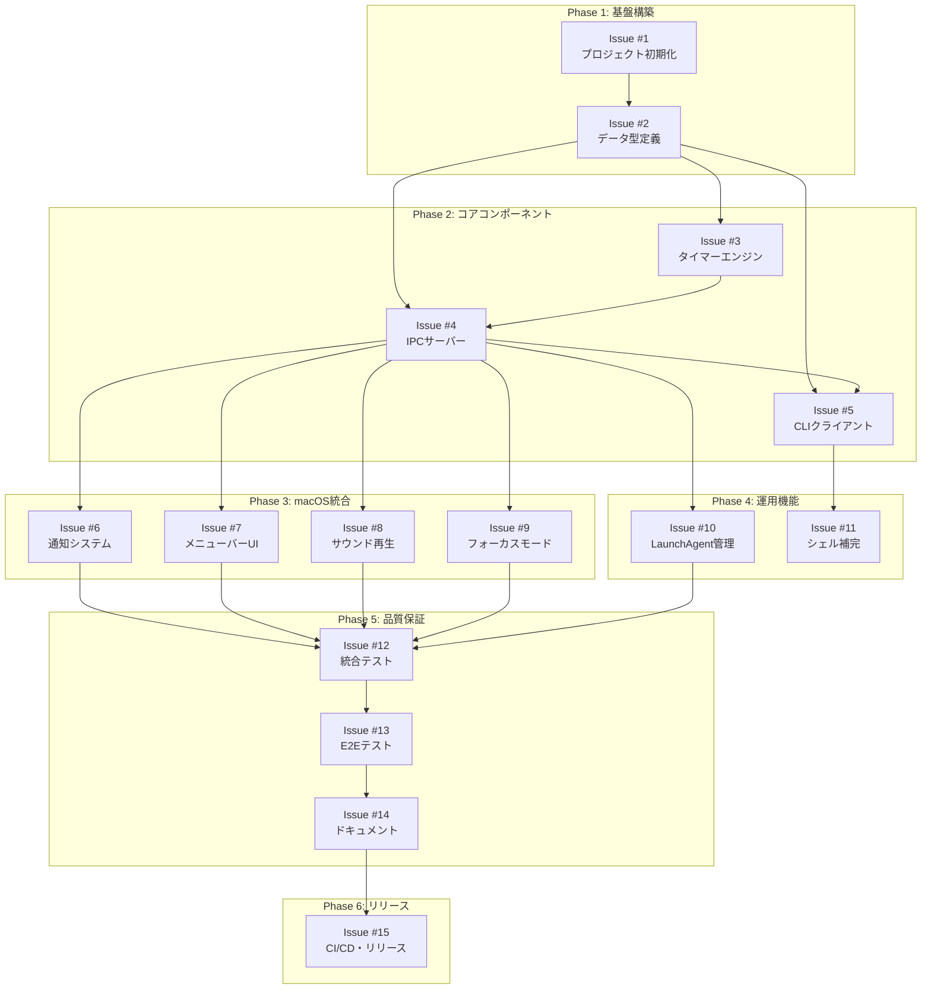

# ポモドーロタイマーCLI 実装Issue計画

## メタ情報

| 項目 | 内容 |
|------|------|
| 作成日 | 2026-01-03 |
| 対応設計書 | 詳細設計書8件 + テスト項目書 |
| 総Issue数 | 15 Issues |
| 推定工数 | 約2週間（1人開発） |

---

## Issue依存関係図



---

## Issue一覧

### Phase 1: 基盤構築

#### Issue #1: プロジェクト初期化

**Title**: `[Setup] Rustプロジェクト初期化とCargo.toml設定`

**Labels**: `setup`, `priority: high`

**Description**:
```markdown
## 概要
ポモドーロタイマーCLIプロジェクトの初期設定を行う。

## タスク
- [ ] `cargo new pomodoro` でプロジェクト作成
- [ ] Cargo.toml に依存関係を追加（tokio, clap, serde, anyhow, tracing）
- [ ] rust-version = "1.71" を設定
- [ ] .gitignore 設定
- [ ] rustfmt.toml, clippy.toml 設定
- [ ] CI用のGitHub Actions workflow追加（lint + test）

## 関連設計書
- [インフラ設計書](docs/designs/detailed/pomodoro-timer/infrastructure.md)

## 受け入れ条件
- `cargo build` が成功する
- `cargo clippy` が警告なしで通過
- GitHub Actions CIが正常動作
```

**Estimate**: 2時間

---

#### Issue #2: データ型定義

**Title**: `[Core] データ型定義（TimerState, PomodoroConfig, IPC types）`

**Labels**: `core`, `priority: high`

**Description**:
```markdown
## 概要
タイマーの状態管理とIPC通信に使用するデータ型を定義する。

## タスク
- [ ] `src/types/mod.rs` 作成
- [ ] `TimerState` 構造体定義
- [ ] `PomodoroConfig` 構造体定義（バリデーション付き）
- [ ] `TimerPhase` enum定義
- [ ] `IpcRequest` / `IpcResponse` 構造体定義
- [ ] serde Serialize/Deserialize derive
- [ ] 単体テスト作成

## 関連設計書
- [Daemonサーバー詳細設計書](docs/designs/detailed/pomodoro-timer/daemon-server.md) Section 4

## 受け入れ条件
- すべての型がserde対応
- バリデーションテスト通過
- カバレッジ90%以上
```

**Estimate**: 3時間

---

### Phase 2: コアコンポーネント

#### Issue #3: タイマーエンジン

**Title**: `[Daemon] タイマーエンジン実装（状態遷移、カウントダウン）`

**Labels**: `daemon`, `core`, `priority: high`

**Description**:
```markdown
## 概要
ポモドーロタイマーのコアロジックを実装する。

## タスク
- [ ] `src/daemon/timer.rs` 作成
- [ ] `TimerEngine` 構造体実装
- [ ] 状態遷移ロジック（Working → Breaking → Stopped）
- [ ] `tokio::time::interval` でカウントダウン
- [ ] `MissedTickBehavior::Skip` 設定
- [ ] イベント発火機構（通知、サウンド用）
- [ ] 自動サイクル機能
- [ ] 長い休憩（4ポモドーロ後）
- [ ] 単体テスト作成

## 関連設計書
- [Daemonサーバー詳細設計書](docs/designs/detailed/pomodoro-timer/daemon-server.md) Section 5

## 受け入れ条件
- 状態遷移が正常に動作
- タイマー精度が1秒以内
- カバレッジ90%以上
```

**Estimate**: 6時間

---

#### Issue #4: IPCサーバー

**Title**: `[Daemon] Unix Domain Socket IPCサーバー実装`

**Labels**: `daemon`, `ipc`, `priority: high`

**Description**:
```markdown
## 概要
CLIクライアントからのコマンドを受け付けるIPCサーバーを実装する。

## タスク
- [ ] `src/daemon/ipc.rs` 作成
- [ ] `IpcServer` 構造体実装
- [ ] Unix Domain Socket リスナー（`~/.pomodoro/pomodoro.sock`）
- [ ] JSON形式のリクエスト/レスポンス処理
- [ ] コマンドディスパッチ（start, pause, resume, stop, status）
- [ ] 接続タイムアウト設定
- [ ] エラーハンドリング
- [ ] 統合テスト作成

## 関連設計書
- [Daemonサーバー詳細設計書](docs/designs/detailed/pomodoro-timer/daemon-server.md) Section 6

## 受け入れ条件
- 複数クライアントからの同時接続対応
- リクエスト処理が50ms以内
- カバレッジ85%以上
```

**Estimate**: 5時間

---

#### Issue #5: CLIクライアント

**Title**: `[CLI] コマンドパーサーとIPCクライアント実装`

**Labels**: `cli`, `priority: high`

**Description**:
```markdown
## 概要
ユーザーが使用するCLIインターフェースを実装する。

## タスク
- [ ] `src/cli/mod.rs` 作成
- [ ] clap derive でコマンド定義
- [ ] サブコマンド: start, pause, resume, stop, status, daemon, install, uninstall
- [ ] 引数バリデーション（work: 1-120, break: 1-60）
- [ ] IPCクライアント実装（タイムアウト5秒、リトライ3回）
- [ ] レスポンス表示（colored使用）
- [ ] エラーメッセージ表示
- [ ] 単体テスト作成

## 関連設計書
- [CLIクライアント詳細設計書](docs/designs/detailed/pomodoro-timer/cli-client.md)

## 受け入れ条件
- すべてのコマンドが動作
- ヘルプメッセージが適切
- 起動時間100ms以内
- カバレッジ85%以上
```

**Estimate**: 5時間

---

### Phase 3: macOS統合

#### Issue #6: 通知システム

**Title**: `[macOS] objc2-user-notifications による通知システム実装`

**Labels**: `macos`, `notification`, `priority: high`

**Description**:
```markdown
## 概要
macOS Notification Centerを使用したアクションボタン付き通知を実装する。

## タスク
- [ ] `src/notification/mod.rs` 作成
- [ ] `UNUserNotificationCenter` ラッパー
- [ ] `UNUserNotificationCenterDelegate` を `define_class!` で実装
- [ ] アクションボタン定義（一時停止、停止）
- [ ] 通知許可リクエスト
- [ ] 通知送信
- [ ] アクションボタンハンドリング
- [ ] codesign署名手順のドキュメント化

## 関連設計書
- [通知システム詳細設計書](docs/designs/detailed/pomodoro-timer/notification-system.md)

## 受け入れ条件
- 通知が正常に表示される
- アクションボタンが動作する
- codesign署名済みバイナリで動作確認
```

**Estimate**: 8時間

---

#### Issue #7: メニューバーUI

**Title**: `[macOS] tray-icon によるメニューバーUI実装`

**Labels**: `macos`, `ui`, `priority: medium`

**Description**:
```markdown
## 概要
メニューバーにタイマー状態を表示し、クイック操作を提供する。

## タスク
- [ ] `src/menubar/mod.rs` 作成
- [ ] `TrayIconBuilder` でアイコン作成
- [ ] 残り時間テキスト表示（🍅 15:30）
- [ ] ドロップダウンメニュー構築
- [ ] メニューイベントハンドリング
- [ ] 1秒ごとの動的更新
- [ ] Daemonとの状態同期

## 関連設計書
- [メニューバーUI詳細設計書](docs/designs/detailed/pomodoro-timer/menubar-ui.md)

## 受け入れ条件
- メニューバーにアイコンが表示される
- 残り時間がリアルタイム更新
- メニュー操作が正常に動作
```

**Estimate**: 6時間

---

#### Issue #8: サウンド再生

**Title**: `[macOS] rodio によるサウンド再生実装`

**Labels**: `macos`, `audio`, `priority: low`

**Description**:
```markdown
## 概要
タイマー完了時の通知音を再生する。

## タスク
- [ ] `src/sound/mod.rs` 作成
- [ ] `OutputStreamBuilder::open_default_stream()` で初期化
- [ ] システムサウンド読み込み（/System/Library/Sounds/Glass.aiff）
- [ ] 埋め込みサウンドオプション
- [ ] 非同期再生（タイマーをブロックしない）
- [ ] `--no-sound` フラグ対応

## 関連設計書
- [サウンド再生詳細設計書](docs/designs/detailed/pomodoro-timer/sound-playback.md)

## 受け入れ条件
- 通知音が正常に再生される
- タイマー動作をブロックしない
- エラー時もタイマーは継続
```

**Estimate**: 3時間

---

#### Issue #9: フォーカスモード

**Title**: `[macOS] Shortcuts.app経由フォーカスモード連携`

**Labels**: `macos`, `focus`, `priority: medium`

**Description**:
```markdown
## 概要
作業開始時にフォーカスモードをON、休憩開始時にOFFにする。

## タスク
- [ ] `src/focus/mod.rs` 作成
- [ ] `/usr/bin/shortcuts run` コマンド実行
- [ ] タイムアウト設定（5秒）
- [ ] エラーハンドリング（ショートカット不存在時）
- [ ] ユーザーセットアップガイド作成
- [ ] `--focus-mode` フラグ対応

## 関連設計書
- [フォーカスモード連携詳細設計書](docs/designs/detailed/pomodoro-timer/focus-mode.md)

## 受け入れ条件
- フォーカスモードが正常に切り替わる
- エラー時もタイマーは継続
- セットアップガイドが完成
```

**Estimate**: 3時間

---

### Phase 4: 運用機能

#### Issue #10: LaunchAgent管理

**Title**: `[macOS] LaunchAgent による自動起動設定`

**Labels**: `macos`, `launchagent`, `priority: medium`

**Description**:
```markdown
## 概要
ログイン時にDaemonを自動起動する設定を管理する。

## タスク
- [ ] `src/launchagent/mod.rs` 作成
- [ ] plist構造体定義（serde対応）
- [ ] plistファイル生成
- [ ] `launchctl load/unload` 実行
- [ ] install/uninstall コマンド実装
- [ ] 冪等性の確保（load前にunload試行）
- [ ] ログディレクトリ作成

## 関連設計書
- [LaunchAgent管理詳細設計書](docs/designs/detailed/pomodoro-timer/launch-agent.md)

## 受け入れ条件
- install/uninstallが正常動作
- ログイン時にDaemonが自動起動
- ログファイルが正しく出力
```

**Estimate**: 4時間

---

#### Issue #11: シェル補完

**Title**: `[CLI] シェル補完スクリプト生成`

**Labels**: `cli`, `ux`, `priority: low`

**Description**:
```markdown
## 概要
bash/zsh/fish用の補完スクリプトを生成する。

## タスク
- [ ] `clap_complete` 依存関係追加
- [ ] `completions` サブコマンド実装
- [ ] bash/zsh/fish 補完スクリプト生成
- [ ] インストール手順ドキュメント

## 関連設計書
- [CLIクライアント詳細設計書](docs/designs/detailed/pomodoro-timer/cli-client.md) Section 7

## 受け入れ条件
- 各シェルで補完が動作
- インストール手順が明確
```

**Estimate**: 2時間

---

### Phase 5: 品質保証

#### Issue #12: 統合テスト

**Title**: `[Test] コンポーネント間統合テスト`

**Labels**: `test`, `priority: high`

**Description**:
```markdown
## 概要
各コンポーネント間の連携をテストする。

## タスク
- [ ] Daemon-CLI間 IPC統合テスト
- [ ] タイマー-通知 統合テスト
- [ ] タイマー-サウンド 統合テスト
- [ ] タイマー-フォーカスモード 統合テスト
- [ ] モック実装（SoundPlayer, NotificationSender）

## 関連設計書
- [テスト項目書](docs/designs/detailed/pomodoro-timer/test-specification.md) Section 3

## 受け入れ条件
- 全統合テストケースが通過
- カバレッジ80%以上
```

**Estimate**: 6時間

---

#### Issue #13: E2Eテスト

**Title**: `[Test] E2Eテストとパフォーマンステスト`

**Labels**: `test`, `priority: medium`

**Description**:
```markdown
## 概要
エンドツーエンドのシナリオテストとパフォーマンス計測。

## タスク
- [ ] 完全なポモドーロサイクルテスト
- [ ] 自動サイクルテスト
- [ ] CLI起動時間計測（目標: 100ms以内）
- [ ] IPC応答時間計測（目標: 50ms以内）
- [ ] メモリ使用量計測（目標: 50MB以下）
- [ ] 手動テストチェックリスト作成

## 関連設計書
- [テスト項目書](docs/designs/detailed/pomodoro-timer/test-specification.md) Section 4, 8

## 受け入れ条件
- 全E2Eテストケースが通過
- パフォーマンス目標達成
```

**Estimate**: 4時間

---

#### Issue #14: ドキュメント

**Title**: `[Docs] README、インストールガイド、使用方法`

**Labels**: `documentation`, `priority: medium`

**Description**:
```markdown
## 概要
ユーザー向けドキュメントを作成する。

## タスク
- [ ] README.md 作成（概要、機能、インストール、使用例）
- [ ] INSTALL.md 作成（Homebrew、手動インストール）
- [ ] USAGE.md 作成（コマンドリファレンス）
- [ ] フォーカスモードセットアップガイド
- [ ] トラブルシューティングガイド
- [ ] CHANGELOG.md 作成

## 受け入れ条件
- 新規ユーザーがドキュメントだけで使い始められる
- コマンド例が動作確認済み
```

**Estimate**: 4時間

---

### Phase 6: リリース

#### Issue #15: CI/CDとリリース

**Title**: `[Release] CI/CDパイプライン完成とv0.1.0リリース`

**Labels**: `release`, `ci`, `priority: high`

**Description**:
```markdown
## 概要
本番リリースに向けたCI/CD設定とリリース作業。

## タスク
- [ ] GitHub Actions リリースワークフロー作成
- [ ] ユニバーサルバイナリ作成（lipo）
- [ ] codesign署名設定
- [ ] GitHub Releaseアセット自動アップロード
- [ ] Homebrew formula作成
- [ ] v0.1.0 タグ作成・リリース

## 関連設計書
- [インフラ設計書](docs/designs/detailed/pomodoro-timer/infrastructure.md)

## 受け入れ条件
- Intel/Apple Silicon両方で動作
- Homebrewからインストール可能
- GitHub Releaseにバイナリ公開
```

**Estimate**: 5時間

---

## 工数サマリー

| Phase | Issue数 | 推定工数 |
|-------|---------|---------|
| Phase 1: 基盤構築 | 2 | 5時間 |
| Phase 2: コアコンポーネント | 3 | 16時間 |
| Phase 3: macOS統合 | 4 | 20時間 |
| Phase 4: 運用機能 | 2 | 6時間 |
| Phase 5: 品質保証 | 3 | 14時間 |
| Phase 6: リリース | 1 | 5時間 |
| **合計** | **15** | **66時間（約8.5人日）** |

---

## マイルストーン

| マイルストーン | 含まれるIssue | 目標日 |
|---------------|--------------|--------|
| M1: コア機能完成 | #1-#5 | 2026-01-06 |
| M2: macOS統合完成 | #6-#10 | 2026-01-10 |
| M3: 品質保証完了 | #11-#14 | 2026-01-14 |
| M4: v0.1.0リリース | #15 | 2026-01-17 |
