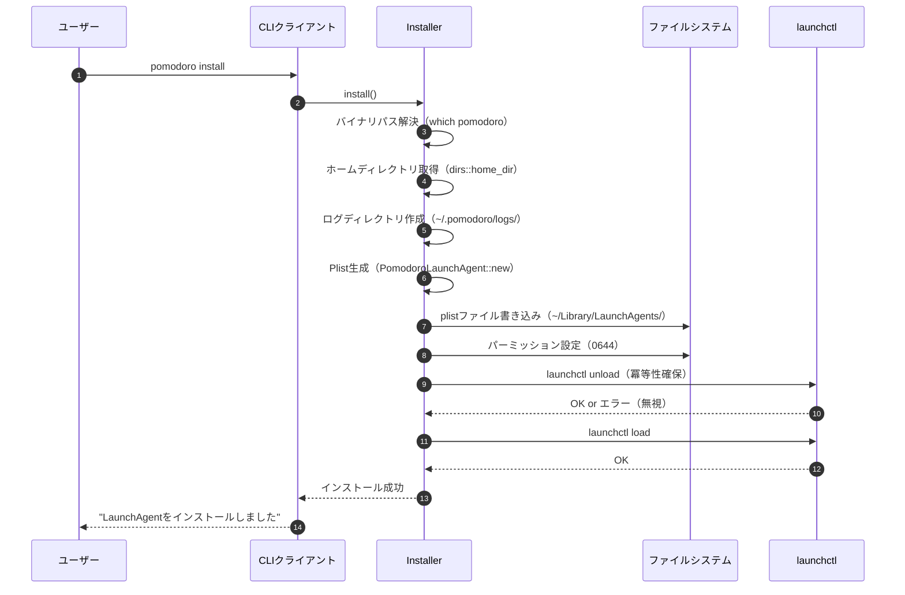
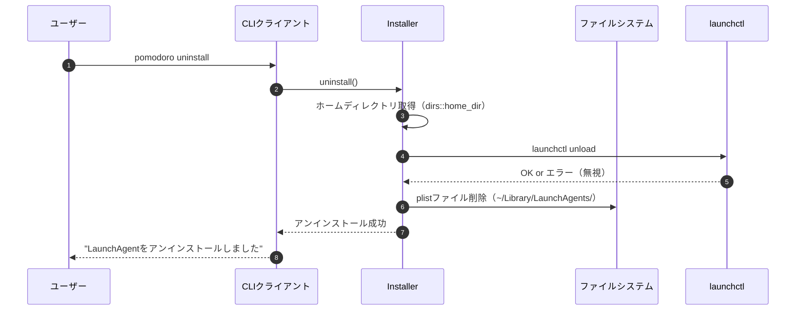

# LaunchAgent管理 詳細設計書

## メタ情報

| 項目 | 内容 |
|------|------|
| ドキュメントID | DETAILED-CLI-001-LA |
| 対応機能 | F-020 (LaunchAgent) |
| 基本設計書 | [BASIC-CLI-001](../../basic/BASIC-CLI-001_pomodoro-timer.md) |
| 対応要件 | REQ-CLI-001 |
| 作成日 | 2026-01-03 |
| 最終更新日 | 2026-01-03 |
| 作成者 | - |
| ステータス | ドラフト |

---

## 1. 概要

### 1.1 目的

本設計書は、macOSのLaunchAgentを使用したポモドーロタイマーDaemonの自動起動・バックグラウンド実行機能の詳細設計を定義する。ユーザーがログイン時に自動的にDaemonが起動し、常駐することで、CLIコマンドからいつでもタイマーを操作できる環境を提供する。

### 1.2 スコープ

#### スコープ内
- LaunchAgent plistファイルの生成（`plist` クレート使用）
- plistファイルのインストール・アンインストール
- `launchctl` コマンドによるサービス登録・解除
- 冪等性を保証したインストールロジック
- ログファイルのローテーション設定
- エラーハンドリング（権限エラー、パス解決エラー等）
- サービス状態の確認機能

#### スコープ外
- Daemon本体の実装（別設計書で定義）
- システム全体のLaunchDaemon（ユーザーレベルのLaunchAgentのみ）
- 自動アップデート機能（Phase 2以降）

### 1.3 用語定義

| 用語 | 定義 |
|------|------|
| LaunchAgent | macOSのユーザーレベルバックグラウンドプロセス管理機構 |
| plist | Property List（XML形式の設定ファイル） |
| launchctl | LaunchAgentを管理するmacOSコマンドラインツール |
| Label | LaunchAgentを一意に識別する逆ドメイン形式の識別子 |
| RunAtLoad | ログイン時に自動起動するかどうかのフラグ |
| KeepAlive | プロセスが終了した際に自動再起動するかどうかのフラグ |

---

## 2. モジュール構成

### 2.1 ディレクトリ構造

```
src/
├── launchagent/
│   ├── mod.rs           # モジュールエントリポイント、公開API
│   ├── plist.rs         # Plist構造体定義、生成ロジック
│   ├── installer.rs     # インストール・アンインストールロジック
│   ├── launchctl.rs     # launchctlコマンド実行ラッパー
│   └── status.rs        # サービス状態確認
└── main.rs              # CLIエントリポイント（install/uninstallコマンド）
```

### 2.2 モジュール責務

| モジュール | 責務 | 主要関数 |
|-----------|------|---------|
| `mod.rs` | 公開API提供、エラー型定義 | `install()`, `uninstall()`, `is_installed()` |
| `plist.rs` | Plist構造体定義、XML生成 | `PomodoroLaunchAgent::new()`, `to_xml()` |
| `installer.rs` | ファイル配置、権限設定 | `install_plist()`, `uninstall_plist()` |
| `launchctl.rs` | launchctlコマンド実行 | `load()`, `unload()`, `bootstrap()`, `bootout()` |
| `status.rs` | サービス状態確認 | `is_running()`, `get_status()` |

---

## 3. Plist構造設計

### 3.1 Plist構造体定義

```rust
use serde::{Deserialize, Serialize};

/// LaunchAgent plist構造体
#[derive(Debug, Clone, Serialize, Deserialize)]
pub struct PomodoroLaunchAgent {
    /// サービスを一意に識別するラベル（逆ドメイン形式）
    #[serde(rename = "Label")]
    pub label: String,

    /// 実行するプログラムとその引数
    #[serde(rename = "ProgramArguments")]
    pub program_arguments: Vec<String>,

    /// ログイン時に自動起動するか
    #[serde(rename = "RunAtLoad")]
    pub run_at_load: bool,

    /// プロセスが終了した際に自動再起動するか
    #[serde(rename = "KeepAlive")]
    pub keep_alive: bool,

    /// 標準出力のログファイルパス
    #[serde(rename = "StandardOutPath")]
    pub standard_out_path: String,

    /// 標準エラー出力のログファイルパス
    #[serde(rename = "StandardErrorPath")]
    pub standard_error_path: String,

    /// 作業ディレクトリ（オプション）
    #[serde(rename = "WorkingDirectory", skip_serializing_if = "Option::is_none")]
    pub working_directory: Option<String>,

    /// 環境変数（オプション）
    #[serde(rename = "EnvironmentVariables", skip_serializing_if = "Option::is_none")]
    pub environment_variables: Option<std::collections::HashMap<String, String>>,
}

impl PomodoroLaunchAgent {
    /// 新しいLaunchAgent設定を作成
    ///
    /// # Arguments
    /// * `binary_path` - pomodoroバイナリの絶対パス（例: "/usr/local/bin/pomodoro"）
    /// * `log_dir` - ログディレクトリの絶対パス（例: "/Users/username/.pomodoro/logs"）
    ///
    /// # Returns
    /// LaunchAgent設定
    pub fn new(binary_path: String, log_dir: String) -> Self {
        Self {
            label: "com.example.pomodoro".to_string(),
            program_arguments: vec![binary_path, "daemon".to_string()],
            run_at_load: true,
            keep_alive: true,
            standard_out_path: format!("{}/stdout.log", log_dir),
            standard_error_path: format!("{}/stderr.log", log_dir),
            working_directory: None,
            environment_variables: None,
        }
    }

    /// Plist XML文字列を生成
    ///
    /// # Returns
    /// XML形式のplist文字列
    ///
    /// # Errors
    /// シリアライズに失敗した場合
    pub fn to_xml(&self) -> anyhow::Result<String> {
        let mut buf = Vec::new();
        plist::to_writer_xml(&mut buf, self)
            .context("Failed to serialize plist to XML")?;
        String::from_utf8(buf).context("Failed to convert plist XML to UTF-8 string")
    }
}
```

### 3.2 生成されるPlist XMLの例

```xml
<?xml version="1.0" encoding="UTF-8"?>
<!DOCTYPE plist PUBLIC "-//Apple//DTD PLIST 1.0//EN" "http://www.apple.com/DTDs/PropertyList-1.0.dtd">
<plist version="1.0">
<dict>
    <key>Label</key>
    <string>com.example.pomodoro</string>
    <key>ProgramArguments</key>
    <array>
        <string>/usr/local/bin/pomodoro</string>
        <string>daemon</string>
    </array>
    <key>RunAtLoad</key>
    <true/>
    <key>KeepAlive</key>
    <true/>
    <key>StandardOutPath</key>
    <string>/Users/username/.pomodoro/logs/stdout.log</string>
    <key>StandardErrorPath</key>
    <string>/Users/username/.pomodoro/logs/stderr.log</string>
</dict>
</plist>
```

### 3.3 Plist設定項目の詳細

| キー | 型 | 必須 | 説明 | 設定値 |
|------|-----|------|------|--------|
| `Label` | String | ✓ | サービスの一意識別子 | `com.example.pomodoro` |
| `ProgramArguments` | Array | ✓ | 実行コマンドと引数 | `["/usr/local/bin/pomodoro", "daemon"]` |
| `RunAtLoad` | Boolean | ✓ | ログイン時自動起動 | `true` |
| `KeepAlive` | Boolean | ✓ | 異常終了時の自動再起動 | `true` |
| `StandardOutPath` | String | ✓ | 標準出力ログパス | `~/.pomodoro/logs/stdout.log` |
| `StandardErrorPath` | String | ✓ | 標準エラーログパス | `~/.pomodoro/logs/stderr.log` |
| `WorkingDirectory` | String | - | 作業ディレクトリ | 未設定（バイナリの場所） |
| `EnvironmentVariables` | Dict | - | 環境変数 | 未設定 |

**重要**: すべてのパスは絶対パスで指定する必要がある。`~` は使用不可。

---

## 4. インストール・アンインストールロジック

### 4.1 インストールフロー



### 4.2 アンインストールフロー



### 4.3 インストール実装

```rust
use anyhow::{Context, Result};
use std::fs;
use std::os::unix::fs::PermissionsExt;
use std::path::PathBuf;

/// LaunchAgentをインストールする
///
/// # Returns
/// インストール成功時はOk、失敗時はErr
///
/// # Errors
/// - バイナリパスの解決に失敗
/// - ホームディレクトリの取得に失敗
/// - ログディレクトリの作成に失敗
/// - plistファイルの書き込みに失敗
/// - launchctl loadに失敗
pub fn install() -> Result<()> {
    // 1. バイナリパスを解決
    let binary_path = resolve_binary_path()
        .context("Failed to resolve pomodoro binary path")?;

    // 2. ホームディレクトリを取得
    let home_dir = dirs::home_dir()
        .context("Failed to get home directory")?;

    // 3. ログディレクトリを作成
    let log_dir = home_dir.join(".pomodoro/logs");
    fs::create_dir_all(&log_dir)
        .context("Failed to create log directory")?;

    // 4. Plist生成
    let plist = PomodoroLaunchAgent::new(
        binary_path,
        log_dir.to_string_lossy().to_string(),
    );
    let plist_xml = plist.to_xml()?;

    // 5. plistファイルパスを構築
    let plist_path = home_dir
        .join("Library/LaunchAgents/com.example.pomodoro.plist");

    // 6. LaunchAgentsディレクトリを作成（存在しない場合）
    if let Some(parent) = plist_path.parent() {
        fs::create_dir_all(parent)
            .context("Failed to create LaunchAgents directory")?;
    }

    // 7. plistファイルを書き込み
    fs::write(&plist_path, plist_xml)
        .context("Failed to write plist file")?;

    // 8. パーミッション設定（0644: rw-r--r--）
    let mut perms = fs::metadata(&plist_path)?.permissions();
    perms.set_mode(0o644);
    fs::set_permissions(&plist_path, perms)
        .context("Failed to set plist file permissions")?;

    // 9. 既存のサービスをアンロード（冪等性確保）
    let _ = launchctl::unload(&plist_path);

    // 10. サービスをロード
    launchctl::load(&plist_path)
        .context("Failed to load LaunchAgent")?;

    tracing::info!("LaunchAgent installed successfully at {:?}", plist_path);
    Ok(())
}

/// LaunchAgentをアンインストールする
///
/// # Returns
/// アンインストール成功時はOk、失敗時はErr
///
/// # Errors
/// - ホームディレクトリの取得に失敗
/// - launchctl unloadに失敗
/// - plistファイルの削除に失敗
pub fn uninstall() -> Result<()> {
    // 1. ホームディレクトリを取得
    let home_dir = dirs::home_dir()
        .context("Failed to get home directory")?;

    // 2. plistファイルパスを構築
    let plist_path = home_dir
        .join("Library/LaunchAgents/com.example.pomodoro.plist");

    // 3. plistファイルが存在しない場合は成功として扱う
    if !plist_path.exists() {
        tracing::info!("LaunchAgent plist file does not exist, nothing to uninstall");
        return Ok(());
    }

    // 4. サービスをアンロード
    let _ = launchctl::unload(&plist_path);

    // 5. plistファイルを削除
    fs::remove_file(&plist_path)
        .context("Failed to remove plist file")?;

    tracing::info!("LaunchAgent uninstalled successfully");
    Ok(())
}

/// pomodoroバイナリの絶対パスを解決する
///
/// # Returns
/// バイナリの絶対パス
///
/// # Errors
/// - whichコマンドの実行に失敗
/// - バイナリが見つからない
fn resolve_binary_path() -> Result<String> {
    let output = std::process::Command::new("which")
        .arg("pomodoro")
        .output()
        .context("Failed to execute 'which pomodoro'")?;

    if !output.status.success() {
        anyhow::bail!("pomodoro binary not found in PATH");
    }

    let path = String::from_utf8(output.stdout)
        .context("Failed to parse which output")?
        .trim()
        .to_string();

    if path.is_empty() {
        anyhow::bail!("pomodoro binary path is empty");
    }

    Ok(path)
}
```

---

## 5. launchctlコマンド実行

### 5.1 launchctlラッパー実装

```rust
use anyhow::{Context, Result};
use std::path::Path;
use std::process::Command;

/// launchctl loadを実行してサービスを登録する
///
/// # Arguments
/// * `plist_path` - plistファイルの絶対パス
///
/// # Returns
/// 成功時はOk、失敗時はErr
///
/// # Errors
/// - launchctlコマンドの実行に失敗
/// - サービスの登録に失敗
pub fn load(plist_path: &Path) -> Result<()> {
    let output = Command::new("launchctl")
        .arg("load")
        .arg(plist_path)
        .output()
        .context("Failed to execute 'launchctl load'")?;

    if !output.status.success() {
        let stderr = String::from_utf8_lossy(&output.stderr);
        anyhow::bail!("launchctl load failed: {}", stderr);
    }

    tracing::debug!("launchctl load succeeded for {:?}", plist_path);
    Ok(())
}

/// launchctl unloadを実行してサービスを解除する
///
/// # Arguments
/// * `plist_path` - plistファイルの絶対パス
///
/// # Returns
/// 成功時はOk、失敗時はErr
///
/// # Note
/// サービスが既に解除されている場合もエラーを返すため、
/// 呼び出し側でエラーを無視することを推奨
pub fn unload(plist_path: &Path) -> Result<()> {
    let output = Command::new("launchctl")
        .arg("unload")
        .arg(plist_path)
        .output()
        .context("Failed to execute 'launchctl unload'")?;

    if !output.status.success() {
        let stderr = String::from_utf8_lossy(&output.stderr);
        tracing::warn!("launchctl unload failed (may be already unloaded): {}", stderr);
        // エラーを返すが、呼び出し側で無視することを想定
        anyhow::bail!("launchctl unload failed: {}", stderr);
    }

    tracing::debug!("launchctl unload succeeded for {:?}", plist_path);
    Ok(())
}

/// launchctl bootstrap（macOS 10.10+の新しいAPI）
///
/// # Arguments
/// * `domain` - ドメイン（例: "gui/501"）
/// * `plist_path` - plistファイルの絶対パス
///
/// # Returns
/// 成功時はOk、失敗時はErr
///
/// # Note
/// macOS 10.10以降で推奨されるAPI。互換性のため`load`も併用可能。
pub fn bootstrap(domain: &str, plist_path: &Path) -> Result<()> {
    let output = Command::new("launchctl")
        .arg("bootstrap")
        .arg(domain)
        .arg(plist_path)
        .output()
        .context("Failed to execute 'launchctl bootstrap'")?;

    if !output.status.success() {
        let stderr = String::from_utf8_lossy(&output.stderr);
        anyhow::bail!("launchctl bootstrap failed: {}", stderr);
    }

    tracing::debug!("launchctl bootstrap succeeded for {:?}", plist_path);
    Ok(())
}

/// launchctl bootout（macOS 10.10+の新しいAPI）
///
/// # Arguments
/// * `domain` - ドメイン（例: "gui/501"）
/// * `label` - サービスラベル（例: "com.example.pomodoro"）
///
/// # Returns
/// 成功時はOk、失敗時はErr
pub fn bootout(domain: &str, label: &str) -> Result<()> {
    let output = Command::new("launchctl")
        .arg("bootout")
        .arg(format!("{}/{}", domain, label))
        .output()
        .context("Failed to execute 'launchctl bootout'")?;

    if !output.status.success() {
        let stderr = String::from_utf8_lossy(&output.stderr);
        tracing::warn!("launchctl bootout failed (may be already stopped): {}", stderr);
        anyhow::bail!("launchctl bootout failed: {}", stderr);
    }

    tracing::debug!("launchctl bootout succeeded for {}/{}", domain, label);
    Ok(())
}
```

### 5.2 launchctlコマンド一覧

| コマンド | 用途 | 引数 | 備考 |
|---------|------|------|------|
| `load` | サービス登録 | plistファイルパス | 従来のAPI、広く使われている |
| `unload` | サービス解除 | plistファイルパス | 従来のAPI |
| `bootstrap` | サービス登録（新） | ドメイン, plistファイルパス | macOS 10.10+推奨 |
| `bootout` | サービス解除（新） | ドメイン/ラベル | macOS 10.10+推奨 |
| `list` | サービス一覧 | - | 状態確認用 |

---

## 6. サービス状態確認

### 6.1 状態確認実装

```rust
use anyhow::{Context, Result};
use std::process::Command;

/// LaunchAgentがインストールされているか確認する
///
/// # Returns
/// インストール済みの場合はtrue、未インストールの場合はfalse
pub fn is_installed() -> bool {
    let home_dir = match dirs::home_dir() {
        Some(dir) => dir,
        None => return false,
    };

    let plist_path = home_dir
        .join("Library/LaunchAgents/com.example.pomodoro.plist");

    plist_path.exists()
}

/// LaunchAgentサービスが実行中か確認する
///
/// # Returns
/// 実行中の場合はtrue、停止中の場合はfalse
///
/// # Errors
/// launchctl listコマンドの実行に失敗した場合
pub fn is_running() -> Result<bool> {
    let output = Command::new("launchctl")
        .arg("list")
        .arg("com.example.pomodoro")
        .output()
        .context("Failed to execute 'launchctl list'")?;

    // 終了コード0 = サービスが存在する
    Ok(output.status.success())
}

/// LaunchAgentサービスの詳細状態を取得する
///
/// # Returns
/// サービスの状態情報（PID、ステータスコード等）
///
/// # Errors
/// launchctl listコマンドの実行に失敗した場合
pub fn get_status() -> Result<ServiceStatus> {
    let output = Command::new("launchctl")
        .arg("list")
        .arg("com.example.pomodoro")
        .output()
        .context("Failed to execute 'launchctl list'")?;

    if !output.status.success() {
        return Ok(ServiceStatus {
            running: false,
            pid: None,
            status_code: None,
        });
    }

    let stdout = String::from_utf8_lossy(&output.stdout);
    parse_launchctl_output(&stdout)
}

/// launchctl listの出力をパースする
///
/// # Arguments
/// * `output` - launchctl listの標準出力
///
/// # Returns
/// パースされたサービス状態
fn parse_launchctl_output(output: &str) -> Result<ServiceStatus> {
    // launchctl listの出力例:
    // {
    //     "Label" = "com.example.pomodoro";
    //     "LimitLoadToSessionType" = "Aqua";
    //     "OnDemand" = false;
    //     "LastExitStatus" = 0;
    //     "PID" = 12345;
    //     "Program" = "/usr/local/bin/pomodoro";
    //     "ProgramArguments" = (
    //         "/usr/local/bin/pomodoro",
    //         "daemon"
    //     );
    // };

    let pid = extract_field(output, "PID")
        .and_then(|s| s.parse::<u32>().ok());

    let status_code = extract_field(output, "LastExitStatus")
        .and_then(|s| s.parse::<i32>().ok());

    Ok(ServiceStatus {
        running: pid.is_some(),
        pid,
        status_code,
    })
}

/// launchctl出力から特定フィールドの値を抽出する
fn extract_field<'a>(output: &'a str, field: &str) -> Option<&'a str> {
    let pattern = format!("\"{}\" = ", field);
    output
        .lines()
        .find(|line| line.contains(&pattern))
        .and_then(|line| {
            line.split('=')
                .nth(1)
                .map(|s| s.trim().trim_matches(';').trim_matches('"'))
        })
}

/// サービスの状態情報
#[derive(Debug, Clone)]
pub struct ServiceStatus {
    /// サービスが実行中かどうか
    pub running: bool,
    /// プロセスID（実行中の場合）
    pub pid: Option<u32>,
    /// 最後の終了ステータスコード
    pub status_code: Option<i32>,
}
```

---

## 7. エラーハンドリング

### 7.1 エラー型定義

```rust
use thiserror::Error;

/// LaunchAgent管理のエラー型
#[derive(Debug, Error)]
pub enum LaunchAgentError {
    /// バイナリパスの解決に失敗
    #[error("Failed to resolve pomodoro binary path: {0}")]
    BinaryPathResolution(String),

    /// ホームディレクトリの取得に失敗
    #[error("Failed to get home directory")]
    HomeDirectoryNotFound,

    /// ログディレクトリの作成に失敗
    #[error("Failed to create log directory: {0}")]
    LogDirectoryCreation(#[from] std::io::Error),

    /// plistファイルの書き込みに失敗
    #[error("Failed to write plist file: {0}")]
    PlistWrite(String),

    /// plistファイルの削除に失敗
    #[error("Failed to remove plist file: {0}")]
    PlistRemove(String),

    /// launchctlコマンドの実行に失敗
    #[error("Failed to execute launchctl: {0}")]
    LaunchctlExecution(String),

    /// サービスの登録に失敗
    #[error("Failed to load LaunchAgent: {0}")]
    ServiceLoad(String),

    /// サービスの解除に失敗
    #[error("Failed to unload LaunchAgent: {0}")]
    ServiceUnload(String),

    /// 権限エラー
    #[error("Permission denied: {0}")]
    PermissionDenied(String),
}
```

### 7.2 エラーハンドリング戦略

| エラーシナリオ | 対応方針 | ユーザーへのメッセージ |
|--------------|---------|---------------------|
| バイナリが見つからない | エラーを返す | "pomodoroバイナリが見つかりません。PATHを確認してください。" |
| ホームディレクトリ取得失敗 | エラーを返す | "ホームディレクトリの取得に失敗しました。" |
| ログディレクトリ作成失敗 | エラーを返す | "ログディレクトリの作成に失敗しました。権限を確認してください。" |
| plist書き込み失敗 | エラーを返す | "LaunchAgent設定ファイルの書き込みに失敗しました。" |
| launchctl load失敗 | エラーを返す | "LaunchAgentの登録に失敗しました。既に登録されている可能性があります。" |
| launchctl unload失敗 | 警告ログ、処理継続 | （ログのみ、ユーザーには表示しない） |
| plist削除失敗 | エラーを返す | "LaunchAgent設定ファイルの削除に失敗しました。" |

### 7.3 リトライロジック

LaunchAgent管理では基本的にリトライは行わない。ただし、以下の場合は例外：

| 操作 | リトライ条件 | 最大リトライ回数 | 待機時間 |
|------|------------|----------------|---------|
| `launchctl unload` | 既にアンロード済みエラー | 0（エラー無視） | - |
| `launchctl load` | 一時的なリソース不足 | 3回 | 1秒 |

---

## 8. ログファイル管理

### 8.1 ログファイル配置

| ログ種別 | パス | 用途 | ローテーション |
|---------|------|------|--------------|
| 標準出力 | `~/.pomodoro/logs/stdout.log` | Daemon起動ログ、情報ログ | 10MB, 5世代 |
| 標準エラー | `~/.pomodoro/logs/stderr.log` | エラーログ、警告ログ | 10MB, 5世代 |

### 8.2 ログローテーション設定

ログローテーションはDaemon側で実装する（本設計書のスコープ外）。

参考実装（`tracing-appender` 使用）:

```rust
use tracing_appender::rolling::{RollingFileAppender, Rotation};

let file_appender = RollingFileAppender::new(
    Rotation::NEVER, // ローテーションはlogrotateに任せる
    "~/.pomodoro/logs",
    "stdout.log",
);
```

macOSの`newsyslog`を使用する場合の設定例（`/etc/newsyslog.d/pomodoro.conf`）:

```
# logfilename          [owner:group]    mode count size when  flags [/pid_file] [sig_num]
~/.pomodoro/logs/stdout.log  644  5     10240  *     J
~/.pomodoro/logs/stderr.log  644  5     10240  *     J
```

---

## 9. テスト設計

### 9.1 単体テスト

```rust
#[cfg(test)]
mod tests {
    use super::*;

    #[test]
    fn test_plist_generation() {
        let plist = PomodoroLaunchAgent::new(
            "/usr/local/bin/pomodoro".to_string(),
            "/Users/test/.pomodoro/logs".to_string(),
        );

        let xml = plist.to_xml().unwrap();

        assert!(xml.contains("<key>Label</key>"));
        assert!(xml.contains("<string>com.example.pomodoro</string>"));
        assert!(xml.contains("<key>RunAtLoad</key>"));
        assert!(xml.contains("<true/>"));
    }

    #[test]
    fn test_plist_serialization() {
        let plist = PomodoroLaunchAgent::new(
            "/usr/local/bin/pomodoro".to_string(),
            "/Users/test/.pomodoro/logs".to_string(),
        );

        let xml = plist.to_xml().unwrap();
        let parsed: PomodoroLaunchAgent = plist::from_bytes(xml.as_bytes()).unwrap();

        assert_eq!(parsed.label, "com.example.pomodoro");
        assert_eq!(parsed.program_arguments.len(), 2);
        assert_eq!(parsed.run_at_load, true);
        assert_eq!(parsed.keep_alive, true);
    }

    #[test]
    fn test_resolve_binary_path() {
        // 実際のバイナリが存在する場合のみテスト
        if let Ok(path) = resolve_binary_path() {
            assert!(path.contains("pomodoro"));
            assert!(path.starts_with('/'));
        }
    }

    #[test]
    fn test_is_installed() {
        // テスト環境では未インストールを想定
        let installed = is_installed();
        assert_eq!(installed, false);
    }
}
```

### 9.2 統合テスト

```rust
#[cfg(test)]
mod integration_tests {
    use super::*;
    use std::fs;
    use tempfile::TempDir;

    #[test]
    fn test_install_uninstall_flow() {
        // テスト用の一時ディレクトリを作成
        let temp_dir = TempDir::new().unwrap();
        let home_dir = temp_dir.path();

        // 環境変数を一時的に変更（テスト用）
        std::env::set_var("HOME", home_dir);

        // インストール
        let result = install();
        assert!(result.is_ok());

        // plistファイルが作成されたことを確認
        let plist_path = home_dir.join("Library/LaunchAgents/com.example.pomodoro.plist");
        assert!(plist_path.exists());

        // アンインストール
        let result = uninstall();
        assert!(result.is_ok());

        // plistファイルが削除されたことを確認
        assert!(!plist_path.exists());
    }
}
```

### 9.3 テストケース一覧

| テストケース | 目的 | 期待結果 |
|------------|------|---------|
| `test_plist_generation` | Plist XML生成の正常性確認 | 正しいXMLが生成される |
| `test_plist_serialization` | Plistシリアライズ・デシリアライズ | 往復変換が成功する |
| `test_resolve_binary_path` | バイナリパス解決 | 絶対パスが取得できる |
| `test_is_installed` | インストール状態確認 | 正しい状態が返る |
| `test_install_uninstall_flow` | インストール・アンインストールフロー | 正常に完了する |
| `test_idempotent_install` | 冪等性確認 | 複数回実行しても成功する |
| `test_uninstall_not_installed` | 未インストール状態でのアンインストール | エラーにならない |

---

## 10. 依存関係

### 10.1 Cargo.toml

```toml
[dependencies]
# Plist生成
plist = "1.6"
serde = { version = "1.0", features = ["derive"] }

# ホームディレクトリ取得
dirs = "5.0"

# エラーハンドリング
anyhow = "1.0"
thiserror = "1.0"

# ロギング
tracing = "0.1"

[dev-dependencies]
tempfile = "3.8"
```

### 10.2 外部コマンド依存

| コマンド | 用途 | 必須 | 代替手段 |
|---------|------|------|---------|
| `which` | バイナリパス解決 | ✓ | `std::env::current_exe()` |
| `launchctl` | サービス管理 | ✓ | なし（macOS標準） |

---

## 11. セキュリティ考慮事項

### 11.1 ファイルパーミッション

| ファイル | パーミッション | 理由 |
|---------|--------------|------|
| plistファイル | `0644` (rw-r--r--) | 他ユーザーからの読み取りを許可、書き込みは所有者のみ |
| ログファイル | `0600` (rw-------) | 所有者のみ読み書き可能（機密情報保護） |

### 11.2 パスインジェクション対策

- すべてのパスは絶対パスで指定
- ユーザー入力を直接パスに使用しない
- `dirs::home_dir()` で安全にホームディレクトリを取得

### 11.3 コマンドインジェクション対策

- `Command::new()` でコマンドと引数を分離
- シェル経由での実行を避ける
- 引数のサニタイズ（必要に応じて）

---

## 12. パフォーマンス考慮事項

### 12.1 インストール時間

| 操作 | 想定時間 | 備考 |
|------|---------|------|
| バイナリパス解決 | < 100ms | `which` コマンド実行 |
| ログディレクトリ作成 | < 50ms | ファイルシステムI/O |
| Plist生成 | < 10ms | メモリ内処理 |
| plist書き込み | < 50ms | ファイルシステムI/O |
| launchctl load | < 500ms | macOSシステムコール |
| **合計** | **< 1秒** | |

### 12.2 メモリ使用量

| 操作 | メモリ使用量 | 備考 |
|------|------------|------|
| Plist構造体 | < 1KB | 小さな構造体 |
| XML生成 | < 5KB | 一時的なバッファ |
| **合計** | **< 10KB** | |

---

## 13. 運用・保守

### 13.1 トラブルシューティング

| 問題 | 原因 | 対処法 |
|------|------|--------|
| インストールに失敗する | バイナリが見つからない | `which pomodoro` でパス確認、PATHに追加 |
| サービスが起動しない | plistファイルの設定ミス | `launchctl list com.example.pomodoro` で確認 |
| ログが出力されない | ログディレクトリの権限不足 | `chmod 755 ~/.pomodoro/logs` で権限付与 |
| 既に登録済みエラー | 以前のインストールが残っている | `pomodoro uninstall` 後に再インストール |

### 13.2 デバッグコマンド

```bash
# サービス一覧確認
launchctl list | grep pomodoro

# サービス詳細確認
launchctl list com.example.pomodoro

# plistファイル確認
cat ~/Library/LaunchAgents/com.example.pomodoro.plist

# ログ確認
tail -f ~/.pomodoro/logs/stdout.log
tail -f ~/.pomodoro/logs/stderr.log

# サービス手動起動
launchctl start com.example.pomodoro

# サービス手動停止
launchctl stop com.example.pomodoro
```

### 13.3 アンインストール手順（手動）

```bash
# 1. サービス停止
launchctl stop com.example.pomodoro

# 2. サービス解除
launchctl unload ~/Library/LaunchAgents/com.example.pomodoro.plist

# 3. plistファイル削除
rm ~/Library/LaunchAgents/com.example.pomodoro.plist

# 4. ログファイル削除（オプション）
rm -rf ~/.pomodoro/logs
```

---

## 14. 今後の拡張

### 14.1 Phase 2で検討する機能

| 機能 | 概要 | 優先度 |
|------|------|--------|
| 自動アップデート | 新バージョン検出時に自動更新 | 中 |
| 複数バージョン管理 | 異なるバージョンの共存 | 低 |
| カスタムラベル | ユーザー定義のサービスラベル | 低 |
| 環境変数設定 | plistに環境変数を追加 | 中 |
| ログレベル設定 | plistでログレベルを指定 | 中 |

### 14.2 改善案

- `bootstrap`/`bootout` への完全移行（macOS 10.10+）
- ログローテーション設定の自動化
- インストール時のバリデーション強化
- エラーメッセージの多言語対応

---

## 変更履歴

| 日付 | バージョン | 変更内容 | 担当者 |
|:---|:---|:---|:---|
| 2026-01-03 | 1.0.0 | 初版作成（基本設計書BASIC-CLI-001、技術調査レポートTECH-INFRA-001を基に作成） | - |
