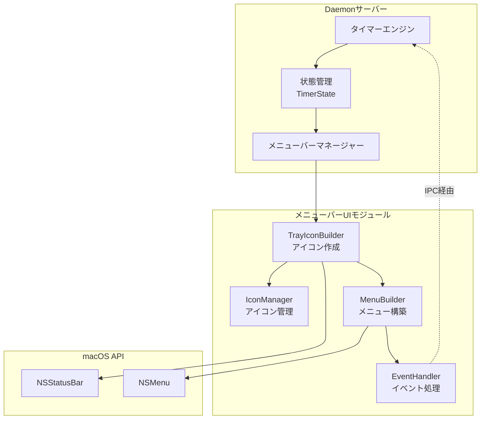
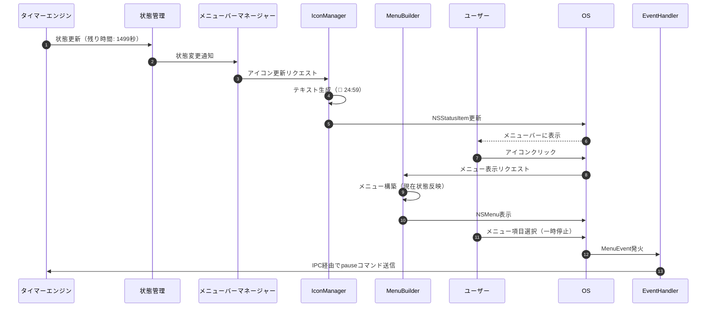
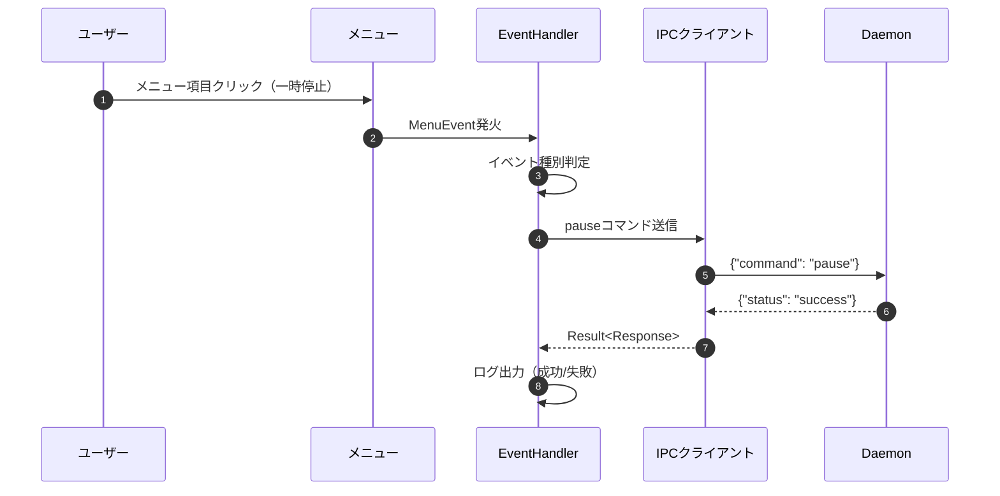
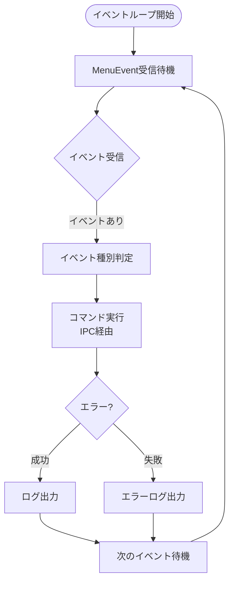
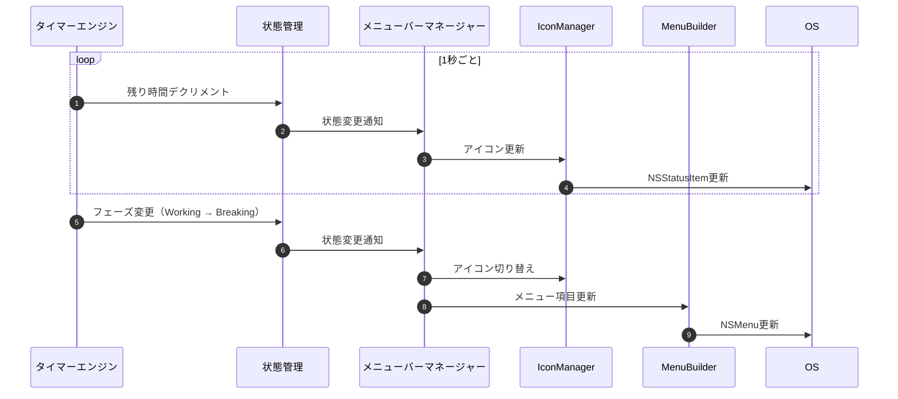

# メニューバーUI 詳細設計書

## メタ情報

| 項目 | 内容 |
|------|------|
| ドキュメントID | DETAILED-CLI-001-MENUBAR |
| 対応機能 | F-018 (メニューバー常駐), F-004 (時間表示) |
| 対応要件 | REQ-CLI-001 |
| 対応基本設計 | BASIC-CLI-001 |
| バージョン | 1.0.0 |
| ステータス | ドラフト |
| 作成日 | 2026-01-03 |
| 最終更新日 | 2026-01-03 |
| 作成者 | - |

---

## 1. 概要

### 1.1 目的

本設計書は、macOSポモドーロタイマーCLIツールのメニューバーUI機能の詳細設計を定義する。`tray-icon` クレートを使用してメニューバーにアイコンを常駐させ、残り時間の表示とクイック操作を提供する。

### 1.2 スコープ

#### スコープ内
- メニューバーアイコンの作成と表示
- 残り時間の動的更新（1秒ごと）
- ドロップダウンメニューの構築
- メニュー項目のクリックイベント処理
- Daemonサーバーとの状態同期
- アイコンリソース管理（PNG画像）
- メニューバー利用不可時のエラーハンドリング

#### スコープ外
- メニューバーアイコンのカスタマイズ機能（Phase 2）
- メニューバーからのタイマー開始機能（Phase 2）
- 通知センターとの連携（別設計書）

### 1.3 用語定義

| 用語 | 定義 |
|------|------|
| トレイアイコン | macOSメニューバーに表示される常駐アイコン |
| ステータスアイテム | macOSのNSStatusItemに相当するメニューバー要素 |
| メニューイベント | メニュー項目クリック時に発火するイベント |
| 状態同期 | Daemonサーバーのタイマー状態とメニューバーUIの同期 |

---

## 2. アーキテクチャ概要

### 2.1 コンポーネント構成



### 2.2 モジュール構成

```
src/menubar/
├── mod.rs              # モジュールエントリーポイント、TrayIconManager
├── icon.rs             # IconManager: アイコン生成・更新
├── menu.rs             # MenuBuilder: メニュー構築
└── event.rs            # EventHandler: イベント処理
```

### 2.3 データフロー



---

## 3. モジュール設計

### 3.1 mod.rs - TrayIconManager

#### 3.1.1 責務

- トレイアイコンの初期化と管理
- 状態変更の監視と更新トリガー
- IconManager、MenuBuilderの統合

#### 3.1.2 構造体定義

```rust
/// メニューバーアイコンの管理
pub struct TrayIconManager {
    /// tray-iconのインスタンス
    tray_icon: TrayIcon,
    /// アイコン管理
    icon_manager: IconManager,
    /// メニュー構築
    menu_builder: MenuBuilder,
    /// イベントハンドラー
    event_handler: Arc<EventHandler>,
    /// 現在の状態
    current_state: Arc<RwLock<TimerState>>,
}

impl TrayIconManager {
    /// 新しいTrayIconManagerを作成
    pub fn new(ipc_client: Arc<IpcClient>) -> Result<Self>;
    
    /// トレイアイコンを初期化
    pub fn initialize(&mut self) -> Result<()>;
    
    /// 状態を更新（1秒ごとに呼ばれる）
    pub fn update_state(&mut self, state: TimerState) -> Result<()>;
    
    /// イベントループを開始
    pub fn run_event_loop(&self) -> Result<()>;
    
    /// トレイアイコンを削除
    pub fn shutdown(&mut self) -> Result<()>;
}
```

#### 3.1.3 実装方針

- `TrayIconBuilder` を使用してアイコンを作成
- 状態更新は `Arc<RwLock<TimerState>>` で共有
- イベントループは `tray_icon::menu::MenuEvent::receiver()` を使用
- エラー時は警告ログを出力し、機能を無効化（クラッシュしない）

### 3.2 icon.rs - IconManager

#### 3.2.1 責務

- アイコン画像の生成と管理
- 残り時間テキストの動的生成
- 状態に応じたアイコン切り替え（作業中/休憩中/停止中）

#### 3.2.2 構造体定義

```rust
/// アイコン管理
pub struct IconManager {
    /// 作業中アイコン（🍅）
    working_icon: Icon,
    /// 休憩中アイコン（☕）
    breaking_icon: Icon,
    /// 停止中アイコン（グレー）
    stopped_icon: Icon,
}

impl IconManager {
    /// 新しいIconManagerを作成
    pub fn new() -> Result<Self>;
    
    /// 状態に応じたアイコンテキストを生成
    /// 例: "🍅 15:30", "☕ 04:30", "⏸ 停止中"
    pub fn generate_title(&self, state: &TimerState) -> String;
    
    /// 状態に応じたアイコンを取得
    pub fn get_icon(&self, phase: &TimerPhase) -> &Icon;
    
    /// アイコンリソースを読み込み
    fn load_icon(path: &str) -> Result<Icon>;
}
```

#### 3.2.3 アイコンリソース

| 状態 | アイコン | ファイル名 | サイズ |
|------|---------|-----------|--------|
| 作業中 | 🍅 | `working.png` | 22x22 @2x |
| 休憩中 | ☕ | `breaking.png` | 22x22 @2x |
| 停止中 | ⏸ | `stopped.png` | 22x22 @2x (グレー) |

**配置場所**: `assets/icons/menubar/`

#### 3.2.4 テキスト生成ロジック

```rust
pub fn generate_title(&self, state: &TimerState) -> String {
    match state.phase {
        TimerPhase::Working => {
            let minutes = state.remaining_seconds / 60;
            let seconds = state.remaining_seconds % 60;
            format!("🍅 {:02}:{:02}", minutes, seconds)
        }
        TimerPhase::Breaking | TimerPhase::LongBreaking => {
            let minutes = state.remaining_seconds / 60;
            let seconds = state.remaining_seconds % 60;
            format!("☕ {:02}:{:02}", minutes, seconds)
        }
        TimerPhase::Paused => {
            format!("⏸ 一時停止")
        }
        TimerPhase::Stopped => {
            format!("⏸ 停止中")
        }
    }
}
```

### 3.3 menu.rs - MenuBuilder

#### 3.3.1 責務

- ドロップダウンメニューの構築
- 状態に応じたメニュー項目の有効/無効化
- セパレーターの挿入

#### 3.3.2 構造体定義

```rust
/// メニュー構築
pub struct MenuBuilder {
    /// メニューインスタンス
    menu: Menu,
    /// メニュー項目ID
    item_ids: MenuItemIds,
}

/// メニュー項目のID管理
pub struct MenuItemIds {
    pub pause: MenuItemId,
    pub resume: MenuItemId,
    pub stop: MenuItemId,
    pub quit: MenuItemId,
}

impl MenuBuilder {
    /// 新しいMenuBuilderを作成
    pub fn new() -> Result<Self>;
    
    /// メニューを構築
    pub fn build(&mut self, state: &TimerState) -> Result<&Menu>;
    
    /// メニュー項目の有効/無効を更新
    pub fn update_menu_state(&mut self, state: &TimerState) -> Result<()>;
    
    /// メニューを取得
    pub fn menu(&self) -> &Menu;
}
```

#### 3.3.3 メニュー構造

```
┌─────────────────────────┐
│ ポモドーロタイマー       │ (タイトル、無効化)
├─────────────────────────┤
│ 作業中: API実装          │ (状態表示、無効化)
│ 残り時間: 15:30          │ (残り時間、無効化)
│ ポモドーロ: #2           │ (回数、無効化)
├─────────────────────────┤
│ ⏸ 一時停止              │ (作業中のみ有効)
│ ▶ 再開                  │ (一時停止中のみ有効)
│ ⏹ 停止                  │ (実行中のみ有効)
├─────────────────────────┤
│ 終了                    │ (常に有効)
└─────────────────────────┘
```

#### 3.3.4 メニュー項目の有効/無効ロジック

| メニュー項目 | 有効条件 |
|-------------|---------|
| 一時停止 | `phase == Working || phase == Breaking` |
| 再開 | `phase == Paused` |
| 停止 | `phase != Stopped` |
| 終了 | 常に有効 |

#### 3.3.5 実装例

```rust
pub fn build(&mut self, state: &TimerState) -> Result<&Menu> {
    self.menu.clear()?;
    
    // タイトル（無効化）
    let title = MenuItem::new("ポモドーロタイマー", false, None);
    self.menu.append(&title)?;
    
    self.menu.append(&PredefinedMenuItem::separator())?;
    
    // 状態表示（無効化）
    if let Some(task_name) = &state.task_name {
        let status = MenuItem::new(
            &format!("作業中: {}", task_name),
            false,
            None
        );
        self.menu.append(&status)?;
    }
    
    let remaining = MenuItem::new(
        &format!("残り時間: {:02}:{:02}", 
            state.remaining_seconds / 60,
            state.remaining_seconds % 60),
        false,
        None
    );
    self.menu.append(&remaining)?;
    
    let count = MenuItem::new(
        &format!("ポモドーロ: #{}", state.pomodoro_count),
        false,
        None
    );
    self.menu.append(&count)?;
    
    self.menu.append(&PredefinedMenuItem::separator())?;
    
    // 操作メニュー
    let pause_enabled = matches!(state.phase, TimerPhase::Working | TimerPhase::Breaking);
    let pause = MenuItem::new("⏸ 一時停止", pause_enabled, None);
    self.item_ids.pause = pause.id();
    self.menu.append(&pause)?;
    
    let resume_enabled = matches!(state.phase, TimerPhase::Paused);
    let resume = MenuItem::new("▶ 再開", resume_enabled, None);
    self.item_ids.resume = resume.id();
    self.menu.append(&resume)?;
    
    let stop_enabled = !matches!(state.phase, TimerPhase::Stopped);
    let stop = MenuItem::new("⏹ 停止", stop_enabled, None);
    self.item_ids.stop = stop.id();
    self.menu.append(&stop)?;
    
    self.menu.append(&PredefinedMenuItem::separator())?;
    
    // 終了
    let quit = MenuItem::new("終了", true, None);
    self.item_ids.quit = quit.id();
    self.menu.append(&quit)?;
    
    Ok(&self.menu)
}
```

### 3.4 event.rs - EventHandler

#### 3.4.1 責務

- メニュー項目クリックイベントの受信
- イベントに応じたコマンド実行（IPC経由）
- エラーハンドリング

#### 3.4.2 構造体定義

```rust
/// イベントハンドラー
pub struct EventHandler {
    /// IPCクライアント
    ipc_client: Arc<IpcClient>,
    /// メニュー項目ID
    item_ids: MenuItemIds,
}

impl EventHandler {
    /// 新しいEventHandlerを作成
    pub fn new(ipc_client: Arc<IpcClient>, item_ids: MenuItemIds) -> Self;
    
    /// イベントを処理
    pub async fn handle_event(&self, event: MenuEvent) -> Result<()>;
    
    /// 一時停止コマンドを送信
    async fn handle_pause(&self) -> Result<()>;
    
    /// 再開コマンドを送信
    async fn handle_resume(&self) -> Result<()>;
    
    /// 停止コマンドを送信
    async fn handle_stop(&self) -> Result<()>;
    
    /// 終了コマンドを送信
    async fn handle_quit(&self) -> Result<()>;
}
```

#### 3.4.3 イベント処理フロー



#### 3.4.4 実装例

```rust
pub async fn handle_event(&self, event: MenuEvent) -> Result<()> {
    if event.id == self.item_ids.pause {
        self.handle_pause().await?;
    } else if event.id == self.item_ids.resume {
        self.handle_resume().await?;
    } else if event.id == self.item_ids.stop {
        self.handle_stop().await?;
    } else if event.id == self.item_ids.quit {
        self.handle_quit().await?;
    }
    Ok(())
}

async fn handle_pause(&self) -> Result<()> {
    tracing::info!("メニューバーから一時停止を実行");
    let response = self.ipc_client.send_command("pause", None).await?;
    if response.status == "success" {
        tracing::info!("一時停止成功");
    } else {
        tracing::error!("一時停止失敗: {}", response.message);
    }
    Ok(())
}
```

---

## 4. アイコン管理

### 4.1 アイコンリソース仕様

#### 4.1.1 ファイル形式

- **形式**: PNG（透過背景）
- **サイズ**: 22x22 ピクセル（@1x）、44x44 ピクセル（@2x）
- **カラー**: フルカラー（作業中: トマト色、休憩中: コーヒー色、停止中: グレー）

#### 4.1.2 リソース配置

```
assets/icons/menubar/
├── working.png       # 作業中アイコン（🍅）
├── working@2x.png    # Retina対応
├── breaking.png      # 休憩中アイコン（☕）
├── breaking@2x.png   # Retina対応
├── stopped.png       # 停止中アイコン（⏸）
└── stopped@2x.png    # Retina対応
```

#### 4.1.3 アイコン読み込み

```rust
fn load_icon(path: &str) -> Result<Icon> {
    let icon_data = include_bytes!(path);
    let image = image::load_from_memory(icon_data)
        .context("アイコン画像の読み込みに失敗")?;
    
    let rgba = image.to_rgba8();
    let (width, height) = rgba.dimensions();
    
    Icon::from_rgba(rgba.into_raw(), width, height)
        .context("アイコンの作成に失敗")
}
```

### 4.2 動的テキスト更新

#### 4.2.1 更新頻度

- **頻度**: 1秒ごと
- **トリガー**: タイマーエンジンからの状態変更通知

#### 4.2.2 更新処理

```rust
pub fn update_state(&mut self, state: TimerState) -> Result<()> {
    // 状態を更新
    *self.current_state.write().unwrap() = state.clone();
    
    // アイコンテキストを生成
    let title = self.icon_manager.generate_title(&state);
    
    // トレイアイコンを更新
    self.tray_icon.set_title(Some(&title))?;
    
    // アイコン画像を更新（状態変化時のみ）
    let icon = self.icon_manager.get_icon(&state.phase);
    self.tray_icon.set_icon(Some(icon.clone()))?;
    
    // メニューを更新
    self.menu_builder.update_menu_state(&state)?;
    
    Ok(())
}
```

---

## 5. メニュー構造

### 5.1 メニュー項目定義

| # | 項目名 | 種別 | 有効条件 | アクション |
|---|--------|------|---------|-----------|
| 1 | ポモドーロタイマー | タイトル | 常に無効 | なし |
| 2 | （セパレーター） | セパレーター | - | - |
| 3 | 作業中: {タスク名} | 状態表示 | タスク名設定時のみ表示、常に無効 | なし |
| 4 | 残り時間: {MM:SS} | 状態表示 | 常に無効 | なし |
| 5 | ポモドーロ: #{回数} | 状態表示 | 常に無効 | なし |
| 6 | （セパレーター） | セパレーター | - | - |
| 7 | ⏸ 一時停止 | 操作 | 作業中または休憩中 | pauseコマンド送信 |
| 8 | ▶ 再開 | 操作 | 一時停止中 | resumeコマンド送信 |
| 9 | ⏹ 停止 | 操作 | 停止中以外 | stopコマンド送信 |
| 10 | （セパレーター） | セパレーター | - | - |
| 11 | 終了 | 操作 | 常に有効 | Daemon終了 |

### 5.2 状態別メニュー表示例

#### 5.2.1 作業中

```
┌─────────────────────────┐
│ ポモドーロタイマー       │
├─────────────────────────┤
│ 作業中: API実装          │
│ 残り時間: 15:30          │
│ ポモドーロ: #2           │
├─────────────────────────┤
│ ⏸ 一時停止              │ ← 有効
│ ▶ 再開                  │ ← 無効（グレーアウト）
│ ⏹ 停止                  │ ← 有効
├─────────────────────────┤
│ 終了                    │
└─────────────────────────┘
```

#### 5.2.2 一時停止中

```
┌─────────────────────────┐
│ ポモドーロタイマー       │
├─────────────────────────┤
│ 作業中: API実装          │
│ 残り時間: 15:30          │
│ ポモドーロ: #2           │
├─────────────────────────┤
│ ⏸ 一時停止              │ ← 無効（グレーアウト）
│ ▶ 再開                  │ ← 有効
│ ⏹ 停止                  │ ← 有効
├─────────────────────────┤
│ 終了                    │
└─────────────────────────┘
```

#### 5.2.3 停止中

```
┌─────────────────────────┐
│ ポモドーロタイマー       │
├─────────────────────────┤
│ 停止中                  │
├─────────────────────────┤
│ ⏸ 一時停止              │ ← 無効（グレーアウト）
│ ▶ 再開                  │ ← 無効（グレーアウト）
│ ⏹ 停止                  │ ← 無効（グレーアウト）
├─────────────────────────┤
│ 終了                    │
└─────────────────────────┘
```

---

## 6. イベントループ

### 6.1 イベントループ設計

#### 6.1.1 イベント受信方式

- `tray_icon::menu::MenuEvent::receiver()` を使用
- ブロッキング受信（`recv()`）でイベント待機
- 別スレッドで実行（Daemonのメインスレッドをブロックしない）

#### 6.1.2 実装例

```rust
pub fn run_event_loop(&self) -> Result<()> {
    let event_handler = self.event_handler.clone();
    let receiver = MenuEvent::receiver();
    
    std::thread::spawn(move || {
        loop {
            if let Ok(event) = receiver.recv() {
                // 非同期ランタイムでイベント処理
                tokio::runtime::Handle::current().block_on(async {
                    if let Err(e) = event_handler.handle_event(event).await {
                        tracing::error!("メニューイベント処理エラー: {:?}", e);
                    }
                });
            }
        }
    });
    
    Ok(())
}
```

### 6.2 イベント処理フロー



---

## 7. 状態同期

### 7.1 Daemonとの同期方式

#### 7.1.1 同期トリガー

| トリガー | 頻度 | 処理内容 |
|---------|------|---------|
| タイマーティック | 1秒ごと | 残り時間更新、アイコンテキスト更新 |
| 状態変更 | イベント発生時 | フェーズ変更、メニュー項目有効/無効更新 |
| コマンド実行 | ユーザー操作時 | メニューからのコマンド実行 |

#### 7.1.2 同期フロー



### 7.2 状態共有方式

#### 7.2.1 共有データ構造

```rust
/// 共有状態
pub struct SharedState {
    /// タイマー状態
    state: Arc<RwLock<TimerState>>,
}

impl SharedState {
    /// 状態を取得
    pub fn get(&self) -> TimerState {
        self.state.read().unwrap().clone()
    }
    
    /// 状態を更新
    pub fn update(&self, state: TimerState) {
        *self.state.write().unwrap() = state;
    }
}
```

#### 7.2.2 更新通知方式

- **方式1**: ポーリング（1秒ごとに状態を取得）
- **方式2**: チャネル経由の通知（`tokio::sync::watch`）

**採用**: 方式2（チャネル経由）を採用し、効率的な更新を実現

```rust
/// 状態変更通知チャネル
pub struct StateNotifier {
    sender: watch::Sender<TimerState>,
    receiver: watch::Receiver<TimerState>,
}

impl StateNotifier {
    pub fn new(initial_state: TimerState) -> Self {
        let (sender, receiver) = watch::channel(initial_state);
        Self { sender, receiver }
    }
    
    /// 状態を通知
    pub fn notify(&self, state: TimerState) {
        let _ = self.sender.send(state);
    }
    
    /// 状態変更を監視
    pub async fn watch(&mut self) -> TimerState {
        self.receiver.changed().await.unwrap();
        self.receiver.borrow().clone()
    }
}
```

---

## 8. エラーハンドリング

### 8.1 エラー種別

| エラー種別 | 発生条件 | 対応方針 |
|-----------|---------|---------|
| メニューバー利用不可 | macOSでメニューバーが利用できない | 警告ログ出力、機能無効化 |
| アイコン読み込み失敗 | アイコンファイルが見つからない | デフォルトアイコン使用 |
| メニュー構築失敗 | メニュー項目追加エラー | エラーログ出力、空メニュー表示 |
| IPC通信エラー | Daemonとの通信失敗 | エラーログ出力、リトライ |
| イベント処理エラー | イベントハンドリング失敗 | エラーログ出力、次のイベント処理継続 |

### 8.2 エラーハンドリング実装

#### 8.2.1 メニューバー利用不可時

```rust
pub fn initialize(&mut self) -> Result<()> {
    match TrayIconBuilder::new()
        .with_menu(Box::new(self.menu_builder.menu().clone()))
        .with_icon(self.icon_manager.get_icon(&TimerPhase::Stopped).clone())
        .build()
    {
        Ok(tray_icon) => {
            self.tray_icon = tray_icon;
            tracing::info!("メニューバーアイコンを初期化しました");
            Ok(())
        }
        Err(e) => {
            tracing::warn!("メニューバーアイコンの初期化に失敗: {:?}", e);
            tracing::warn!("メニューバー機能を無効化します");
            // 機能を無効化するが、Daemonは継続
            Err(anyhow::anyhow!("メニューバー利用不可"))
        }
    }
}
```

#### 8.2.2 アイコン読み込み失敗時

```rust
fn load_icon(path: &str) -> Result<Icon> {
    match include_bytes!(path) {
        Ok(icon_data) => {
            // 正常読み込み
            Icon::from_rgba(...)
        }
        Err(e) => {
            tracing::error!("アイコン読み込み失敗: {}, デフォルトアイコンを使用", path);
            // デフォルトアイコン（単色）を生成
            create_default_icon()
        }
    }
}

fn create_default_icon() -> Result<Icon> {
    // 22x22の単色アイコンを生成
    let rgba = vec![128, 128, 128, 255; 22 * 22 * 4];
    Icon::from_rgba(rgba, 22, 22)
        .context("デフォルトアイコンの作成に失敗")
}
```

#### 8.2.3 IPC通信エラー時

```rust
async fn handle_pause(&self) -> Result<()> {
    tracing::info!("メニューバーから一時停止を実行");
    
    match self.ipc_client.send_command("pause", None).await {
        Ok(response) => {
            if response.status == "success" {
                tracing::info!("一時停止成功");
            } else {
                tracing::error!("一時停止失敗: {}", response.message);
            }
            Ok(())
        }
        Err(e) => {
            tracing::error!("IPC通信エラー: {:?}", e);
            // リトライは行わず、エラーログのみ出力
            // ユーザーは再度メニューから操作可能
            Err(e)
        }
    }
}
```

### 8.3 ログ出力

#### 8.3.1 ログレベル

| レベル | 用途 | 例 |
|--------|------|-----|
| ERROR | 致命的エラー | IPC通信失敗、アイコン作成失敗 |
| WARN | 警告（機能制限） | メニューバー利用不可 |
| INFO | 正常動作 | アイコン初期化成功、コマンド実行成功 |
| DEBUG | デバッグ情報 | 状態更新、イベント受信 |
| TRACE | 詳細トレース | メニュー項目追加、アイコン更新 |

#### 8.3.2 ログ出力例

```rust
tracing::info!("メニューバーアイコンを初期化しました");
tracing::debug!("状態更新: {:?}", state);
tracing::error!("メニュー構築エラー: {:?}", e);
tracing::warn!("メニューバー機能を無効化します");
```

---

## 9. テスト設計

### 9.1 単体テスト

#### 9.1.1 IconManager

| テストケース | 入力 | 期待出力 |
|-------------|------|---------|
| 作業中テキスト生成 | `TimerState { phase: Working, remaining_seconds: 930 }` | `"🍅 15:30"` |
| 休憩中テキスト生成 | `TimerState { phase: Breaking, remaining_seconds: 270 }` | `"☕ 04:30"` |
| 一時停止中テキスト生成 | `TimerState { phase: Paused }` | `"⏸ 一時停止"` |
| 停止中テキスト生成 | `TimerState { phase: Stopped }` | `"⏸ 停止中"` |
| アイコン取得（作業中） | `TimerPhase::Working` | `working_icon` |
| アイコン取得（休憩中） | `TimerPhase::Breaking` | `breaking_icon` |

#### 9.1.2 MenuBuilder

| テストケース | 入力 | 期待出力 |
|-------------|------|---------|
| 作業中メニュー構築 | `TimerState { phase: Working }` | 一時停止: 有効、再開: 無効、停止: 有効 |
| 一時停止中メニュー構築 | `TimerState { phase: Paused }` | 一時停止: 無効、再開: 有効、停止: 有効 |
| 停止中メニュー構築 | `TimerState { phase: Stopped }` | 一時停止: 無効、再開: 無効、停止: 無効 |
| タスク名表示 | `TimerState { task_name: Some("API実装") }` | メニューに「作業中: API実装」が表示される |
| タスク名なし | `TimerState { task_name: None }` | タスク名メニュー項目が表示されない |

#### 9.1.3 EventHandler

| テストケース | 入力 | 期待動作 |
|-------------|------|---------|
| 一時停止イベント | `MenuEvent { id: pause_id }` | `ipc_client.send_command("pause")` が呼ばれる |
| 再開イベント | `MenuEvent { id: resume_id }` | `ipc_client.send_command("resume")` が呼ばれる |
| 停止イベント | `MenuEvent { id: stop_id }` | `ipc_client.send_command("stop")` が呼ばれる |
| 終了イベント | `MenuEvent { id: quit_id }` | Daemon終了処理が呼ばれる |

### 9.2 統合テスト

#### 9.2.1 状態同期テスト

| テストケース | 手順 | 期待結果 |
|-------------|------|---------|
| 残り時間更新 | 1. タイマー開始<br/>2. 1秒待機<br/>3. メニューバーアイコン確認 | アイコンテキストが「🍅 24:59」に更新される |
| フェーズ変更 | 1. 作業タイマー完了<br/>2. メニューバーアイコン確認 | アイコンが🍅から☕に変更される |
| メニュー項目更新 | 1. 一時停止実行<br/>2. メニュー表示 | 「再開」が有効、「一時停止」が無効 |

#### 9.2.2 エラーハンドリングテスト

| テストケース | 手順 | 期待結果 |
|-------------|------|---------|
| IPC通信エラー | 1. Daemon停止<br/>2. メニューから一時停止実行 | エラーログ出力、クラッシュしない |
| アイコン読み込み失敗 | 1. アイコンファイル削除<br/>2. Daemon起動 | デフォルトアイコン使用、警告ログ出力 |

### 9.3 手動テスト

#### 9.3.1 UI確認

| テスト項目 | 確認内容 |
|-----------|---------|
| アイコン表示 | メニューバーに🍅アイコンが表示される |
| テキスト表示 | 残り時間が「15:30」形式で表示される |
| メニュー表示 | アイコンクリックでメニューが表示される |
| メニュー項目 | 状態に応じて項目が有効/無効化される |
| セパレーター | セパレーターが正しく表示される |

#### 9.3.2 操作確認

| テスト項目 | 操作 | 期待結果 |
|-----------|------|---------|
| 一時停止 | メニューから「一時停止」選択 | タイマーが一時停止する |
| 再開 | メニューから「再開」選択 | タイマーが再開する |
| 停止 | メニューから「停止」選択 | タイマーが停止する |
| 終了 | メニューから「終了」選択 | Daemonが終了する |

---

## 10. 実装スケジュール

| # | タスク | 担当 | 期限 | ステータス |
|---|--------|------|------|-----------|
| 1 | IconManager実装 | - | 2026-01-09 | 未着手 |
| 2 | MenuBuilder実装 | - | 2026-01-10 | 未着手 |
| 3 | EventHandler実装 | - | 2026-01-11 | 未着手 |
| 4 | TrayIconManager実装 | - | 2026-01-12 | 未着手 |
| 5 | アイコンリソース作成 | - | 2026-01-08 | 未着手 |
| 6 | 単体テスト実装 | - | 2026-01-13 | 未着手 |
| 7 | 統合テスト実装 | - | 2026-01-14 | 未着手 |
| 8 | 手動テスト | - | 2026-01-15 | 未着手 |

---

## 11. 未解決課題

| ID | 課題 | 対応方針 | 期限 | ステータス |
|----|------|---------|------|-----------|
| I-010 | メニューバーUIとDaemonの同期方法 | `tokio::sync::watch` チャネル使用 | 2026-01-11 | 解決済み |
| I-014 | メニューバーアイコンの動的テキスト更新パフォーマンス | 1秒ごとの更新で問題ないか検証 | 2026-01-12 | 未着手 |
| I-015 | メニューバー利用不可時のフォールバック | 警告ログ出力、機能無効化 | 2026-01-09 | 解決済み |

---

## 変更履歴

| 日付 | バージョン | 変更内容 | 担当者 |
|:---|:---|:---|:---|
| 2026-01-03 | 1.0.0 | 初版作成 | - |
