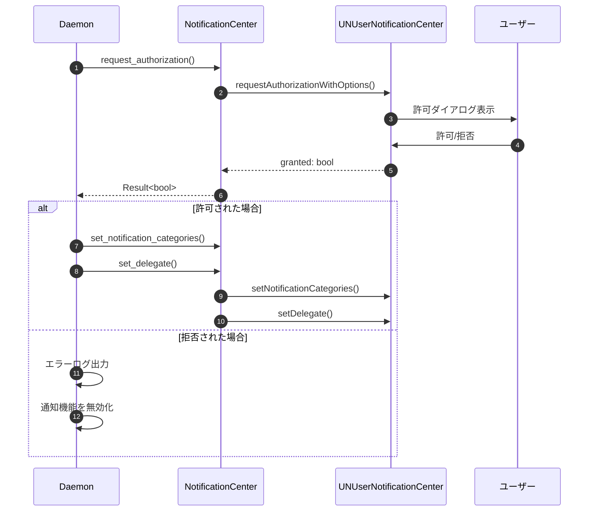
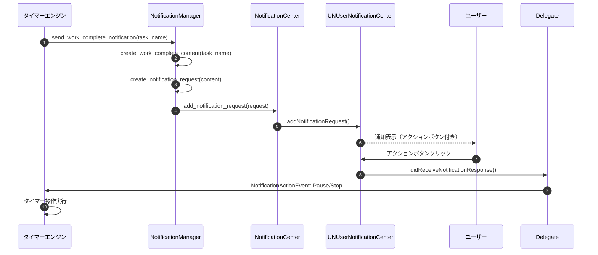

# 通知システム詳細設計書

## メタ情報

| 項目 | 内容 |
|------|------|
| ドキュメントID | DETAILED-CLI-001-NOTIFICATION |
| 対応要件 | REQ-CLI-001 (F-002, F-017) |
| 対応基本設計 | BASIC-CLI-001 (3.2.2 F-017: ネイティブ通知拡張) |
| バージョン | 1.0.0 |
| ステータス | ドラフト |
| 作成日 | 2026-01-03 |
| 最終更新日 | 2026-01-03 |
| 作成者 | - |

---

## 1. 概要

### 1.1 目的

本設計書は、macOS Pomodoro Timer CLIツールの通知システムの詳細設計を定義する。`objc2-user-notifications` を使用してmacOS Notification Centerとネイティブに統合し、アクションボタン付き通知を実現する。

### 1.2 スコープ

#### スコープ内
- タイマー完了時の通知送信（作業完了/休憩完了）
- アクションボタン付き通知（一時停止/停止）
- 通知アクションのイベントハンドリング
- 通知許可リクエストフロー
- 通知デリゲート実装（`UNUserNotificationCenterDelegate`）
- エラーハンドリング（未署名バイナリ、許可拒否等）

#### スコープ外
- 通知履歴の永続化（Phase 2）
- 通知設定のカスタマイズUI（Phase 2）
- 通知音のカスタマイズ（サウンド再生設計書で対応）

### 1.3 対応機能

| 機能ID | 機能名 | 概要 |
|--------|--------|------|
| F-002 | システム通知 | タイマー完了時のデスクトップ通知 |
| F-017 | ネイティブ通知拡張 | アクションボタン付き通知（一時停止/停止） |

---

## 2. モジュール構成

### 2.1 ディレクトリ構造

```
src/
├── notification/
│   ├── mod.rs                  # モジュールエントリポイント、公開API
│   ├── center.rs               # UNUserNotificationCenter ラッパー
│   ├── delegate.rs             # UNUserNotificationCenterDelegate 実装
│   ├── actions.rs              # 通知アクション定義
│   ├── content.rs              # 通知コンテンツ構築
│   ├── request.rs              # 通知リクエスト作成
│   └── error.rs                # エラー型定義
└── main.rs
```

### 2.2 モジュール責務

| モジュール | 責務 | 主要型 |
|-----------|------|--------|
| `mod.rs` | 公開API、初期化処理 | `NotificationManager` |
| `center.rs` | `UNUserNotificationCenter` のRustラッパー | `NotificationCenter` |
| `delegate.rs` | デリゲート実装、アクションハンドリング | `NotificationDelegate` |
| `actions.rs` | アクション定義、カテゴリ登録 | `NotificationAction`, `NotificationCategory` |
| `content.rs` | 通知コンテンツ構築 | `NotificationContentBuilder` |
| `request.rs` | 通知リクエスト作成・送信 | `NotificationRequest` |
| `error.rs` | エラー型定義 | `NotificationError` |

---

## 3. 通知種別

### 3.1 通知種別一覧

| 通知ID | 通知名 | トリガー | カテゴリID | アクションボタン |
|--------|--------|---------|-----------|----------------|
| NTF-001 | 作業完了通知 | 作業タイマー完了 | `WORK_COMPLETE` | 一時停止, 停止 |
| NTF-002 | 休憩完了通知 | 休憩タイマー完了 | `BREAK_COMPLETE` | 一時停止, 停止 |
| NTF-003 | 長い休憩完了通知 | 長い休憩タイマー完了 | `LONG_BREAK_COMPLETE` | 一時停止, 停止 |

### 3.2 通知詳細

#### 3.2.1 NTF-001: 作業完了通知

**基本情報**
| 項目 | 値 |
|------|-----|
| カテゴリID | `WORK_COMPLETE` |
| タイトル | `🍅 ポモドーロタイマー` |
| 本文 | `作業時間が終了しました。休憩してください。` |
| サブタイトル | タスク名（設定されている場合） |

**アクションボタン**
| アクションID | ラベル | 動作 |
|-------------|--------|------|
| `PAUSE_ACTION` | 一時停止 | タイマーを一時停止 |
| `STOP_ACTION` | 停止 | タイマーを停止 |

**通知コンテンツ例**
```json
{
  "title": "🍅 ポモドーロタイマー",
  "subtitle": "API実装",
  "body": "作業時間が終了しました。休憩してください。",
  "categoryIdentifier": "WORK_COMPLETE",
  "sound": "default"
}
```

#### 3.2.2 NTF-002: 休憩完了通知

**基本情報**
| 項目 | 値 |
|------|-----|
| カテゴリID | `BREAK_COMPLETE` |
| タイトル | `☕ ポモドーロタイマー` |
| 本文 | `休憩時間が終了しました。作業を再開してください。` |
| サブタイトル | タスク名（設定されている場合） |

**アクションボタン**
| アクションID | ラベル | 動作 |
|-------------|--------|------|
| `PAUSE_ACTION` | 一時停止 | タイマーを一時停止 |
| `STOP_ACTION` | 停止 | タイマーを停止 |

#### 3.2.3 NTF-003: 長い休憩完了通知

**基本情報**
| 項目 | 値 |
|------|-----|
| カテゴリID | `LONG_BREAK_COMPLETE` |
| タイトル | `☕ ポモドーロタイマー` |
| 本文 | `長い休憩時間が終了しました。作業を再開してください。` |
| サブタイトル | タスク名（設定されている場合） |

**アクションボタン**
| アクションID | ラベル | 動作 |
|-------------|--------|------|
| `PAUSE_ACTION` | 一時停止 | タイマーを一時停止 |
| `STOP_ACTION` | 停止 | タイマーを停止 |

---

## 4. objc2実装詳細

### 4.1 依存関係

```toml
[dependencies]
objc2 = "0.6"
objc2-foundation = { version = "0.3", features = ["NSString", "NSError"] }
objc2-user-notifications = { version = "0.3", features = [
    "UNUserNotificationCenter",
    "UNNotificationContent",
    "UNNotificationRequest",
    "UNNotificationAction",
    "UNNotificationCategory",
    "UNUserNotificationCenterDelegate"
] }
```

### 4.2 NotificationCenter（center.rs）

**責務**: `UNUserNotificationCenter` のRustラッパー、シングルトンアクセス

```rust
use objc2_foundation::NSString;
use objc2_user_notifications::{
    UNUserNotificationCenter, UNAuthorizationOptions,
};
use crate::notification::error::NotificationError;

/// UNUserNotificationCenter のラッパー
pub struct NotificationCenter {
    center: Retained<UNUserNotificationCenter>,
}

impl NotificationCenter {
    /// シングルトンインスタンスを取得
    pub fn shared() -> Self {
        unsafe {
            let center = UNUserNotificationCenter::currentNotificationCenter();
            Self {
                center: Retained::retain(center).unwrap(),
            }
        }
    }

    /// 通知許可をリクエスト
    pub async fn request_authorization(&self) -> Result<bool, NotificationError> {
        let options = UNAuthorizationOptions::Alert
            | UNAuthorizationOptions::Sound
            | UNAuthorizationOptions::Badge;

        let (granted, error) = unsafe {
            self.center.requestAuthorizationWithOptions_completionHandler(
                options,
                |granted, error| {
                    if let Some(err) = error {
                        return (false, Some(err));
                    }
                    (granted, None)
                },
            )
        };

        if let Some(err) = error {
            return Err(NotificationError::AuthorizationFailed(
                err.localizedDescription().to_string()
            ));
        }

        Ok(granted)
    }

    /// 通知カテゴリを登録
    pub fn set_notification_categories(&self, categories: Vec<UNNotificationCategory>) {
        unsafe {
            let categories_set = NSSet::setWithArray(&categories);
            self.center.setNotificationCategories(categories_set);
        }
    }

    /// デリゲートを設定
    pub fn set_delegate(&self, delegate: &UNUserNotificationCenterDelegate) {
        unsafe {
            self.center.setDelegate(Some(delegate));
        }
    }

    /// 通知を送信
    pub async fn add_notification_request(
        &self,
        request: &UNNotificationRequest,
    ) -> Result<(), NotificationError> {
        unsafe {
            self.center.addNotificationRequest_withCompletionHandler(
                request,
                |error| {
                    if let Some(err) = error {
                        return Err(NotificationError::SendFailed(
                            err.localizedDescription().to_string()
                        ));
                    }
                    Ok(())
                },
            )
        }
    }
}
```

### 4.3 NotificationDelegate（delegate.rs）

**責務**: `UNUserNotificationCenterDelegate` 実装、アクションハンドリング

```rust
use objc2::runtime::ProtocolObject;
use objc2::rc::Retained;
use objc2::declare_class;
use objc2::ClassType;
use objc2_foundation::{NSObject, NSObjectProtocol};
use objc2_user_notifications::{
    UNUserNotificationCenterDelegate, UNNotification, UNNotificationResponse,
    UNNotificationPresentationOptions,
};
use std::sync::mpsc::Sender;

/// アクションイベント
#[derive(Debug, Clone)]
pub enum NotificationActionEvent {
    Pause,
    Stop,
}

/// UNUserNotificationCenterDelegate の実装
declare_class!(
    pub struct NotificationDelegate;

    unsafe impl ClassType for NotificationDelegate {
        type Super = NSObject;
        const NAME: &'static str = "PomodoroNotificationDelegate";
    }

    unsafe impl NotificationDelegate {
        /// アクションレスポンスを受信
        #[method(userNotificationCenter:didReceiveNotificationResponse:withCompletionHandler:)]
        fn did_receive_notification_response(
            &self,
            _center: &UNUserNotificationCenter,
            response: &UNNotificationResponse,
            completion_handler: &Block<dyn Fn()>,
        ) {
            let action_identifier = unsafe {
                response.actionIdentifier().to_string()
            };

            // アクションIDに応じてイベントを送信
            let event = match action_identifier.as_str() {
                "PAUSE_ACTION" => Some(NotificationActionEvent::Pause),
                "STOP_ACTION" => Some(NotificationActionEvent::Stop),
                _ => None,
            };

            if let Some(event) = event {
                // イベントをDaemonに送信（IPC経由）
                if let Some(sender) = self.ivars().action_sender.as_ref() {
                    let _ = sender.send(event);
                }
            }

            // 完了ハンドラを呼び出し
            completion_handler.call(());
        }

        /// フォアグラウンド時の通知表示
        #[method(userNotificationCenter:willPresentNotification:withCompletionHandler:)]
        fn will_present_notification(
            &self,
            _center: &UNUserNotificationCenter,
            _notification: &UNNotification,
            completion_handler: &Block<dyn Fn(UNNotificationPresentationOptions)>,
        ) {
            // フォアグラウンドでも通知を表示
            let options = UNNotificationPresentationOptions::Banner
                | UNNotificationPresentationOptions::Sound
                | UNNotificationPresentationOptions::List;

            completion_handler.call(options);
        }
    }

    unsafe impl NSObjectProtocol for NotificationDelegate {}
    unsafe impl UNUserNotificationCenterDelegate for NotificationDelegate {}
);

impl NotificationDelegate {
    /// 新しいデリゲートインスタンスを作成
    pub fn new(action_sender: Sender<NotificationActionEvent>) -> Retained<Self> {
        let this = Self::alloc().init();
        unsafe {
            (*this.ivars_mut()).action_sender = Some(action_sender);
        }
        this
    }
}

/// デリゲートのインスタンス変数
pub struct NotificationDelegateIvars {
    action_sender: Option<Sender<NotificationActionEvent>>,
}
```

### 4.4 NotificationAction（actions.rs）

**責務**: 通知アクション・カテゴリの定義

```rust
use objc2_foundation::NSString;
use objc2_user_notifications::{
    UNNotificationAction, UNNotificationActionOptions, UNNotificationCategory,
    UNNotificationCategoryOptions,
};

/// 通知アクションID
pub mod action_ids {
    pub const PAUSE_ACTION: &str = "PAUSE_ACTION";
    pub const STOP_ACTION: &str = "STOP_ACTION";
}

/// 通知カテゴリID
pub mod category_ids {
    pub const WORK_COMPLETE: &str = "WORK_COMPLETE";
    pub const BREAK_COMPLETE: &str = "BREAK_COMPLETE";
    pub const LONG_BREAK_COMPLETE: &str = "LONG_BREAK_COMPLETE";
}

/// 通知アクションを作成
pub fn create_actions() -> Vec<UNNotificationAction> {
    vec![
        create_pause_action(),
        create_stop_action(),
    ]
}

/// 一時停止アクションを作成
fn create_pause_action() -> UNNotificationAction {
    unsafe {
        UNNotificationAction::actionWithIdentifier_title_options(
            &NSString::from_str(action_ids::PAUSE_ACTION),
            &NSString::from_str("一時停止"),
            UNNotificationActionOptions::Foreground,
        )
    }
}

/// 停止アクションを作成
fn create_stop_action() -> UNNotificationAction {
    unsafe {
        UNNotificationAction::actionWithIdentifier_title_options(
            &NSString::from_str(action_ids::STOP_ACTION),
            &NSString::from_str("停止"),
            UNNotificationActionOptions::Destructive,
        )
    }
}

/// 通知カテゴリを作成
pub fn create_categories() -> Vec<UNNotificationCategory> {
    let actions = create_actions();

    vec![
        create_category(category_ids::WORK_COMPLETE, &actions),
        create_category(category_ids::BREAK_COMPLETE, &actions),
        create_category(category_ids::LONG_BREAK_COMPLETE, &actions),
    ]
}

/// カテゴリを作成
fn create_category(
    identifier: &str,
    actions: &[UNNotificationAction],
) -> UNNotificationCategory {
    unsafe {
        UNNotificationCategory::categoryWithIdentifier_actions_intentIdentifiers_options(
            &NSString::from_str(identifier),
            &NSArray::from_vec(actions.to_vec()),
            &NSArray::new(),
            UNNotificationCategoryOptions::empty(),
        )
    }
}
```

### 4.5 NotificationContent（content.rs）

**責務**: 通知コンテンツの構築

```rust
use objc2_foundation::NSString;
use objc2_user_notifications::{UNMutableNotificationContent, UNNotificationSound};
use crate::notification::actions::category_ids;

/// 通知コンテンツビルダー
pub struct NotificationContentBuilder {
    content: Retained<UNMutableNotificationContent>,
}

impl NotificationContentBuilder {
    /// 新しいビルダーを作成
    pub fn new() -> Self {
        unsafe {
            let content = UNMutableNotificationContent::new();
            Self {
                content: Retained::retain(content).unwrap(),
            }
        }
    }

    /// タイトルを設定
    pub fn title(self, title: &str) -> Self {
        unsafe {
            self.content.setTitle(&NSString::from_str(title));
        }
        self
    }

    /// サブタイトルを設定
    pub fn subtitle(self, subtitle: &str) -> Self {
        unsafe {
            self.content.setSubtitle(&NSString::from_str(subtitle));
        }
        self
    }

    /// 本文を設定
    pub fn body(self, body: &str) -> Self {
        unsafe {
            self.content.setBody(&NSString::from_str(body));
        }
        self
    }

    /// カテゴリIDを設定
    pub fn category_identifier(self, category_id: &str) -> Self {
        unsafe {
            self.content.setCategoryIdentifier(&NSString::from_str(category_id));
        }
        self
    }

    /// サウンドを設定
    pub fn sound(self, sound: UNNotificationSound) -> Self {
        unsafe {
            self.content.setSound(Some(&sound));
        }
        self
    }

    /// ビルド
    pub fn build(self) -> Retained<UNMutableNotificationContent> {
        self.content
    }
}

/// 作業完了通知のコンテンツを作成
pub fn create_work_complete_content(task_name: Option<&str>) -> Retained<UNMutableNotificationContent> {
    let mut builder = NotificationContentBuilder::new()
        .title("🍅 ポモドーロタイマー")
        .body("作業時間が終了しました。休憩してください。")
        .category_identifier(category_ids::WORK_COMPLETE)
        .sound(unsafe { UNNotificationSound::defaultSound() });

    if let Some(task) = task_name {
        builder = builder.subtitle(task);
    }

    builder.build()
}

/// 休憩完了通知のコンテンツを作成
pub fn create_break_complete_content(task_name: Option<&str>) -> Retained<UNMutableNotificationContent> {
    let mut builder = NotificationContentBuilder::new()
        .title("☕ ポモドーロタイマー")
        .body("休憩時間が終了しました。作業を再開してください。")
        .category_identifier(category_ids::BREAK_COMPLETE)
        .sound(unsafe { UNNotificationSound::defaultSound() });

    if let Some(task) = task_name {
        builder = builder.subtitle(task);
    }

    builder.build()
}

/// 長い休憩完了通知のコンテンツを作成
pub fn create_long_break_complete_content(task_name: Option<&str>) -> Retained<UNMutableNotificationContent> {
    let mut builder = NotificationContentBuilder::new()
        .title("☕ ポモドーロタイマー")
        .body("長い休憩時間が終了しました。作業を再開してください。")
        .category_identifier(category_ids::LONG_BREAK_COMPLETE)
        .sound(unsafe { UNNotificationSound::defaultSound() });

    if let Some(task) = task_name {
        builder = builder.subtitle(task);
    }

    builder.build()
}
```

### 4.6 NotificationRequest（request.rs）

**責務**: 通知リクエストの作成・送信

```rust
use objc2_foundation::NSString;
use objc2_user_notifications::{UNNotificationRequest, UNMutableNotificationContent};
use uuid::Uuid;

/// 通知リクエストを作成
pub fn create_notification_request(
    content: &UNMutableNotificationContent,
) -> Retained<UNNotificationRequest> {
    unsafe {
        let identifier = NSString::from_str(&Uuid::new_v4().to_string());
        UNNotificationRequest::requestWithIdentifier_content_trigger(
            &identifier,
            content,
            None, // トリガーなし（即座に表示）
        )
    }
}
```

### 4.7 NotificationError（error.rs）

**責務**: エラー型定義

```rust
use thiserror::Error;

/// 通知システムのエラー
#[derive(Debug, Error)]
pub enum NotificationError {
    #[error("通知許可の取得に失敗しました: {0}")]
    AuthorizationFailed(String),

    #[error("通知の送信に失敗しました: {0}")]
    SendFailed(String),

    #[error("通知許可が拒否されています")]
    PermissionDenied,

    #[error("バイナリが署名されていません。codesignで署名してください")]
    UnsignedBinary,

    #[error("通知システムの初期化に失敗しました: {0}")]
    InitializationFailed(String),
}
```

---

## 5. 通知許可フロー

### 5.1 許可リクエストシーケンス



### 5.2 許可状態の確認

```rust
impl NotificationCenter {
    /// 現在の許可状態を取得
    pub async fn get_authorization_status(&self) -> UNAuthorizationStatus {
        unsafe {
            self.center.getNotificationSettingsWithCompletionHandler(|settings| {
                settings.authorizationStatus()
            })
        }
    }

    /// 通知が許可されているか確認
    pub async fn is_authorized(&self) -> bool {
        let status = self.get_authorization_status().await;
        matches!(status, UNAuthorizationStatus::Authorized)
    }
}
```

---

## 6. 通知送信フロー

### 6.1 通知送信シーケンス



### 6.2 NotificationManager（mod.rs）

**責務**: 通知システムの公開API、初期化処理

```rust
use std::sync::mpsc::{channel, Sender, Receiver};
use crate::notification::{
    center::NotificationCenter,
    delegate::{NotificationDelegate, NotificationActionEvent},
    actions::{create_categories},
    content::{create_work_complete_content, create_break_complete_content, create_long_break_complete_content},
    request::create_notification_request,
    error::NotificationError,
};

/// 通知マネージャー
pub struct NotificationManager {
    center: NotificationCenter,
    action_receiver: Receiver<NotificationActionEvent>,
}

impl NotificationManager {
    /// 新しい通知マネージャーを作成
    pub async fn new() -> Result<Self, NotificationError> {
        let center = NotificationCenter::shared();

        // 通知許可をリクエスト
        let granted = center.request_authorization().await?;
        if !granted {
            return Err(NotificationError::PermissionDenied);
        }

        // アクションイベントチャネルを作成
        let (action_sender, action_receiver) = channel();

        // デリゲートを作成・設定
        let delegate = NotificationDelegate::new(action_sender);
        center.set_delegate(&delegate);

        // カテゴリを登録
        let categories = create_categories();
        center.set_notification_categories(categories);

        Ok(Self {
            center,
            action_receiver,
        })
    }

    /// 作業完了通知を送信
    pub async fn send_work_complete_notification(
        &self,
        task_name: Option<&str>,
    ) -> Result<(), NotificationError> {
        let content = create_work_complete_content(task_name);
        let request = create_notification_request(&content);
        self.center.add_notification_request(&request).await
    }

    /// 休憩完了通知を送信
    pub async fn send_break_complete_notification(
        &self,
        task_name: Option<&str>,
    ) -> Result<(), NotificationError> {
        let content = create_break_complete_content(task_name);
        let request = create_notification_request(&content);
        self.center.add_notification_request(&request).await
    }

    /// 長い休憩完了通知を送信
    pub async fn send_long_break_complete_notification(
        &self,
        task_name: Option<&str>,
    ) -> Result<(), NotificationError> {
        let content = create_long_break_complete_content(task_name);
        let request = create_notification_request(&content);
        self.center.add_notification_request(&request).await
    }

    /// アクションイベントを受信（ノンブロッキング）
    pub fn try_recv_action(&self) -> Option<NotificationActionEvent> {
        self.action_receiver.try_recv().ok()
    }

    /// アクションイベントを受信（ブロッキング）
    pub fn recv_action(&self) -> Result<NotificationActionEvent, std::sync::mpsc::RecvError> {
        self.action_receiver.recv()
    }
}
```

---

## 7. コード署名（codesign）

### 7.1 署名の必要性

`objc2-user-notifications` を使用する場合、バイナリに `codesign` 署名が**必須**です。署名がない場合、以下の問題が発生します：

| 問題 | 症状 |
|------|------|
| 通知が表示されない | `addNotificationRequest` が失敗する |
| デリゲートメソッドが呼ばれない | アクションボタンが機能しない |
| 許可ダイアログが表示されない | `requestAuthorization` が失敗する |

### 7.2 開発環境での署名

#### 7.2.1 アドホック署名（開発用）

```bash
# ビルド後に署名
cargo build --release
codesign --force --deep --sign - target/release/pomodoro

# 署名確認
codesign --verify --verbose target/release/pomodoro
```

#### 7.2.2 自動署名スクリプト

```bash
#!/bin/bash
# scripts/sign-dev.sh

set -e

BINARY_PATH="target/release/pomodoro"

echo "Building release binary..."
cargo build --release

echo "Signing binary with ad-hoc signature..."
codesign --force --deep --sign - "$BINARY_PATH"

echo "Verifying signature..."
codesign --verify --verbose "$BINARY_PATH"

echo "✅ Binary signed successfully"
```

### 7.3 リリースビルドでの署名

#### 7.3.1 開発者証明書の取得

1. Apple Developer Programに登録
2. Xcode > Preferences > Accounts > Manage Certificates
3. "Developer ID Application" 証明書を作成

#### 7.3.2 証明書での署名

```bash
# 証明書一覧を確認
security find-identity -v -p codesigning

# 証明書で署名
codesign --force --deep --sign "Developer ID Application: Your Name (TEAM_ID)" \
  --options runtime \
  target/release/pomodoro

# 公証（Notarization）
xcrun notarytool submit target/release/pomodoro.zip \
  --apple-id "your-email@example.com" \
  --team-id "TEAM_ID" \
  --password "app-specific-password"
```

### 7.4 CI/CDでの自動署名

#### 7.4.1 GitHub Actions設定例

```yaml
# .github/workflows/release.yml
name: Release

on:
  push:
    tags:
      - 'v*'

jobs:
  build-macos:
    runs-on: macos-latest
    steps:
      - uses: actions/checkout@v4

      - name: Install Rust
        uses: dtolnay/rust-toolchain@stable

      - name: Build release binary
        run: cargo build --release

      - name: Import signing certificate
        env:
          CERTIFICATE_BASE64: ${{ secrets.MACOS_CERTIFICATE }}
          CERTIFICATE_PASSWORD: ${{ secrets.MACOS_CERTIFICATE_PASSWORD }}
        run: |
          echo "$CERTIFICATE_BASE64" | base64 --decode > certificate.p12
          security create-keychain -p actions temp.keychain
          security default-keychain -s temp.keychain
          security unlock-keychain -p actions temp.keychain
          security import certificate.p12 -k temp.keychain -P "$CERTIFICATE_PASSWORD" -T /usr/bin/codesign
          security set-key-partition-list -S apple-tool:,apple: -s -k actions temp.keychain

      - name: Sign binary
        run: |
          codesign --force --deep --sign "Developer ID Application: Your Name (TEAM_ID)" \
            --options runtime \
            target/release/pomodoro

      - name: Verify signature
        run: codesign --verify --verbose target/release/pomodoro

      - name: Upload artifact
        uses: actions/upload-artifact@v4
        with:
          name: pomodoro-macos
          path: target/release/pomodoro
```

### 7.5 署名エラーハンドリング

```rust
impl NotificationManager {
    /// 署名状態を確認
    pub fn check_code_signature() -> Result<(), NotificationError> {
        use std::process::Command;

        let output = Command::new("codesign")
            .args(&["--verify", "--verbose", std::env::current_exe()?.to_str().unwrap()])
            .output()?;

        if !output.status.success() {
            return Err(NotificationError::UnsignedBinary);
        }

        Ok(())
    }

    /// 初期化時に署名を確認
    pub async fn new_with_signature_check() -> Result<Self, NotificationError> {
        // 署名確認
        Self::check_code_signature()?;

        // 通常の初期化
        Self::new().await
    }
}
```

---

## 8. エラーハンドリング

### 8.1 エラーケース一覧

| エラーケース | エラー型 | 対処方法 |
|-------------|---------|---------|
| 通知許可が拒否されている | `PermissionDenied` | エラーメッセージ表示、システム環境設定へ誘導 |
| バイナリが未署名 | `UnsignedBinary` | codesign手順を表示 |
| 通知送信失敗 | `SendFailed` | リトライ、ログ出力 |
| 初期化失敗 | `InitializationFailed` | エラーログ出力、通知機能を無効化 |

### 8.2 エラーハンドリング実装

```rust
impl NotificationManager {
    /// エラーハンドリング付き初期化
    pub async fn new_with_fallback() -> Option<Self> {
        match Self::new_with_signature_check().await {
            Ok(manager) => Some(manager),
            Err(NotificationError::UnsignedBinary) => {
                eprintln!("⚠️  バイナリが署名されていません。");
                eprintln!("通知機能を使用するには、以下のコマンドで署名してください：");
                eprintln!("  codesign --force --deep --sign - target/release/pomodoro");
                None
            }
            Err(NotificationError::PermissionDenied) => {
                eprintln!("⚠️  通知許可が拒否されています。");
                eprintln!("システム環境設定 > 通知 で許可してください。");
                None
            }
            Err(e) => {
                eprintln!("⚠️  通知システムの初期化に失敗しました: {}", e);
                None
            }
        }
    }
}
```

### 8.3 通知送信時のリトライロジック

```rust
impl NotificationManager {
    /// リトライ付き通知送信
    pub async fn send_notification_with_retry(
        &self,
        content: &UNMutableNotificationContent,
        max_retries: u32,
    ) -> Result<(), NotificationError> {
        let mut retries = 0;

        loop {
            let request = create_notification_request(content);
            match self.center.add_notification_request(&request).await {
                Ok(_) => return Ok(()),
                Err(e) if retries < max_retries => {
                    retries += 1;
                    eprintln!("通知送信失敗（リトライ {}/{}）: {}", retries, max_retries, e);
                    tokio::time::sleep(tokio::time::Duration::from_secs(1)).await;
                }
                Err(e) => return Err(e),
            }
        }
    }
}
```

---

## 9. テスト戦略

### 9.1 単体テスト

#### 9.1.1 NotificationContentBuilderのテスト

```rust
#[cfg(test)]
mod tests {
    use super::*;

    #[test]
    fn test_notification_content_builder() {
        let content = NotificationContentBuilder::new()
            .title("Test Title")
            .body("Test Body")
            .category_identifier("TEST_CATEGORY")
            .build();

        unsafe {
            assert_eq!(content.title().to_string(), "Test Title");
            assert_eq!(content.body().to_string(), "Test Body");
            assert_eq!(content.categoryIdentifier().to_string(), "TEST_CATEGORY");
        }
    }

    #[test]
    fn test_work_complete_content() {
        let content = create_work_complete_content(Some("API実装"));

        unsafe {
            assert_eq!(content.title().to_string(), "🍅 ポモドーロタイマー");
            assert_eq!(content.subtitle().to_string(), "API実装");
            assert!(content.body().to_string().contains("作業時間が終了"));
        }
    }
}
```

#### 9.1.2 アクション・カテゴリのテスト

```rust
#[cfg(test)]
mod tests {
    use super::*;

    #[test]
    fn test_create_actions() {
        let actions = create_actions();
        assert_eq!(actions.len(), 2);

        unsafe {
            assert_eq!(actions[0].identifier().to_string(), "PAUSE_ACTION");
            assert_eq!(actions[1].identifier().to_string(), "STOP_ACTION");
        }
    }

    #[test]
    fn test_create_categories() {
        let categories = create_categories();
        assert_eq!(categories.len(), 3);

        unsafe {
            assert_eq!(categories[0].identifier().to_string(), "WORK_COMPLETE");
            assert_eq!(categories[1].identifier().to_string(), "BREAK_COMPLETE");
            assert_eq!(categories[2].identifier().to_string(), "LONG_BREAK_COMPLETE");
        }
    }
}
```

### 9.2 統合テスト

#### 9.2.1 通知送信テスト（手動）

```rust
#[tokio::test]
#[ignore] // 手動実行のみ
async fn test_send_notification() {
    let manager = NotificationManager::new().await.unwrap();

    // 作業完了通知を送信
    manager.send_work_complete_notification(Some("テストタスク"))
        .await
        .unwrap();

    // 通知が表示されることを目視確認
    tokio::time::sleep(tokio::time::Duration::from_secs(5)).await;
}
```

#### 9.2.2 アクションハンドリングテスト（手動）

```rust
#[tokio::test]
#[ignore] // 手動実行のみ
async fn test_action_handling() {
    let manager = NotificationManager::new().await.unwrap();

    // 通知を送信
    manager.send_work_complete_notification(Some("テストタスク"))
        .await
        .unwrap();

    // アクションボタンをクリック（手動）
    println!("通知のアクションボタンをクリックしてください...");

    // アクションイベントを受信
    match manager.recv_action() {
        Ok(event) => println!("受信したアクション: {:?}", event),
        Err(e) => panic!("アクション受信失敗: {}", e),
    }
}
```

### 9.3 テスト実行方法

```bash
# 単体テストのみ実行
cargo test --lib

# 統合テスト（手動テストを除く）
cargo test --test '*'

# 手動テストを実行（要codesign署名）
cargo test --test integration_test -- --ignored --nocapture
```

---

## 10. パフォーマンス考慮事項

### 10.1 メモリ使用量

| 項目 | 目標値 | 対策 |
|------|--------|------|
| NotificationManager | 1MB以下 | シングルトンパターン、不要なRetainedの解放 |
| デリゲートインスタンス | 100KB以下 | 最小限のインスタンス変数 |

### 10.2 通知送信遅延

| 項目 | 目標値 | 対策 |
|------|--------|------|
| 通知送信遅延 | 500ms以下 | 非同期処理、リトライロジックの最適化 |
| アクション応答時間 | 100ms以下 | イベントチャネルの効率的な使用 |

### 10.3 最適化実装

```rust
impl NotificationManager {
    /// 通知を非同期で送信（ノンブロッキング）
    pub fn send_notification_async(
        &self,
        content: UNMutableNotificationContent,
    ) -> tokio::task::JoinHandle<Result<(), NotificationError>> {
        let center = self.center.clone();
        tokio::spawn(async move {
            let request = create_notification_request(&content);
            center.add_notification_request(&request).await
        })
    }
}
```

---

## 11. セキュリティ考慮事項

### 11.1 セキュリティ要件

| 要件 | 対策 |
|------|------|
| 通知内容の検証 | タスク名の長さ制限（100文字）、特殊文字のエスケープ |
| 不正なアクションIDの防止 | アクションID定数の使用、パターンマッチング |
| メモリ安全性 | `Retained<T>` による自動メモリ管理 |

### 11.2 入力検証

```rust
impl NotificationManager {
    /// タスク名を検証
    fn validate_task_name(task_name: &str) -> Result<&str, NotificationError> {
        if task_name.len() > 100 {
            return Err(NotificationError::InvalidInput("タスク名は100文字以内にしてください".to_string()));
        }

        // 改行・タブ等の制御文字を除外
        if task_name.chars().any(|c| c.is_control()) {
            return Err(NotificationError::InvalidInput("タスク名に制御文字は使用できません".to_string()));
        }

        Ok(task_name)
    }

    /// 検証付き通知送信
    pub async fn send_work_complete_notification_validated(
        &self,
        task_name: Option<&str>,
    ) -> Result<(), NotificationError> {
        let validated_task = task_name
            .map(|name| Self::validate_task_name(name))
            .transpose()?;

        self.send_work_complete_notification(validated_task).await
    }
}
```

---

## 12. 変更履歴

| 日付 | バージョン | 変更内容 | 担当者 |
|:---|:---|:---|:---|
| 2026-01-03 | 1.0.0 | 初版作成 | - |
