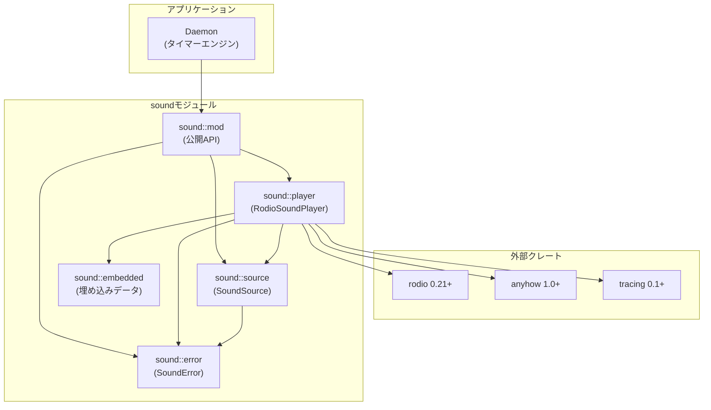
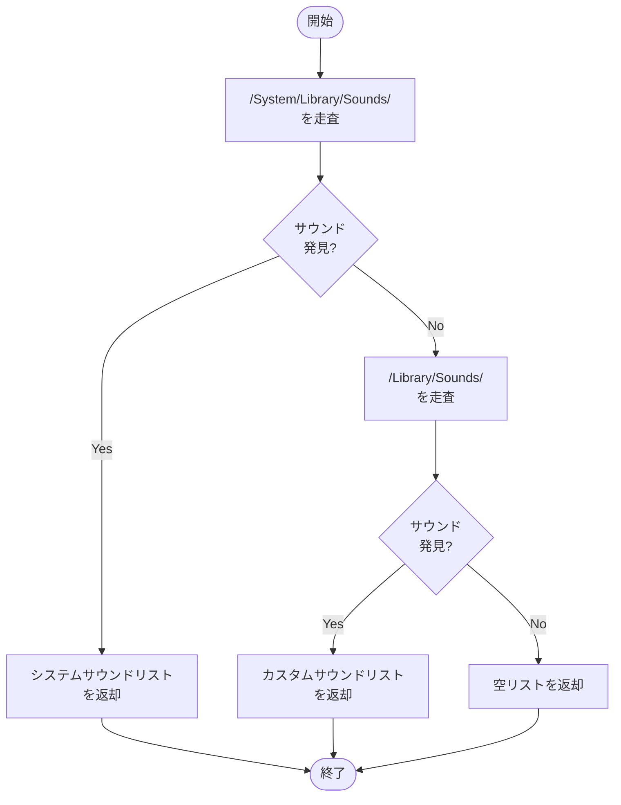
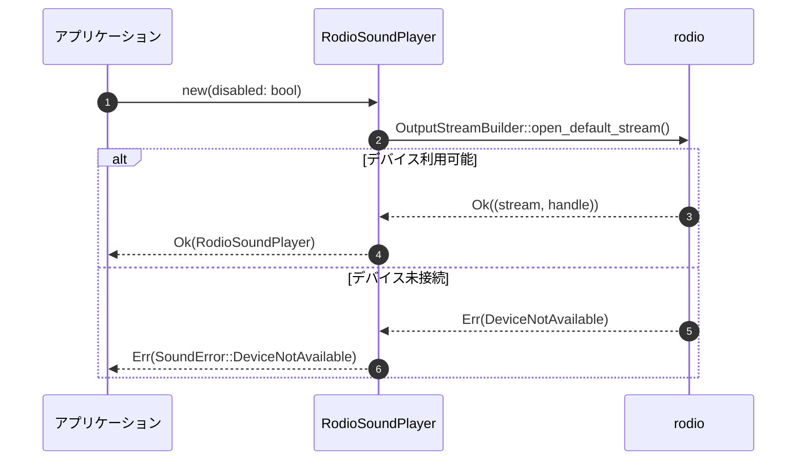
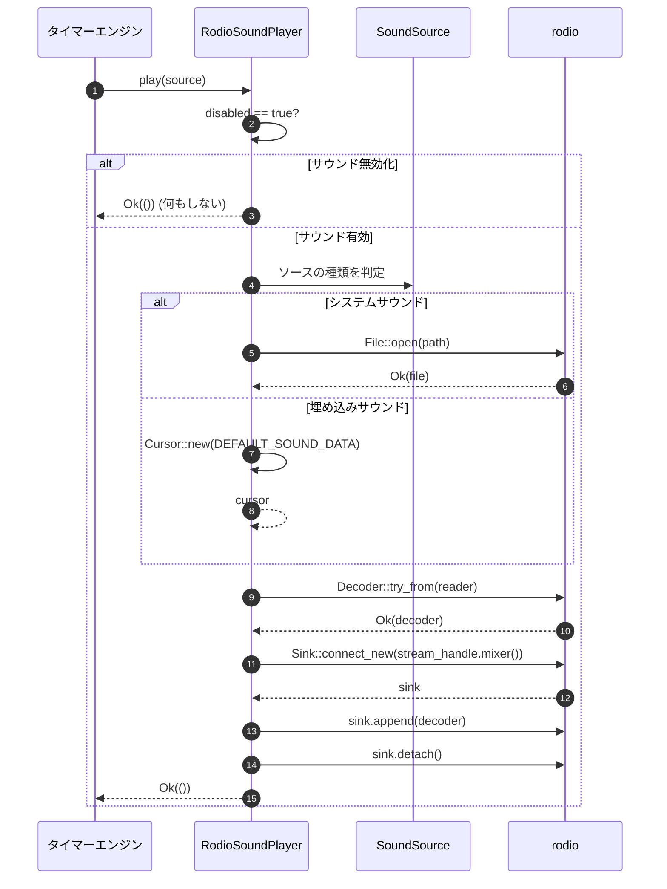
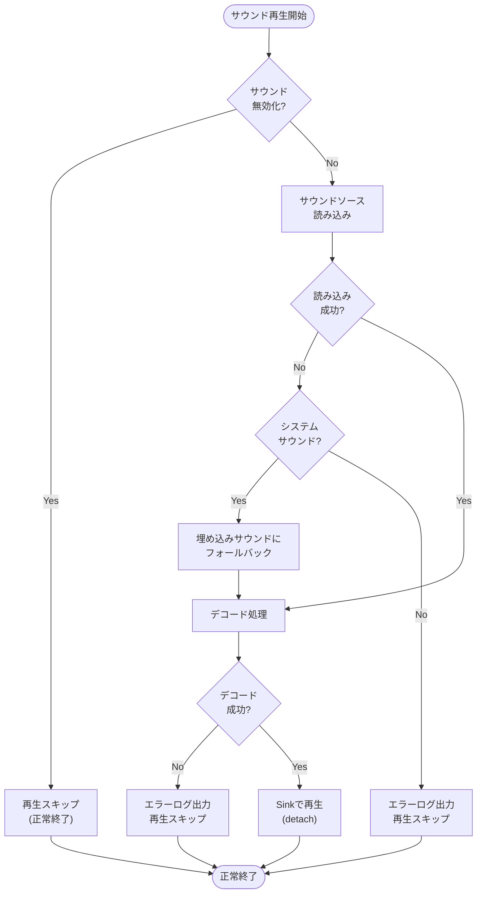
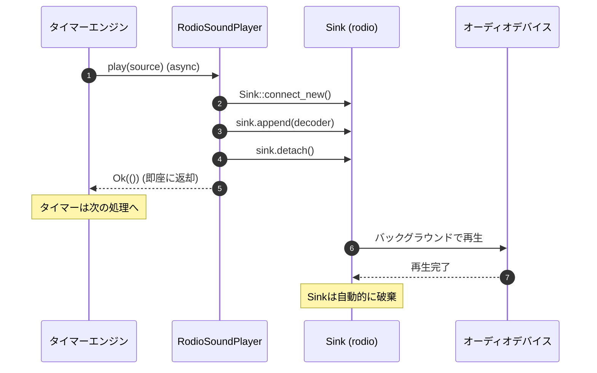

# サウンド再生 詳細設計書

## メタ情報

| 項目 | 内容 |
|------|------|
| ドキュメントID | DETAILED-CLI-001-SOUND |
| 対応基本設計 | BASIC-CLI-001 |
| 対応機能 | F-021 (システムサウンド通知) |
| バージョン | 1.0.0 |
| ステータス | ドラフト |
| 作成日 | 2026-01-03 |
| 最終更新日 | 2026-01-03 |
| 作成者 | - |

---

## 1. 概要

### 1.1 目的

本設計書は、ポモドーロタイマーCLIツールにおけるサウンド再生機能の詳細設計を定義する。タイマー完了時にmacOSネイティブサウンドを再生することで、ユーザーに聴覚的なフィードバックを提供する。

### 1.2 スコープ

#### スコープ内
- rodio v0.21の新API (`OutputStreamBuilder`) を使用したサウンド再生
- macOSシステムサウンド (`/System/Library/Sounds/`) の検出と再生
- 埋め込みサウンド (`include_bytes!`) による代替再生
- 音量制御の準備（`amplify_decibel` による将来対応）
- 非同期サウンド再生（タイマーをブロックしない）
- オーディオデバイス未接続時のエラーハンドリング
- `--no-sound` フラグによるサウンド無効化

#### スコープ外（Phase 2以降）
- カスタムサウンドファイルの指定
- 音量調整UI
- サウンドのプレビュー機能
- 複数サウンドの同時再生

### 1.3 用語定義

| 用語 | 定義 |
|------|------|
| rodio | Rustのクロスプラットフォームオーディオライブラリ |
| OutputStreamBuilder | rodio v0.21で導入された新しいストリーム管理API |
| Sink | オーディオ出力を管理するrodioのコンポーネント |
| Decoder | オーディオファイルをデコードするrodioのコンポーネント |
| システムサウンド | macOSの `/System/Library/Sounds/` に格納されている標準サウンド |
| 埋め込みサウンド | バイナリに `include_bytes!` で埋め込まれたサウンドファイル |

---

## 2. モジュール設計

### 2.1 モジュール構成

```
src/
├── sound/
│   ├── mod.rs                  # 公開API、SoundPlayerトレイト定義
│   ├── player.rs               # RodioSoundPlayer実装
│   ├── source.rs               # SoundSource列挙型、サウンド検出
│   ├── error.rs                # SoundError定義
│   └── embedded.rs             # 埋め込みサウンドデータ
└── main.rs
```

### 2.2 モジュール責務

| モジュール | 責務 | 公開API |
|-----------|------|---------|
| `sound::mod` | サウンド再生の公開インターフェース定義 | `SoundPlayer` トレイト、`create_sound_player()` |
| `sound::player` | rodio v0.21を使用した実装 | `RodioSoundPlayer` 構造体 |
| `sound::source` | サウンドソースの検出・管理 | `SoundSource` 列挙型、`discover_system_sounds()` |
| `sound::error` | エラー型定義 | `SoundError` 列挙型 |
| `sound::embedded` | 埋め込みサウンドデータ | `DEFAULT_SOUND_DATA` 定数 |

### 2.3 依存関係



---

## 3. サウンドソース設計

### 3.1 SoundSource列挙型

```rust
/// サウンドの取得元を表す列挙型
#[derive(Debug, Clone, PartialEq, Eq)]
pub enum SoundSource {
    /// macOSシステムサウンド
    System {
        /// サウンド名（例: "Glass"）
        name: String,
        /// フルパス（例: "/System/Library/Sounds/Glass.aiff"）
        path: PathBuf,
    },
    /// 埋め込みサウンド（バイナリに含まれる）
    Embedded {
        /// サウンド名（例: "default"）
        name: String,
    },
}
```

### 3.2 システムサウンド検出

#### 3.2.1 検出対象ディレクトリ

| ディレクトリ | 説明 | 優先度 |
|-------------|------|--------|
| `/System/Library/Sounds/` | macOS標準サウンド | 高 |
| `/Library/Sounds/` | システム全体のカスタムサウンド | 中 |
| `~/Library/Sounds/` | ユーザー固有のカスタムサウンド | 低 |

#### 3.2.2 対応フォーマット

| 拡張子 | フォーマット | 対応状況 |
|--------|-------------|---------|
| `.aiff` | AIFF (Audio Interchange File Format) | ✅ 対応 |
| `.wav` | WAV (Waveform Audio File Format) | ✅ 対応 |
| `.mp3` | MP3 (MPEG Audio Layer 3) | ✅ 対応 |
| `.m4a` | AAC (Advanced Audio Coding) | ✅ 対応 |
| `.flac` | FLAC (Free Lossless Audio Codec) | ✅ 対応 |

#### 3.2.3 検出ロジック



### 3.3 デフォルトサウンド選定

| 優先順位 | サウンド名 | パス | 理由 |
|---------|-----------|------|------|
| 1 | Glass | `/System/Library/Sounds/Glass.aiff` | macOS標準、短く明瞭 |
| 2 | Ping | `/System/Library/Sounds/Ping.aiff` | 代替候補 |
| 3 | 埋め込み | バイナリ内 | システムサウンド未検出時 |

### 3.4 埋め込みサウンド

#### 3.4.1 埋め込み方式

```rust
// sound/embedded.rs
/// デフォルトサウンドデータ（AIFF形式）
pub const DEFAULT_SOUND_DATA: &[u8] = include_bytes!("../../assets/default.aiff");
```

#### 3.4.2 埋め込みサウンドの仕様

| 項目 | 仕様 |
|------|------|
| フォーマット | AIFF (16-bit PCM) |
| サンプルレート | 44.1 kHz |
| チャンネル数 | モノラル (1ch) |
| 長さ | 1秒以内 |
| ファイルサイズ | 100KB以下 |
| 音量 | -6dB（ピークを避ける） |

---

## 4. サウンド再生実装

### 4.1 SoundPlayerトレイト

```rust
/// サウンド再生の抽象インターフェース
#[async_trait::async_trait]
pub trait SoundPlayer: Send + Sync {
    /// サウンドを再生する（非同期、ノンブロッキング）
    async fn play(&self, source: &SoundSource) -> Result<(), SoundError>;

    /// サウンドが再生可能かチェック
    fn is_available(&self) -> bool;
}
```

### 4.2 RodioSoundPlayer実装

#### 4.2.1 構造体定義

```rust
/// rodio v0.21を使用したサウンドプレイヤー
pub struct RodioSoundPlayer {
    /// オーディオ出力ストリーム（ライフタイム管理）
    _stream: OutputStream,
    /// ストリームハンドル（Sink作成用）
    stream_handle: OutputStreamHandle,
    /// サウンド無効化フラグ
    disabled: bool,
}
```

#### 4.2.2 初期化処理



#### 4.2.3 再生処理フロー



### 4.3 rodio v0.21 新API使用例

#### 4.3.1 ストリーム初期化

```rust
use rodio::{OutputStreamBuilder, OutputStream, OutputStreamHandle};

pub fn new(disabled: bool) -> Result<Self, SoundError> {
    if disabled {
        // サウンド無効化時はダミーストリームを作成
        let (stream, handle) = OutputStreamBuilder::open_default_stream()
            .map_err(|e| SoundError::DeviceNotAvailable(e.to_string()))?;
        return Ok(Self {
            _stream: stream,
            stream_handle: handle,
            disabled: true,
        });
    }

    let (stream, handle) = OutputStreamBuilder::open_default_stream()
        .map_err(|e| SoundError::DeviceNotAvailable(e.to_string()))?;

    Ok(Self {
        _stream: stream,
        stream_handle: handle,
        disabled: false,
    })
}
```

#### 4.3.2 サウンド再生

```rust
use rodio::{Sink, Decoder};
use std::fs::File;
use std::io::Cursor;

async fn play(&self, source: &SoundSource) -> Result<(), SoundError> {
    if self.disabled {
        return Ok(());
    }

    // ソースからリーダーを作成
    let reader: Box<dyn std::io::Read + Send> = match source {
        SoundSource::System { path, .. } => {
            let file = File::open(path)
                .map_err(|e| SoundError::FileNotFound(path.display().to_string()))?;
            Box::new(file)
        }
        SoundSource::Embedded { .. } => {
            Box::new(Cursor::new(DEFAULT_SOUND_DATA))
        }
    };

    // デコーダー作成（rodio v0.21の新API）
    let decoder = Decoder::try_from(reader)
        .map_err(|e| SoundError::DecodeError(e.to_string()))?;

    // Sink作成（rodio v0.21の新API）
    let sink = Sink::connect_new(&self.stream_handle);

    // サウンドを追加
    sink.append(decoder);

    // 非同期で再生（detachでバックグラウンド再生）
    sink.detach();

    Ok(())
}
```

---

## 5. 音量制御設計（Phase 2準備）

### 5.1 音量制御方式

rodio v0.21では `amplify_decibel()` メソッドが追加され、デシベル単位での音量調整が可能になった。

#### 5.1.1 デシベル変換表

| 音量レベル | デシベル (dB) | 説明 |
|-----------|--------------|------|
| 無音 | -∞ | 完全に無音 |
| 極小 | -20 dB | ほとんど聞こえない |
| 小 | -10 dB | 小さい音量 |
| 中 | 0 dB | 元の音量（デフォルト） |
| 大 | +6 dB | やや大きい音量 |
| 極大 | +12 dB | 大きい音量（歪みに注意） |

#### 5.1.2 実装準備（Phase 2）

```rust
// Phase 2で実装予定
use rodio::Source;

async fn play_with_volume(&self, source: &SoundSource, volume_db: f32) -> Result<(), SoundError> {
    // ... (デコーダー作成まで同じ)

    // 音量調整を適用
    let adjusted = decoder.amplify_decibel(volume_db);

    let sink = Sink::connect_new(&self.stream_handle);
    sink.append(adjusted);
    sink.detach();

    Ok(())
}
```

### 5.2 音量設定の永続化（Phase 2）

| 設定項目 | デフォルト値 | 範囲 | 保存先 |
|---------|------------|------|--------|
| `sound.volume_db` | 0.0 | -20.0 ~ +12.0 | `~/.pomodoro/config.toml` |
| `sound.enabled` | true | true/false | `~/.pomodoro/config.toml` |

---

## 6. エラーハンドリング

### 6.1 SoundError定義

```rust
/// サウンド再生に関するエラー
#[derive(Debug, thiserror::Error)]
pub enum SoundError {
    /// オーディオデバイスが利用できない
    #[error("オーディオデバイスが利用できません: {0}")]
    DeviceNotAvailable(String),

    /// サウンドファイルが見つからない
    #[error("サウンドファイルが見つかりません: {0}")]
    FileNotFound(String),

    /// デコードエラー
    #[error("サウンドファイルのデコードに失敗しました: {0}")]
    DecodeError(String),

    /// ストリーム作成エラー
    #[error("オーディオストリームの作成に失敗しました: {0}")]
    StreamError(String),

    /// その他のエラー
    #[error("サウンド再生エラー: {0}")]
    Other(String),
}
```

### 6.2 エラーハンドリング戦略

| エラー種別 | 発生タイミング | 対処方法 | ユーザーへの影響 |
|-----------|--------------|---------|----------------|
| `DeviceNotAvailable` | 初期化時 | 警告ログ出力、サウンド無効化で続行 | サウンドなしで動作 |
| `FileNotFound` | 再生時 | 埋め込みサウンドにフォールバック | デフォルトサウンドで再生 |
| `DecodeError` | 再生時 | エラーログ出力、再生スキップ | サウンドなしで続行 |
| `StreamError` | 再生時 | エラーログ出力、再生スキップ | サウンドなしで続行 |

### 6.3 エラーハンドリングフロー



---

## 7. 非同期処理設計

### 7.1 非同期再生の必要性

タイマーエンジンはサウンド再生完了を待たずに次の処理に進む必要がある。rodioの `Sink::detach()` を使用することで、バックグラウンドで再生を継続する。

### 7.2 非同期処理フロー



### 7.3 ライフタイム管理

| オブジェクト | ライフタイム | 管理方法 |
|-------------|------------|---------|
| `OutputStream` | アプリケーション全体 | `RodioSoundPlayer` のフィールドで保持 |
| `OutputStreamHandle` | アプリケーション全体 | `RodioSoundPlayer` のフィールドで保持 |
| `Sink` | 再生完了まで | `detach()` でバックグラウンドスレッドに移譲 |
| `Decoder` | `Sink` に追加されるまで | `Sink::append()` で所有権移動 |

---

## 8. テスト設計

### 8.1 単体テスト

| テストケース | 目的 | 検証内容 |
|-------------|------|---------|
| `test_discover_system_sounds` | システムサウンド検出 | `/System/Library/Sounds/` のサウンドが検出される |
| `test_embedded_sound_playback` | 埋め込みサウンド再生 | `DEFAULT_SOUND_DATA` が正常に再生される |
| `test_disabled_sound_player` | サウンド無効化 | `disabled=true` で再生がスキップされる |
| `test_file_not_found_fallback` | ファイル未検出時のフォールバック | 存在しないパスで埋め込みサウンドにフォールバック |
| `test_decode_error_handling` | デコードエラー処理 | 不正なファイルでエラーが適切に処理される |

### 8.2 統合テスト

| テストケース | 目的 | 検証内容 |
|-------------|------|---------|
| `test_timer_completion_sound` | タイマー完了時のサウンド再生 | タイマー完了時にサウンドが再生される |
| `test_no_sound_flag` | `--no-sound` フラグ | フラグ指定時にサウンドが再生されない |
| `test_multiple_sound_playback` | 複数回再生 | 連続してサウンドを再生してもクラッシュしない |

### 8.3 テストダブル

オーディオデバイスが存在しない環境でのテストのため、モックを使用する。

```rust
#[cfg(test)]
mod tests {
    use super::*;

    /// テスト用のモックSoundPlayer
    struct MockSoundPlayer {
        play_count: Arc<Mutex<usize>>,
    }

    #[async_trait::async_trait]
    impl SoundPlayer for MockSoundPlayer {
        async fn play(&self, _source: &SoundSource) -> Result<(), SoundError> {
            let mut count = self.play_count.lock().unwrap();
            *count += 1;
            Ok(())
        }

        fn is_available(&self) -> bool {
            true
        }
    }

    #[tokio::test]
    async fn test_mock_sound_player() {
        let player = MockSoundPlayer {
            play_count: Arc::new(Mutex::new(0)),
        };

        let source = SoundSource::Embedded {
            name: "test".to_string(),
        };

        player.play(&source).await.unwrap();

        let count = *player.play_count.lock().unwrap();
        assert_eq!(count, 1);
    }
}
```

---

## 9. パフォーマンス要件

### 9.1 性能目標

| 指標 | 目標値 | 測定方法 |
|------|--------|---------|
| サウンド再生開始遅延 | 100ms以内 | タイマー完了から再生開始までの時間 |
| メモリ使用量 | 10MB以下 | `OutputStream` + `Sink` のメモリ使用量 |
| CPU使用率 | 1%以下 | 再生中のCPU使用率 |
| 再生完了後のメモリリーク | なし | `Sink::detach()` 後のメモリ解放確認 |

### 9.2 最適化方針

| 項目 | 方針 |
|------|------|
| ストリーム初期化 | アプリケーション起動時に1回のみ実行 |
| デコーダー | `Decoder::try_from()` で効率的にデコード |
| Sink管理 | `detach()` でバックグラウンドスレッドに移譲 |
| 埋め込みサウンド | `include_bytes!` でコンパイル時に埋め込み |

---

## 10. セキュリティ考慮事項

### 10.1 ファイルパス検証

| 検証項目 | 対策 |
|---------|------|
| パストラバーサル攻撃 | システムサウンドディレクトリ以外のパスを拒否 |
| シンボリックリンク | `fs::canonicalize()` で実パスを検証 |
| 権限チェック | 読み取り権限がない場合はエラー |

### 10.2 リソース制限

| 項目 | 制限 |
|------|------|
| ファイルサイズ | 10MB以下（大きすぎるファイルは拒否） |
| 再生時間 | 10秒以内（長すぎるサウンドは拒否） |
| 同時再生数 | 1つまで（複数再生は無視） |

---

## 11. 実装チェックリスト

### 11.1 必須実装

- [ ] `SoundPlayer` トレイト定義
- [ ] `RodioSoundPlayer` 実装（rodio v0.21新API使用）
- [ ] `SoundSource` 列挙型定義
- [ ] システムサウンド検出機能 (`discover_system_sounds()`)
- [ ] 埋め込みサウンド (`DEFAULT_SOUND_DATA`)
- [ ] `--no-sound` フラグ対応
- [ ] エラーハンドリング（`SoundError`）
- [ ] 非同期再生（`Sink::detach()`）
- [ ] ファイル未検出時のフォールバック
- [ ] 単体テスト（5ケース以上）

### 11.2 推奨実装

- [ ] システムサウンド一覧表示コマンド (`pomodoro sounds list`)
- [ ] サウンドプレビュー機能 (`pomodoro sounds preview <name>`)
- [ ] 音量制御準備（`amplify_decibel` 使用）
- [ ] 統合テスト（3ケース以上）

### 11.3 Phase 2実装

- [ ] 音量調整UI
- [ ] カスタムサウンドファイル指定
- [ ] 設定ファイルでのデフォルトサウンド変更
- [ ] サウンドのプレビュー機能

---

## 12. 依存関係

### 12.1 外部クレート

```toml
[dependencies]
rodio = "0.21"
anyhow = "1.0"
tracing = "0.1"
async-trait = "0.1"
thiserror = "1.0"

[dev-dependencies]
tokio = { version = "1.48", features = ["test-util"] }
```

### 12.2 機能フラグ

rodioの機能フラグは最小限に抑える。

```toml
[dependencies.rodio]
version = "0.21"
default-features = false
features = ["symphonia-all"]  # Symphoniaデコーダー（全フォーマット対応）
```

---

## 13. 制約事項

### 13.1 技術的制約

| 制約 | 詳細 | 理由 |
|------|------|------|
| rodio v0.21以上 | 新API使用必須 | `OutputStreamBuilder` 使用 |
| macOS専用 | システムサウンドパスがmacOS固有 | `/System/Library/Sounds/` |
| MSRV 1.71以上 | rodioの要件 | プロジェクト全体のMSRV統一 |

### 13.2 運用制約

| 制約 | 詳細 |
|------|------|
| オーディオデバイス必須 | デバイスなしでも起動は可能（警告表示） |
| システムサウンド変更 | macOSアップデートで変更される可能性 |

---

## 14. 変更履歴

| 日付 | バージョン | 変更内容 | 担当者 |
|:---|:---|:---|:---|
| 2026-01-03 | 1.0.0 | 初版作成（rodio v0.21対応、システムサウンド検出、埋め込みサウンド、非同期再生） | - |
