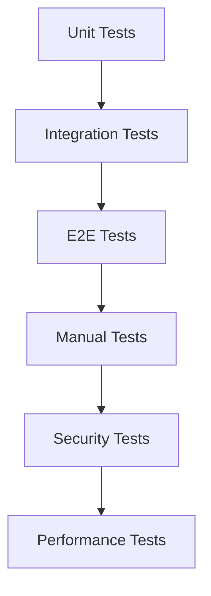

# テスト項目書: macOS Pomodoro Timer CLI

## メタ情報

| 項目 | 内容 |
|------|------|
| ドキュメントID | TEST-CLI-001 |
| 対応設計書 | DETAILED-CLI-001-* (全コンポーネント) |
| 対応要件 | REQ-CLI-001 |
| 作成日 | 2026-01-03 |
| ステータス | ドラフト |

---

## 1. テスト方針

### 1.1 テストレベル

| レベル | 対象 | カバレッジ目標 | 実装タイミング |
|--------|------|---------------|---------------|
| Unit | ドメインロジック、ユースケース | 90%以上 | Sprint 1 |
| Integration | コンポーネント間連携、IPC通信 | 80%以上 | Sprint 1-2 |
| E2E | 主要ユーザーフロー | 主要パス100% | Sprint 2 |
| Manual | macOS固有機能（通知、メニューバー等） | 主要機能100% | Sprint 2 |

### 1.2 テスト優先度

| 優先度 | 説明 | 実装タイミング |
|--------|------|---------------|
| P0 | クリティカルパス（必須） | Sprint 1 |
| P1 | 重要機能 | Sprint 1-2 |
| P2 | エッジケース | Sprint 2以降 |

### 1.3 テスト環境

| 項目 | 要件 |
|------|------|
| OS | macOS 12 (Monterey) 以降 |
| Rust | 1.71以上 |
| テストフレームワーク | cargo test, tokio-test |
| モックライブラリ | mockall |
| CLIテスト | assert_cmd |
| カバレッジツール | cargo-tarpaulin |

---

## 2. ユニットテスト項目

### 2.1 Daemonサーバー（daemon-server.md）

#### 2.1.1 TimerState

| TC-ID | テスト項目 | テスト種別 | 前提条件 | テスト手順 | 期待結果 | 優先度 |
|-------|-----------|-----------|---------|-----------|---------|--------|
| TC-U-D-001 | TimerState初期化 | Unit | なし | `TimerState::new(config)` を呼び出す | `phase=Stopped`, `remaining_seconds=0`, `pomodoro_count=0` | P0 |
| TC-U-D-002 | 作業開始 | Unit | 停止状態 | `start_working(Some("タスク名"))` を呼び出す | `phase=Working`, `remaining_seconds=1500`, `task_name=Some("タスク名")` | P0 |
| TC-U-D-003 | 休憩開始（通常） | Unit | `pomodoro_count=1` | `start_breaking()` を呼び出す | `phase=Breaking`, `remaining_seconds=300` | P0 |
| TC-U-D-004 | 長い休憩開始 | Unit | `pomodoro_count=4` | `start_breaking()` を呼び出す | `phase=LongBreaking`, `remaining_seconds=900` | P0 |
| TC-U-D-005 | 一時停止 | Unit | 作業中 | `pause()` を呼び出す | `phase=Paused`, 残り時間は保持 | P0 |
| TC-U-D-006 | 再開 | Unit | 一時停止中 | `resume()` を呼び出す | `phase=Working`, 残り時間は保持 | P0 |
| TC-U-D-007 | 停止 | Unit | 作業中 | `stop()` を呼び出す | `phase=Stopped`, `remaining_seconds=0`, `task_name=None` | P0 |
| TC-U-D-008 | ティック処理（未完了） | Unit | `remaining_seconds=10` | `tick()` を呼び出す | `remaining_seconds=9`, 戻り値=false | P0 |
| TC-U-D-009 | ティック処理（完了） | Unit | `remaining_seconds=1` | `tick()` を呼び出す | `remaining_seconds=0`, 戻り値=true | P0 |
| TC-U-D-010 | 実行中判定 | Unit | `phase=Working` | `is_running()` を呼び出す | true | P1 |
| TC-U-D-011 | 一時停止中判定 | Unit | `phase=Paused` | `is_paused()` を呼び出す | true | P1 |

**テストコード雛形:**
```rust
#[test]
fn test_timer_state_new() {
    // Arrange
    let config = PomodoroConfig::default();
    
    // Act
    let state = TimerState::new(config);
    
    // Assert
    assert_eq!(state.phase, TimerPhase::Stopped);
    assert_eq!(state.remaining_seconds, 0);
    assert_eq!(state.pomodoro_count, 0);
    assert_eq!(state.task_name, None);
}
```

#### 2.1.2 PomodoroConfig

| TC-ID | テスト項目 | テスト種別 | 前提条件 | テスト手順 | 期待結果 | 優先度 |
|-------|-----------|-----------|---------|-----------|---------|--------|
| TC-U-D-012 | デフォルト設定 | Unit | なし | `PomodoroConfig::default()` を呼び出す | `work_minutes=25`, `break_minutes=5`, `long_break_minutes=15` | P0 |
| TC-U-D-013 | 設定検証（正常） | Unit | 有効な設定値 | `validate()` を呼び出す | `Ok(())` | P0 |
| TC-U-D-014 | 設定検証（作業時間下限エラー） | Unit | `work_minutes=0` | `validate()` を呼び出す | `Err("作業時間は1-120分の範囲で指定してください")` | P1 |
| TC-U-D-015 | 設定検証（作業時間上限エラー） | Unit | `work_minutes=121` | `validate()` を呼び出す | `Err("作業時間は1-120分の範囲で指定してください")` | P1 |
| TC-U-D-016 | 設定検証（休憩時間下限エラー） | Unit | `break_minutes=0` | `validate()` を呼び出す | `Err("休憩時間は1-60分の範囲で指定してください")` | P1 |
| TC-U-D-017 | 設定検証（休憩時間上限エラー） | Unit | `break_minutes=61` | `validate()` を呼び出す | `Err("休憩時間は1-60分の範囲で指定してください")` | P1 |

#### 2.1.3 IpcRequest/Response

| TC-ID | テスト項目 | テスト種別 | 前提条件 | テスト手順 | 期待結果 | 優先度 |
|-------|-----------|-----------|---------|-----------|---------|--------|
| TC-U-D-018 | Startリクエストシリアライズ | Unit | なし | `IpcRequest::Start` をJSON化 | `{"command":"start","workMinutes":25,...}` | P0 |
| TC-U-D-019 | Pauseリクエストデシリアライズ | Unit | JSON文字列 | `serde_json::from_str()` | `IpcRequest::Pause` | P0 |
| TC-U-D-020 | 成功レスポンス作成 | Unit | なし | `IpcResponse::success()` | `status="success"`, `data` が設定される | P0 |
| TC-U-D-021 | エラーレスポンス作成 | Unit | なし | `IpcResponse::error()` | `status="error"`, `data=None` | P0 |

### 2.2 CLIクライアント（cli-client.md）

#### 2.2.1 コマンドパース

| TC-ID | テスト項目 | テスト種別 | 前提条件 | テスト手順 | 期待結果 | 優先度 |
|-------|-----------|-----------|---------|-----------|---------|--------|
| TC-U-C-001 | Startコマンドパース | Unit | なし | `["pomodoro", "start", "--work", "30"]` をパース | `Commands::Start`, `work=30` | P0 |
| TC-U-C-002 | タスク名パース | Unit | なし | `["pomodoro", "start", "--task", "API実装"]` をパース | `task=Some("API実装")` | P0 |
| TC-U-C-003 | タスク名バリデーション（空文字） | Unit | なし | `validate_task_name("")` を呼び出す | `Err("タスク名は空にできません")` | P1 |
| TC-U-C-004 | タスク名バリデーション（長すぎる） | Unit | 101文字の文字列 | `validate_task_name()` を呼び出す | `Err("タスク名は100文字以内にしてください")` | P1 |
| TC-U-C-005 | Pauseコマンドパース | Unit | なし | `["pomodoro", "pause"]` をパース | `Commands::Pause` | P0 |
| TC-U-C-006 | Statusコマンドパース | Unit | なし | `["pomodoro", "status"]` をパース | `Commands::Status` | P0 |

#### 2.2.2 IPCクライアント

| TC-ID | テスト項目 | テスト種別 | 前提条件 | テスト手順 | 期待結果 | 優先度 |
|-------|-----------|-----------|---------|-----------|---------|--------|
| TC-U-C-007 | ソケットパス取得 | Unit | `HOME=/Users/test` | `get_socket_path()` を呼び出す | `/Users/test/.pomodoro/pomodoro.sock` | P0 |
| TC-U-C-008 | リクエストシリアライズ | Unit | `IpcRequest::Start` | `serde_json::to_string()` | JSON文字列が生成される | P0 |
| TC-U-C-009 | レスポンスデシリアライズ | Unit | JSON文字列 | `serde_json::from_str()` | `IpcResponse` が生成される | P0 |
| TC-U-C-010 | エラーレスポンス処理 | Unit | `status="error"` | `send_request()` を呼び出す | `Err(...)` が返る | P1 |

### 2.3 通知システム（notification-system.md）

#### 2.3.1 NotificationContentBuilder

| TC-ID | テスト項目 | テスト種別 | 前提条件 | テスト手順 | 期待結果 | 優先度 |
|-------|-----------|-----------|---------|-----------|---------|--------|
| TC-U-N-001 | コンテンツビルダー | Unit | なし | `NotificationContentBuilder::new().title("Test").build()` | `title="Test"` | P0 |
| TC-U-N-002 | 作業完了通知コンテンツ | Unit | `task_name=Some("API実装")` | `create_work_complete_content()` | `title="🍅 ポモドーロタイマー"`, `subtitle="API実装"` | P0 |
| TC-U-N-003 | 休憩完了通知コンテンツ | Unit | なし | `create_break_complete_content()` | `title="☕ ポモドーロタイマー"` | P0 |

#### 2.3.2 NotificationAction

| TC-ID | テスト項目 | テスト種別 | 前提条件 | テスト手順 | 期待結果 | 優先度 |
|-------|-----------|-----------|---------|-----------|---------|--------|
| TC-U-N-004 | アクション作成 | Unit | なし | `create_actions()` を呼び出す | 2つのアクションが返る | P0 |
| TC-U-N-005 | カテゴリ作成 | Unit | なし | `create_categories()` を呼び出す | 3つのカテゴリが返る | P0 |

### 2.4 メニューバーUI（menubar-ui.md）

#### 2.4.1 IconManager

| TC-ID | テスト項目 | テスト種別 | 前提条件 | テスト手順 | 期待結果 | 優先度 |
|-------|-----------|-----------|---------|-----------|---------|--------|
| TC-U-M-001 | 作業中テキスト生成 | Unit | `phase=Working`, `remaining_seconds=930` | `generate_title()` を呼び出す | `"🍅 15:30"` | P0 |
| TC-U-M-002 | 休憩中テキスト生成 | Unit | `phase=Breaking`, `remaining_seconds=270` | `generate_title()` を呼び出す | `"☕ 04:30"` | P0 |
| TC-U-M-003 | 一時停止中テキスト生成 | Unit | `phase=Paused` | `generate_title()` を呼び出す | `"⏸ 一時停止"` | P0 |
| TC-U-M-004 | 停止中テキスト生成 | Unit | `phase=Stopped` | `generate_title()` を呼び出す | `"⏸ 停止中"` | P0 |

#### 2.4.2 MenuBuilder

| TC-ID | テスト項目 | テスト種別 | 前提条件 | テスト手順 | 期待結果 | 優先度 |
|-------|-----------|-----------|---------|-----------|---------|--------|
| TC-U-M-005 | 作業中メニュー構築 | Unit | `phase=Working` | `build()` を呼び出す | 一時停止: 有効、再開: 無効、停止: 有効 | P0 |
| TC-U-M-006 | 一時停止中メニュー構築 | Unit | `phase=Paused` | `build()` を呼び出す | 一時停止: 無効、再開: 有効、停止: 有効 | P0 |
| TC-U-M-007 | 停止中メニュー構築 | Unit | `phase=Stopped` | `build()` を呼び出す | すべてのアクションが無効 | P0 |

### 2.5 フォーカスモード（focus-mode.md）

#### 2.5.1 Shortcuts実行

| TC-ID | テスト項目 | テスト種別 | 前提条件 | テスト手順 | 期待結果 | 優先度 |
|-------|-----------|-----------|---------|-----------|---------|--------|
| TC-U-F-001 | Shortcuts存在確認 | Unit | macOS 12+ | `shortcuts_exists()` を呼び出す | true | P0 |
| TC-U-F-002 | ショートカット未検出エラー | Unit | 存在しないショートカット名 | `enable_focus()` を呼び出す | `Err(ShortcutNotFound)` | P1 |
| TC-U-F-003 | FocusModeConfig デフォルト | Unit | なし | `FocusModeConfig::default()` | `enabled=false`, `enable_shortcut_name="Enable Work Focus"` | P0 |

### 2.6 LaunchAgent（launch-agent.md）

#### 2.6.1 Plist生成

| TC-ID | テスト項目 | テスト種別 | 前提条件 | テスト手順 | 期待結果 | 優先度 |
|-------|-----------|-----------|---------|-----------|---------|--------|
| TC-U-L-001 | Plist生成 | Unit | なし | `PomodoroLaunchAgent::new()` | `label="com.example.pomodoro"`, `run_at_load=true` | P0 |
| TC-U-L-002 | Plist XML生成 | Unit | Plist構造体 | `to_xml()` を呼び出す | 有効なXMLが生成される | P0 |
| TC-U-L-003 | Plistシリアライズ・デシリアライズ | Unit | Plist構造体 | XML化→パース | 元の構造体と一致 | P0 |

#### 2.6.2 インストール状態確認

| TC-ID | テスト項目 | テスト種別 | 前提条件 | テスト手順 | 期待結果 | 優先度 |
|-------|-----------|-----------|---------|-----------|---------|--------|
| TC-U-L-004 | インストール状態確認（未インストール） | Unit | plistファイルなし | `is_installed()` を呼び出す | false | P0 |
| TC-U-L-005 | インストール状態確認（インストール済み） | Unit | plistファイルあり | `is_installed()` を呼び出す | true | P0 |

### 2.7 サウンド再生（sound-playback.md）

#### 2.7.1 SoundSource

| TC-ID | テスト項目 | テスト種別 | 前提条件 | テスト手順 | 期待結果 | 優先度 |
|-------|-----------|-----------|---------|-----------|---------|--------|
| TC-U-S-001 | システムサウンド検出 | Unit | macOS | `discover_system_sounds()` を呼び出す | `/System/Library/Sounds/` のサウンドが検出される | P0 |
| TC-U-S-002 | 埋め込みサウンドデータ | Unit | なし | `DEFAULT_SOUND_DATA` を確認 | データが存在する | P0 |

#### 2.7.2 RodioSoundPlayer

| TC-ID | テスト項目 | テスト種別 | 前提条件 | テスト手順 | 期待結果 | 優先度 |
|-------|-----------|-----------|---------|-----------|---------|--------|
| TC-U-S-003 | サウンド無効化時の再生 | Unit | `disabled=true` | `play()` を呼び出す | `Ok(())` が即座に返る（再生しない） | P0 |
| TC-U-S-004 | 埋め込みサウンド再生 | Unit | `SoundSource::Embedded` | `play()` を呼び出す | `Ok(())` が返る | P0 |

---

## 3. 統合テスト項目

### 3.1 Daemon-CLI統合

| TC-ID | テスト項目 | テスト種別 | 前提条件 | テスト手順 | 期待結果 | 優先度 |
|-------|-----------|-----------|---------|-----------|---------|--------|
| TC-I-001 | タイマー開始（IPC経由） | Integration | Daemon起動中 | 1. CLIから `start` コマンド送信<br/>2. Daemonがリクエスト受信 | タイマーが開始され、成功レスポンスが返る | P0 |
| TC-I-002 | タイマー一時停止（IPC経由） | Integration | タイマー実行中 | 1. CLIから `pause` コマンド送信<br/>2. Daemonがリクエスト受信 | タイマーが一時停止され、成功レスポンスが返る | P0 |
| TC-I-003 | ステータス確認（IPC経由） | Integration | タイマー実行中 | 1. CLIから `status` コマンド送信<br/>2. Daemonがリクエスト受信 | 現在の状態が返る | P0 |
| TC-I-004 | IPC接続エラー | Integration | Daemon停止中 | 1. CLIから `start` コマンド送信 | 接続エラーメッセージが表示される | P1 |

### 3.2 タイマーエンジン-通知システム統合

| TC-ID | テスト項目 | テスト種別 | 前提条件 | テスト手順 | 期待結果 | 優先度 |
|-------|-----------|-----------|---------|-----------|---------|--------|
| TC-I-005 | 作業完了時の通知送信 | Integration | タイマー実行中 | 1. タイマーが完了<br/>2. 通知システムが呼ばれる | 作業完了通知が送信される | P0 |
| TC-I-006 | 休憩完了時の通知送信 | Integration | 休憩タイマー実行中 | 1. タイマーが完了<br/>2. 通知システムが呼ばれる | 休憩完了通知が送信される | P0 |
| TC-I-007 | 通知アクションボタン処理 | Integration | 通知表示中 | 1. 通知の「一時停止」ボタンをクリック<br/>2. Daemonがイベント受信 | タイマーが一時停止される | P1 |

### 3.3 タイマーエンジン-フォーカスモード統合

| TC-ID | テスト項目 | テスト種別 | 前提条件 | テスト手順 | 期待結果 | 優先度 |
|-------|-----------|-----------|---------|-----------|---------|--------|
| TC-I-008 | 作業開始時のフォーカスモード有効化 | Integration | `focus_mode=true` | 1. タイマー開始<br/>2. フォーカスモード連携が呼ばれる | フォーカスモードがONになる | P1 |
| TC-I-009 | 休憩開始時のフォーカスモード無効化 | Integration | `focus_mode=true` | 1. 休憩タイマー開始<br/>2. フォーカスモード連携が呼ばれる | フォーカスモードがOFFになる | P1 |
| TC-I-010 | フォーカスモード失敗時のフォールバック | Integration | ショートカット未作成 | 1. タイマー開始<br/>2. フォーカスモード連携が失敗 | 警告ログ出力、タイマーは継続 | P1 |

### 3.4 タイマーエンジン-サウンド再生統合

| TC-ID | テスト項目 | テスト種別 | 前提条件 | テスト手順 | 期待結果 | 優先度 |
|-------|-----------|-----------|---------|-----------|---------|--------|
| TC-I-011 | 作業完了時のサウンド再生 | Integration | タイマー実行中 | 1. タイマーが完了<br/>2. サウンド再生が呼ばれる | サウンドが再生される | P1 |
| TC-I-012 | `--no-sound` フラグ | Integration | `--no-sound` 指定 | 1. タイマー開始<br/>2. タイマーが完了 | サウンドが再生されない | P1 |
| TC-I-013 | サウンドファイル未検出時のフォールバック | Integration | システムサウンドなし | 1. タイマーが完了<br/>2. サウンド再生が呼ばれる | 埋め込みサウンドが再生される | P2 |

### 3.5 LaunchAgent統合

| TC-ID | テスト項目 | テスト種別 | 前提条件 | テスト手順 | 期待結果 | 優先度 |
|-------|-----------|-----------|---------|-----------|---------|--------|
| TC-I-014 | LaunchAgentインストール | Integration | 未インストール | 1. `pomodoro install` 実行<br/>2. plistファイル作成<br/>3. `launchctl load` 実行 | plistファイルが作成され、サービスが登録される | P0 |
| TC-I-015 | LaunchAgentアンインストール | Integration | インストール済み | 1. `pomodoro uninstall` 実行<br/>2. `launchctl unload` 実行<br/>3. plistファイル削除 | サービスが解除され、plistファイルが削除される | P0 |
| TC-I-016 | 冪等性（再インストール） | Integration | インストール済み | 1. `pomodoro install` を2回実行 | エラーなく完了する | P1 |

---

## 4. E2Eテスト項目

### 4.1 基本フロー

| TC-ID | テスト項目 | テスト種別 | 前提条件 | テスト手順 | 期待結果 | 優先度 |
|-------|-----------|-----------|---------|-----------|---------|--------|
| TC-E-001 | 完全なポモドーロサイクル | E2E | Daemon起動中 | 1. `pomodoro start --task "テスト"`<br/>2. 25分待機<br/>3. 作業完了通知確認<br/>4. 5分待機<br/>5. 休憩完了通知確認 | 通知が表示され、タイマーが正常に動作する | P0 |
| TC-E-002 | 一時停止・再開フロー | E2E | タイマー実行中 | 1. `pomodoro pause`<br/>2. 残り時間確認<br/>3. `pomodoro resume`<br/>4. タイマー継続確認 | 一時停止・再開が正常に動作する | P0 |
| TC-E-003 | 停止フロー | E2E | タイマー実行中 | 1. `pomodoro stop`<br/>2. ステータス確認 | タイマーが停止し、状態がリセットされる | P0 |

### 4.2 自動サイクルフロー

| TC-ID | テスト項目 | テスト種別 | 前提条件 | テスト手順 | 期待結果 | 優先度 |
|-------|-----------|-----------|---------|-----------|---------|--------|
| TC-E-004 | 自動サイクル有効時の動作 | E2E | `--auto-cycle` 指定 | 1. `pomodoro start --auto-cycle`<br/>2. 作業完了<br/>3. 休憩完了 | 自動的に次の作業タイマーが開始される | P1 |
| TC-E-005 | 4ポモドーロ後の長い休憩 | E2E | `pomodoro_count=3` | 1. 4回目の作業完了 | 長い休憩タイマーが開始される | P1 |

### 4.3 フォーカスモード連携フロー

| TC-ID | テスト項目 | テスト種別 | 前提条件 | テスト手順 | 期待結果 | 優先度 |
|-------|-----------|-----------|---------|-----------|---------|--------|
| TC-E-006 | フォーカスモード連携 | E2E | ショートカット作成済み | 1. `pomodoro start --focus-mode`<br/>2. フォーカスモード確認<br/>3. 休憩開始<br/>4. フォーカスモード確認 | 作業中はON、休憩中はOFF | P1 |

---

## 5. 手動テスト項目（macOS固有機能）

### 5.1 通知システム

| TC-ID | テスト項目 | テスト種別 | 前提条件 | テスト手順 | 期待結果 | 優先度 |
|-------|-----------|-----------|---------|-----------|---------|--------|
| TC-M-001 | 通知許可リクエスト | Manual | 初回起動 | 1. Daemon起動<br/>2. 通知許可ダイアログ確認 | 通知許可ダイアログが表示される | P0 |
| TC-M-002 | 通知表示（作業完了） | Manual | タイマー実行中 | 1. タイマー完了まで待機 | 「🍅 ポモドーロタイマー」通知が表示される | P0 |
| TC-M-003 | 通知アクションボタン | Manual | 通知表示中 | 1. 「一時停止」ボタンをクリック | タイマーが一時停止される | P0 |
| TC-M-004 | 通知音 | Manual | タイマー実行中 | 1. タイマー完了まで待機 | システムサウンドが再生される | P1 |
| TC-M-005 | 通知許可拒否時の動作 | Manual | 通知許可拒否 | 1. Daemon起動<br/>2. タイマー実行 | 警告ログ出力、タイマーは動作 | P1 |

### 5.2 メニューバーUI

| TC-ID | テスト項目 | テスト種別 | 前提条件 | テスト手順 | 期待結果 | 優先度 |
|-------|-----------|-----------|---------|-----------|---------|--------|
| TC-M-006 | メニューバーアイコン表示 | Manual | Daemon起動中 | 1. メニューバー確認 | 🍅アイコンが表示される | P0 |
| TC-M-007 | 残り時間表示 | Manual | タイマー実行中 | 1. メニューバーアイコン確認 | 「🍅 15:30」形式で表示される | P0 |
| TC-M-008 | メニュー表示 | Manual | Daemon起動中 | 1. アイコンをクリック | ドロップダウンメニューが表示される | P0 |
| TC-M-009 | メニュー項目の有効/無効 | Manual | タイマー実行中 | 1. メニュー表示<br/>2. 項目の状態確認 | 「一時停止」が有効、「再開」が無効 | P0 |
| TC-M-010 | メニューからの一時停止 | Manual | タイマー実行中 | 1. メニューから「一時停止」選択 | タイマーが一時停止される | P0 |

### 5.3 フォーカスモード

| TC-ID | テスト項目 | テスト種別 | 前提条件 | テスト手順 | 期待結果 | 優先度 |
|-------|-----------|-----------|---------|-----------|---------|--------|
| TC-M-011 | フォーカスモード有効化 | Manual | ショートカット作成済み | 1. `pomodoro start --focus-mode`<br/>2. システム環境設定確認 | フォーカスモードがONになる | P1 |
| TC-M-012 | フォーカスモード無効化 | Manual | フォーカスモードON | 1. 休憩開始<br/>2. システム環境設定確認 | フォーカスモードがOFFになる | P1 |
| TC-M-013 | ショートカット未作成時のエラー | Manual | ショートカット未作成 | 1. `pomodoro start --focus-mode` | 警告メッセージ表示、タイマーは動作 | P1 |

### 5.4 LaunchAgent

| TC-ID | テスト項目 | テスト種別 | 前提条件 | テスト手順 | 期待結果 | 優先度 |
|-------|-----------|-----------|---------|-----------|---------|--------|
| TC-M-014 | LaunchAgentインストール | Manual | 未インストール | 1. `pomodoro install`<br/>2. `launchctl list` 確認 | サービスが登録される | P0 |
| TC-M-015 | ログイン時自動起動 | Manual | LaunchAgent登録済み | 1. ログアウト<br/>2. ログイン<br/>3. `pomodoro status` | Daemonが自動起動している | P0 |
| TC-M-016 | LaunchAgentアンインストール | Manual | LaunchAgent登録済み | 1. `pomodoro uninstall`<br/>2. `launchctl list` 確認 | サービスが解除される | P0 |

### 5.5 サウンド再生

| TC-ID | テスト項目 | テスト種別 | 前提条件 | テスト手順 | 期待結果 | 優先度 |
|-------|-----------|-----------|---------|-----------|---------|--------|
| TC-M-017 | システムサウンド再生 | Manual | タイマー実行中 | 1. タイマー完了まで待機 | システムサウンド（Glass）が再生される | P1 |
| TC-M-018 | 埋め込みサウンド再生 | Manual | システムサウンドなし | 1. タイマー完了まで待機 | 埋め込みサウンドが再生される | P2 |
| TC-M-019 | オーディオデバイス未接続時 | Manual | オーディオデバイスなし | 1. Daemon起動 | 警告ログ出力、Daemonは起動 | P2 |

### 5.6 コード署名

| TC-ID | テスト項目 | テスト種別 | 前提条件 | テスト手順 | 期待結果 | 優先度 |
|-------|-----------|-----------|---------|-----------|---------|--------|
| TC-M-020 | 署名済みバイナリの動作 | Manual | 署名済みバイナリ | 1. `codesign --verify`<br/>2. Daemon起動<br/>3. 通知送信 | 署名が有効、通知が表示される | P0 |
| TC-M-021 | 未署名バイナリの動作 | Manual | 未署名バイナリ | 1. Daemon起動<br/>2. 通知送信 | 警告メッセージ、通知は表示されない | P1 |

---

## 6. エッジケース・境界値テスト

### 6.1 入力値の境界

| TC-ID | 対象 | 境界条件 | テスト値 | 期待結果 | 優先度 |
|-------|------|---------|---------|---------|--------|
| TC-B-001 | 作業時間 | 最小値 | 1分 | 正常動作 | P1 |
| TC-B-002 | 作業時間 | 最大値 | 120分 | 正常動作 | P1 |
| TC-B-003 | 作業時間 | 境界-1 | 0分 | バリデーションエラー | P1 |
| TC-B-004 | 作業時間 | 境界+1 | 121分 | バリデーションエラー | P1 |
| TC-B-005 | 休憩時間 | 最小値 | 1分 | 正常動作 | P1 |
| TC-B-006 | 休憩時間 | 最大値 | 60分 | 正常動作 | P1 |
| TC-B-007 | 休憩時間 | 境界-1 | 0分 | バリデーションエラー | P1 |
| TC-B-008 | 休憩時間 | 境界+1 | 61分 | バリデーションエラー | P1 |
| TC-B-009 | タスク名 | 最小値 | 1文字 | 正常動作 | P2 |
| TC-B-010 | タスク名 | 最大値 | 100文字 | 正常動作 | P2 |
| TC-B-011 | タスク名 | 境界-1 | 空文字 | バリデーションエラー | P2 |
| TC-B-012 | タスク名 | 境界+1 | 101文字 | バリデーションエラー | P2 |

### 6.2 特殊ケース

| TC-ID | ケース | 入力 | 期待結果 | 優先度 |
|-------|--------|------|---------|--------|
| TC-S-001 | タスク名に特殊文字 | `"API実装 (v2.0)"` | 正常動作 | P2 |
| TC-S-002 | タスク名にUnicode | `"機能開発🍅"` | 正常動作 | P2 |
| TC-S-003 | タスク名に改行 | `"タスク\n名"` | バリデーションエラー | P2 |
| TC-S-004 | 同時に複数のCLIクライアント | 2つのCLIから同時にコマンド送信 | 両方とも正常に処理される | P2 |
| TC-S-005 | Daemon再起動中のCLIコマンド | Daemon停止→CLI実行 | 接続エラーメッセージ | P2 |

---

## 7. セキュリティテスト項目

| TC-ID | テスト観点 | テスト内容 | 期待結果 | 優先度 |
|-------|-----------|-----------|---------|--------|
| TC-SEC-001 | ソケットファイル権限 | `~/.pomodoro/pomodoro.sock` の権限確認 | 所有者のみアクセス可能 | P1 |
| TC-SEC-002 | plistファイル権限 | `~/Library/LaunchAgents/com.example.pomodoro.plist` の権限確認 | `0644` (rw-r--r--) | P1 |
| TC-SEC-003 | ログファイル権限 | `~/.pomodoro/logs/*.log` の権限確認 | `0600` (rw-------) | P1 |
| TC-SEC-004 | パストラバーサル攻撃 | サウンドファイルパスに `../` を含める | エラー、システムサウンドディレクトリ外は拒否 | P2 |
| TC-SEC-005 | コマンドインジェクション | タスク名に `;` や `|` を含める | エスケープされる、コマンド実行されない | P2 |

---

## 8. パフォーマンステスト項目

| TC-ID | テスト対象 | 条件 | 目標値 | 測定方法 | 優先度 |
|-------|-----------|------|--------|---------|--------|
| TC-P-001 | CLI起動時間 | `pomodoro --help` | 100ms以内 | `time` コマンド | P1 |
| TC-P-002 | IPC通信遅延 | `pomodoro status` | 50ms以内 | `tracing` ログ | P1 |
| TC-P-003 | 通知送信遅延 | タイマー完了→通知表示 | 500ms以内 | `tracing` ログ | P1 |
| TC-P-004 | サウンド再生開始遅延 | タイマー完了→再生開始 | 100ms以内 | `tracing` ログ | P2 |
| TC-P-005 | メモリ使用量 | Daemon常駐時 | 50MB以下 | Activity Monitor | P1 |
| TC-P-006 | CPU使用率 | アイドル時 | 1%以下 | Activity Monitor | P1 |

---

## 9. テストデータ

### 9.1 正常系テストデータ

```json
{
  "validConfig": {
    "work_minutes": 25,
    "break_minutes": 5,
    "long_break_minutes": 15,
    "auto_cycle": false,
    "focus_mode": false
  },
  "validStartParams": {
    "workMinutes": 30,
    "breakMinutes": 10,
    "longBreakMinutes": 20,
    "taskName": "API実装",
    "autoCycle": true,
    "focusMode": true
  }
}
```

### 9.2 異常系テストデータ

```json
{
  "invalidWorkMinutes": {
    "work_minutes": 0,
    "break_minutes": 5,
    "long_break_minutes": 15
  },
  "invalidBreakMinutes": {
    "work_minutes": 25,
    "break_minutes": 61,
    "long_break_minutes": 15
  },
  "emptyTaskName": {
    "taskName": ""
  },
  "longTaskName": {
    "taskName": "a".repeat(101)
  }
}
```

---

## 10. テスト実行順序



---

## 11. カバレッジ目標

| レイヤー | 目標カバレッジ | 備考 |
|---------|--------------|------|
| Daemon (timer, state, ipc) | 95% | ビジネスロジックは高カバレッジ必須 |
| CLI (commands, display) | 90% | ユーザー入力処理は高カバレッジ必須 |
| Notification | 80% | objc2連携部分はモック可 |
| MenuBar | 70% | UI部分は手動テストでカバー |
| Focus Mode | 70% | Shortcuts連携は手動テストでカバー |
| LaunchAgent | 85% | plist生成・インストールロジックは高カバレッジ |
| Sound | 75% | rodio連携部分はモック可 |

---

## 12. CI/CD統合

### 12.1 GitHub Actions設定

```yaml
# .github/workflows/ci.yml
- name: Run tests
  run: cargo test --all-features --verbose

- name: Generate coverage
  run: cargo tarpaulin --out Xml --all-features

- name: Check coverage threshold
  run: |
    COVERAGE=$(cargo tarpaulin --out Json --all-features | jq '.files | map(.coverage) | add / length')
    if (( $(echo "$COVERAGE < 80" | bc -l) )); then
      echo "Error: Coverage is below 80%"
      exit 1
    fi
```

### 12.2 テスト実行コマンド

```bash
# 単体テストのみ
cargo test --lib

# 統合テストのみ
cargo test --test '*'

# すべてのテスト
cargo test --all-features

# カバレッジ測定
cargo tarpaulin --out Html --all-features
open tarpaulin-report.html

# 特定のテストのみ実行
cargo test test_timer_state_new

# 手動テストを除外
cargo test -- --skip manual
```

---

## 13. 手動テストチェックリスト

### 13.1 初回起動時

- [ ] 通知許可ダイアログが表示される
- [ ] 通知許可を承認すると通知が表示される
- [ ] 通知許可を拒否すると警告メッセージが表示される
- [ ] メニューバーアイコンが表示される

### 13.2 タイマー動作

- [ ] タイマー開始時にメニューバーアイコンが更新される
- [ ] 残り時間が1秒ごとに更新される
- [ ] 作業完了時に通知が表示される
- [ ] 休憩完了時に通知が表示される
- [ ] 通知のアクションボタンが機能する

### 13.3 フォーカスモード

- [ ] 作業開始時にフォーカスモードがONになる
- [ ] 休憩開始時にフォーカスモードがOFFになる
- [ ] ショートカット未作成時に警告メッセージが表示される

### 13.4 LaunchAgent

- [ ] インストール後にサービスが登録される
- [ ] ログイン時に自動起動する
- [ ] アンインストール後にサービスが解除される

### 13.5 サウンド

- [ ] タイマー完了時にサウンドが再生される
- [ ] `--no-sound` フラグでサウンドが再生されない
- [ ] オーディオデバイス未接続時に警告メッセージが表示される

---

## 14. リグレッションテスト戦略

### 14.1 リグレッションテストスイート

リリース前に必ず実行するテストスイート：

| カテゴリ | テストケース | 実行頻度 |
|---------|------------|---------|
| クリティカルパス | TC-E-001, TC-E-002, TC-E-003 | リリース前必須 |
| 通知システム | TC-M-001, TC-M-002, TC-M-003 | リリース前必須 |
| メニューバーUI | TC-M-006, TC-M-007, TC-M-008 | リリース前必須 |
| LaunchAgent | TC-M-014, TC-M-015, TC-M-016 | リリース前必須 |

### 14.2 自動化可能なリグレッションテスト

```bash
# リグレッションテストスイート実行
cargo test --test regression_tests

# カバレッジ確認
cargo tarpaulin --out Html --all-features
```

---

## 15. 変更履歴

| 日付 | バージョン | 変更内容 | 担当者 |
|:---|:---|:---|:---|
| 2026-01-03 | 1.0.0 | 初版作成（全コンポーネントの詳細設計書を基に作成） | - |
